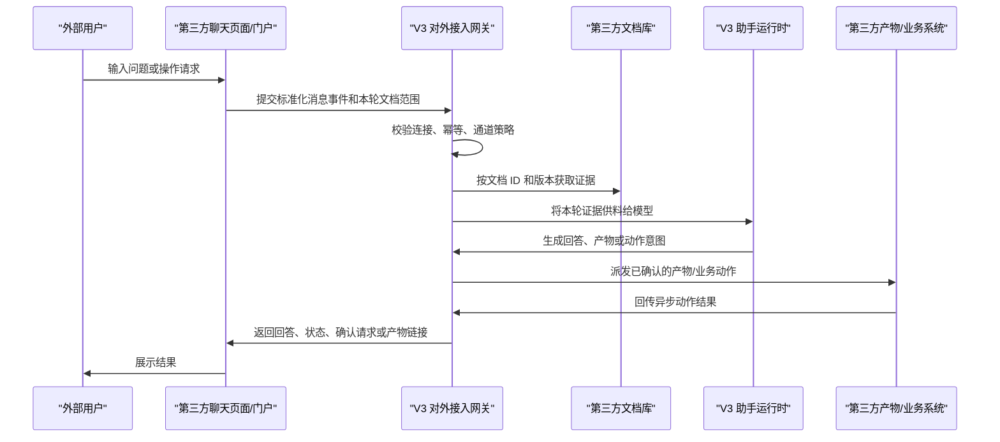

# V3 纯第三方简单版接口文档

**文档状态：** 对外草案 v0.5
**最后更新：** 2026-05-20
**适用对象：** 第三方自建门户、文档库、产物系统、业务系统和客户 IT 对接团队
**默认 V3 对外域名：** `https://v3.elepcloud.com`

本文只描述“纯第三方模式”。飞书、Lark、企业微信等标准机器人平台不在本文展开；这些平台走各自官方事件和机器人接口，再由 V3 转为统一通道事件。

纯第三方模式适用于：第三方自己搭建聊天页面或业务入口，文档库、产物系统、业务系统也可以都在第三方服务器上；V3 作为统一智能处理、资料供料、动作风控和审计中心。

## 1. 对接目标

纯第三方模式要完成四类闭环：

- 用户在第三方页面或系统里向 V3 提问；
- 第三方把本轮已经筛好的可用文档 ID 传给 V3，V3 只在这些文档内检索；
- V3 生成回答、报告、静态页或其他产物，并可发布回第三方系统；
- V3 在用户确认后，调用第三方业务接口处理事务，并接收异步结果回传。

V3 不要求第三方放弃自己的页面、文档库或业务系统。第三方页面仍由第三方控制，V3 负责背后的问答、资料供料、动作确认和审计。

## 2. 总体架构



关键边界：

- 第三方负责在调用 V3 前筛好本轮可用文档；
- V3 只使用请求中传入且已解析成功的文档；
- 模型可以回答普通问题，但涉及 V3 文档、产物和工具结果时，只能基于 V3 已供给证据；
- 高风险或跨系统写入必须经过 V3 确认流程。

## 3. 最小接入范围

最小可联调版本建议先准备：

<span class="requirement-highlight">红色标记表示本次 Data Buddy 最大需求中，纯第三方最小对接必须优先确认或落地的部分。</span>

| 模块 | 第三方需要提供 | V3 使用方式 |
| --- | --- | --- |
| 聊天入口 | 自建页面或网关调用 V3 消息接口 | 创建 AssistantRun 并返回回复对象 |
| 用户标识 | 当前提问人的稳定外部 ID | 绑定会话、审计和历史上下文 |
| <span class="requirement-highlight">文档库</span> | <span class="requirement-highlight">文档 ID、版本、正文或下载地址</span> | <span class="requirement-highlight">建立索引或按需读取证据，对应需求 1：解析文档并同步</span> |
| <span class="requirement-highlight">本轮文档范围</span> | <span class="requirement-highlight">每次消息传入本轮可用文档 ID 列表，包括普通资料和模板文档 ID</span> | <span class="requirement-highlight">只在该列表对应文档内检索，对应需求 3：聊天指定模板文件</span> |
| <span class="requirement-highlight">对话控制参数</span> | <span class="requirement-highlight">新会话提交默认提示词、输出格式和本轮模板要求</span> | <span class="requirement-highlight">创建 AssistantRun 时写入本轮策略，对应需求 2：按默认提示词和输出格式对话</span> |
| <span class="requirement-highlight">产物接口</span> | <span class="requirement-highlight">接收 HTML 页面、下载链接或发布回执</span> | <span class="requirement-highlight">发布/查询/下载 V3 产物，对应需求 3：按模板输出 HTML 页面</span> |
| 业务动作 | 接收 V3 派发的动作请求 | 执行业务事务并回传结果 |

<span class="requirement-highlight">如果项目早期只覆盖本次三项需求，最小闭环是：文档解析与同步 -> 新会话携带默认提示词/输出格式 -> 聊天携带模板文档 ID -> V3 输出 HTML 页面并返回预览/下载地址。业务动作可以后续接入。</span>

资料库仍保留在第三方服务器时，按本文的文档接口字段准备文档 ID、版本、正文或下载地址即可进入联调。后续如果新增对接说明，统一发布到 V3 外部集成观测页的“对接方式与文档”区域，不再另发散落的历史文档。

## 3.1 本次三项需求的最小范围与缺口评估

| 需求 | 在线文档相关部分 | 现有覆盖 | 当前缺口 | 建议落地 |
| --- | --- | --- | --- | --- |
| <span class="requirement-highlight">1. 解析文档并同步</span> | <span class="requirement-highlight">第 7 节文档接口、第 8 节 `documents/parse`、`parse-detail`、`external/sources/{source_id}/sync`</span> | <span class="requirement-highlight">已有单文档解析、解析详情查询、资料源同步触发和本轮文档范围字段</span> | <span class="requirement-highlight">批量存量文档解析/同步的对外批处理接口尚未作为独立接口公开；当前可用循环调用单文档解析或走资料源同步</span> | <span class="requirement-highlight">联调先用单文档 `documents/parse`；存量批量导入如有性能要求，再补批量 parse 或 source sync 任务参数</span> |
| <span class="requirement-highlight">2. 新会话接收默认提示词和输出格式后对话</span> | <span class="requirement-highlight">第 5 节 `/events`、`conversation_external_id`、`sender_external_id`、`requested_skills[].arguments`</span> | <span class="requirement-highlight">已有新会话 ID、用户 ID、消息文本和本轮 skill 参数承载位</span> | <span class="requirement-highlight">尚未有一等字段 `default_prompt`、`output_format`、`render_mode`；目前只能放在 `text` 或 `requested_skills[].arguments` 中，审计和校验不够直接</span> | <span class="requirement-highlight">建议新增请求字段：`default_prompt`、`output_format=markdown/html/chat/copyable_rich_text`、`render_mode=normal/artifact`，并做长度、枚举和敏感信息校验</span> |
| <span class="requirement-highlight">3. 聊天指定模板文件并按模板输出 HTML 页面</span> | <span class="requirement-highlight">第 5 节 `document_template_skill`，第 8 节模板文档先解析，第 10 节快速 HTML 交付</span> | <span class="requirement-highlight">已有模板文档 ID、输出类型 `static_page/html`、快速 HTML 渲染、预览和下载接口</span> | <span class="requirement-highlight">模板必须先解析并出现在本轮 `available_document_external_ids`；尚未有专门的“模板文件上传/选择/生成 HTML”组合接口</span> | <span class="requirement-highlight">最小联调用 `requested_skills[].arguments.template_document_external_id`；后续可加 `template_document_external_id` 顶层字段或模板管理接口</span> |

## 4. 文档是否必须搬到 V3

不需要把第三方服务器上的所有文档一次性拷贝到 V3 才能问答。

V3 需要的是“可验证、可追溯版本、可限定范围”的证据供料。第三方可以根据安全要求选择以下方式：

| 方式 | 说明 | 适用场景 |
| --- | --- | --- |
| 增量索引 | V3 拉取发生变化的文档正文或解析文本，生成检索索引和证据片段 | 常规知识库问答，体验最好 |
| 按需读取 | V3 先同步文档元数据和版本，需要深读时再调用正文接口 | 原文敏感、文档量大、只允许按需访问 |
| 第三方预解析 | 第三方提供已解析 Markdown/HTML/段落/结构化表格，V3 不下载原文件 | 第三方已有解析管线 |
| 推送供料 | 第三方主动推送变更文档、片段或索引包 | 内网隔离或第三方主动控制同步 |

无论哪种方式，都建议提供：

- 稳定的 `document_external_id`；
- 单调变化或可比较的 `revision`；
- `updated_at`；
- `content_hash` 或文件哈希；
- 文档删除或停用信号。

V3 可以保存文档元数据、解析后的文本片段、索引和来源定位信息。文档原件可以继续留在第三方服务器上。若项目要求 V3 不长期保存正文，可在实施阶段约定缓存周期、删除策略和只读按需读取策略。

问答时的基本过程是：

1. 第三方页面把用户消息、`sender_external_id` 和本轮文档 ID 列表发给 V3；
2. V3 把外部文档 ID 映射到内部文档记录；
3. V3 只在本轮传入且已解析成功的文档内检索或按需读取；
4. V3 把证据片段、来源和版本供给模型；
5. 模型基于这些证据回答，并保留 `当前未供料` 的边界说明。

## 5. V3 入站聊天接口

第三方自建页面或网关将用户消息提交给 V3：

```http
POST /v1/external/channels/{connection_id}/events
Host: v3.elepcloud.com
Content-Type: application/json
Authorization: Bearer <V3 inbound token>
```

请直接使用 `https://v3.elepcloud.com/v1/...`。如果从 `http://` 发起请求，网关重定向可能导致调试工具把 `POST` 改成 `GET`，表现为 `405 Method Not Allowed`。

当连接配置了入站 Bearer Token 时，聊天事件、用户确认和动作结果回传都会强校验 `Authorization: Bearer <V3 inbound token>`。该 token 由 V3 生成并交付给第三方，只用于“第三方 -> V3”的入站调用；V3 派发第三方业务动作时使用第三方另行提供的派发专用 token 或签名密钥。

请求示例：

```json
{
  "platform": "generic_chat",
  "tenant_external_id": "tenant-ext-001",
  "bot_external_id": "bot-v3",
  "conversation_external_id": "chat-risk-room",
  "thread_external_id": "thread-optional",
  "sender_external_id": "user-10001",
  "message_external_id": "msg-20260515-0001",
  "message_type": "text",
  "text": "帮我按周报模板总结本轮传入的采购审批制度，并生成一页 HTML 交付稿。",
  "available_document_source_id": "src-docs",
  "available_document_external_ids": ["doc-001", "doc-002", "tpl-weekly-report-001"],
  "default_prompt": "你是 Data Buddy 助手，请优先按本轮传入资料回答，输出面向业务用户。",
  "output_format": "html",
  "render_mode": "artifact",
  "requested_skills": [
    {
      "skill_id": "procurement_policy_review",
      "version": "2026-05-20",
      "mode": "preferred",
      "arguments": {
        "focus": "risk"
      }
    },
    {
      "skill_id": "document_template_skill",
      "version": "2026-05-20",
      "mode": "required",
      "arguments": {
        "template_document_external_id": "tpl-weekly-report-001",
        "source_id": "src-docs",
        "output_type": "static_page"
      }
    }
  ],
  "mention_external_user_ids": [],
  "attachment_refs": [],
  "idempotency_key": "generic_chat:tenant-ext-001:msg-20260515-0001",
  "received_at": "2026-05-15T10:00:00Z"
}
```

字段要求：

| 字段 | 必填 | 说明 |
| --- | --- | --- |
| `platform` | 是 | 必须和连接配置一致；当前自建聊天联调通常使用 `generic_chat`，也可按项目配置使用 `third_party` |
| `tenant_external_id` | 是 | 第三方租户、空间或客户 ID |
| `bot_external_id` | 是 | 第三方侧机器人或应用 ID |
| `conversation_external_id` | 是 | 会话、群、房间或页面上下文 ID；同一轮、同一页面会话或同一聊天窗口保持不变，V3 会映射为同一个对话上下文 |
| `thread_external_id` | 否 | 子线程、话题或页面局部上下文 ID；没有子线程时可省略 |
| `sender_external_id` | 是 | 当前提问用户在第三方系统中的稳定 ID；V3 会用它绑定会话、审计和“用户历史上下文” |
| `message_external_id` | 是 | 第三方消息 ID，必须稳定 |
| `message_type` | 是 | `text`、`image`、`file`、`audio`、`video`、`card`、`event` 或 `unknown` |
| `text` | 文本消息必填 | 用户输入文本 |
| `available_document_source_id` | 文档问答建议传 | 本轮可用文档所属资料源 ID；连接配置了默认资料源时可省略，但联调建议显式传 |
| `available_document_external_ids` | 文档问答建议传 | 本轮允许 V3 使用的第三方文档 ID 列表；只传本轮已筛好的文档，不要传全库 |
| <span class="requirement-highlight">`default_prompt`</span> | <span class="requirement-highlight">本次需求建议新增</span> | <span class="requirement-highlight">新会话默认提示词或页面级 system prompt；当前可临时放入 `requested_skills[].arguments.default_prompt` 或连接配置，建议补成一等字段</span> |
| <span class="requirement-highlight">`output_format`</span> | <span class="requirement-highlight">本次需求建议新增</span> | <span class="requirement-highlight">期望输出格式，建议枚举为 `markdown`、`html`、`chat`、`copyable_rich_text`；当前可临时放入 `requested_skills[].arguments.output_format`</span> |
| <span class="requirement-highlight">`render_mode`</span> | <span class="requirement-highlight">本次需求建议新增</span> | <span class="requirement-highlight">输出处理模式，建议 `normal` 表示普通聊天，`artifact` 表示生成可预览/下载产物；当前可由 `output_type` 和用户文本间接表达</span> |
| `requested_skills` | 否 | 第三方希望本轮应用的结构化 skill 列表；正式对接建议传此字段，不建议只把 skill 写进用户自然语言文本 |
| `requested_skills[].skill_id` | `requested_skills` 有值时必填 | 本轮希望启用的 skill 稳定标识，建议使用英文或业务 slug |
| `requested_skills[].version` | 否 | skill 版本号或策略版本，用于审计和复现；不传时按连接默认策略处理 |
| `requested_skills[].mode` | 否 | `required`、`preferred` 或 `disabled`；不传默认按 `preferred` |
| `requested_skills[].arguments` | 否 | 本轮 skill 参数对象，只放非敏感参数；禁止放 token、密码、Cookie 或长期下载 URL |
| `requested_skills[].arguments.template_document_external_id` | 模板 skill 建议传 | 模板文档的第三方文档 ID，必须同时出现在本轮 `available_document_external_ids` 中 |
| `requested_skills[].arguments.source_id` | 模板 skill 建议传 | 模板文档所属资料源 ID，通常与 `available_document_source_id` 一致 |
| `requested_skills[].arguments.output_type` | 模板 skill 建议传 | 期望输出类型，例如 `static_page`、`html`、`page` 或 `any` |
| `mention_external_user_ids` | 否 | 本条消息中被 @ 的第三方用户 ID 列表；无 @ 时传空数组或省略 |
| `attachment_refs` | 否 | 附件引用，文件下载需按项目配置访问方式和有效期 |
| `idempotency_key` | 是 | 防重放和重复投递 |
| `received_at` | 是 | 第三方收到消息的时间 |

关于用户历史上下文：

- V3 会按 `platform + tenant_external_id + bot_external_id + sender_external_id` 维护一个内部隐藏的用户上下文范围，用于沉淀该用户历史对话摘要；
- 该上下文不是默认供料。只有当用户问题明确引用“刚才、上次、之前、继续”等历史语境时，V3 才会把该用户自己的历史上下文作为可选证据供给模型；
- `mention_external_user_ids` 只是本条消息中的提及对象，不会把被提及用户的历史对话供给模型。

关于本轮 SKILL：

- 如果第三方只在 `text` 里写“本轮使用某某 skill”，V3 会把它当作普通用户文本，模型可能遵循，但这是非结构化兜底，不保证可审计、可复现或可校验；
- 正式对接建议传 `requested_skills`。V3 会把它作为本轮结构化运行策略写入助手运行上下文，并供给模型；
- `requested_skills[].skill_id` 必填，建议使用稳定英文或业务 slug；`version` 可选；`mode` 可选，取值为 `required`、`preferred` 或 `disabled`，不传时按 `preferred` 处理；
- `requested_skills[].arguments` 可选，必须是 JSON object，只放本轮 skill 所需的非敏感参数，例如 `{ "focus": "risk" }`。不要放 token、密码、Cookie 或长期下载 URL；
- <span class="requirement-highlight">本次需求中的“默认提示词、输出格式、正常聊天/MD/HTML/可复制图文格式”建议作为 `default_prompt`、`output_format`、`render_mode` 一等字段补到接口；在接口补齐前，可先放入 `requested_skills[].arguments` 做联调占位。</span>
- 当前版本是模型提示级 skill 策略，先解决“本轮用什么规则/流程回答”的问题；如果后续要把 skill 变成可执行工具，还需要单独配置工具范围、确认和审计白名单；
- 请求体兼容驼峰字段 `requestedSkills`，也兼容别名 `skillRefs` / `skill_refs`。嵌套字段兼容 `skillId`、`skillVersion`。

关于本轮文档模板 skill：

- 如果第三方希望“指定某个文档为模板，按这个格式/结构/风格输出”，请在 `requested_skills` 中传 `skill_id: "document_template_skill"`；
- 模板文档也必须出现在本轮 `available_document_external_ids` 中，V3 只会从本轮文档范围里读取模板快照；
- 推荐参数为 `arguments.template_document_external_id`、`arguments.source_id`、`arguments.output_type`。也兼容 `templateDocumentExternalId`、`template_document_id` / `templateDocumentId`；
- `output_type` 可传 `static_page`、`html`、`page` 或 `any`。当用户生成快速 HTML/静态页时，V3 会把模板文档转换成自定义 `templateReference`；
- 模板文档默认只约束输出结构、章节顺序、措辞风格和必填字段，不会自动作为事实证据。事实仍来自本轮普通文档供料和 V3 本轮证据。

关于本轮文档范围：

- 文档问答建议每条消息都传 `available_document_source_id` 和 `available_document_external_ids`，不要依赖上一轮消息里的文档列表；
- V3 会把这些外部文档 ID 映射为内部文档，并为 `connection_id + conversation_external_id + source_id` 创建或刷新一个会话级临时数据集；
- 同一份 V3 文档可以同时属于原始资料库和多个临时数据集。临时数据集只保存 membership 范围，不移动、不复制、不删除原文档；
- V3 只会使用本轮显式传入且已成功解析到内部文档的 `available_document_external_ids`，不会扩大到同资料源或同数据集的其它文档；
- 未解析到、未索引完成或未传入本轮列表的文档不会供料给模型。

生成回复响应示例：

```json
{
  "accepted": true,
  "assistant_run_id": "00000000-0000-0000-0000-000000000001",
  "idempotency_key": "generic_chat:tenant-ext-001:msg-20260515-0001",
  "reply": {
    "target_conversation_external_id": "chat-risk-room",
    "reply_type": "text",
    "text": "根据本轮传入的采购审批制度，本周建议重点关注审批超时、审批边界和供应商变更风险。",
    "task_status": "answered",
    "requires_confirmation": false
  }
}
```

响应字段说明：

| 字段 | 说明 |
| --- | --- |
| `accepted` | V3 是否已接收本轮消息并完成接口层处理 |
| `assistant_run_id` | 本轮 V3 助手运行 ID；后续查询状态、确认动作和审计定位时使用 |
| `idempotency_key` | V3 回显的幂等键，用于第三方排查重复投递 |
| `reply` | V3 返回给第三方页面展示或处理的最终回复对象 |
| `reply.target_conversation_external_id` | 应展示回复的第三方会话 ID，通常等于请求里的 `conversation_external_id` |
| `reply.reply_type` | 回复类型，例如 `text`、`task_status`、`card`、`artifact_link` 或 `requires_confirmation` |
| `reply.text` | 文本回复内容；仅当 `reply_type=text` 或需要展示文本时有值 |
| `reply.task_status` | 任务状态，例如 `answered`、`processing`、`failed` 或 `v3_search_evidence_required` |
| `reply.requires_confirmation` | 是否需要第三方页面继续展示确认动作 |
| `reply.action_id` | 需要确认或跟踪的外部动作 ID；仅动作类回复返回 |
| `reply.confirmation_id` | 确认请求 ID；第三方提交确认时可用于关联 |
| `reply.card` | 结构化卡片对象，例如等待搜索证据、错误提示或业务摘要 |
| `reply.artifact_links` | 产物链接列表；只放可展示给第三方页面的短期或受控链接 |

这个 `/events` 接口同时承担两个职责：第三方把用户消息发给 V3，V3 把本次生成回复、任务状态或确认卡片放在响应体 `reply` 中返回给第三方。第三方页面按 `reply.target_conversation_external_id` 把回复展示回原会话即可；第一阶段不需要再调用单独的“取回复”接口。

如果第三方自建聊天页希望获得“边生成边展示”的体验，可以改用流式接口。流式接口的请求体、鉴权、幂等规则和 `/events` 一致，只是响应采用 SSE：

```http
POST /v1/external/channels/{connection_id}/events/stream
Host: v3.elepcloud.com
Content-Type: application/json
Accept: text/event-stream
Authorization: Bearer <V3 inbound token>
```

流式接口适合长回答、静态页生成、报告生成和用户希望看到实时进展的场景。前端收到 `external_channel.delta` 后追加到同一个助手气泡；收到 `external_channel.completed` 后，以其中的 `response.reply` 作为最终权威结果。若第三方暂时不做流式展示，继续调用 `/events` 即可。

SSE 事件类型：

| 事件 | 说明 |
| --- | --- |
| `external_channel.started` | V3 已通过鉴权、连接和幂等校验并开始处理；这不是助手回复 |
| `external_channel.delta` | 本轮回复的增量文本，第三方页面可逐段追加显示 |
| `external_channel.completed` | 本轮运行完成，`response` 字段包含与 `/events` 同结构的最终响应 |
| `error` | 本轮运行失败或请求不合法，`message` 字段说明原因 |
| `done` | SSE 流结束 |

SSE 响应示例：

```text
event: external_channel.started
data: {"status":"started","idempotency_key":"generic_chat:tenant-ext-001:msg-20260515-0001"}

event: external_channel.delta
data: {"index":0,"delta":"根据本轮传入的采购审批制度，"}

event: external_channel.delta
data: {"index":1,"delta":"本周建议重点关注审批超时、审批边界和供应商变更风险。"}

event: external_channel.completed
data: {"assistant_run_id":"00000000-0000-0000-0000-000000000001","response":{"accepted":true,"reply":{"target_conversation_external_id":"chat-risk-room","reply_type":"text","text":"根据本轮传入的采购审批制度，本周建议重点关注审批超时、审批边界和供应商变更风险。","task_status":"answered","requires_confirmation":false}}}

event: done
data: {"ok":true}
```

SSE data 字段说明：

| 位置 | 字段 | 说明 |
| --- | --- | --- |
| `external_channel.started.data` | `status` | 固定表示流已开始处理，通常为 `started` |
| `external_channel.started.data` | `idempotency_key` | 本轮消息幂等键，用于前端和服务端日志关联 |
| `external_channel.delta.data` | `index` | 增量片段序号，从 0 开始递增 |
| `external_channel.delta.data` | `delta` | 本次追加的文本片段，可追加到同一个助手气泡 |
| `external_channel.completed.data` | `assistant_run_id` | 本轮助手运行 ID |
| `external_channel.completed.data` | `response` | 与 `/events` JSON 响应同结构的最终权威响应 |
| `done.data` | `ok` | SSE 流是否正常结束 |
| `error.data` | `status` | 错误状态或 HTTP 状态，便于页面展示失败态 |
| `error.data` | `error.code` | 稳定错误码，便于第三方做分支处理 |
| `error.data` | `error.message` | 可展示或记录的错误说明，不包含密钥和敏感正文 |

前端实现注意事项：

- 因为流式接口是 `POST + JSON body`，浏览器端建议使用 `fetch` + `ReadableStream` 读取 SSE；原生 `EventSource` 只适合 `GET`，不适合直接提交本接口请求体；
- 同一条用户消息的重试必须复用相同 `idempotency_key`，避免重复创建运行或重复派发动作；
- 页面展示时不要把 `external_channel.started` 当作助手回答；只有 `external_channel.delta` 和 `external_channel.completed.response.reply.text` 可以进入助手消息气泡；
- 当前流式能力是 V3 对外接口层的 SSE 流式返回；若某个模型供应商暂时只返回整段文本，V3 仍会把最终文本拆成增量事件输出，后续可按模型网关能力升级为更细粒度 token 透传。

任务状态响应示例：

```json
{
  "accepted": true,
  "assistant_run_id": "00000000-0000-0000-0000-000000000001",
  "idempotency_key": "generic_chat:tenant-ext-001:msg-20260515-0001",
  "reply": {
    "target_conversation_external_id": "chat-risk-room",
    "reply_type": "task_status",
    "task_status": "processing"
  }
}
```

任务状态字段说明：

| 字段 | 说明 |
| --- | --- |
| `accepted` | V3 是否接收该请求 |
| `assistant_run_id` | 当前任务运行 ID |
| `idempotency_key` | 本轮请求幂等键 |
| `reply.target_conversation_external_id` | 任务状态应回显到的第三方会话 |
| `reply.reply_type` | 当前为 `task_status`，表示不是最终自然语言答案 |
| `reply.task_status` | 任务状态值，例如 `processing`、`failed`、`answered` 或 `v3_search_evidence_required` |

常见 `reply_type`：

- `task_status`：处理中、失败、等待证据；普通问答不要把它渲染成助手回答；
- `text`：普通文本回答；
- `card`：结构化卡片；
- `artifact_link`：产物链接；
- `requires_confirmation`：需要用户确认；

如果消息需要外部/网页搜索，而 V3 尚未供给搜索证据，可能返回：

```json
{
  "reply_type": "task_status",
  "task_status": "v3_search_evidence_required",
  "card": {
    "type": "v3_search_evidence_required",
    "search_evidence_required": true
  }
}
```

等待搜索证据字段说明：

| 字段 | 说明 |
| --- | --- |
| `reply_type` | 固定为 `task_status`，表示当前不是最终回答 |
| `task_status` | 固定为 `v3_search_evidence_required`，表示需要 V3 只读搜索证据供料 |
| `card.type` | 卡片类型，第三方页面可按该类型展示等待证据状态 |
| `card.search_evidence_required` | 是否处于等待搜索证据状态 |

这表示 V3 正等待只读搜索证据供料，不表示已经完成联网搜索。

## 6. 用户标识约定

简单版不要求第三方提供额外用户接口。第三方只需要在每条消息里提供稳定的 `sender_external_id`，用于：

- 绑定同一外部用户的会话上下文；
- 生成审计摘要；
- 支持用户追问“刚才、上次、继续”等历史语境。

`sender_external_id` 建议使用第三方系统内部稳定 ID，不建议使用昵称、手机号、临时 session id 或会变化的展示名。

最小示例：

```json
{
  "tenant_external_id": "tenant-ext-001",
  "bot_external_id": "bot-v3",
  "conversation_external_id": "chat-risk-room",
  "sender_external_id": "user-10001",
  "message_external_id": "msg-20260515-0001"
}
```

最小用户标识字段说明：

| 字段 | 说明 |
| --- | --- |
| `tenant_external_id` | 第三方租户、空间或客户 ID |
| `bot_external_id` | 第三方机器人或应用 ID |
| `conversation_external_id` | 本轮会话或页面上下文 ID |
| `sender_external_id` | 第三方用户稳定 ID，不能用昵称或临时 session 替代 |
| `message_external_id` | 第三方消息稳定 ID，用于幂等和审计定位 |

## 7. 文档接口

### 7.1 文档列表

建议第三方提供：

```http
GET /documents?cursor=<cursor>&updated_after=<iso_time>&limit=100
```

响应示例：

```json
{
  "items": [
    {
      "document_external_id": "doc-001",
      "title": "采购审批制度",
      "document_type": "pdf",
      "revision": "rev-20260515-01",
      "updated_at": "2026-05-15T09:20:00Z",
      "deleted": false,
      "content_url": "https://third-party.example.com/documents/doc-001/content",
      "acl_url": "https://third-party.example.com/documents/doc-001/acl",
      "content_hash": "sha256:..."
    }
  ],
  "next_cursor": "cursor-002"
}
```

文档列表字段说明：

| 字段 | 说明 |
| --- | --- |
| `items` | 当前页文档数组 |
| `items[].document_external_id` | 第三方文档稳定 ID；V3 对话和解析映射都使用该 ID |
| `items[].title` | 文档标题，用于展示和检索摘要 |
| `items[].document_type` | 文档类型或扩展名，例如 `pdf`、`docx`、`md` |
| `items[].revision` | 文档版本标识；正文变化时必须变化 |
| `items[].updated_at` | 第三方文档更新时间，ISO 8601 格式 |
| `items[].deleted` | 是否已删除；为 `true` 时 V3 后续不应继续使用 |
| `items[].content_url` | V3 拉取正文或文件的短期受控 URL |
| `items[].acl_url` | V3 拉取权限快照的短期受控 URL |
| `items[].content_hash` | 文档内容哈希，用于判断是否需要重新解析 |
| `next_cursor` | 下一页游标；没有下一页时传 `null` 或省略 |

### 7.2 文档正文

建议第三方提供：

```http
GET /documents/{document_external_id}/content?revision=rev-20260515-01
```

可返回：

- 原始文件下载流；
- 已解析文本；
- Markdown；
- HTML；
- 结构化段落；
- 表格数据；
- 附件列表；
- 文件哈希、版本号和更新时间。

正文必须与 `revision` 对应。文档更新后，应生成新的版本标识。

### 7.3 文档状态变更

建议第三方在文档列表或同步回调中明确表达文档是否仍可使用：

```json
{
  "document_external_id": "doc-001",
  "revision": "rev-20260515-01",
  "updated_at": "2026-05-15T09:21:00Z",
  "deleted": false,
  "disabled": false,
  "content_hash": "sha256:..."
}
```

文档状态字段说明：

| 字段 | 说明 |
| --- | --- |
| `document_external_id` | 第三方文档稳定 ID |
| `revision` | 当前文档版本标识 |
| `updated_at` | 本次状态或内容变化时间 |
| `deleted` | 是否删除；删除后 V3 不应继续把该文档作为证据 |
| `disabled` | 是否停用；停用表示暂不可用但不等于删除 |
| `content_hash` | 当前正文或文件哈希，变化时 V3 应重新解析或刷新索引 |

状态说明：

- `deleted=true` 表示文档已删除，V3 后续不应继续使用该文档；
- `disabled=true` 表示文档暂不可用，V3 后续不应继续使用该文档；
- `revision` 或 `content_hash` 变化时，V3 应重新解析或刷新索引；
- 第三方每次对话仍应只传本轮要使用的 `available_document_external_ids`。

## 8. 文档解析与资料源同步

<span class="requirement-highlight">本节对应需求 1：解析文档并同步。最小联调先使用单文档 `documents/parse`，再用 `parse-detail` 确认 `lifecycle=indexed`、`chunkCount` 和 `retrievalEvidenceCount` 后进入对话。</span>

第一阶段建议采用“第三方上传后触发单文档解析”的轻量链路：

```http
POST /v1/external/channels/{connection_id}/documents/parse
Host: v3.elepcloud.com
Content-Type: application/json
Authorization: Bearer <V3 inbound token>
```

第三方传入 `source_id`、`dataset_id`、`document_external_id`、可选 `revision_external_id` 和短时效 `content_url`。V3 下载文档后进入现有上传解析工作流，并把内部文档记录关联到 `source_id + document_external_id`。

请求 Body 示例：

```json
{
  "source_id": "third-party-source-main",
  "dataset_id": "0f2f7b19-58ab-4b2b-9a8f-cc38bfbf8c9d",
  "dataset_external_id": "dataset-third-party-main",
  "dataset_title": "第三方资料库",
  "document_external_id": "doc-001",
  "revision_external_id": "rev-20260515-01",
  "title": "采购审批制度.docx",
  "content_type": "application/vnd.openxmlformats-officedocument.wordprocessingml.document",
  "content_url": "https://third-party.example.com/download/doc-001?expires=short",
  "metadata": {
    "business_category": "procurement"
  },
  "idempotency_key": "third-party-source-main:doc-001:rev-20260515-01"
}
```

解析请求字段说明：

| 字段 | 必填 | 说明 |
| --- | --- | --- |
| `source_id` | 是 | V3 资料源 ID，通常由 V3 联调配置给出 |
| `dataset_id` | 否 | V3 内部数据集 UUID；如果传错或传非 UUID 会返回反序列化或数据集不存在错误 |
| `dataset_external_id` | 否 | 第三方数据集或资料库稳定 ID；不知道内部 UUID 时建议传这个字段 |
| `dataset_title` | 否 | 数据集展示名；V3 创建或展示资料库时使用 |
| `document_external_id` | 是 | 第三方文档稳定 ID；后续对话用 `available_document_external_ids` 引用同一个值 |
| `revision_external_id` | 否 | 第三方文档版本 ID；内容更新时建议变化 |
| `title` | 否 | 文档标题或文件名 |
| `content_type` | 否 | MIME 类型；不传时 V3 会尝试从文件名或响应头推断 |
| `content_url` | 是 | V3 可下载原始文件的短期 URL；不要使用长期公开链接 |
| `metadata` | 否 | 非敏感业务元数据对象，只用于审计和后续映射 |
| `idempotency_key` | 否 | 本次解析请求幂等键；建议按 `source_id + document_external_id + revision` 生成 |
| `allow_http_loopback` | 否 | 仅本地联调使用，允许 HTTP loopback 下载；生产不要开启 |

解析响应关键字段说明：

| 字段 | 说明 |
| --- | --- |
| `accepted` | V3 是否接收解析请求 |
| `source_id` | V3 回显的资料源 ID |
| `document_external_id` | V3 回显的第三方文档 ID |
| `revision_external_id` | V3 回显的第三方版本 ID |
| `document.id` | V3 内部文档 ID |
| `document.dataset_id` | 文档归属的 V3 内部数据集 UUID |
| `document.title` | V3 记录的文档标题 |
| `document.content_type` | V3 记录或推断的 MIME 类型 |
| `document.lifecycle` | 文档生命周期；`indexed` 表示已经完成索引并可作为检索证据 |
| `document.parse_status` | 解析状态摘要，例如已接收、解析中、已完成或失败 |
| `document.parseQualityStatus` | 解析质量状态的驼峰兼容字段 |
| `document.created_at` | V3 文档记录创建时间 |
| `document.updated_at` | V3 文档记录更新时间 |
| `workflow_execution` | 后台解析工作流信息，用于 V3 侧排查 |

解析状态查询：

```http
GET /v1/external/channels/{connection_id}/documents/{document_external_id}/parse-detail?source_id={source_id}
Authorization: Bearer <V3 inbound token>
```

解析详情响应字段说明：

| 字段 | 说明 |
| --- | --- |
| `source_id` | 查询的资料源 ID |
| `document_external_id` | 查询的第三方文档 ID |
| `lifecycle` | 当前聚合生命周期；`indexed` 表示文档已完成索引 |
| `chunk_count` / `chunkCount` | 已生成的文本分块数量 |
| `retrieval_evidence_count` / `retrievalEvidenceCount` | 可用于检索供料的证据数量 |
| `parse_status` / `parseStatus` | 文档解析状态 |
| `parse_quality_status` / `parseQualityStatus` | 解析质量状态 |
| `parse_quality_summary` / `parseQualitySummary` | 解析质量摘要对象 |
| `model_status` / `modelStatus` | 面向模型供料的状态摘要 |
| `ingest` | 解析入库摘要，例如标题、内容类型和分块数 |
| `workflow` | 后台工作流状态摘要 |
| `latest` | 最新版本对应的文档详情对象 |
| `documents` | 与该外部文档 ID 匹配的 V3 文档记录列表 |
| `documents[].document_id` | V3 内部文档 ID |
| `documents[].dataset_id` | V3 内部数据集 UUID |
| `documents[].revision_external_id` | 第三方版本 ID |
| `documents[].created_at` | V3 文档记录创建时间 |
| `documents[].updated_at` | V3 文档记录更新时间 |

对话时，第三方继续调用消息接口，并传入本轮可用文档：

```json
{
  "available_document_source_id": "src-docs",
  "available_document_external_ids": ["third-doc-20260518-001"]
}
```

对话文档范围字段说明：

| 字段 | 说明 |
| --- | --- |
| `available_document_source_id` | 本轮文档所属资料源 ID |
| `available_document_external_ids` | 本轮允许 V3 使用的第三方文档 ID 列表；只传本轮选中的文档 |

V3 会把外部文档 ID 映射为内部文档范围，并只从这些文档供料给模型。

实现细节：

- 每次带 `available_document_external_ids` 的对话请求都会刷新当前会话的临时文档范围；
- 临时数据集的范围来自本轮传入的文档 ID，完成或过期后只清理临时 membership，不影响原始文档所在资料库；
- V3 只允许本轮显式范围内、已解析可索引的文档供料；
- 没有出现在本轮 `available_document_external_ids` 里的文档不会进入模型上下文。

### 8.1 V3 触发资料源同步

<span class="requirement-highlight">本节也对应需求 1 的“同步”。如果第三方已有文档列表/正文接口，V3 可通过资料源同步拉取增量；如果是前端上传后立即解析，优先走上面的 `documents/parse`。</span>

V3 可通过连接配置中的第三方文档接口进行增量同步。运营或系统可触发：

```http
POST /v1/external/sources/{source_id}/sync
Host: v3.elepcloud.com
```

V3 会把同步任务放入后台队列。同步任务应记录：

- 本次同步的 source；
- 增量游标；
- 文档数量；
- 新增、更新、删除、失败数量；
- 错误摘要。

同步日志和观测摘要不会展示原始文档正文和密钥。

## 9. 用户确认接口

当 V3 判断某个动作需要确认时，会返回 `requires_confirmation`。第三方页面应把动作摘要展示给用户，再把确认结果提交给 V3：

```http
POST /v1/external/channels/{connection_id}/confirmations
Host: v3.elepcloud.com
Content-Type: application/json
Authorization: Bearer <V3 inbound token>
```

请求示例：

```json
{
  "assistant_run_id": "00000000-0000-0000-0000-000000000001",
  "action_id": "act-001",
  "confirmation_external_id": "confirm-001",
  "sender_external_user_id": "user-10001",
  "decision": "approved",
  "comment": "确认提交审批。",
  "idempotency_key": "third_party:tenant-ext-001:confirm-001",
  "confirmed_at": "2026-05-15T10:03:00Z"
}
```

确认请求字段说明：

| 字段 | 说明 |
| --- | --- |
| `assistant_run_id` | V3 返回的助手运行 ID |
| `action_id` | V3 待确认动作 ID |
| `confirmation_external_id` | 第三方侧确认记录 ID，便于对账和幂等 |
| `sender_external_user_id` | 做出确认或拒绝的第三方用户 ID |
| `decision` | `approved` 或 `rejected` |
| `comment` | 用户确认备注；V3 仅保存必要摘要 |
| `idempotency_key` | 确认请求幂等键 |
| `confirmed_at` | 第三方确认发生时间 |

`decision` 支持：

- `approved`；
- `rejected`。

第三方页面必须展示 V3 返回的动作摘要，不应自行拼接高风险动作内容。

## 10. 产物接口

<span class="requirement-highlight">本节对应需求 3：聊天中指定模板文件 ID 后，按模板要求输出 HTML 页面，并通过预览/下载地址交付。</span>

V3 可以生成报告、页面、文档、表格、图片、压缩包或链接，并按项目配置发布到第三方系统。

当前主链路采用“V3 外部动作派发”方式：V3 把 `external_artifact.publish`、`external_artifact.status`、`external_artifact.revoke` 作为受控动作保存到审计记录中，再派发到第三方配置的 HTTPS endpoint。

<span class="requirement-highlight">本次第三方对接的页面类产物可采用“快速 HTML 交付”方式：`html-anything` 作为模板来源和设计参考，V3 直接渲染浏览器可打开的 HTML，跳过调试页、效果图和截图确认。</span> V3 仍保留模型路由、数据集、证据供料和产物审计边界。

V3 内部渲染最终页时使用：

```json
{
  "direct_html": true,
  "background": false
}
```

渲染请求字段说明：

| 字段 | 说明 |
| --- | --- |
| `direct_html` | 是否走快速 HTML 直出模式；为 `true` 时跳过调试页和截图确认 |
| `background` | 是否后台异步渲染；为 `false` 时接口尽量同步返回初始渲染结果 |

<span class="requirement-highlight">模板选择最小路径：先把模板文件作为普通文档解析成功，再在聊天请求中把模板文档 ID 放入 `available_document_external_ids` 和 `requested_skills[].arguments.template_document_external_id`，同时设置 `output_type=static_page` 或 `html`。</span>

渲染响应里的 `render_output.id` 是本次 HTML 生成 id。第三方如果采用异步或需要确认状态，可用同一个 id 查询：

```http
GET /v1/external/channels/{connection_id}/static-page-renders/{render_output_id}
Host: v3.elepcloud.com
Authorization: Bearer <V3 inbound token>
```

状态响应会返回 `status`、`html_preview_url` / `htmlPreviewUrl`、`html_download_url` / `htmlDownloadUrl`、`download_url` / `downloadUrl` 和 `retryable_error_reason` / `retryableErrorReason`。`status=rendered` 且存在下载地址时即可进入下载；`status=failed` 时，第三方应展示失败状态并参考 `retryable_error_reason` 发起重试或人工处理。

渲染状态字段说明：

| 字段 | 说明 |
| --- | --- |
| `id` | V3 静态页渲染输出 ID，即路径中的 `render_output_id` |
| `draft_id` | 对应的静态页草稿 ID |
| `assistant_run_id` | 触发渲染的助手运行 ID |
| `image_job_id` | 关联的图片任务 ID；快速 HTML 模式通常为空 |
| `status` | `queued`、`rendering`、`rendered`、`failed` 或 `cancelled` |
| `html` | 内部响应中的 HTML 内容；外部状态接口通常应使用预览或下载 URL |
| `html_preview_url` / `htmlPreviewUrl` | 浏览器 inline 预览地址 |
| `html_download_url` / `htmlDownloadUrl` | HTML 附件下载地址 |
| `download_url` / `downloadUrl` | 兼容下载地址，通常与 `html_download_url` 等价 |
| `retryable_error_reason` / `retryableErrorReason` | 失败时是否可重试及原因 |
| `asset_manifest` | 渲染资产摘要和审计信息 |
| `created_at` | 渲染输出创建时间 |

预览 HTML：

```http
GET /v1/external/channels/{connection_id}/static-page-renders/{render_output_id}/preview
Host: v3.elepcloud.com
Authorization: Bearer <V3 inbound token>
```

第三方服务器端下载 HTML：

```http
GET /v1/external/channels/{connection_id}/static-page-renders/{render_output_id}/download
Host: v3.elepcloud.com
Authorization: Bearer <V3 inbound token>
```

预览接口返回 inline `text/html; charset=utf-8`；下载接口返回 `text/html; charset=utf-8` 附件。第三方应由服务器端带 token 下载后转存或分发，不要把 V3 token 放到浏览器里。V3 会校验 `render_output_id` 必须属于该 `connection_id` 对应的外部通道上下文。

第三方建议提供：

```http
POST /artifacts
GET /artifacts/{artifact_external_id}
POST /artifacts/{artifact_external_id}/revoke
```

V3 派发示例：

```json
{
  "action_id": "act-artifact-001",
  "assistant_run_id": "00000000-0000-0000-0000-000000000001",
  "action_type": "external_artifact.publish",
  "risk_level": "low_risk_write",
  "target_system": "third_party_artifact_api",
  "arguments_redacted": {
    "artifact_ref": "artifact-001",
    "target_system": "customer-portal",
    "visibility": "source_acl"
  },
  "confirmation_state": "not_required",
  "requester_summary": {
    "platform": "third_party",
    "tenant_external_id": "tenant-ext-001",
    "conversation_external_id": "chat-risk-room",
    "sender_external_id": "user-10001"
  },
  "raw_arguments_included": false
}
```

产物派发字段说明：

| 字段 | 说明 |
| --- | --- |
| `action_id` | V3 外部动作运行 ID |
| `assistant_run_id` | 触发动作的助手运行 ID |
| `action_type` | 动作类型，例如 `external_artifact.publish`、`external_artifact.status` 或 `external_artifact.revoke` |
| `risk_level` | 动作风险级别，例如 `read_only`、`low_risk_write`、`high_risk_write` 或 `cross_system` |
| `target_system` | 第三方目标系统标识 |
| `arguments_redacted` | 脱敏后的动作参数摘要，只包含第三方执行所需的安全字段 |
| `arguments_redacted.artifact_ref` | V3 或业务侧产物引用 |
| `arguments_redacted.target_system` | 产物发布目标，例如客户门户或下载中心 |
| `arguments_redacted.visibility` | 产物可见性策略，例如跟随来源权限 |
| `confirmation_state` | 确认状态，例如 `not_required`、`pending`、`confirmed` 或 `rejected` |
| `requester_summary` | 请求来源摘要，不包含原始用户消息正文 |
| `requester_summary.platform` | 来源平台 |
| `requester_summary.tenant_external_id` | 第三方租户 ID |
| `requester_summary.conversation_external_id` | 第三方会话 ID |
| `requester_summary.sender_external_id` | 发起动作的第三方用户 ID |
| `raw_arguments_included` | 是否包含原始参数；对外派发应为 `false` |

第三方响应可返回：

```json
{
  "external_request_id": "artifact-publish-001",
  "status": "accepted",
  "artifact_external_id": "tp-artifact-001"
}
```

产物响应字段说明：

| 字段 | 说明 |
| --- | --- |
| `external_request_id` | 第三方接收本次动作后的请求 ID |
| `status` | 第三方处理状态，例如 `accepted`、`running`、`succeeded` 或 `failed` |
| `artifact_external_id` | 第三方系统生成的产物 ID |

产物发布要求：

- 下载链接应短期有效或带访问校验；
- 撤销后第三方不可继续访问；
- 发布、查看、下载、撤销都应可审计；
- V3 观测接口不展示原始产物正文、原始下载地址或凭证。

## 11. 业务动作接口

V3 可在用户确认和系统校验后调用第三方业务接口，例如：

- 创建或更新工单；
- 发起审批；
- 写入 CRM 跟进记录；
- 创建项目任务；
- 提交结构化表单；
- 调用客户内部流程。

第三方建议提供一个统一动作接收 endpoint：

```http
POST /actions
```

V3 派发请求示例：

```json
{
  "action_id": "act-001",
  "assistant_run_id": "00000000-0000-0000-0000-000000000001",
  "action_type": "ticket.update_priority",
  "risk_level": "high_risk_write",
  "target_system": "ticketing",
  "confirmation_state": "confirmed",
  "arguments_redacted": {
    "ticket_id": "T-1001",
    "priority": "high"
  },
  "requester_summary": {
    "platform": "third_party",
    "tenant_external_id": "tenant-ext-001",
    "conversation_external_id": "chat-risk-room",
    "sender_external_id": "user-10001"
  },
  "raw_arguments_included": false
}
```

业务动作派发字段说明：

| 字段 | 说明 |
| --- | --- |
| `action_id` | V3 外部动作运行 ID |
| `assistant_run_id` | 触发动作的助手运行 ID |
| `action_type` | 业务动作类型，由双方联调约定，例如 `ticket.update_priority` |
| `risk_level` | 风险级别，决定是否必须用户确认 |
| `target_system` | 第三方业务系统标识 |
| `confirmation_state` | 动作确认状态；高风险动作必须为 `confirmed` 才会派发 |
| `arguments_redacted` | 脱敏后的业务参数对象 |
| `arguments_redacted.ticket_id` | 示例工单 ID；实际字段按业务动作约定 |
| `arguments_redacted.priority` | 示例优先级；实际字段按业务动作约定 |
| `requester_summary` | 请求来源摘要 |
| `raw_arguments_included` | 是否包含原始参数；对外派发应为 `false` |

风险等级建议：

| 风险等级 | 示例 | 处理要求 |
| --- | --- | --- |
| `read_only` | 查询状态 | 不写入第三方系统 |
| `low_risk_write` | 发布草稿、创建低风险记录 | 可直接执行或轻量确认 |
| `high_risk_write` | 对外发布、提交审批、关键字段变更 | 必须用户确认 |
| `cross_system` | 跨系统事务、影响多个系统 | 必须确认并重点审计 |

V3 不会把飞书、企微或第三方入站回调用的通用 token 当作动作派发凭证复用。派发 endpoint 必须配置派发专用 Bearer Token 或签名密钥之一；否则 V3 会记录 `dispatch_blocked` 和 `dispatch_auth_missing`。

## 12. 动作结果回传

第三方异步执行完成后，把结果回传给 V3：

```http
POST /v1/external/channels/{connection_id}/actions/{action_id}/result
Host: v3.elepcloud.com
Content-Type: application/json
Authorization: Bearer <V3 inbound token>
```

请求示例：

```json
{
  "external_request_id": "gateway-req-001",
  "status": "succeeded",
  "idempotency_key": "third_party:tenant-ext-001:result-001",
  "completed_at": "2026-05-15T10:30:00Z",
  "code": "OK",
  "message": "可选说明文本。V3 只记录 message 是否存在。",
  "result": {
    "artifact_id": "artifact-001",
    "status": "created"
  }
}
```

结果回传字段说明：

| 字段 | 说明 |
| --- | --- |
| `external_request_id` | 第三方执行请求 ID；如果派发时已记录，回传必须一致 |
| `status` | `accepted`、`running`、`succeeded`、`failed`、`cancelled` 或 `rejected` |
| `idempotency_key` | 结果回传幂等键，重复回传必须复用 |
| `completed_at` | 第三方动作完成或状态更新时间 |
| `code` | 第三方稳定结果码或错误码 |
| `message` | 可选说明；V3 只保存是否存在和安全摘要，不保存原文 |
| `result` | 第三方结果对象；V3 只保存结构摘要和字段数量 |
| `result.artifact_id` | 示例产物 ID；实际字段按业务动作约定 |
| `result.status` | 示例结果状态；实际字段按业务动作约定 |

支持的 `status`：

- `accepted`；
- `running`；
- `succeeded`；
- `failed`；
- `cancelled`；
- `rejected`。

V3 会校验该通道是否拥有对应动作。如果派发时已经记录 `external_request_id`，回传时不允许传入不一致的请求 ID。`message` 和任意 `result` 值不会原文保存；V3 只保存是否存在、状态、安全错误码、字段数量等结构化摘要。

## 13. V3 出站派发签名

V3 调用第三方产物或业务动作 endpoint 时，建议第三方校验以下请求头：

```http
Authorization: Bearer <dispatch token>
X-V3-Connection-Id: generic-chat-main
X-V3-Timestamp: 2026-05-15T10:00:00Z
X-V3-Nonce: 01HX...
X-V3-Content-SHA256: <JSON 原始请求体 sha256 hex>
X-V3-Signature: sha256=<HMAC-SHA256 hex>
```

出站请求头字段说明：

| 请求头 | 说明 |
| --- | --- |
| `Authorization` | V3 派发动作时使用的专用 Bearer Token；只在配置了派发 token 时发送 |
| `X-V3-Connection-Id` | V3 外部连接 ID |
| `X-V3-Timestamp` | V3 发起请求时间，第三方应校验时间窗口 |
| `X-V3-Nonce` | 一次性随机值，第三方应防重放 |
| `X-V3-Content-SHA256` | JSON 原始请求体的 SHA-256 摘要 |
| `X-V3-Signature` | 基于签名原文和派发签名密钥生成的 HMAC-SHA256 |

只有配置派发 Bearer Token 时才发送 `Authorization`。只有配置派发签名密钥时才发送 `X-V3-Signature`。两者都配置时，V3 会同时发送。

推荐签名原文：

```text
method + "\n" + path + "\n" + timestamp + "\n" + nonce + "\n" + raw_body_sha256
```

第三方应校验：

- HTTPS；
- 时间戳窗口；
- nonce 不重复；
- body hash 一致；
- HMAC 签名一致；
- token 未过期；
- 来源 IP 或网络白名单符合项目约定。

## 14. 观测接口

V3 提供观测优先的管理接口，供 V3 控制台和运营人员使用。第三方自建聊天页面不需要直接暴露这些接口给普通用户。

```http
GET /v1/external/integrations
GET /v1/external/integrations/{integration_id}/audit
POST /v1/external/integrations/{integration_id}/retry
POST /v1/external/integrations/{integration_id}/disable
POST /v1/external/integrations/{integration_id}/rotate-secret
```

观测摘要包括：

- 通道健康状态；
- 最近活动时间；
- 文档同步状态；
- 消息、文档范围和同步摘要；
- 动作总数、待确认、派发阻断、派发失败、等待结果、结果成功/失败；
- 搜索证据待供料数量；
- 产物发布、撤销和状态查询摘要。

观测接口不会返回：

- 第三方原始密钥；
- 原始 provider payload；
- 未供料文档正文；
- 原始用户查询全文；
- 原始动作结果正文；
- 原始下载地址或长期凭证。

审计筛选示例：

```http
GET /v1/external/integrations/generic-chat-main/audit?item_type=action&action_state=result_callback
GET /v1/external/integrations/generic-chat-main/audit?item_type=search_evidence
GET /v1/external/integrations/generic-chat-main/audit?item_type=action&action_id=act-001&limit=1
```

## 15. 错误返回

V3 错误格式：

```json
{
  "code": "external_channel_connection_not_found",
  "message": "未找到对应的第三方聊天通道连接。",
  "details": {}
}
```

错误字段说明：

| 字段 | 说明 |
| --- | --- |
| `code` | 稳定错误码，第三方应优先按该字段做分支处理 |
| `message` | 面向调试或展示的错误说明，不包含密钥和敏感正文 |
| `details` | 可选结构化错误详情，例如字段名、约束或安全错误码 |

常见错误码：

| 错误码 | 说明 |
| --- | --- |
| `external_channel_connection_not_found` | 未找到聊天通道连接 |
| `external_channel_disabled` | 连接已停用 |
| `external_channel_platform_mismatch` | 请求平台与连接配置不一致 |
| `external_message_invalid` | 消息结构不合法 |
| `external_action_not_found` | 未找到动作 |
| `external_action_result_request_mismatch` | 回传请求 ID 不一致 |
| `external_action_dispatch_blocked` | 动作派发被阻断 |
| `react_dataset_not_selected` | 请求的数据集不在当前文档范围 |

第三方错误返回也应使用稳定 `code`，不要在 `message` 中返回密钥、token、完整 SQL、堆栈或敏感业务正文。

## 16. 联调前第三方准备清单

请第三方在联调前准备：

- 测试环境域名和网络访问方式；
- V3 可调用的文档列表接口；
- V3 可调用的文档正文或解析文本接口；
- 至少 1 个稳定的测试 `sender_external_id`；
- 至少 2 个测试 `conversation_external_id`，用于验证不同会话上下文；
- 至少 5 份测试文档，包括普通资料、模板资料、已更新版本、已删除或停用样例；
- 至少 1 组 `requested_skills` 样例；
- 至少 1 份模板文档，并能在消息中通过 `document_template_skill` 指定；
- 自建聊天页面或消息网关；
- 产物接收 endpoint；
- 业务动作接收 endpoint；
- 动作结果回传测试数据；
- Bearer Token 或签名密钥；
- IP 白名单、证书和 HTTPS 配置；
- 运维联系人和失败重试策略。

推荐测试用例：

1. 同一问题，传入不同 `available_document_external_ids` 时回答只基于本轮文档范围；
2. 未传入本轮文档列表的文档不进入回答证据；
3. 文档更新后，V3 使用新 revision；
4. 指定模板文档后，V3 按模板结构生成结果；
5. 高风险动作必须先返回确认请求；
6. 用户拒绝确认后，V3 不派发动作；
7. 已确认动作派发到第三方 endpoint；
8. 第三方回传 `succeeded` 后，V3 观测面板展示结果回调；
9. 重复消息和重复结果回调不会重复创建任务；
10. 未配置派发凭证时，V3 记录 `dispatch_auth_missing`，不静默失败。

## 17. 安全与合规要求

- 生产环境必须使用 HTTPS；
- 所有连接必须有明确租户和连接 ID；
- 所有写入动作必须可审计；
- 高风险动作必须确认；
- 第三方下载地址应短期有效或带访问校验；
- 文档删除、停用或版本变化后，应尽快同步到 V3；
- V3 和第三方都不应在日志中保存明文 token、密钥、Cookie 或未供料正文；
- 第三方页面不得把 V3 管理接口开放给普通用户；
- 内网部署、专线、代理、网关和证书策略需在项目实施阶段确认。

## 18. 当前实现状态

当前 V3 已具备的纯第三方主链路能力：

- 统一外部聊天通道事件：`POST /v1/external/channels/{connection_id}/events`；
- 统一外部聊天通道流式事件：`POST /v1/external/channels/{connection_id}/events/stream`；
- 统一用户确认回调：`POST /v1/external/channels/{connection_id}/confirmations`；
- 外部动作结果回传：`POST /v1/external/channels/{connection_id}/actions/{action_id}/result`；
- 连接级入站 Bearer Token 校验，覆盖聊天事件、用户确认和动作结果回传；
- <span class="requirement-highlight">单文档解析触发：`POST /v1/external/channels/{connection_id}/documents/parse`；</span>
- <span class="requirement-highlight">解析详情查询：`GET /v1/external/channels/{connection_id}/documents/{document_external_id}/parse-detail`；</span>
- <span class="requirement-highlight">资料源同步触发：`POST /v1/external/sources/{source_id}/sync`；</span>
- 外部动作派发到第三方 HTTPS endpoint；
- 派发 Bearer Token 和 HMAC 签名；
- 动作生命周期观测和审计筛选；
- action detail permalink 和脱敏 trace export；
- 搜索证据待供料状态观测；
- 观测页公开文档入口，支持 HTML 直接打开和 Markdown 下载。

仍需按项目配置或后续联调确认：

- 具体第三方文档 API 字段映射；
- <span class="requirement-highlight">用户 ID、会话 ID、skill 和模板文档字段映射；</span>
- <span class="requirement-highlight">`default_prompt`、`output_format`、`render_mode` 是否作为 `/events` 一等字段实现；当前文档已按本次需求建议标注，代码侧还需要补合同和校验；</span>
- <span class="requirement-highlight">批量存量文档解析接口是否需要新增；当前已有单文档 parse 和 source sync，但没有独立的批量 parse 请求体；</span>
- <span class="requirement-highlight">模板文件上传/选择/生成 HTML 是否需要组合接口；当前最小方案是模板先作为文档解析，再通过 `document_template_skill` 指定；</span>
- 产物 endpoint 和业务动作 endpoint；
- 生产级入站签名、IP 白名单、重放窗口和密钥轮换界面；
- 客户真实沙箱环境的端到端验证。

## 19. 推荐联调顺序

1. 创建 V3 第三方连接和 `connection_id`；
2. 配置第三方测试环境、网络和凭证；
3. 第三方消息网关调用 V3 events 接口；
4. 准备稳定的 `sender_external_id` 和 `conversation_external_id`；
5. 同步测试文档元数据、正文和解析状态；
6. 验证 `available_document_external_ids` 本轮文档范围；
7. 验证 `requested_skills` 和模板文档生成；
8. 接入产物发布 endpoint；
9. 接入业务动作 endpoint；
10. 验证用户确认、动作派发和结果回传；
11. 查看 V3 外部集成观测面板和审计筛选；
12. 进入真实客户沙箱联调。

## 20. 最新公开文档入口

V3 对外对接文档只保留最新有效版本，并统一发布在外部集成观测页的“对接方式与文档”区域。

- 完整对接文档 HTML：`/external-integrations/third-party-integration-api.zh-CN.html`
- 完整对接文档 MD：`/external-integrations/third-party-integration-api.zh-CN.md`
- 纯第三方简单版 HTML：`/external-integrations/pure-third-party-integration-guide.zh-CN.html`
- 纯第三方简单版 MD：`/external-integrations/pure-third-party-integration-guide.zh-CN.md`

仓库内保留的源文件为：

- `docs/integrations/third-party-integration-api.zh-CN.md`
- `docs/integrations/pure-third-party-integration-guide.zh-CN.md`
