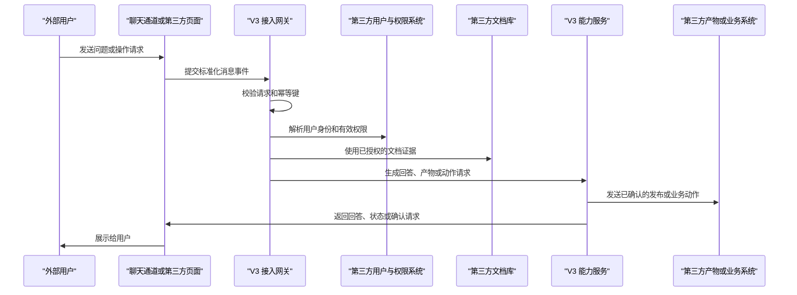

# V3 第三方接入说明书

**文档状态：** 对外草案 v0.1
**最后更新：** 2026-05-25
**适用对象：** 第三方系统负责人、客户 IT 团队、渠道/文档/权限/业务系统对接开发人员
**默认对外域名：** `https://v3.elepcloud.com`
**说明：** 本文可作为第三方联调前的接口说明材料，只说明 V3 对外开放的能力、接口、字段和使用方式，不展开具体实现细节。默认第三方接口使用 `https://v3.elepcloud.com/v1/...`；具体凭证、白名单、回调地址和开放接口，以项目交付环境和双方确认的联调配置为准。

如果第三方采用自建聊天页面、自建文档库、自建用户 ID、会话 ID、skill、模板、产物或业务接口的“纯第三方模式”，可优先阅读独立对接文档：`docs/integrations/pure-third-party-integration-guide.zh-CN.md`。如果第三方要接入类似 8 服务器现有数据库源的 MySQL/经营库，数据库接口已合并在本文 `11.6 第三方数据库对接`。需要发给业务/技术评审时，可直接打开同目录 HTML 阅读版。

V3 外部集成观测页提供两类公开文档入口：

- 完整对接文档 HTML：`/external-integrations/third-party-integration-api.zh-CN.html`
- 完整对接文档 MD：`/external-integrations/third-party-integration-api.zh-CN.md`
- 纯第三方简单版 HTML：`/external-integrations/pure-third-party-integration-guide.zh-CN.html`
- 纯第三方简单版 MD：`/external-integrations/pure-third-party-integration-guide.zh-CN.md`

默认访问规则：

- `https://v3.elepcloud.com/` 打开外部集成观测面板；
- 第三方接口默认使用 `https://v3.elepcloud.com/v1/...`；
- 该观测域名不提供直接跳回 V3 主工作台的导航入口。
- 连接配置了入站 Bearer Token 时，第三方调用 V3 的聊天事件、用户确认和动作结果回传都必须带 `Authorization: Bearer <V3 inbound token>`；该 token 由 V3 生成并交付给第三方。
- V3 对外对接文档只保留最新有效版本；HTML 和 MD 都统一发布在外部集成观测页的“对接方式与文档”区域。
- 外部聊天消息如果需要实时网页信息但当前不可用，V3 会返回 `task_status=v3_search_evidence_required`；第三方页面应把它展示为等待状态，不要展示成已完成搜索。

## 1. 接入目标

V3 支持把智能助手能力接入到第三方系统中，第三方可以按需使用以下能力：

- 在飞书、Lark、企业微信或第三方自建聊天页面中使用 V3 助手；
- 接入第三方文档库，让 V3 在授权范围内解析、索引和问答；
- 接入第三方用户、部门、角色、用户组和文档权限；
- 将 V3 生成的产物发布回第三方系统；
- 在用户确认后，由 V3 调用第三方业务接口处理事务。

第三方只需要明确使用哪些 V3 能力，以及按本文接口传递用户、会话、文档、模板、输出格式和动作确认信息。V3 会按接口返回文本、任务状态、确认请求、产物链接或错误码。

## 2. 接入模式

### 2.1 标准机器人模式

适用于飞书、Lark、企业微信等标准机器人平台。

在该模式下：

- 第三方平台负责消息投递、事件回调、群聊或单聊入口；
- V3 适配平台的官方机器人接口；
- V3 返回文本、卡片、文件、任务状态或确认请求；
- 平台侧负责把 V3 返回内容展示给用户。

### 2.2 纯第三方模式

适用于客户或合作方自建系统，例如自建门户、自建文档库、自建用户中心、自建业务系统。

在该模式下，第三方可以分别提供：

- 聊天通道接口：把用户消息发送给 V3；
- 文档接口：让 V3 拉取或接收文档、附件、版本和正文；
- 用户接口：让 V3 同步用户、部门、用户组、角色和停用状态；
- 权限接口：让 V3 获取文档级访问范围；
- 产物接口：接收 V3 生成的报告、页面、文件或链接；
- 事务接口：接收用户确认后的业务动作。

第三方可以搭建自己的聊天页面，并按本文的聊天、文档、模板和产物接口调用 V3。

### 2.3 混合模式

聊天入口、文档库、用户权限、产物系统和业务系统可以部署在不同服务器上。

示例：

- 用户在企业微信群里提问；
- 文档来自客户门户；
- 用户和部门来自客户统一身份系统；
- 审批或工单动作写入客户业务系统；
- V3 返回问答结果、产物链接、任务状态或用户确认请求。

## 3. 总体流程



## 4. 双方职责边界

### V3 负责

- 创建和管理第三方连接；
- 绑定租户、账号和外部身份；
- 解析第三方文档并建立索引；
- 按第三方提供的用户、会话、文档范围和权限信息处理请求；
- 创建和维护对话任务状态；
- 返回问答结果、产物链接、任务状态和确认请求；
- 按配置发送已确认的产物发布或业务动作；
- 提供接入健康状态、同步状态、错误和观测信息。

### 第三方负责

- 提供稳定的 HTTPS 接口或标准平台机器人配置；
- 提供文档列表、正文、附件、版本号和更新时间；
- 提供用户、部门、用户组、角色和停用状态；
- 提供文档权限或可访问范围；
- 保证外部用户 ID、文档 ID、消息 ID 等标识稳定；
- 配合配置签名密钥、访问令牌、IP 白名单或回调地址；
- 在需要时接收 V3 产物发布和业务动作回调。

## 5. 核心原则

- 所有请求必须归属到明确租户和连接。
- 所有消息、文档和动作回调都必须支持幂等。
- 第三方应只把本轮允许使用的文档 ID、模板 ID、skill 和输出格式传给 V3。
- V3 对文档问答只使用本轮可访问、已解析或已提供的文档范围。
- 如果当前问题需要实时网页信息但不可用，V3 会返回等待或不可用状态，而不是返回未验证的实时网页结论。
- 高风险写入、跨系统事务、权限变更、外部发布等动作必须经过确认。
- 日志、观测页面、错误返回和接口响应不得泄露密钥、令牌或未授权正文。
- 第三方聊天页面可以独立部署，但应通过本文接口完成消息提交、确认、产物查询和动作结果回传。

## 6. 回答能力与状态返回

V3 接收第三方消息后，会按请求内容返回以下几类结果：

- `text`：普通文本回答；
- `card`：结构化卡片；
- `artifact_link`：产物链接；
- `requires_confirmation`：需要用户确认的动作；
- `task_status`：处理中、失败、等待外部条件或无法立即完成。

文档问答场景下，第三方应在会话首次提问或文档范围变化时传入可用文档范围：可以传当前问题允许使用的 `available_document_external_ids`/单文档兼容字段 `documentExternalId`，也可以传稳定业务分组 `dataset_external_id` 授权该分组下的全部文档；如果一个工作区需要同时选择多个分组，传 `dataset_external_ids` 数组。分组字段和文档 ID 可以同时传，V3 会按并集合并授权：分组内文档整组生效，分组外的显式文档也生效，已经包含在分组内的显式文档会自动去重。只有想把本次会话限制为少数具体文档时，才只传文档 ID、不传分组字段。该授权绑定 `conversation_external_id`，同一会话后续消息会继续复用，直到第三方更换会话 ID 或重新传入新的文档范围。第三方内部读权限由第三方在传入这些范围前完成判断；V3 按本轮/本会话传入的文档或分组范围供料，不会再替第三方扩大或缩小第三方内部权限。`available_document_source_id` 只用于限定这些文档所属资料源；连接上的默认资料源只用于补齐资料源 ID，不会在缺少文档 ID 或稳定分组 ID 时自动扩大为整源可用。V3 会基于可用文档生成回答；如果文档尚未解析完成、缺少必要输入或当前能力不可用，会返回任务状态或错误码。

当标准化聊天消息明显需要实时网页信息而当前不可用时，通道响应可以使用 `reply_type=task_status`、`task_status=v3_search_evidence_required`，并携带 `type=v3_search_evidence_required` 的安全卡片。第三方自建聊天页面应把它展示为“等待 V3 可用证据”的状态。

## 7. 连接与凭证

V3 会为每个第三方通道或数据源创建连接记录。

常见连接类型：

- 聊天通道连接：飞书、Lark、企业微信、自建聊天页面、客户门户；
- 文档源连接：文档库、文件夹、知识库、附件库；
- 用户源连接：用户目录、组织架构、角色系统、权限系统；
- 产物连接：报告库、文件库、页面系统、下载中心；
- 业务动作连接：工单、审批、CRM、ERP、流程系统。

第三方通常会获得：

- `connection_id`：V3 分配的连接 ID；
- API 域名：由项目交付环境提供；
- 鉴权方式：签名密钥、Bearer Token、平台签名或双方确认的专用方式；
- 回调地址：V3 调用第三方接口时使用；
- 白名单配置：IP、域名、来源地址或平台事件地址。

## 8. 鉴权与签名建议

生产环境建议同时使用 HTTPS、连接级凭证和请求签名。

推荐请求头：

```http
X-V3-Connection-Id: generic-chat-main
X-V3-Timestamp: 2026-05-13T12:00:00Z
X-V3-Nonce: 01HXEXAMPLE
X-V3-Signature: sha256=...
```

推荐签名原文：

```text
method + "\n" + path + "\n" + timestamp + "\n" + nonce + "\n" + raw_body_sha256
```

基础要求：

- 使用 HTTPS；
- 时间戳在双方约定的有效窗口内；
- `nonce` 不重复；
- 请求体参与签名；
- 密钥支持轮换；
- 失败请求返回明确错误码，但不返回密钥细节。

飞书、Lark、企业微信等标准平台接入时，应优先使用平台官方签名和事件校验机制。自建聊天或纯第三方通道配置入站 Bearer Token 后，第三方请求必须携带 `Authorization` 请求头。V3 向第三方派发业务动作时，若配置了派发 endpoint，应同时配置派发专用 Bearer Token 或签名密钥之一。

## 9. 幂等规则

第三方发送消息、同步文档、推送权限或回调动作结果时，都应提供稳定幂等键。

聊天消息建议格式：

```text
{platform}:{tenant_external_id}:{message_external_id}
```

示例：

```text
generic_chat:tenant-001:msg-20260513-0001
```

如果 V3 收到相同幂等键：

- 不重复创建助手任务；
- 不重复执行业务动作；
- 可以返回已存在的任务 ID 或状态；
- 对第三方来说可安全重试。

## 10. 聊天通道接口

### 10.1 提交用户消息

```http
POST /v1/external/channels/{connection_id}/events
Host: v3.elepcloud.com
Content-Type: application/json
Authorization: Bearer <V3 inbound token>
```

用途：第三方聊天页面、机器人网关或平台适配器向 V3 提交用户消息。

请直接使用 `https://v3.elepcloud.com/v1/...`；不要先打 `http://` 再依赖重定向，避免调试工具把 `POST` 改成 `GET` 后得到 `405 Method Not Allowed`。

路径参数：

| 字段 | 说明 |
| --- | --- |
| `connection_id` | V3 分配的聊天通道连接 ID |

请求示例：

```json
{
  "platform": "generic_chat",
  "tenant_external_id": "tenant-ext-001",
  "bot_external_id": "bot-v3",
  "conversation_external_id": "chat-risk-room",
  "thread_external_id": "thread-001",
  "sender_external_id": "user-10001",
  "message_external_id": "msg-20260513-0001",
  "message_type": "text",
  "text": "请基于我有权限查看的制度文档，说明本周采购审批需要注意什么。",
  "available_document_source_id": "src-docs",
  "available_document_external_ids": ["doc-001"],
  "business_datasource_ids": [],
  "requested_skills": [
    {
      "skill_id": "policy_risk_review",
      "version": "2026-05-20",
      "mode": "preferred",
      "arguments": {
        "focus": "procurement"
      }
    }
  ],
  "mention_external_user_ids": [],
  "attachment_refs": [],
  "idempotency_key": "generic_chat:tenant-ext-001:msg-20260513-0001",
  "received_at": "2026-05-13T12:00:00Z"
}
```

主要字段说明：

| 字段 | 是否必填 | 说明 |
| --- | --- | --- |
| `platform` | 是 | 通道来源，例如 `feishu`、`lark`、`we_com`、`generic_chat`、`third_party` |
| `tenant_external_id` | 是 | 第三方侧租户或客户 ID |
| `bot_external_id` | 是 | 第三方侧机器人或应用 ID |
| `conversation_external_id` | 是 | 群聊、会话或页面会话 ID；同一轮、同一页面会话或同一聊天窗口保持不变，用于维持多轮对话和文档范围授权 |
| `thread_external_id` | 否 | 话题、帖子或子线程 ID |
| `sender_external_id` | 是 | 第三方侧用户 ID，必须稳定 |
| `message_external_id` | 是 | 第三方侧消息 ID，必须稳定 |
| `message_type` | 是 | 消息类型 |
| `text` | 否 | 文本内容 |
| `available_document_source_id` | 文档问答建议传 | 本次授权所属资料源 ID；连接配置了默认资料源时可省略，但单独传资料源不会授权整源文档回答 |
| `available_document_external_ids` | 文档问答建议传 | 允许 V3 使用的第三方文档 ID 列表；首次传入后同一 `conversation_external_id` 后续有效；单文档可用 `documentExternalId` |
| `dataset_external_id` | 文档分组问答建议传 | 第三方稳定业务分组/资料库 ID；传入后表示本会话可使用该分组下的全部文档，同一 `conversation_external_id` 后续有效；UUID 也可以使用，只要它在第三方业务侧是稳定分组 ID；不要传每次请求生成的临时任务 ID 或文件 ID |
| `dataset_external_ids` | 多分组文档问答建议传 | 第三方稳定业务分组/资料库 ID 数组；一个工作区选择多个分组时使用。兼容别名：`datasetExternalIds`、`availableDatasetExternalIds` |
| `business_datasource_ids` | 业务库问答/报表建议传 | 本轮指定业务库 ID 数组；值来自 `11.6.1 创建/更新数据库源` 的 `source_external_id`。兼容别名：`businessDatasourceIds`、`businessDataSourceIds`、`databaseSourceIds` |
| `artifact_type` | 产物生成建议传 | 推荐产物语义字段；静态页传 `static_page` 后，V3 会自动进入报表页面生成流程。兼容别名：`artifactType` |
| `template` | 使用模板时传 | 产物模板引用对象；用于结构、版式、字段组织和风格参考，不扩大事实证据范围 |
| `template.source_id` | 模板建议传 | 模板所属文档源 ID |
| `template.document_external_id` | 文档模板必填 | 模板文档 ID；兼容 `template_document_external_id`、`documentExternalId` |
| `template.revision_external_id` | 否 | 模板版本 ID |
| `template.mode` | 否 | 推荐传 `reference` |
| `template.output_type` | 否 | `static_page`、`html`、`report`、`document`、`table`、`image` 或 `any` |
| `template.template_reference_id` | 否 | V3 内置静态页模板引用；使用第三方文档模板时通常不用传 |
| `requested_skills` | 否 | 第三方希望本轮应用的结构化 skill 列表 |
| `requested_skills[].skill_id` | `requested_skills` 有值时必填 | skill 稳定标识，建议使用英文或业务 slug |
| `requested_skills[].version` | 否 | skill 版本或策略版本，用于版本选择和问题复现 |
| `requested_skills[].mode` | 否 | `required`、`preferred` 或 `disabled`；不传默认按 `preferred` |
| `requested_skills[].arguments` | 否 | 本轮 skill 参数对象，只放非敏感参数 |
| `mention_external_user_ids` | 否 | 被提及的第三方用户 ID 列表 |
| `attachment_refs` | 否 | 附件引用列表；推荐对象数组，也兼容 `["https://example.com/a.docx"]` 字符串 URL 数组。后续若要 V3 主动下载附件，建议优先走文档解析接口 |
| `idempotency_key` | 是 | 幂等键 |
| `received_at` | 是 | 第三方收到或生成该消息的时间 |

多分组授权示例：

```json
{
  "conversation_external_id": "chat-risk-room",
  "message_external_id": "msg-20260513-0002",
  "text": "请汇总这几个工作区分组里的制度差异。",
  "available_document_source_id": "src-docs",
  "dataset_external_ids": ["workspace-main", "workspace-archive"],
  "available_document_external_ids": ["extra-policy-doc-001"]
}
```

上例表示本次会话可以使用 `workspace-main` 和 `workspace-archive` 两个稳定业务分组下的全部已解析文档，也可以额外使用 `extra-policy-doc-001` 这份显式文档；如果该文档本来就在两个分组内，V3 会去重。后续同一个 `conversation_external_id` 可以不重复传这些范围，V3 会继续复用该授权范围。

支持的消息类型：

- `text`
- `image`
- `file`
- `audio`
- `video`
- `card`
- `event`
- `unknown`

生成回复响应示例：

```json
{
  "accepted": true,
  "assistant_run_id": "arun_01HXEXAMPLE",
  "idempotency_key": "generic_chat:tenant-ext-001:msg-20260513-0001",
  "reply": {
    "target_conversation_external_id": "chat-risk-room",
    "reply_type": "text",
    "text": "根据你当前权限可查看的制度文档，本周采购审批需要重点关注三点...",
    "task_status": "answered",
    "requires_confirmation": false
  }
}
```

响应字段说明：

| 字段 | 说明 |
| --- | --- |
| `accepted` | V3 是否已接收本轮消息并完成接口层处理 |
| `assistant_run_id` | 本轮 V3 任务 ID，用于状态查询、确认动作和问题定位 |
| `idempotency_key` | V3 回显的幂等键 |
| `reply` | V3 返回给第三方页面展示或处理的回复对象 |
| `reply.target_conversation_external_id` | 应展示回复的第三方会话 ID |
| `reply.reply_type` | 回复类型，例如 `text`、`task_status`、`card`、`artifact_link` 或 `requires_confirmation` |
| `reply.text` | 文本回复内容；静态页/报表发布完成时会包含 Markdown 可点击链接和原始 `页面地址: URL`，第三方页面建议按富文本/Markdown 或 URL 自动链接渲染 |
| `reply.task_status` | 任务状态，例如 `answered`、`processing`、`needs_input`、`failed`、`v3_search_evidence_required`、`data_ingestion_analysis_queued`、`data_ingestion_analysis_completed` |
| `reply.requires_confirmation` | 是否需要第三方继续展示用户确认 |
| `reply.action_id` | 待确认或待追踪的外部动作 ID |
| `reply.confirmation_id` | 确认请求 ID |
| `reply.card` | 结构化卡片对象 |
| `reply.artifact_links` | 产物链接列表 |

说明：

- 该接口用于接收用户消息并创建或继续 V3 对话任务；
- 同一个接口响应体中的 `reply` 即为 V3 返回给第三方页面的生成回复、任务状态或确认卡片；
- 第三方页面按 `reply.target_conversation_external_id` 把回复展示回原会话；
- 如果 V3 已接收但暂时无法立即给出最终文本，会返回 `reply_type=task_status`；
- 如果当前资料不足但同会话可继续，会返回 `reply.task_status=needs_input` 和 `reply.card.type=v3_needs_input`，第三方把 `reply.text` 或 `reply.card.question` 展示给用户，用户补充后继续用同一个 `conversation_external_id` 发下一轮消息即可；
- 如果需要用户确认动作，会返回 `reply_type=requires_confirmation`；
- 第一阶段不要求第三方再调用单独的“取回复”接口。

数据接入/入库分析不新增请求字段。第三方在普通消息里提出接入、入库、建表、字段映射、清洗、schema、ETL、导入或数据库分析需求即可。若服务端启用 `data_ingestion_analysis` 固定能力，V3 会返回 `task_status`：排队/重试中为 `data_ingestion_analysis_queued` 或 `data_ingestion_analysis_retrying`；完成后为 `data_ingestion_analysis_completed`，卡片 `reply.card.type=v3_data_ingestion_analysis_result`，`reply.card.result_summary` 只包含安全摘要（来源摘要、行数/告警、字段映射摘要、staging 摘要、校验项和建议动作）。如果可形成导入草稿，卡片还会返回 `reply.card.staging_plan.type=v3_data_ingestion_staging_plan`，该计划只用于人工确认后的数据集/数据源导入，固定 `production_write_allowed=false`。人工确认创建或复用 staging 数据集后，状态为 `data_ingestion_staging_dataset_ready`，卡片 `reply.card.type=v3_data_ingestion_staging_plan_execution`，可返回 `dataset_id`、`dataset_key`、`dataset_title` 和 `imported_row_count=0`。内部人工继续启动数据库源同步后，状态为 `data_ingestion_staging_sync_started`；同步执行中、完成、失败分别为 `data_ingestion_staging_sync_running`、`data_ingestion_staging_sync_completed`、`data_ingestion_staging_sync_failed`，卡片 `reply.card.type=v3_data_ingestion_staging_sync`，可返回 `source_id`、`sync_run_id`、`workflow_stage` 和 `workflow_status`。同步完成后，同一个 `conversation_external_id` 的后续消息会自动复用该 staging 数据集作为可见数据范围，用于继续问答、生成报表或静态页；第三方不需要每轮重复传内部 `dataset_id`。如需要人工确认，状态为 `data_ingestion_analysis_needs_human`；失败为 `data_ingestion_analysis_failed`；人工取消或运行被取消时为 `data_ingestion_analysis_cancelled`，`reply.card.runtime_event.retryable=false`，第三方不需要自动重试取消态。V3 不会在该流程里暴露数据库 URL、凭据、完整表 dump，也不会自动写生产库或修改 schema。

### 10.2 流式提交用户消息（SSE）

```http
POST /v1/external/channels/{connection_id}/events/stream
Host: v3.elepcloud.com
Content-Type: application/json
Accept: text/event-stream
Authorization: Bearer <V3 inbound token>
```

用途：请求体与 `/events` 完全一致；第三方希望页面边等待边展示生成进度或最终文本时，使用 SSE 流式版本。

结构化事件的 `data` 使用 `schema=v3.external_channel.sse.v1`。`external_channel.delta` 仍保持简单文本增量格式；`error` 和 `done` 保持原格式。为兼容旧接入，结构化事件会把常用旧字段在顶层平铺一份，同时完整内容放在 `data.data`。

断线续传：第三方应记录最后一个结构化事件的 `event_id` 或 `sequence`。如果 SSE 中断，用同一个 `idempotency_key` 重新请求 `/events/stream`，并任选一种方式传入上次已消费到的序号：

| 方式 | 示例 |
| --- | --- |
| Header | `Last-Event-ID: assistant-run-id:000012` |
| Query | `POST /events/stream?since_sequence=12` |
| Body | `"stream_since_sequence": 12` 或 `"streamSinceSequence": 12` |

V3 会回放该序号之后的公开事件；如果任务还在处理，会继续跟随原任务输出后续状态，不会因为重复 `idempotency_key` 重新创建运行。

代码示例：

```js
// 示例 A：fetch POST 直接消费 SSE，适合第三方服务端或受控前端代理。
function parseSseFrames(chunkText, state) {
  state.buffer += chunkText;
  const frames = state.buffer.split('\n\n');
  state.buffer = frames.pop() || '';
  return frames.map((frame) => {
    const event = frame.match(/^event: (.+)$/m)?.[1] || 'message';
    const dataText = frame.match(/^data: (.+)$/m)?.[1] || '{}';
    return { event, data: JSON.parse(dataText) };
  });
}

async function streamExternalMessage({ url, token, requestBody, handlers }) {
  const response = await fetch(url, {
    method: 'POST',
    headers: {
      authorization: `Bearer ${token}`,
      accept: 'text/event-stream',
      'content-type': 'application/json',
    },
    body: JSON.stringify(requestBody),
  });
  if (!response.ok || !response.body) {
    throw new Error(`V3 stream failed: ${response.status}`);
  }

  const reader = response.body.getReader();
  const decoder = new TextDecoder();
  const state = { buffer: '', lastSequence: 0, lastEventId: '' };

  while (true) {
    const { value, done } = await reader.read();
    if (done) break;
    const frames = parseSseFrames(decoder.decode(value, { stream: true }), state);
    for (const frame of frames) {
      const { event, data } = frame;
      if (data.sequence) state.lastSequence = data.sequence;
      if (data.event_id) state.lastEventId = data.event_id;

      if (event === 'external_channel.delta') {
        handlers.onDelta?.(data.delta || '');
      } else if (event === 'external_channel.completed') {
        handlers.onCompleted?.(data.data?.response || data.response);
      } else if (event === 'external_channel.needs_input') {
        handlers.onNeedsInput?.(data.data?.card || data.card || data);
      } else if (event === 'done') {
        handlers.onDone?.(data);
      } else if (event === 'error') {
        handlers.onError?.(data.error || data);
      } else {
        handlers.onProgress?.({
          event,
          phase: data.phase,
          status: data.status,
          text: data.display_text,
          statusUrl: data.status_url || data.data?.card?.status_url,
          pollAfterSeconds: data.poll_after_seconds || data.data?.card?.poll_after_seconds,
          artifactLink: data.artifact_links?.[0] || data.card?.public_url || data.data?.card?.public_url,
        });
      }
    }
  }
  return state;
}
```

```js
// 示例 B：断线续传。保留原 requestBody 和 idempotency_key，只补 stream_since_sequence。
async function reconnectExternalStream({ url, token, requestBody, lastSequence, handlers }) {
  return streamExternalMessage({
    url,
    token,
    requestBody: {
      ...requestBody,
      stream_since_sequence: lastSequence,
    },
    handlers,
  });
}
```

```js
// 示例 C：status_url 轮询兜底。适合 SSE 超时、浏览器切后台、网关限制长连接。
async function pollExternalStatus({ statusUrl, token, onProgress }) {
  let pollAfterSeconds = 15;
  while (statusUrl) {
    await new Promise((resolve) => setTimeout(resolve, pollAfterSeconds * 1000));
    const payload = await fetch(statusUrl, {
      headers: { authorization: `Bearer ${token}`, accept: 'application/json' },
    }).then((response) => response.json());

    const reply = payload.reply || {};
    onProgress?.(reply.text || reply.card?.status || reply.task_status || 'processing', payload);

    if (reply.artifact_links?.[0] || reply.reply_type === 'artifact_link') return payload;
    if (['failed', 'cancelled'].includes(reply.task_status)) return payload;

    statusUrl = reply.card?.status_url || statusUrl;
    pollAfterSeconds = reply.card?.poll_after_seconds || pollAfterSeconds;
  }
  return null;
}
```

```js
// 示例 D：浏览器 EventSource 只能 GET，推荐第三方服务端做一层代理。
// 浏览器：
const source = new EventSource(`/v3-stream-proxy?message_id=${encodeURIComponent(messageId)}`);
source.addEventListener('external_channel.delta', (event) => appendText(JSON.parse(event.data).delta));
source.addEventListener('external_channel.completed', (event) => renderFinal(JSON.parse(event.data)));
source.addEventListener('done', () => source.close());

// 第三方服务端代理逻辑：
// 1. 根据 message_id 取出原 POST 请求体；
// 2. 调用 V3 POST /events/stream；
// 3. 把 V3 返回的 SSE 原样转发给浏览器；
// 4. 浏览器重连时带上最后 event_id，服务端转成 Last-Event-ID 或 stream_since_sequence。
```

生产建议：V3 inbound token 放在第三方服务端，不直接暴露给浏览器；浏览器页面连接第三方自己的代理接口即可。

结构化事件通用字段：

| 字段 | 说明 |
| --- | --- |
| `schema` | 固定为 `v3.external_channel.sse.v1` |
| `event_id` | 事件稳定 ID，可用于去重；格式为 `{assistant_run_id 或 pending}:{sequence}` |
| `sequence` | 本轮流内单调阶段序号；数值越大越靠后 |
| `assistant_run_id` | 本轮 V3 任务 ID；开始事件可能为空 |
| `idempotency_key` | 本轮消息幂等键 |
| `conversation_external_id` | 第三方会话 ID |
| `phase` | 阶段，例如 `started`、`static_page`、`completed` |
| `status` | 公开状态；第三方可展示为任务状态 |
| `display_text` | 可直接展示给用户或操作人员的进度文案 |
| `status_url` | 后续状态查询地址；没有则为空 |
| `poll_after_seconds` | 建议轮询间隔；没有则为空 |
| `data` | 该事件的具体业务数据 |

SSE 事件：

| event | data 说明 |
| --- | --- |
| `external_channel.started` | V3 已通过鉴权和入参解析，开始处理本轮消息；这不是助手回复 |
| `external_channel.retrieval_started` | V3 正在检索可见文档、数据源和会话上下文；第三方可展示为处理中进度 |
| `external_channel.delta` | 文本增量，字段为 `delta`；第三方可逐段追加到聊天气泡 |
| `external_channel.static_page_planning` | 静态页/报表页面正在规划；第三方可展示为“正在生成页面方案” |
| `external_channel.static_page_queued` | 静态页/报表页面已进入生成队列；不需要第三方确认 |
| `external_channel.static_page_preview_ready` | 过程预览已生成；若返回 `card.preview_url`，可作为生成过程预览展示 |
| `external_channel.static_page_publish_progress` | 静态页发布进度，例如 queued/running/retrying |
| `external_channel.static_page_published` | 最终静态页已发布，`artifact_links[0]` 或 `card.public_url` 是页面链接 |
| `external_channel.static_page_issue` | 发布链路遇到问题，事件会带 `card.error` 说明原因；V3 会尽量重试或保留可接管状态 |
| `external_channel.static_page_continue_polling` | 本次 SSE 等待到达上限但后台任务仍继续，第三方按 `status_url` 或 `card.status_url` 继续轮询 |
| `external_channel.needs_input` | 当前可见资料不足以完成本轮；展示 `display_text` 或 `card.question`，用户补充后继续同一会话 |
| `external_channel.heartbeat` | 长任务心跳，表示 SSE 连接仍在等待后续状态 |
| `external_channel.completed` | 完整 `ExternalChannelEventResponse`，结构与 `/events` JSON 响应一致 |
| `error` | 本轮处理失败，包含 `status` 和 `error.code/message` |
| `done` | 流结束标记，`ok=true/false` |

响应片段示例：

```text
event: external_channel.started
data: {"schema":"v3.external_channel.sse.v1","event_id":"pending:000000","sequence":0,"phase":"started","status":"started","display_text":"V3 已开始处理本轮消息。","idempotency_key":"generic_chat:tenant-ext-001:msg-20260513-0001","conversation_external_id":"chat-risk-room","data":{"status":"started","idempotency_key":"generic_chat:tenant-ext-001:msg-20260513-0001"}}

event: external_channel.delta
data: {"index":0,"delta":"根据你当前权限可查看的制度文档，"}

event: external_channel.completed
data: {"schema":"v3.external_channel.sse.v1","event_id":"arun_01HXEXAMPLE:000100","sequence":100,"phase":"completed","status":"completed","display_text":"本轮处理已返回当前结果。","assistant_run_id":"arun_01HXEXAMPLE","idempotency_key":"generic_chat:tenant-ext-001:msg-20260513-0001","conversation_external_id":"chat-risk-room","data":{"response":{"accepted":true,"reply":{"reply_type":"text","text":"根据你当前权限可查看的制度文档..."}}}}

event: done
data: {"ok":true}
```

SSE data 字段说明：

| 位置 | 字段 | 说明 |
| --- | --- | --- |
| `external_channel.started.data` | `display_text` | 可展示的开始处理文案；不要渲染成助手最终回复 |
| `external_channel.started.data.data` | `status` | 流已开始处理，通常为 `started` |
| `external_channel.retrieval_started.data` | `display_text` | 可展示的检索/上下文准备文案；不要渲染成助手最终回复 |
| `external_channel.delta.data` | `index` | 增量片段序号，从 0 开始 |
| `external_channel.delta.data` | `delta` | 本次追加的文本片段 |
| `external_channel.static_page_planning.data.data` | `summary` | 页面规划摘要；可展示给操作人员 |
| `external_channel.static_page_queued.data.data` | `card` | 静态页任务卡片，通常包含 `draft_id`、`status_url`、`poll_after_seconds`；若已生成可发送页面链接，还会包含 `public_url` |
| `external_channel.static_page_preview_ready.data.data` | `card.preview_url` | 过程预览 URL；最终交付仍以 `artifact_links[0]` 或 `card.public_url` 为准 |
| `external_channel.static_page_publish_progress.data.data` | `card.status` | 发布阶段细分状态，例如 `static_page_publish_queued`、`static_page_publish_running`、`static_page_publish_retrying` |
| `external_channel.static_page_published.data.data` | `artifact_links` | 最终页面链接数组 |
| `external_channel.static_page_issue.data.data` | `card.error` | 失败、需人工或重试原因；不要直接把它展示成最终失败，可提示 V3 正在重试或等待接管 |
| `external_channel.static_page_continue_polling.data` | `status_url` | 后续状态查询地址；也可能在 `data.card.status_url` 中出现 |
| `external_channel.needs_input.data.data` | `card.question` | 需要用户补充的问题；同一会话下一轮会沿用已有文档/数据范围继续 |
| `external_channel.completed.data` | `assistant_run_id` | 本轮 V3 任务 ID |
| `external_channel.completed.data.data` | `response` | 与 `/events` JSON 响应同结构的最终响应 |
| `done.data` | `ok` | SSE 流是否正常结束 |
| `error.data` | `status` | 错误状态或 HTTP 状态 |
| `error.data` | `error.code` | 稳定错误码 |
| `error.data` | `error.message` | 错误说明，不包含密钥和敏感正文 |

说明：SSE 会先返回 `started` 作为传输态，随后按 `delta` 输出文本片段，并在 `completed` 中返回本轮初始响应；第三方页面不要把 `started` 渲染为助手消息。若返回 `needs_input`，第三方展示问题并让用户补充，下一轮仍用同一个会话 ID。静态页生成时，V3 会继续在同一条 SSE 连接里输出页面规划、生成进度、发布进度、最终页面链接或问题原因；如果第三方连接较短，仍可按 `status_url` 轮询。若出现可继续的超时、重试或后台继续，顶层 `reply.task_status` 仍为 `processing`，可按 `poll_after_seconds` 继续查询；只有顶层 `reply.task_status=failed` 才表示不可继续失败/取消。若 `completed.data.data.response.reply.card.public_url`、`completed.data.data.response.reply.artifact_links[0]`、结构化事件顶层 `card.public_url` 或 `artifact_links[0]` 已存在，第三方可先展示或转存该页面链接。若只返回 `render_output_id`，第三方可按静态页渲染产物接口查询、预览或下载 HTML。第三方不需要为过程预览单独做确认、下载或二次提交。

### 10.2.1 可选助手回复主动回推

如果第三方页面等待时间较短、SSE 连接可能中断，或希望后台异步结果完成后自动追加到第三方会话，可在聊天通道配置里提供助手回复回推 endpoint。V3 仍以 `/events` 或 `/events/stream` 接收入站消息；后台结果完成或失败后，V3 会向第三方配置的回推地址 POST 一次最终助手回复。未配置回推地址时，不影响原有响应、SSE 断线续传和 `status_url` 轮询。

回推 endpoint 配置键：

- `reply_dispatch_url`、`replyDispatchUrl`；
- `external_reply_dispatch_url`、`externalReplyDispatchUrl`；
- `outbound_reply_url`、`outboundReplyUrl`；
- `assistant_reply_dispatch_url`、`assistantReplyDispatchUrl`。

回推鉴权配置键：

- Bearer Token：`reply_dispatch_bearer_token`、`replyDispatchBearerToken`、`external_reply_bearer_token`、`externalReplyBearerToken`、`outbound_reply_bearer_token`、`outboundReplyBearerToken`；
- 签名密钥：`reply_dispatch_signing_secret`、`replyDispatchSigningSecret`、`external_reply_signing_secret`、`externalReplySigningSecret`、`outbound_reply_signing_secret`、`outboundReplySigningSecret`。

如果只配置了动作派发鉴权，V3 可复用 `dispatch_bearer_token` / `dispatch_signing_secret` 作为回推鉴权；但回推 endpoint 必须使用回复专用配置键，避免把业务动作 endpoint 误用为聊天回复地址。V3 不会把平台通用 `token`、`callback_token`、`verification_token` 当作回推凭证。

V3 回推请求头：

| Header | 说明 |
| --- | --- |
| `Authorization` | 配置 Bearer Token 时为 `Bearer <token>` |
| `x-v3-connection-id` | V3 聊天通道连接 ID |
| `x-v3-timestamp` | ISO 8601 时间 |
| `x-v3-nonce` | 本次请求随机值 |
| `x-v3-content-sha256` | 请求体 SHA-256 |
| `x-v3-signature` | 配置签名密钥时为 `sha256=<hex>` |

签名串与业务动作派发一致：

```text
POST
<path-with-query>
<x-v3-timestamp>
<x-v3-nonce>
<x-v3-content-sha256>
```

回推 payload：

```json
{
  "schema": "v3.external_channel.outbound_reply.v1",
  "event_type": "assistant_reply",
  "trigger": "async_result_completed",
  "source_event_name": "assistant_run.external_channel_static_page_publish_completed",
  "assistant_run_id": "assistant-run-id",
  "idempotency_key": "outbound:assistant-run-id:hash",
  "conversation_external_id": "conv-20260518-0001",
  "reply": {
    "target_conversation_external_id": "conv-20260518-0001",
    "reply_type": "artifact_link",
    "text": "已依据客户需求生成可访问的报表页面。\n\n页面链接：https://v3.elepcloud.com/...",
    "card": {
      "public_url": "https://v3.elepcloud.com/..."
    },
    "artifact_links": [
      "https://v3.elepcloud.com/..."
    ],
    "task_status": "static_page_published",
    "requires_confirmation": false,
    "action_id": null,
    "confirmation_id": null
  },
  "artifact_links": [
    "https://v3.elepcloud.com/..."
  ],
  "task_status": "static_page_published",
  "requires_confirmation": false
}
```

第三方处理规则：

- 按 `idempotency_key` 去重；
- 按 `conversation_external_id` 找到第三方会话并追加助手消息；
- `reply` 结构与 `/events`、`/events/stream` 最终响应一致；
- `reply.artifact_links[0]`、`reply.card.public_url`、`reply.card.generated_artifact_url` 可作为页面或报表链接；
- 回推失败不会改变 V3 原任务结果，V3 会记录脱敏审计；第三方仍可通过状态接口补拉结果。

任务状态响应示例：

```json
{
  "accepted": true,
  "assistant_run_id": "arun_01HXEXAMPLE",
  "idempotency_key": "generic_chat:tenant-ext-001:msg-20260513-0001",
  "reply": {
    "target_conversation_external_id": "chat-risk-room",
    "reply_type": "task_status",
    "task_status": "processing"
  }
}
```

任务状态字段说明：

| 字段 | 说明 |
| --- | --- |
| `accepted` | V3 是否接收该请求 |
| `assistant_run_id` | 当前 V3 任务 ID |
| `idempotency_key` | 本轮请求幂等键 |
| `reply.target_conversation_external_id` | 任务状态应回显到的第三方会话 |
| `reply.reply_type` | 当前为 `task_status`，表示不是最终自然语言答案 |
| `reply.task_status` | 任务状态值，例如 `processing`、`failed`、`answered` 或 `v3_search_evidence_required` |

### 10.3 查询任务状态

可选查询接口：

```http
GET /v1/external/runs/{assistant_run_id}
```

响应示例：

```json
{
  "assistant_run_id": "arun_01HXEXAMPLE",
  "status": "completed",
  "created_at": "2026-05-13T12:00:01Z",
  "completed_at": "2026-05-13T12:00:05Z",
  "reply": {
    "reply_type": "text",
    "text": "根据你当前权限可查看的制度文档，本周采购审批需要重点关注三点..."
  }
}
```

任务查询响应字段说明：

| 字段 | 说明 |
| --- | --- |
| `assistant_run_id` | 查询的 V3 任务 ID |
| `status` | 运行状态，例如 `queued`、`running`、`completed`、`failed` 或 `cancelled` |
| `created_at` | 任务创建时间 |
| `completed_at` | 任务完成时间；未完成时可能为空 |
| `reply` | 任务完成后的回复对象 |
| `reply.reply_type` | 回复类型 |
| `reply.text` | 最终文本回复 |

### 10.4 提交用户确认

已接入接口：

```http
POST /v1/external/channels/{connection_id}/confirmations
Host: v3.elepcloud.com
Content-Type: application/json
Authorization: Bearer <V3 inbound token>
```

用途：当 V3 判断某个动作需要确认时，第三方页面或机器人把用户确认结果提交给 V3。

请求示例：

```json
{
  "assistant_run_id": "arun_01HXEXAMPLE",
  "action_id": "external-action-001",
  "confirmation_external_id": "confirm-001",
  "sender_external_user_id": "user-10001",
  "decision": "approved",
  "comment": "确认提交审批。",
  "idempotency_key": "generic_chat:tenant-ext-001:confirm-001",
  "confirmed_at": "2026-05-13T12:03:00Z"
}
```

说明：

| 字段 | 说明 |
| --- | --- |
| `assistant_run_id` | V3 返回的任务 ID |
| `action_id` | V3 在需要确认的回复中返回的外部动作 ID；如未传，V3 会兼容使用 `confirmation_external_id` 查找 |
| `confirmation_external_id` | 第三方侧确认记录 ID，便于对账和幂等 |
| `sender_external_user_id` | 做出确认或拒绝的第三方用户 ID |
| `decision` | `approved` 或 `rejected` |
| `comment` | 用户确认备注；V3 仅保存必要摘要 |
| `idempotency_key` | 第三方确认回调的幂等键 |
| `confirmed_at` | 第三方确认发生时间 |

## 11. 第三方文档库接口

V3 支持两种文档接入方式：

- 拉取模式：V3 按计划调用第三方文档接口；
- 推送模式：第三方主动把文档、版本和权限推送给 V3。

新接入项目建议优先采用拉取模式，便于双方处理重试、分页和增量同步。

### 11.1 文档列表

第三方建议提供：

```http
GET /documents
```

查询参数示例：

| 参数 | 说明 |
| --- | --- |
| `cursor` | 分页游标 |
| `updated_after` | 增量同步起始时间 |
| `limit` | 单页数量 |

响应示例：

```json
{
  "items": [
    {
      "document_external_id": "doc-001",
      "title": "采购审批制度",
      "document_type": "pdf",
      "revision": "rev-20260513-01",
      "updated_at": "2026-05-13T10:20:00Z",
      "deleted": false,
      "content_url": "https://third-party.example.com/documents/doc-001/content",
      "acl_url": "https://third-party.example.com/documents/doc-001/acl"
    }
  ],
  "next_cursor": "cursor-002"
}
```

文档列表字段说明：

| 字段 | 说明 |
| --- | --- |
| `items` | 当前页文档数组 |
| `items[].document_external_id` | 第三方文档稳定 ID |
| `items[].title` | 文档标题 |
| `items[].document_type` | 文档类型或扩展名，例如 `pdf`、`docx`、`md` |
| `items[].revision` | 文档版本标识；正文变化时必须变化 |
| `items[].updated_at` | 第三方文档更新时间，ISO 8601 格式 |
| `items[].deleted` | 是否已删除 |
| `items[].content_url` | V3 拉取正文或文件的短期受控 URL |
| `items[].acl_url` | V3 拉取文档访问范围的短期受控 URL |
| `next_cursor` | 下一页游标；没有下一页时传 `null` 或省略 |

### 11.2 文档正文

第三方建议提供：

```http
GET /documents/{document_external_id}/content
```

可返回：

- 原始文件下载流；
- 已解析文本；
- HTML、Markdown 或结构化段落；
- 附件列表；
- 文件哈希、版本号和更新时间。

正文必须与 `revision` 对应。文档更新后，应生成新的版本标识。

### 11.3 文档访问范围

第三方建议提供：

```http
GET /documents/{document_external_id}/acl
```

响应示例：

```json
{
  "document_external_id": "doc-001",
  "revision": "rev-20260513-01",
  "acl_hash": "sha256:...",
  "captured_at": "2026-05-13T10:21:00Z",
  "allow": [
    { "subject_type": "user", "subject_external_id": "user-10001", "level": "read" },
    { "subject_type": "department", "subject_external_id": "dept-finance", "level": "read" },
    { "subject_type": "role", "subject_external_id": "role-procurement-admin", "level": "manage" }
  ],
  "deny": [
    { "subject_type": "user", "subject_external_id": "user-99999", "reason": "restricted" }
  ]
}
```

访问范围字段说明：

| 字段 | 说明 |
| --- | --- |
| `document_external_id` | 第三方文档稳定 ID |
| `revision` | 访问范围对应的文档版本 |
| `acl_hash` | 访问范围哈希，用于判断 ACL 是否变化 |
| `captured_at` | 访问范围采集时间 |
| `allow` | 允许访问主体列表 |
| `allow[].subject_type` | 主体类型，例如 `user`、`department`、`group`、`role` 或 `tenant` |
| `allow[].subject_external_id` | 第三方主体稳定 ID |
| `allow[].level` | 访问级别，例如 `read`、`write` 或 `manage` |
| `deny` | 明确拒绝主体列表 |
| `deny[].subject_type` | 被拒绝主体类型 |
| `deny[].subject_external_id` | 被拒绝主体稳定 ID |
| `deny[].reason` | 拒绝原因或策略标识 |

权限说明：

- `allow` 表示可访问主体；
- `deny` 表示明确拒绝主体；
- 主体可以是用户、部门、用户组、角色或租户；
- V3 会按第三方提供的访问范围处理文档问答；
- 文档访问范围变化后，应尽快让 V3 重新同步。

### 11.4 第三方触发 V3 文档解析

第三方上传或更新文档后，可以主动通知 V3 下载并解析单个文档：

```http
POST /v1/external/channels/{connection_id}/documents/parse
Host: v3.elepcloud.com
Content-Type: application/json
Authorization: Bearer <V3 inbound token>
```

请求示例：

```json
{
  "source_id": "third-party-source-main",
  "dataset_id": "0f2f7b19-58ab-4b2b-9a8f-cc38bfbf8c9d",
  "dataset_external_id": "dataset-third-party-main",
  "dataset_title": "第三方资料库",
  "document_external_id": "doc-001",
  "revision_external_id": "rev-20260515-01",
  "title": "采购审批制度.docx",
  "content_type": "application/vnd.openxmlformats-officedocument.wordprocessingml.document",
  "content_url": "https://third-party.example.com/download/doc-001?expires=short",
  "metadata": {
    "business_category": "procurement"
  },
  "idempotency_key": "third-party-source-main:doc-001:rev-20260515-01"
}
```

解析请求字段说明：

| 字段 | 必填 | 说明 |
| --- | --- | --- |
| `source_id` | 是 | V3 资料源 ID，通常由 V3 联调配置给出 |
| `dataset_id` | 否 | V3 分配的数据集 UUID；传非 UUID 时会被视为无效或返回数据集不存在 |
| `dataset_external_id` | 否 | 第三方数据集或资料库稳定 ID；不知道 V3 数据集 UUID 时建议传这个字段。UUID 也可以使用，只要它在第三方业务侧是稳定分组 ID；不要传每次请求生成的临时任务 ID 或文件 ID |
| `dataset_title` | 否 | 数据集展示名 |
| `document_external_id` | 是 | 第三方文档稳定 ID；后续对话用 `available_document_external_ids` 引用同一个值 |
| `revision_external_id` | 否 | 第三方文档版本 ID；内容更新时建议变化 |
| `title` | 否 | 文档标题或文件名 |
| `content_type` | 否 | MIME 类型；不传时 V3 会尝试从文件名或响应头推断 |
| `content_url` | 是 | V3 可下载原始文件的短期 URL；不要使用长期公开链接 |
| `metadata` | 否 | 非敏感业务元数据对象，用于后续查询、展示或双方对账 |
| `idempotency_key` | 否 | 本次解析请求幂等键 |
| `allow_http_loopback` | 否 | 仅本地联调使用，允许 HTTP loopback 下载；生产不要开启 |

数据集归属说明：

- `dataset_external_id` 是第三方业务侧稳定的资料库、空间或项目 ID；可以是 UUID，只要同一个业务分组长期复用同一个值。不要传每次请求生成的临时会话 ID、文件 ID 或下载任务 ID。
- V3 会按稳定 `dataset_external_id` 建立资料库分组；同一分组后续对话传 `dataset_external_id` 或 `dataset_external_ids` 即可授权整组文档。
- 第三方解析自动创建的 V3 数据集和文档归属于 V3 内部第三方系统账户；系统账户按第三方通道连接区分，同一连接的解析入库、文档分组移动和对话运行使用同一个系统账户，支持多个第三方隔离和审计。
- 这些系统自动解析源默认不出现在普通资料库列表中；第三方问答按会话授权的 `available_document_external_ids`、稳定 `dataset_external_id` 单分组或 `dataset_external_ids` 多分组供料。

解析响应字段说明：

| 字段 | 说明 |
| --- | --- |
| `accepted` | V3 是否接收解析请求 |
| `source_id` | V3 回显的资料源 ID |
| `document_external_id` | V3 回显的第三方文档 ID |
| `revision_external_id` | V3 回显的第三方版本 ID |
| `document.id` | V3 返回的文档 ID，用于状态排查和后续接口关联 |
| `document.dataset_id` | 文档归属的 V3 数据集 UUID |
| `document.title` | V3 记录的文档标题 |
| `document.content_type` | V3 记录或推断的 MIME 类型 |
| `document.lifecycle` | 文档生命周期；`indexed` 表示已经完成索引并可作为检索证据 |
| `document.parse_status` / `document.parseStatus` | 文档解析状态 |
| `document.parse_quality_status` / `document.parseQualityStatus` | 解析质量状态 |
| `document.parse_quality_summary` / `document.parseQualitySummary` | 解析质量摘要对象 |
| `document.created_at` | V3 文档记录创建时间 |
| `document.updated_at` | V3 文档记录更新时间 |
| `workflow_execution` | 可选排查信息；正常对接可忽略 |

解析状态查询：

```http
GET /v1/external/channels/{connection_id}/documents/{document_external_id}/parse-detail?source_id={source_id}
Authorization: Bearer <V3 inbound token>
```

解析详情响应字段说明：

| 字段 | 说明 |
| --- | --- |
| `source_id` | 查询的资料源 ID |
| `document_external_id` | 查询的第三方文档 ID |
| `lifecycle` | 当前聚合生命周期；`indexed` 表示文档已完成索引 |
| `chunk_count` / `chunkCount` | 已生成的文本分块数量 |
| `retrieval_evidence_count` / `retrievalEvidenceCount` | 可用于文档问答的证据数量 |
| `parse_status` / `parseStatus` | 文档解析状态 |
| `parse_quality_status` / `parseQualityStatus` | 解析质量状态 |
| `parse_quality_summary` / `parseQualitySummary` | 解析质量摘要对象 |
| `model_status` / `modelStatus` | 问答可用状态摘要 |
| `ingest` | 解析入库摘要，例如标题、内容类型和分块数 |
| `workflow` | 可选排查状态摘要；正常对接可忽略 |
| `latest` | 最新版本对应的文档详情对象 |
| `documents` | 与该外部文档 ID 匹配的 V3 文档记录列表 |
| `documents[].document_id` | V3 返回的文档 ID |
| `documents[].dataset_id` | V3 数据集 UUID |
| `documents[].title` | V3 文档标题 |
| `documents[].content_type` | V3 文档 MIME 类型 |
| `documents[].lifecycle` | 单条文档记录生命周期 |
| `documents[].revision_external_id` | 第三方版本 ID |
| `documents[].created_at` | V3 文档记录创建时间 |
| `documents[].updated_at` | V3 文档记录更新时间 |

### 11.5 第三方移动文档分组

第三方把文档从一个资料库/分组移动到另一个资料库/分组时，可以按 `document_external_id` 修改 V3 侧归属的数据集。该接口不重新下载文档、不重新解析文档。

```http
PATCH /v1/external/channels/{connection_id}/documents/{document_external_id}/dataset
Host: v3.elepcloud.com
Content-Type: application/json
Authorization: Bearer <V3 inbound token>
```

请求示例：

```json
{
  "source_id": "third-party-source-main",
  "dataset_external_id": "dataset-third-party-archive",
  "dataset_title": "第三方归档资料库",
  "revision_external_id": "rev-20260515-01"
}
```

请求字段说明：

| 字段 | 必填 | 说明 |
| --- | --- | --- |
| `source_id` | 条件必填 | V3 资料源 ID；连接配置了默认资料源或 V3 可从文档记录推断时可省略 |
| `dataset_external_id` | 条件必填 | 目标第三方数据集或资料库稳定 ID；和 `dataset_id` 二选一。目标不存在时 V3 自动创建。UUID 也可以使用，只要它在第三方业务侧是稳定分组 ID；不要传每次请求生成的临时任务 ID 或文件 ID |
| `dataset_id` | 条件必填 | 目标 V3 数据集 UUID；和 `dataset_external_id` 二选一 |
| `dataset_title` | 否 | 目标数据集展示名；自动创建目标数据集时使用 |
| `revision_external_id` | 否 | 第三方文档版本 ID；不传则移动同一 `document_external_id` 下的全部版本 |

移动目标说明：`dataset_external_id` 仍应传业务稳定分组。若第三方使用 UUID 作为稳定分组 ID，V3 会按该 UUID 建立或复用对应资料库；响应中的 `dataset_id` 会回显实际归属的数据集。

响应字段说明：

| 字段 | 说明 |
| --- | --- |
| `accepted` | 是否完成移动 |
| `source_id` | V3 回显的资料源 ID |
| `document_external_id` | V3 回显的第三方文档 ID |
| `revision_external_id` | 本次限定的第三方版本 ID；未限定时为空 |
| `dataset_id` | 移动后的 V3 数据集 UUID |
| `dataset_external_id` | 移动后的第三方数据集或资料库稳定 ID |
| `moved_count` | 实际移动的 V3 文档记录数量 |
| `previous_dataset_ids` | 移动前的 V3 数据集 UUID 列表 |
| `documents` | 移动后的 V3 文档摘要列表 |

### 11.6 第三方数据库对接

数据库源可以由 V3 侧先完成连接、表映射、画像和同步配置，也可以由第三方通道先登记业务库。典型方式和 8 服务器现有 `hy-sql-traffic-area` 类似：V3 托管数据库密钥和表白名单，第三方或联调方通过 API 查看状态、触发同步；同步后的数据进入 V3 数据集，再用于问答、分析和静态页报表。

生产建议由 V3 侧把连接串保存为服务端环境变量或密钥绑定，接口里只出现 `connection_env` 这类密钥引用。第三方若只能先传 `connection_url`、`username`、`password`，V3 第一版不会把明文凭据写入 PostgreSQL、日志或模型上下文，只创建 `pending_secret_binding` 状态的业务库记录，后续绑定服务端密钥后再同步。第三方通道只能查询或使用通道配置中允许的数据库源状态：`default_source_id` / `defaultSourceId`，或 `allowed_database_source_ids` / `allowedDatabaseSourceIds` / `database_source_ids` / `databaseSourceIds` / `allowed_source_ids` / `allowedSourceIds` / `database_sources`。

最小接入顺序：

1. 创建/配置数据库源：第三方调用通道接口登记 `source_external_id`，或由 V3 运维预先配置 `source_id`、数据库类型、密钥引用、库名、表映射。
2. 联调验证：调用连接测试、库表扫描、表预览、语义画像。
3. 同步入库：把数据库行清洗成 V3 文档/数据集。
4. 状态查询：第三方通道查询数据库源和同步结果。
5. 聊天/报表：在聊天事件里传 `business_datasource_ids` 或同步后的数据集范围，生成问答或静态页报表。

数据库源配置摘要示例：

```json
{
  "source_id": "hy-sql-traffic-area",
  "connector_kind": "mysql",
  "display_name": "hy_sql 区域经营库",
  "database_source": {
    "kind": "mysql",
    "database": "hy_sql",
    "connection_env": "THIRD_PARTY_HY_SQL_DATABASE_URL",
    "default_dataset_id": "31588c60-0885-47c4-81fe-4ff5c27de8e7",
    "row_limit": 5000,
    "tables": [{
      "table": "bi_contract_warning",
      "id_column": "parentcode",
      "id_columns": ["parentcode", "storecode", "txdate"],
      "title_column": "dist_name",
      "content_columns": ["shopdesc", "catgldesc", "dist_name"],
      "metadata_columns": ["storecode", "brandcode", "txdate"],
      "updated_at_column": "txdate",
      "object_type": "document",
      "content_type": "text/markdown"
    }]
  }
}
```

#### 11.6.1 创建/更新数据库源（第三方通道）

第三方创建或更新业务库时调用。第一版外部自助接口只支持 MySQL。若传 `connection_env`，表示 V3 服务器已配置同名数据库连接串环境变量；若只传原始 `connection_url` / `username` / `password`，V3 只登记为 `pending_secret_binding`，不会明文落库。

```http
POST /v1/external/channels/{connection_id}/database-sources
Host: v3.elepcloud.com
Content-Type: application/json
Authorization: Bearer <V3 inbound token>
```

请求示例：

```json
{
  "source_external_id": "db-20260601-0001",
  "name": "生产经营库",
  "connector_kind": "mysql",
  "connection_env": "THIRD_PARTY_DB_MAIN_URL",
  "connection_url": null,
  "username": null,
  "password": null,
  "database": "hy_sql",
  "tables": ["bi_traffic_area"],
  "dataset_external_id": "xinbai-operating-analysis",
  "dataset_title": "新百经营分析数据集",
  "idempotency_key": "datasource:db-20260601-0001"
}
```

字段说明：

| 字段 | 必填 | 说明 |
| --- | --- | --- |
| `connection_id` | 是 | 路径参数；V3 分配的第三方通道 ID |
| `source_external_id` | 是 | 第三方稳定业务库 ID；后续聊天可放入 `business_datasource_ids` |
| `name` | 否 | 业务库展示名 |
| `connector_kind` | 否 | 第一版只支持 `mysql`；其他类型返回 `unsupported_connector_kind` |
| `connection_env` | 可用库建议必填 | V3 服务器环境变量名；有它时可进入连接测试、画像和同步链路 |
| `connection_url` | 否 | 原始连接串；未同时传 `connection_env` 时只创建待密钥绑定记录，不明文落库 |
| `username` / `password` | 否 | 原始账号密码；不明文落库，不进入模型上下文 |
| `database` | `connection_env` 模式必填 | MySQL 数据库名 |
| `tables` | 否 | 表名白名单；为空表示后续由 V3 画像/配置决定 |
| `dataset_external_id` | 否 | 目标稳定数据集/资料库 ID |
| `dataset_title` | 否 | 自动创建数据集时使用 |
| `idempotency_key` | 否 | 幂等键 |

响应示例：

```json
{
  "accepted": true,
  "source_external_id": "db-20260601-0001",
  "source_id": "db-20260601-0001",
  "source": {
    "id": "db-20260601-0001",
    "name": "生产经营库",
    "connector_kind": "mysql",
    "status": "ready"
  },
  "redacted_summary": {
    "kind": "mysql",
    "database": "hy_sql",
    "connection_env": "THIRD_PARTY_DB_MAIN_URL",
    "table_count": 0,
    "tables": []
  },
  "credential_status": "ready",
  "warnings": []
}
```

若未提供 `connection_env` 但提供了原始连接信息，`credential_status` 返回 `pending_secret_binding`。第三方可以先保存 `source_id`，后续由 V3 侧完成密钥绑定后再查询状态或触发同步。

#### 11.6.2 连接测试

用于确认 V3 能访问数据库，但不返回密码。

```http
POST /v1/external/sources/{source_id}/database/test
Host: v3.elepcloud.com
Content-Type: application/json
Authorization: Bearer <V3 inbound token>
```

请求示例：

```json
{
  "database_source": {}
}
```

字段说明：

| 字段 | 必填 | 说明 |
| --- | --- | --- |
| `source_id` | 是 | 路径参数；V3 数据库源 ID，例如 `hy-sql-traffic-area` |
| `database_source` | 否 | 临时覆盖配置；生产通常传空对象，使用 V3 已保存的服务端配置；不能传密码、token、原始连接串等敏感字段 |

#### 11.6.3 扫描库表结构

用于拿到库、表、字段、类型和估算行数。

```http
POST /v1/external/sources/{source_id}/database/schema
Host: v3.elepcloud.com
Content-Type: application/json
Authorization: Bearer <V3 inbound token>
```

请求示例：

```json
{
  "database_source": {}
}
```

响应示例：

```json
{
  "source_id": "hy-sql-traffic-area",
  "connector_kind": "mysql",
  "redacted_summary": {},
  "schema": {
    "database": "hy_sql",
    "table_count": 2,
    "tables": [{
      "table": "bi_contract_warning",
      "column_count": 18,
      "approximate_row_count": 12000,
      "columns": [{
        "name": "storecode",
        "data_type": "varchar",
        "nullable": true
      }]
    }]
  }
}
```

#### 11.6.4 表预览

用于抽样查看表数据，辅助确认字段含义。不要用于导出完整数据。

```http
POST /v1/external/sources/{source_id}/database/preview
Host: v3.elepcloud.com
Content-Type: application/json
Authorization: Bearer <V3 inbound token>
```

请求示例：

```json
{
  "table": "bi_contract_warning",
  "limit": 20,
  "database_source": {}
}
```

字段说明：

| 字段 | 必填 | 说明 |
| --- | --- | --- |
| `table` | 是 | 表名；必须在该数据库源允许访问的表范围内 |
| `limit` | 否 | 预览行数；建议 20 以内 |
| `database_source` | 否 | 临时覆盖配置；生产通常传空对象 |

#### 11.6.5 数据库语义画像

用于让 V3 判断哪些字段像时间、指标、维度、实体或文本，为后续问答和报表做准备。

```http
POST /v1/external/sources/{source_id}/database/profile
Host: v3.elepcloud.com
Content-Type: application/json
Authorization: Bearer <V3 inbound token>
```

请求示例：

```json
{
  "sample_limit": 100,
  "database_source": {}
}
```

响应示例：

```json
{
  "source_id": "hy-sql-traffic-area",
  "connector_kind": "mysql",
  "redacted_summary": {},
  "profile": {
    "database": "hy_sql",
    "table_count": 2,
    "metric_count": 12,
    "dimension_count": 18,
    "tables": [{
      "table": "bi_contract_warning",
      "approximate_row_count": 12000,
      "metric_count": 8,
      "dimension_count": 10,
      "time_dimension_count": 1,
      "entity_column_count": 4,
      "text_column_count": 3,
      "mapping_confidence": 0.86
    }]
  }
}
```

#### 11.6.6 应用画像为表映射

用于把画像结果写回数据库源配置。建议先 `dry_run=true` 看结果，确认后再正式写入。

```http
POST /v1/external/sources/{source_id}/database/apply-profile
Host: v3.elepcloud.com
Content-Type: application/json
Authorization: Bearer <V3 inbound token>
```

请求示例：

```json
{
  "sample_limit": 100,
  "tables": ["bi_contract_warning"],
  "dry_run": true,
  "database_source": {}
}
```

响应字段说明：

| 字段 | 说明 |
| --- | --- |
| `accepted` | 请求是否被接受 |
| `source_id` | 数据库源 ID |
| `connector_kind` | 数据库类型 |
| `dry_run` | 是否只是预览 |
| `redacted_summary` | 新配置的脱敏摘要 |
| `database_source` | 新表映射配置；不含明文密码 |
| `profile` | 本次画像结果 |
| `updated_at` | 写回配置时间；`dry_run=true` 时为空 |

#### 11.6.7 聚合查询

用于小范围统计验证，例如按门店、品牌、日期做 `count`、`sum`、`avg`。

```http
POST /v1/external/sources/{source_id}/database/aggregate
Host: v3.elepcloud.com
Content-Type: application/json
Authorization: Bearer <V3 inbound token>
```

请求示例：

```json
{
  "table": "bi_contract_warning",
  "dimensions": ["dist_name", "txdate"],
  "metric": "quekou",
  "aggregation": "sum",
  "limit": 50,
  "scan_limit": 5000,
  "database_source": {}
}
```

#### 11.6.8 同步数据库到 V3 数据集

把数据库行清洗为 V3 文档/证据，后续问答和报表都走数据集链路。

```http
POST /v1/external/sources/{source_id}/sync
Host: v3.elepcloud.com
Content-Type: application/json
Authorization: Bearer <V3 inbound token>
```

请求示例：

```json
{
  "sync_kind": "incremental",
  "dataset_id": "31588c60-0885-47c4-81fe-4ff5c27de8e7",
  "dataset_external_id": "xinbai-operating-analysis",
  "dataset_title": "新百经营分析",
  "checkpoint": {
    "txdate_after": "2026-05-01"
  },
  "connector_context": {
    "database_source": {
      "tables": [{
        "table": "bi_contract_warning"
      }]
    }
  }
}
```

字段说明：

| 字段 | 必填 | 说明 |
| --- | --- | --- |
| `sync_kind` | 否 | `incremental` 增量同步；`full` 全量同步 |
| `dataset_id` | 条件必填 | 目标 V3 数据集 UUID；和 `dataset_external_id` 至少传一个，或数据库源已配置 `default_dataset_id` |
| `dataset_external_id` | 条件必填 | 第三方稳定数据集 ID；V3 可自动创建或复用 |
| `dataset_title` | 否 | 自动创建数据集时使用 |
| `checkpoint` | 否 | 增量同步游标；结构由具体表和业务约定决定 |
| `connector_context.database_source` | 否 | 本次同步的数据库源覆盖项；生产只允许安全字段 |

响应示例：

```json
{
  "accepted": true,
  "source_id": "hy-sql-traffic-area",
  "sync_run_id": "sync-20260531-0001",
  "sync_kind": "incremental",
  "status": "queued",
  "workflow_execution": {
    "id": "workflow-execution-id",
    "status": "running"
  },
  "enqueued_tasks": []
}
```

#### 11.6.9 查询数据库源状态

该接口只读，不接收数据库密码，不执行 SQL，不返回原始连接串、密码、token 或原始同步游标。

```http
GET /v1/external/channels/{connection_id}/database-sources/{source_external_id}/status
Host: v3.elepcloud.com
Authorization: Bearer <V3 inbound token>
```

路径字段说明：

| 字段 | 必填 | 说明 |
| --- | --- | --- |
| `connection_id` | 是 | V3 分配的第三方通道 ID |
| `source_external_id` | 是 | 已授权给该通道的 V3 数据库源 ID；通常也是第三方侧登记的数据库源稳定 ID |

响应示例：

```json
{
  "source_id": "hy-sql-main",
  "connector_kind": "mysql",
  "redacted_summary": {
    "kind": "mysql",
    "database": "hy_sql",
    "connection_env": "THIRD_PARTY_HY_SQL_DATABASE_URL",
    "default_dataset_id": "5af2f8a6-0d3c-4a12-a77a-333333333333",
    "table_count": 1,
    "tables": ["bi_traffic_area"]
  },
  "status": {
    "config_valid": true,
    "dataset": {
      "dataset_id": "5af2f8a6-0d3c-4a12-a77a-333333333333",
      "key": "external-source-hy-sql-main-dataset-workspace-main",
      "title": "HY SQL 主数据集",
      "lifecycle": "active",
      "is_default": false,
      "dataset_external_id": "workspace-main"
    },
    "datasets": [{
      "dataset_id": "5af2f8a6-0d3c-4a12-a77a-333333333333",
      "key": "external-source-hy-sql-main-dataset-workspace-main",
      "title": "HY SQL 主数据集",
      "is_default": false,
      "dataset_external_id": "workspace-main",
      "document_count": 20,
      "indexed_document_count": 20,
      "indexed_chunk_count": 20,
      "retrieval_evidence_count": 20,
      "readiness": {
        "signal": "ready"
      }
    }],
    "dataset_readiness": {
      "signal": "ready",
      "document_count": 20,
      "indexed_document_count": 20,
      "indexed_chunk_count": 20
    },
    "table_readiness": [],
    "recent_sync_runs": [],
    "sync_readiness": {
      "signal": "ready",
      "status": "succeeded",
      "row_count": 20,
      "failed_row_count": 0,
      "row_failure_groups": []
    },
    "semantic_profile": {},
    "health_findings": {
      "signal": "ok",
      "items": []
    }
  }
}
```

响应字段说明：

| 字段 | 说明 |
| --- | --- |
| `source_id` | V3 数据库源 ID |
| `connector_kind` | 数据源类型；当前主要为 `mysql` |
| `redacted_summary` | 脱敏连接摘要，只包含数据库名、服务端密钥引用、映射表数量和表名 |
| `status.config_valid` | 数据库源脱敏配置是否可解析 |
| `status.dataset` | 当前默认或显式目标数据集摘要 |
| `status.datasets` | 该数据库源已发现的目标数据集列表；每项包含该源在该目标数据集下的安全计数和 readiness |
| `status.datasets[].readiness.signal` | 单个目标数据集的可问状态；用于区分默认数据集为空、但历史显式目标数据集已可问的情况 |
| `status.datasets[].retrieval_evidence_count` | 该目标数据集中来自此数据库源的检索证据数 |
| `status.dataset_readiness.signal` | 数据集问答可用状态；`ready` 表示可用于问答/报表 |
| `status.table_readiness` | 各映射表的文档、索引、分块状态 |
| `status.recent_sync_runs` | 最近同步任务摘要；checkpoint 只返回安全摘要，不返回原始游标 |
| `status.recent_sync_runs[].row_failure_groups` | 最近同步任务中的行转换失败分组，按表和原因聚合 |
| `status.sync_readiness.signal` | 综合同步状态；常见值：`ready`、`sync_running`、`sync_failed`、`no_documents`、`indexing` |
| `status.sync_readiness.row_failure_groups` | 当前同步可用状态中的行转换失败分组；包含表、原因、失败行数和少量主键样例 |
| `status.semantic_profile` | 表字段、指标、维度、时间字段、实体字段等语义摘要 |
| `status.health_findings` | 配置、同步、索引、行转换失败等问题摘要 |

#### 11.6.10 聊天和报表使用数据库数据

数据库同步完成后，不在聊天里传 SQL，也不传数据库密码。聊天可传 `business_datasource_ids` 指定本轮业务库范围，也可传同步后的 `dataset_external_ids` 指定数据集范围。若两者同时传，V3 会按已授权业务库和数据集范围供料，不会因为只传通道默认源而自动扩大到所有库。

```http
POST /v1/external/channels/{connection_id}/events
Host: v3.elepcloud.com
Content-Type: application/json
Authorization: Bearer <V3 inbound token>
```

请求示例：

```json
{
  "platform": "generic_chat",
  "tenant_external_id": "tenant-ext-001",
  "bot_external_id": "bot-v3",
  "conversation_external_id": "conv-db-001",
  "sender_external_id": "user-10001",
  "message_external_id": "msg-db-001",
  "message_type": "text",
  "text": "按门店和品牌生成本月经营风险报表。",
  "default_prompt": "优先基于已同步数据库数据回答。",
  "output_format": "rich_text",
  "render_mode": "artifact",
  "artifact_type": "static_page",
  "business_datasource_ids": [
    "db-20260601-0001"
  ],
  "dataset_external_ids": [
    "xinbai-operating-analysis"
  ],
  "requested_skills": [],
  "idempotency_key": "third-party:tenant-ext-001:msg-db-001",
  "received_at": "2026-05-31T10:00:00Z"
}
```

字段说明：

| 字段 | 必填 | 说明 |
| --- | --- | --- |
| `business_datasource_ids` | 业务库问答/报表建议填 | 第三方业务库 ID 数组；值来自 11.6.1 的 `source_external_id`。兼容别名：`businessDatasourceIds`、`businessDataSourceIds`、`databaseSourceIds` |
| `dataset_external_ids` | 否 | 已同步数据集范围；用于只授权具体稳定数据集 |

如果进入静态页/报表页面生成流程，重点看：

| 字段 | 说明 |
| --- | --- |
| `reply.task_status` | 顶层兼容状态；生成中、可重试、后台继续、待补数据或待人工处理统一为 `processing`，最终成功为 `static_page_published`，只有不可继续的失败/取消才返回 `failed`。细分阶段看 `reply.card.status` |
| `reply.card.status` | 静态页细分阶段；如 `static_page_planning`、`static_page_generation_queued`、`static_page_publish_running`、`static_page_published`、`static_page_publish_failed` |
| `reply.card.public_url` | 最终公开页面 URL；为空表示还在生成或发布失败 |
| `reply.card.status` | 页面生成/发布细分状态；第三方按不透明状态记录并结合 `status_url` 轮询 |
| `reply.card.generated_artifact_url` | 已生成产物 URL |
| `reply.card.template_reference_id` | 本次使用的静态页模板引用；若为 `generated-static-page:{draft_id}`，表示来自 V3 已发布页面模板库 |
| `reply.card.template_match_policy` | 模板命中策略：`exact_dataset_artifact_key` 表示相同数据集组合直接复用，`dataset_overlap` 表示按数据集交集套用模板，`explicit_or_inferred_template` 表示显式或意图推断模板 |
| `reply.card.relaxed_template_match` | 当 `template_match_policy=dataset_overlap` 时返回历史模板匹配摘要；第三方可记录但不需要参与计算 |
| `reply.card.style_reuse_policy` / `reply.card.data_refresh_policy` | 默认复用模板样式并按本轮授权数据集/业务库刷新数据；客户明确要求换风格时才重新进入新的页面设计流程 |
| `artifact_links` | 产物链接数组；第三方页面可直接展示 |

已发布并被接受的静态页会进入 V3 模板库。后续同一数据集组合优先复用已有页面；若数据集组合不完全相同但存在交集，V3 可自动套用该模板的视觉风格、布局结构和组件组织，事实数据仍以当前会话授权范围为准。

#### 11.6.11 状态判断

| 场景 | 判断方式 | 第三方动作 |
| --- | --- | --- |
| 连接失败 | `database/test` 返回错误 | 检查网络、白名单、账号权限和 V3 密钥配置 |
| schema 为空 | `schema.table_count=0` | 检查库名、账号权限、表过滤 |
| 同步中 | `sync_readiness.signal=sync_running` | 页面提示处理中，稍后重查 |
| 数据集不可问 | `dataset_readiness.signal` 不是 `ready` | 等待同步/索引，或让 V3 重跑同步 |
| 行转换失败 | `row_failure_groups` 非空 | 根据表名、原因和主键样本修正字段映射 |
| 报表缺样本行 | `validation_summary.warnings`、`card.missing_evidence` 或页面缺口说明 | V3 会先扩大供料并补充样本；仍不足时按已有数据先出页面，第三方可继续追问要求补充或调整 |

生产注意：

- 第三方不要在公开接口里传数据库密码、连接串、token。
- V3 只按配置白名单访问表，不执行第三方传入的任意 SQL。
- 数据库同步后的问答/报表使用 V3 数据集范围，不直接把原始表 dump 给模型。
- 同一个数据库源可以同步到不同 V3 数据集，用于不同客户、工作区或权限范围。
- 数据库字段画像和表映射是报表质量关键；正式接入前至少跑一次 schema、profile、preview 和小范围 sync。

## 12. 用户与组织接口

第三方需要让 V3 能够识别外部用户是谁，以及该用户属于哪些组织和角色。

建议提供以下接口：

```http
GET /users
GET /departments
GET /groups
GET /roles
GET /users/{user_external_id}/memberships
```

用户响应示例：

```json
{
  "items": [
    {
      "user_external_id": "user-10001",
      "display_name": "张三",
      "email": "zhangsan@example.com",
      "mobile": "+86-13800000000",
      "status": "active",
      "department_external_ids": ["dept-finance"],
      "group_external_ids": ["group-procurement"],
      "role_external_ids": ["role-requester"],
      "updated_at": "2026-05-13T09:00:00Z"
    }
  ],
  "next_cursor": null
}
```

用户列表字段说明：

| 字段 | 说明 |
| --- | --- |
| `items` | 当前页用户数组 |
| `items[].user_external_id` | 第三方用户稳定 ID |
| `items[].display_name` | 用户展示名 |
| `items[].email` | 用户邮箱；仅在必要时传递 |
| `items[].mobile` | 用户手机号；仅在必要时传递 |
| `items[].status` | 用户状态，例如 `active` 或 `disabled` |
| `items[].department_external_ids` | 用户所属部门 ID 列表 |
| `items[].group_external_ids` | 用户所属用户组 ID 列表 |
| `items[].role_external_ids` | 用户角色 ID 列表 |
| `items[].updated_at` | 用户资料最后更新时间 |
| `next_cursor` | 下一页游标；没有下一页时传 `null` 或省略 |

V3 计算有效权限时会综合：

- 用户直接权限；
- 部门权限；
- 用户组权限；
- 角色权限；
- 租户或空间默认权限；
- 明确拒绝规则；
- 用户是否已停用；
- 文档版本和访问范围时间。

## 13. 产物发布接口

当 V3 生成报告、页面、文档、表格、图片或其他产物时，可按项目配置发布到第三方系统。

V3 支持产物发布、状态查询和撤销。撤销属于高风险动作，必须先完成用户确认；确认后或无需确认的动作，会由 V3 发送到第三方配置的产物 endpoint。观测接口会返回 `artifact_summary`，用于查看发布、撤销、失败和待确认数量。

页面类产物支持快速 HTML 交付模式：V3 可以按模板和聊天要求生成可浏览器打开的 HTML，并返回预览和下载地址。

对于第三方发起的复杂建表/静态页请求，推荐仍走聊天入口，但新接入可使用更简单的产物语义字段：`artifact_type: "static_page"`，模板用一级字段 `template` 表达。V3 会自动补齐产物模式、图文输出和内部 `document_template_skill`，并把模板文档作为结构/版式/字段组织参考；事实内容仍以本会话已授权资料和检索证据为准。

推荐请求片段：

```json
{
  "text": "根据本轮经营数据和模板生成经营分析静态页",
  "artifact_type": "static_page",
  "template": {
    "source_id": "third-party-source-main",
    "document_external_id": "tpl-xinbai-static-page",
    "revision_external_id": "v1",
    "mode": "reference",
    "output_type": "static_page"
  },
  "dataset_external_ids": ["workspace-operating-data"],
  "available_document_external_ids": ["doc-operating-data-001"]
}
```

兼容旧写法仍然有效：已接入第三方可以继续传 `render_mode: "artifact"`、`output_format: "image_text"`，模板 skill 可继续在 `requested_skills[].arguments.output_type` 中传 `static_page`。若同时传 `template` 和旧 skill，V3 会按模板文档去重。

V3 会自动完成页面生成与发布，并通过 SSE/状态卡片展示过程进度。生成过程不作为阻塞确认点，也不要求第三方调用内部生成能力。本次回复优先返回 `reply.artifact_links[0]`、`reply.card.generated_artifact_url` / `reply.card.public_url`，同时兼容保留 `reply.card.render_output_id`、`reply.card.html_preview_url` 和 `reply.card.html_download_url`。发布完成时，`reply.text` 也会带 Markdown 形式的可点击链接（如 `[点击查看报表](URL)`）和一行原始 `页面地址: URL`，第三方页面建议渲染 Markdown 链接或自动识别 URL；程序侧仍以结构化字段 `reply.artifact_links[0]`、`reply.card.public_url`、`reply.card.generated_artifact_url` 为准。若最终页面带动态数据文件，最终卡片还会返回 `reply.card.data_url`、`reply.card.data_snapshot_url` 和 `reply.card.dynamic_page_contract`，第三方服务端可按需转存同目录 `data.json`。报表类静态页默认必须带时间范围选择；经营分析类报表默认按月展示，未指定时间时取最新可用月份，同时保留自定义时间范围能力。第三方不需要做额外确认、下载或二次提交。

静态页状态卡和最终发布卡会带 `reply.card.recipient_delivery`、`reply.card.permission_review_status` 和 `reply.card.editable_after_publish`。第三方操作人员可以先发送基础页面链接；若需要给总部、分店店总或指定人员发送不同权限口径的页面，继续传用户-角色-门店/区域范围映射，V3 可基于已生成页面继续调整并产出新的单独链接。

第三方拿到 `assistant_run_id` 后，可以查询该运行的最新第三方回复：

```http
GET /v1/external/channels/{connection_id}/assistant-runs/{assistant_run_id}/reply
Host: v3.elepcloud.com
Authorization: Bearer <V3 inbound token>
```

该接口返回与 `/events` 相同的 `ExternalChannelEventResponse`。如果仍在生成、重试或后台继续，`reply.reply_type=task_status` 且顶层 `reply.task_status=processing`，细分阶段读取 `reply.card.status`，此时卡片会带 `reply.card.status_url` 和 `reply.card.poll_after_seconds`，第三方应按建议间隔继续轮询或提示 V3 正在补充处理；如果已发布，`reply.reply_type=artifact_link`，`reply.task_status=static_page_published`，`reply.artifact_links[0]` 为最终页面链接，动态页会额外带 `reply.card.data_url` / `reply.card.data_snapshot_url`；只有顶层 `reply.task_status=failed` 才表示不可继续失败/取消，此时提示稍后重试或等待 V3 人工处理。第三方也可以用原 `/events` 请求体和同一 `idempotency_key` 重试，V3 会在最终产物发布后返回同一个 artifact link。

第三方不需要关心 V3 内部生成配置，只需按响应字段判断是否已拿到最终 HTML 页面，或仍在自动发布队列。

快速 HTML 生成可使用以下选项：

```json
{
  "direct_html": true,
  "background": false
}
```

渲染请求字段说明：

| 字段 | 说明 |
| --- | --- |
| `direct_html` | 是否走快速 HTML 直出模式；为 `true` 时跳过调试页和截图确认 |
| `background` | 是否异步渲染；为 `false` 时接口尽量同步返回初始渲染结果 |

渲染响应中的 `render_output.id` 是稳定生成 id。第三方服务端可用该 id 轮询状态：

```http
GET /v1/external/channels/{connection_id}/static-page-renders/{render_output_id}
Host: v3.elepcloud.com
Authorization: Bearer <V3 inbound token>
```

状态响应返回 `status`、`html_preview_url` / `htmlPreviewUrl`、`html_download_url` / `htmlDownloadUrl`、`download_url` / `downloadUrl`、`retryable_error_reason` / `retryableErrorReason`。`status=rendered` 且存在下载地址时可以下载；`status=queued|rendering` 时继续轮询；`status=failed` 时按 `retryable_error_reason` 决定重试或人工处理。

渲染状态字段说明：

| 字段 | 说明 |
| --- | --- |
| `id` | V3 静态页渲染输出 ID，即路径中的 `render_output_id` |
| `draft_id` | 对应的静态页草稿 ID |
| `assistant_run_id` | 触发渲染的 V3 任务 ID |
| `status` | `queued`、`rendering`、`rendered`、`failed` 或 `cancelled` |
| `html` | HTML 内容；第三方通常优先使用预览或下载 URL |
| `html_preview_url` / `htmlPreviewUrl` | 浏览器 inline 预览地址 |
| `html_download_url` / `htmlDownloadUrl` | HTML 附件下载地址 |
| `download_url` / `downloadUrl` | 兼容下载地址，通常与 `html_download_url` 等价 |
| `retryable_error_reason` / `retryableErrorReason` | 失败时是否可重试及原因 |
| `asset_manifest` | 渲染资产摘要 |
| `created_at` | 渲染输出创建时间 |

第三方预览 HTML：

```http
GET /v1/external/channels/{connection_id}/static-page-renders/{render_output_id}/preview
Host: v3.elepcloud.com
Authorization: Bearer <V3 inbound token>
```

第三方下载 HTML：

```http
GET /v1/external/channels/{connection_id}/static-page-renders/{render_output_id}/download
Host: v3.elepcloud.com
Authorization: Bearer <V3 inbound token>
```

预览响应为 inline `text/html; charset=utf-8`；下载响应为 `text/html; charset=utf-8` 附件。第三方应由服务器端带 token 下载后转存到自己的文件库或下载中心；浏览器页面不得持有 V3 token。`render_output_id` 必须属于对应 `connection_id` 的外部通道任务。

如项目配置直接产物接口，可按双方约定使用：

```http
POST /v1/external/artifacts/{artifact_id}/publish
POST /v1/external/artifacts/{artifact_id}/revoke
```

第三方也可以提供接收接口，例如：

```http
POST /artifacts
POST /artifacts/{artifact_external_id}/revoke
```

V3 派发到第三方产物 endpoint 的请求会采用统一外部动作格式，例如：

```json
{
  "action_id": "act-artifact-001",
  "assistant_run_id": "00000000-0000-0000-0000-000000000001",
  "action_type": "external_artifact.publish",
  "risk_level": "low_risk_write",
  "target_system": "third_party_artifact_api",
  "arguments_redacted": {
    "artifact_ref": "artifact-001",
    "target_system": "customer-portal",
    "visibility": "source_acl"
  },
  "confirmation_state": "not_required",
  "requester_summary": {
    "platform": "generic_chat",
    "tenant_external_id": "tenant-ext-001",
    "conversation_external_id": "chat-risk-room",
    "sender_external_id": "user-ext-001"
  },
  "raw_arguments_included": false
}
```

产物动作派发字段说明：

| 字段 | 说明 |
| --- | --- |
| `action_id` | V3 外部动作运行 ID |
| `assistant_run_id` | 触发动作的 V3 任务 ID |
| `action_type` | 动作类型，例如 `external_artifact.publish`、`external_artifact.status` 或 `external_artifact.revoke` |
| `risk_level` | 动作风险级别，例如 `read_only`、`low_risk_write`、`high_risk_write` 或 `cross_system` |
| `target_system` | 第三方目标系统标识 |
| `arguments_redacted` | 脱敏后的动作参数摘要，只包含第三方执行所需的安全字段 |
| `arguments_redacted.artifact_ref` | V3 或业务侧产物引用 |
| `arguments_redacted.target_system` | 产物发布目标，例如客户门户或下载中心 |
| `arguments_redacted.visibility` | 产物可见性策略，例如跟随来源权限 |
| `confirmation_state` | 确认状态，例如 `not_required`、`pending`、`confirmed` 或 `rejected` |
| `requester_summary` | 请求来源摘要，不包含原始用户消息正文 |
| `requester_summary.platform` | 来源平台 |
| `requester_summary.tenant_external_id` | 第三方租户 ID |
| `requester_summary.conversation_external_id` | 第三方会话 ID |
| `requester_summary.sender_external_id` | 发起动作的第三方用户 ID |
| `raw_arguments_included` | 是否包含原始参数；对外派发应为 `false` |

撤销请求的 `action_type` 为 `external_artifact.revoke`，`confirmation_state` 必须已经是 `confirmed`。第三方响应中可返回 `external_request_id`、`externalRequestId`、`request_id` 或 `requestId`，V3 只保存请求 id 和脱敏响应摘要。

发布请求示例：

```json
{
  "artifact_id": "artifact-001",
  "artifact_type": "report",
  "title": "采购审批风险分析",
  "owner_external_user_id": "user-10001",
  "visibility": "same_as_source_permissions",
  "download_url": "https://v3.example.com/artifacts/artifact-001",
  "expires_at": "2026-06-13T00:00:00Z",
  "idempotency_key": "artifact:artifact-001:publish"
}
```

发布请求字段说明：

| 字段 | 说明 |
| --- | --- |
| `artifact_id` | V3 或业务侧产物 ID |
| `artifact_type` | 产物类型，例如 `report`、`html`、`document` 或 `package` |
| `title` | 产物标题 |
| `owner_external_user_id` | 第三方产物所有者或发起用户 ID |
| `visibility` | 产物可见性策略，例如 `same_as_source_permissions` |
| `download_url` | V3 产物下载地址；应短期有效或要求服务端带 token 获取 |
| `expires_at` | 下载地址或发布请求有效期 |
| `idempotency_key` | 产物发布幂等键 |

产物发布必须满足：

- 产物权限不高于来源文档权限；
- 下载链接具备有效期或访问校验；
- 撤销后第三方不可继续访问；
- 发布、查看、下载、撤销都应可追溯。
- 观测接口会展示发布、撤销、阻断、失败和待确认数量，但不会展示原始产物正文、原始下载地址或密钥。

## 14. 业务动作接口

V3 可以在用户授权和系统校验后调用第三方业务接口，例如：

- 创建或更新工单；
- 发起审批；
- 写入 CRM 跟进记录；
- 创建项目任务；
- 发送通知；
- 提交结构化表单；
- 调用客户业务流程。

动作风险等级建议：

| 风险等级 | 示例 | 处理要求 |
| --- | --- | --- |
| `low` | 查询状态、生成草稿 | 可直接执行或轻量确认 |
| `medium` | 创建任务、提交普通记录 | 需要清晰展示动作摘要 |
| `high` | 对外发布、变更权限、发起审批 | 必须用户确认 |
| `critical` | 财务、法务、删除、跨系统重大变更 | 需要更严格的确认和留痕 |

业务动作通过第三方配置的 HTTPS endpoint 接收。高风险和跨系统动作必须等待用户确认；已确认或无需确认的动作，才会发送给第三方。若未配置派发 endpoint，V3 会返回或展示 `dispatch_blocked`，失败原因是 `dispatch_endpoint_missing`。

派发 endpoint 配置键：

- 产物动作优先读取 `artifact_action_dispatch_url`、`artifactActionDispatchUrl`、`artifact_dispatch_url`、`artifactDispatchUrl`；
- 业务动作优先读取 `business_action_dispatch_url`、`businessActionDispatchUrl`、`business_dispatch_url`、`businessDispatchUrl`；
- 两类动作都可回退读取 `external_action_dispatch_url`、`externalActionDispatchUrl`、`action_dispatch_url`、`actionDispatchUrl`。

派发鉴权配置键：

- Bearer Token：`external_action_bearer_token`、`externalActionBearerToken`、`action_bearer_token`、`actionBearerToken`、`dispatch_bearer_token`、`dispatchBearerToken`；
- 签名密钥：`external_action_signing_secret`、`externalActionSigningSecret`、`action_signing_secret`、`actionSigningSecret`、`dispatch_signing_secret`、`dispatchSigningSecret`。

V3 不会把飞书、企微或第三方回调用的通用 `token`、`callback_token`、`verification_token` 当作外部动作派发凭证复用。若配置了派发 endpoint，但没有配置派发专用 Bearer Token 或签名密钥，V3 会返回或展示 `dispatch_blocked`，失败原因是 `dispatch_auth_missing`。

V3 派发给第三方时，只发送脱敏 payload：

```json
{
  "action_id": "act-001",
  "assistant_run_id": "arun-001",
  "action_type": "ticket.update_priority",
  "risk_level": "high_risk_write",
  "target_system": "ticketing",
  "confirmation_state": "confirmed",
  "arguments_redacted": {
    "ticket_id": "T-1001",
    "priority": "high"
  },
  "requester_summary": {
    "platform": "generic_chat",
    "tenant_external_id": "tenant-001",
    "conversation_external_id": "chat-risk-room",
    "sender_external_id": "user-a"
  },
  "raw_arguments_included": false
}
```

业务动作派发字段说明：

| 字段 | 说明 |
| --- | --- |
| `action_id` | V3 外部动作运行 ID |
| `assistant_run_id` | 触发动作的 V3 任务 ID |
| `action_type` | 业务动作类型，由双方联调约定 |
| `risk_level` | 风险级别，决定是否必须用户确认 |
| `target_system` | 第三方业务系统标识 |
| `confirmation_state` | 动作确认状态；高风险动作必须为 `confirmed` 才会派发 |
| `arguments_redacted` | 脱敏后的业务参数对象 |
| `arguments_redacted.ticket_id` | 示例工单 ID；实际字段按业务动作约定 |
| `arguments_redacted.priority` | 示例优先级；实际字段按业务动作约定 |
| `requester_summary` | 请求来源摘要 |
| `requester_summary.platform` | 来源平台 |
| `requester_summary.tenant_external_id` | 第三方租户 ID |
| `requester_summary.conversation_external_id` | 第三方会话 ID |
| `requester_summary.sender_external_id` | 发起动作的第三方用户 ID |
| `raw_arguments_included` | 是否包含原始参数；对外派发应为 `false` |

第三方响应可返回 `external_request_id`、`externalRequestId`、`request_id` 或 `requestId`。V3 会保存该请求 id 和脱敏后的结果摘要；第三方原始响应正文、令牌、密钥、任意 message 文本不会写入动作摘要。

第三方系统异步执行完成后，可以把动作结果回传给 V3：

```http
POST /v1/external/channels/{connection_id}/actions/{action_id}/result
Host: v3.elepcloud.com
Content-Type: application/json
Authorization: Bearer <V3 inbound token>
```

请求示例：

```json
{
  "external_request_id": "gateway-req-001",
  "status": "succeeded",
  "idempotency_key": "generic_chat:tenant-ext-001:result-001",
  "completed_at": "2026-05-14T10:30:00Z",
  "code": "OK",
  "message": "可选说明文本。V3 只记录 message 是否存在。",
  "result": {
    "artifact_id": "artifact-001",
    "status": "created"
  }
}
```

结果回传字段说明：

| 字段 | 说明 |
| --- | --- |
| `external_request_id` | 第三方执行请求 ID；如果派发时已记录，回传必须一致 |
| `status` | `accepted`、`running`、`succeeded`、`failed`、`cancelled` 或 `rejected` |
| `idempotency_key` | 结果回传幂等键，重复回传必须复用 |
| `completed_at` | 第三方动作完成或状态更新时间 |
| `code` | 第三方稳定结果码或错误码 |
| `message` | 可选说明；V3 只保存是否存在和安全摘要，不保存原文 |
| `result` | 第三方结果对象；V3 只保存结构摘要和字段数量 |
| `result.artifact_id` | 示例产物 ID；实际字段按业务动作约定 |
| `result.status` | 示例结果状态；实际字段按业务动作约定 |

支持的回传状态包括 `succeeded`、`failed`、`cancelled`、`rejected`、`running`、`accepted`。V3 会校验该通道是否拥有对应动作；如果派发时已经记录了 `external_request_id`，回传时不允许传入不一致的请求 ID。`message` 和任意 `result` 值不会原文保存；V3 只保存是否存在、状态/安全错误码，以及对象字段数量等结构化摘要。

V3 出站派发请求头：

```http
Authorization: Bearer <dispatch token>
X-V3-Connection-Id: generic-chat-main
X-V3-Timestamp: 2026-05-14T09:30:00Z
X-V3-Nonce: 01HX...
X-V3-Content-SHA256: <JSON 原始请求体的 sha256 hex>
X-V3-Signature: sha256=<HMAC-SHA256 hex>
```

出站请求头字段说明：

| 请求头 | 说明 |
| --- | --- |
| `Authorization` | V3 派发动作时使用的专用 Bearer Token；只在配置了派发 token 时发送 |
| `X-V3-Connection-Id` | V3 外部连接 ID |
| `X-V3-Timestamp` | V3 发起请求时间，第三方应校验时间窗口 |
| `X-V3-Nonce` | 一次性随机值，第三方应防重放 |
| `X-V3-Content-SHA256` | JSON 原始请求体的 SHA-256 摘要 |
| `X-V3-Signature` | 基于签名原文和派发签名密钥生成的 HMAC-SHA256 |

只有配置派发 Bearer Token 时才会发送 `Authorization`。只有配置派发签名密钥时才会发送 `X-V3-Signature`。两者都配置时，V3 会同时发送。

## 15. 回复格式

V3 返回给第三方通道的内容会统一封装为回复对象。

常见回复类型：

- `task_status`：任务已接收、处理中、失败、完成；
- `text`：普通文本回答；
- `card`：结构化卡片；
- `artifact_link`：产物链接；
- `requires_confirmation`：需要用户确认；
- `error`：错误或无法完成。

文本回复示例：

```json
{
  "reply_type": "text",
  "text": "根据你当前权限可查看的文档，本周采购审批需要关注以下三点：..."
}
```

文本回复字段说明：

| 字段 | 说明 |
| --- | --- |
| `reply_type` | 当前为 `text`，表示普通文本回复 |
| `text` | 给第三方页面展示的自然语言内容 |

确认请求示例：

```json
{
  "reply_type": "requires_confirmation",
  "confirmation_id": "confirm-001",
  "title": "是否创建采购审批跟进工单？",
  "summary": "V3 将在第三方工单系统中创建一条普通优先级工单。",
  "risk_level": "medium",
  "actions": ["approve", "reject"]
}
```

确认回复字段说明：

| 字段 | 说明 |
| --- | --- |
| `reply_type` | 当前为 `requires_confirmation`，表示需要用户确认 |
| `confirmation_id` | 确认请求 ID |
| `title` | 给用户展示的确认标题 |
| `summary` | 给用户展示的确认摘要 |
| `risk_level` | 动作风险等级 |
| `actions` | 第三方页面可展示的操作按钮，例如 `approve` 和 `reject` |

## 16. 管理观测接口

V3 提供观测优先的管理接口，供运营人员和 V3 控制台使用。这些接口不是第三方聊天页面，也不会暴露原始凭证、原始 provider payload 或文档正文。

```http
GET /v1/external/integrations
```

返回聊天通道和资料源连接摘要，包括健康状态、最近活动时间、动作派发计数、动作生命周期摘要、实时网页信息等待状态、权限/同步状态和脱敏后的配置摘要。

聊天通道会返回 `action_summary`，用于观测外部动作生命周期，包括总动作数、待确认、派发阻断/失败、已派发待结果、已收到结果回调、成功/失败/处理中结果、最近动作时间和最近结果回调时间。该字段不包含第三方原始结果正文或任意回调 message 文本。

聊天通道还会返回 `search_summary`，用于观测实时网页信息是否等待处理，包括 `required_count`、`latest_required_at` 和 `search_evidence_required` 等信号。该字段不包含用户原始查询文本或搜索结果正文。

响应中的 `drift_summary` 是观测字段，不包含原始文档正文、原始权限明细或密钥材料：

- 聊天通道会展示外部用户映射漂移，例如 `identity_mapping_gap`、`disabled_principals`，并给出未映射用户数、已停用用户数和最近用户更新时间。
- 资料源会展示 ACL 与同步恢复状态，例如 `acl_missing`、`acl_stale`、`sync_failed`、`sync_recovering`，并给出 ACL 快照数、过期快照数、失败同步数、最新 ACL 快照时间和最新同步状态。
- 聊天通道还会返回 `artifact_summary`，用于展示外部产物动作状态，包括状态查询、发布、撤销、待确认、阻断、失败、已发布、已撤销和最近产物动作时间。该字段仅用于运营观测，不包含原始产物正文、原始下载地址或凭证材料。

```http
GET /v1/external/integrations/{integration_id}/audit
```

返回该集成相关的消息、动作、实时网页信息等待状态和同步记录时间线。动作记录会展示确认状态、派发状态、派发原因、鉴权模式、HTTP 状态、脱敏响应摘要，以及安全的结果回调状态，例如回调状态、幂等键、完成时间和结构化结果摘要。搜索证据记录使用 `item_type=search_evidence`，只说明当前需要实时网页信息，不暴露用户原始查询。嵌套摘要中的 `token`、`secret`、`authorization`、`cookie`、`password` 等敏感键会被移除。

外部集成观测面板会把当前选中的 `integration_id`、`audit_filter` 和 `action_id` 保存在 URL 中，方便运营人员分享单条动作详情定位链接。面板也可以导出一份脱敏 action trace JSON，不包含第三方原始请求体、原始回调消息或凭证材料。

可选查询参数：

- `item_type`：`message`、`action`、`search_evidence`、`sync` 或 `all`；
- `action_state`：`result_callback`、`waiting_result`、`failed`、`blocked`、`pending_confirmation` 或 `all`，只适用于动作记录；
- `action_id`：精确的外部动作运行 ID，通常与 `item_type=action` 一起用于打开单条动作详情；
- `limit`：返回记录数量，会限制在 `1..100`。

观测查询字段说明：

| 字段 | 说明 |
| --- | --- |
| `integration_id` | 外部集成 ID，可为聊天通道或资料源连接 |
| `item_type` | 观测记录类型过滤 |
| `action_state` | 动作状态过滤，仅适用于 `item_type=action` |
| `action_id` | 外部动作运行 ID，用于定位单条动作 |
| `limit` | 返回记录数量上限 |

示例：

```http
GET /v1/external/integrations/generic-chat-main/audit?item_type=action&action_state=result_callback
```

```http
GET /v1/external/integrations/generic-chat-main/audit?item_type=search_evidence
```

```http
GET /v1/external/integrations/generic-chat-main/audit?item_type=action&action_id=act-001&limit=1
```

```http
POST /v1/external/integrations/{integration_id}/retry
```

资料源集成会请求一次增量同步；聊天通道集成会重试最近处于 `dispatch_blocked` 或 `dispatch_failed` 的、已经确认或无需确认的外部动作。重试结果会以脱敏状态和结果摘要展示在观测接口中。

```http
POST /v1/external/integrations/{integration_id}/disable
```

停用聊天通道或资料源连接。停用后的聊天通道会拒绝后续入站事件；停用后的资料源会拒绝新的同步任务。

```http
POST /v1/external/integrations/{integration_id}/rotate-secret
```

记录一次密钥轮换请求标记。该接口不会在公开响应、观测页面或配置摘要中返回原始密钥材料。

## 17. 错误格式

错误响应统一使用：

```json
{
  "code": "external_channel_connection_not_found",
  "message": "未找到对应的第三方聊天通道连接。",
  "details": {
    "field": "connection_id"
  }
}
```

错误字段说明：

| 字段 | 说明 |
| --- | --- |
| `code` | 稳定错误码，第三方应优先按该字段做分支处理 |
| `message` | 面向调试或展示的错误说明，不包含密钥和敏感正文 |
| `details` | 可选结构化错误详情，例如字段名、约束或安全错误码 |
| `details.field` | 出错字段名；仅在字段级错误时返回 |

常见错误码：

| 错误码 | 含义 |
| --- | --- |
| `bad_request` | 请求格式或必填字段错误 |
| `unauthorized` | 鉴权失败 |
| `signature_invalid` | 签名错误 |
| `replay_rejected` | 重放请求被拒绝 |
| `external_channel_connection_not_found` | 未找到聊天通道连接 |
| `external_channel_disabled` | 连接已停用 |
| `external_channel_platform_mismatch` | 请求平台与连接配置不一致 |
| `permission_denied` | 当前用户无权访问相关资源 |
| `conflict` | 幂等键或唯一约束冲突 |
| `rate_limited` | 请求过于频繁 |
| `storage_error` | 服务端存储错误 |

## 18. 数据安全要求

第三方和 V3 联调时，应共同遵守：

- 不在 URL 中传递长期有效密钥；
- 不在日志中打印访问令牌、签名密钥、完整下载地址或敏感正文；
- 文件下载地址应短期有效，或必须带权限校验；
- 用户手机号、邮箱等个人信息只在必要字段中传递；
- 文档正文只用于授权索引、问答和必要问题排查，不对无权用户暴露；
- 权限撤销后，应让 V3 尽快同步新权限；
- 用户停用后，应禁止继续以该用户身份发起问答或动作；
- 跨租户数据必须物理或逻辑隔离；
- 错误信息只返回排查所需内容，不返回服务端堆栈和密钥细节。

## 19. 部署方式

### 19.1 V3 托管接入

第三方系统通过公网或专线访问 V3 接口。适用于标准 SaaS 或托管交付。

### 19.2 第三方网关接入

第三方在自己的网络中部署网关：

- 网关连接文档库、用户系统和业务系统；
- 网关与 V3 通过 HTTPS 通信；
- 源系统无需直接暴露给 V3。

### 19.3 私有化或混合部署

V3、文档源、聊天通道和业务系统可以部署在同一内网或多个网络区域。具体网络、密钥、证书、回调和留痕策略在项目实施阶段确认。

## 20. 飞书、Lark、企业微信说明

标准平台机器人接入时，第三方通常需要提供：

- 应用或机器人 ID；
- 事件订阅地址配置；
- 签名密钥或加密密钥；
- 机器人消息发送权限；
- 卡片、文件、回调等平台能力授权；
- 租户、群聊、用户 ID 的映射规则；
- 平台侧可访问范围和安全策略。

V3 会优先按平台官方规则完成验签、事件解析、消息发送和回调处理，再转换成统一的 V3 事件与回复格式。

## 21. 第三方联调准备清单

正式联调前，请第三方准备：

- 测试环境 API 域名；
- 测试租户 ID；
- 测试用户、部门、用户组和角色数据；
- 至少 3 到 5 份测试文档；
- 每份测试文档的权限样例；
- 文档更新、删除、权限变更样例；
- 聊天消息回调或自建聊天页面；
- 文件下载地址或附件获取接口；
- 接口鉴权方案；
- IP、域名或来源白名单；
- 错误码说明；
- 产物接收接口，如需要；
- 业务动作接口和确认规则，如需要；
- 联调负责人和故障联系渠道。

### 21.1 文档入口与版本规则

联调文档只以 V3 外部集成观测页的“对接方式与文档”区域为准。HTML 用于直接打开评审，Markdown 用于下载留档；旧的第一阶段文档、交接包说明、历史计划和历史验证收据不再作为对外材料维护。

当前保留的公开入口：

- 完整对接文档 HTML：`/external-integrations/third-party-integration-api.zh-CN.html`
- 完整对接文档 MD：`/external-integrations/third-party-integration-api.zh-CN.md`
- 纯第三方简单版 HTML：`/external-integrations/pure-third-party-integration-guide.zh-CN.html`
- 纯第三方简单版 MD：`/external-integrations/pure-third-party-integration-guide.zh-CN.md`

后续新增或变更对接文档时，先更新仓库内对应 Markdown 源文件，再通过生成脚本同步 HTML 和 Web public 发布文件，最后在观测页保持同一组最新入口。

## 22. 版本与变更

本文为 v0.1 对外草案。后续如接口路径、字段、鉴权、幂等、权限模型、回复格式或部署方式发生变化，应同步更新文档版本。

建议版本策略：

- 小字段新增：保持兼容，更新小版本；
- 字段含义变化：需要双方确认；
- 删除字段或改变必填规则：需要提前通知；
- 安全策略变化：需要重新联调；
- 平台官方接口变化：以平台官方最新规则和双方联调结果为准。

## 23. 推荐联调顺序

建议按以下顺序推进：

1. 确认接入模式和部署方式；
2. 配置聊天通道连接；
3. 提交一条标准化测试消息；
4. 同步测试用户和组织结构；
5. 同步测试文档和访问范围；
6. 验证不同用户权限下的问答结果；
7. 验证附件、产物链接和任务状态；
8. 验证需要确认的业务动作；
9. 验证失败、重试、幂等和权限撤销；
10. 进入灰度和生产配置。
