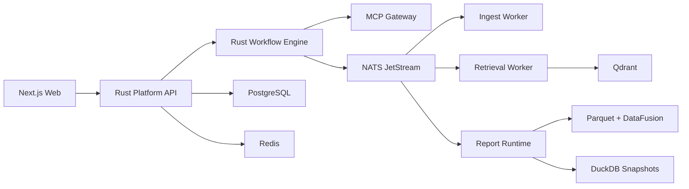

# AI数据平台 DataMax Rust 重构方案

## 一句话结论

本次建议采用“`Next.js 前端 + Rust 平台核心 + PostgreSQL 主状态 + MCP 工具面 + Qdrant 检索 + Parquet/DataFusion 报表层`”的 DataMax 架构，直接以绿地方式重建，不再延续旧运行时负担。

## 为什么值得一次性重构

现有系统已经证明了业务方向是对的：

- 文档上传、归组、长期记忆、目录问答、报表快照、静态页草稿都已跑通

但它的技术底座仍停留在早期阶段：

- 编排隐藏在代码分支中
- 主状态边界不清晰
- 前端壳层稳态不足
- 工具面不统一
- 报表体系缺少稳定抽象

因此继续修补旧架构的收益已经明显低于重建收益。

## DataMax 的核心设计

### 体验层

- `Next.js + TypeScript`
- 聊天、报表编辑器、移动端、工作台体验全部保留在 Web 层

### 平台核心

- `Rust + axum + tokio`
- 负责用户、数据集、密钥、文档元数据、任务、报表资产、统一 API

### 编排层

- Rust 自建显式 workflow engine
- 每条主链路都用状态机运行，不再隐藏在路由逻辑中

### 工具层

- 外部工具统一走 `MCP`
- 模型层统一走 `LLM Gateway + Tool Registry`

### 数据层

- `PostgreSQL`：主事务库
- `Redis`：热点缓存和短态
- `Qdrant`：向量检索
- `Parquet + DataFusion`：报表分析层
- `DuckDB`：快照和离线分析，不做主库

### 任务层

- `NATS JetStream`
- 支撑后台任务、重试、重放、死信

### 观测层

- `OpenTelemetry`
- 统一 traces、metrics、logs

## 关键判断

### Rust 是不是合适语言

是，适合作为这套系统的主干语言。

但不建议把所有层都改成 Rust。最优组合是：

- UI 保持 `TS`
- 平台核心改为 `Rust`

### DuckDB 还要不要

要，但角色变化：

- 保留给分析、快照、开发验证
- 不再承载平台主事务状态

### Temporal 要不要上

方向对，但当前 Rust SDK 还不适合作为 DataMax 第一版核心依赖。
DataMax 应先自建显式 workflow engine，未来再视 Rust SDK 成熟度决定是否替换。

## 最终目标形态

## 已生成的正式文档

仓库内已补齐：

- `docs/architecture/v3-rust-architecture.md`
- `docs/architecture/v3-repository-and-module-layout.md`
- `docs/adr/README.md`
- `docs/adr/0001` 到 `0005`

这套文档已经可以作为 DataMax 重构的正式蓝图使用。
