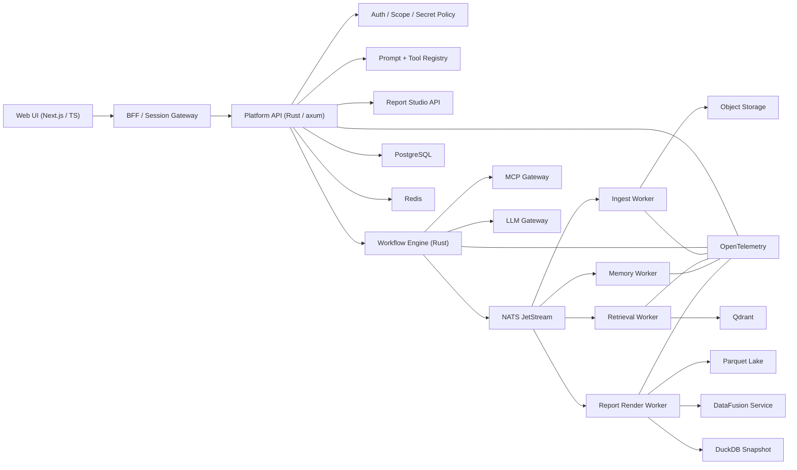

# DataMax Rust Rebuild Architecture

## Status
Proposed

## Goal

在不保留旧运行时包袱的前提下，基于当前系统已经验证过的业务闭环，重建一套面向未来 3 到 5 年的 DataMax 架构。重构目标不是把现有 Node.js 代码逐行翻译成 Rust，而是把系统升级为：

- 前端体验层继续使用 `Next.js + TypeScript`
- 平台核心、编排、数据处理、报表运行时全面 Rust 化
- 工具接入统一走 `MCP + 标准化 tool contract`
- 平台主状态进入 `PostgreSQL`
- 检索、分析、报表、发布、观测全部分层治理

## Why Rebuild

当前系统的强项是业务链路已经跑通：

- 文档上传、归组、长期记忆、目录问答、报表快照、静态页草稿都已具备业务价值

当前系统的核心短板也很明确：

- 宿主进程硬编码编排，运行时不可视、不可审计、不可重放
- JSON、本地文件、缓存、DuckDB 混合承载状态，边界不干净
- 前端壳层和移动端稳态不足，交互层和业务层耦合重
- 工具调用面不统一，内外能力没有统一协议边界
- 报表系统尚未形成规划 AST、编辑层、渲染层、发布层的稳定抽象

这决定了 DataMax 必须是绿地重建，而不是继续在旧运行时上叠补丁。

## Requirements

### Functional

- 支持多数据集、多文档、多用户的 AI 问答与知识检索
- 支持数据集密钥作用域、文档作用域、会话作用域的统一权限控制
- 支持长期记忆目录问答、证据召回、按数据集输出、报表生成
- 支持静态页报表规划、模块编辑、主题编译、发布与回看
- 支持报表数据随数据集内容变化而刷新
- 支持移动端聊天主链路与 PC 端完整工作台能力

### Non-Functional

- 平台主链路具备可观测、可追踪、可回放、可审计能力
- 主业务状态有强一致事务边界
- 后台任务具备幂等、重试、死信、重放能力
- 检索与报表链路具备清晰的数据分层
- 工具接入面标准化，便于后续替换模型供应商和工具生态

### Constraints

- 本次允许一次性全量重构，不考虑与旧运行时长期并存
- 不要求先做多活和超大规模横向扩展，但必须避免把单机限制硬编码进核心模型
- 现有已经验证的业务语义要保留，不能因技术换栈丢掉产品闭环

## Architecture Principles

- `Front-end for experience, Rust for platform`
- `PostgreSQL for system of record`
- `DuckDB for analytics, never primary state`
- `MCP for external tool boundary`
- `Explicit workflows over hidden orchestration`
- `Parquet-based analytical data plane`
- `Observability from day one`
- `Asset publishing is a first-class domain`

## High-Level Architecture

## Layer Design

### 1. Experience Layer

#### Web UI

- 技术：`Next.js + TypeScript`

职责：

- 聊天、数据集管理、文档管理、报表中心、静态页编辑器、移动端交互
- 页面级状态与流式会话体验
- 不再承担复杂业务编排和领域判断

#### BFF / Session Gateway

- 技术：`Next.js route handlers` 或独立 edge BFF

职责：

- 统一 cookie/session、csrf、stream proxy
- Web 端聚合读取接口
- 对 UI 层屏蔽后端服务拆分

### 2. Platform Control Plane

#### Platform API

- 技术：`Rust + axum + tower`

职责：

- 用户、租户、会话、数据集、文档元数据、密钥、报表资产、任务提交
- 所有状态变更的唯一入口
- 输出统一 OpenAPI 契约

#### Auth / Scope / Secret Policy

职责：

- 统一处理用户身份、角色、数据集可见性、密钥 grant、文档作用域
- 所有工具调用、检索、报表构建前都必须经过 scope 校验

#### Prompt + Tool Registry

职责：

- 管理 system prompt、planner prompt、tool prompt 的版本与激活状态
- 管理内部 tool contract、外部 MCP tool、HTTP adapter 的定义
- 避免 prompt 散落在业务代码中

### 3. Workflow Plane

#### Workflow Engine

- 技术：Rust 自建显式状态机引擎
- 不直接依赖 Temporal Rust SDK 作为核心执行层

职责：

- 会话问答
- 目录问答
- 文档上传与归组
- 长期记忆刷新
- 报表规划
- 报表渲染与发布

每条链路都以显式 `workflow definition + state transition + persisted event` 运行，而不是隐藏在路由函数里的 if/else。

### 4. Integration Plane

#### MCP Gateway

- 技术：Rust，基于 MCP Rust SDK

职责：

- 接入 remote MCP servers
- 封装内部能力为标准化 tool
- 对 LLM 统一暴露工具界面

注意：当前 MCP 官方 SDK 页面把 Rust 列为 `Tier 2`，可用但不是生态最成熟的首选 SDK，因此 DataMax 的对外协议应采用 MCP，但内部仍保留 adapter 层，不与某个 SDK 实现深度耦合。

#### LLM Gateway

职责：

- 对接 Responses API、OpenClaw 或其他模型网关
- 统一模型参数、流式输出、tool calling、reasoning summary、fallback 策略
- 让上层编排不直接依赖某个模型供应商

### 5. Worker Plane

#### Ingest Worker

- 文档接收
- OCR / 提取
- chunk 切分
- 标题推断
- 元数据抽取
- 数据集归组
- 密钥继承与文档绑定

#### Retrieval Worker

- embedding 生成
- 向量写入
- 混合检索预处理
- 同密钥 / 同数据集 payload 过滤
- 目录视图和证据索引构建

#### Memory Worker

- 长期记忆目录生成
- 文档记忆索引刷新
- 业务上下文聚合

#### Report Render Worker

- 报表规划 AST 执行
- 图表数据装配
- PC / Mobile 主题编译
- 生成静态资产
- 发布版本管理

## Data Architecture

### PostgreSQL

作为唯一主事务库，保存：

- 用户、租户、会话
- 数据集、文档元数据
- 数据集密钥绑定、grant 记录、活动密钥
- workflow definition、workflow execution、task 状态
- prompt registry、tool registry
- 报表定义、发布版本、资产索引

### Redis

- 热缓存
- 会话短期态
- 幂等键
- 速率限制
- UI 流式响应辅助缓冲

### Object Storage

- 原始文档
- 解析中间产物
- 图表数据文件
- 已发布静态页 assets
- 历史导出包

### Qdrant

- 文档 chunk 向量
- payload filter
- 同数据集、同密钥、同租户范围检索

### Parquet Lake

- 采集数据
- 报表事实表
- 指标快照
- 长期保留分析数据

### DataFusion

作为 Rust 分析查询层，为报表运行时提供：

- 多源查询抽象
- 并行流式执行
- 统一表达式与优化能力

### DuckDB

只用于：

- 单机快照分析
- 离线导出包
- 开发验证
- 报表数据打包

绝不承载平台主状态。

## Memory Model

### Session Memory

- 当前对话上下文
- 最近轮次消息
- tool trace
- 当前草稿状态

### Long-term Memory

- 文档 chunk
- embedding
- 目录视图
- 证据索引

### Business Context Memory

- 数据集
- 密钥作用域
- 报表定义
- 主题与模板
- 已发布资产

三层记忆物理存储分离、生命周期分离、授权模型分离。

## Report Architecture

DataMax 报表系统分四层：

### 1. Report Plan AST

- 页面结构
- 模块顺序
- 预期文本
- 图表意图
- 数据绑定位点

### 2. Editable Module Graph

- 用户可修改文本
- 用户可删改模块
- 用户可拖拽排序
- 用户可替换图表类型

### 3. Theme Compiler

- 根据 `PC / Mobile` 和主题风格编译页面
- 主题与内容解耦

### 4. Published Report Runtime

- 已发布报表持有固定样式
- 数据刷新默认只更新数据，不自动重排样式
- 可根据数据集变化触发重新计算

## Secret and Scope Model

### Secret Binding

- 密钥文本只在受控边界进入系统
- 服务端仅保存加密态和指纹
- grant 代表用户在当前设备和当前身份下的解锁能力

### Scope Resolution

- 用户作用域
- 数据集作用域
- 密钥作用域
- 文档作用域
- 发布资产作用域

所有检索、问答、报表和导出行为都必须走统一 scope resolver。

## Observability

DataMax 强制接入 OpenTelemetry：

- traces：请求、任务、检索、渲染、工具调用
- metrics：延迟、错误率、队列积压、索引耗时、报表编译耗时
- logs：结构化日志，与 trace id 关联

观测必须覆盖：

- Web 请求
- workflow transitions
- tool invocations
- worker jobs
- 数据访问
- 报表发布

## Deployment Topology

### Default Production Topology

- `web`：Next.js
- `platform-api`：Rust
- `workflow-engine`：Rust
- `workers`：Rust worker group
- `postgres`
- `redis`
- `qdrant`
- `nats`
- `object storage`
- `otel collector`

### Scale Direction

- API 和 worker 水平扩展
- Object storage 外置
- Qdrant 可独立扩展
- Parquet lake 可迁往统一对象存储
- DataFusion 查询服务可独立扩容

## Technology Choices

| Domain | Choice | Rationale |
|---|---|---|
| Frontend | Next.js + TypeScript | UI 迭代效率最高 |
| HTTP API | axum | Rust 主流高性能 Web 框架 |
| Async runtime | tokio | 生态成熟，支撑高并发 IO |
| Primary DB | PostgreSQL | 强事务、强治理、可扩展 |
| Cache | Redis | 热数据与短态最合适 |
| Event bus | NATS JetStream | 轻量、可靠、支持 replay |
| Vector DB | Qdrant | Rust 生态友好，检索能力成熟 |
| Analytics | DataFusion + Parquet | Rust 原生分析层 |
| Snapshot analytics | DuckDB | 开发与离线分析性价比高 |
| Tool boundary | MCP | 行业标准化方向 |
| Observability | OpenTelemetry | 标准化可观测体系 |

## What DataMax Explicitly Avoids

- 不再使用本地 JSON 作为主业务状态
- 不再使用 DuckDB 承载平台主事务
- 不再把业务编排藏在路由逻辑内部
- 不再把 prompt 和 tool 定义散落在应用代码中
- 不再让前端页面直接承担复杂业务决策
- 不把 Temporal Rust SDK 作为当前 DataMax 的关键执行依赖

## Risks

### Risk 1: Full rewrite may reintroduce old semantic bugs

Mitigation:

- 先冻结现有 golden scenarios
- 以真实案例回放校验 DataMax 输出与状态变化

### Risk 2: Rust ecosystem integration speed is lower than TS/Python

Mitigation:

- 工具面协议化
- 对实验性模型接入保留 adapter 层

### Risk 3: Report editor scope can grow uncontrollably

Mitigation:

- 先固定 AST + module graph 抽象
- 禁止编辑器直接操作底层发布资产

## Success Criteria

- 关键业务链路全部在显式 workflow 中运行
- 主业务状态全部迁入 PostgreSQL
- 所有工具调用经过统一 contract 和 scope 校验
- 报表系统形成规划、编辑、编译、发布四层结构
- 全链路 OTel 可见
- 移动端与 PC 端前端壳层稳定，不再反复出现布局漂移类问题

## References

- MCP Architecture Overview: https://modelcontextprotocol.io/docs/learn/architecture
- MCP SDK Tiering: https://modelcontextprotocol.io/docs/sdk
- OpenAI Responses API tools and remote MCP support: https://openai.com/index/new-tools-and-features-in-the-responses-api/
- Tokio Runtime: https://docs.rs/tokio/latest/tokio/runtime/
- axum: https://docs.rs/axum/latest/axum/
- Temporal Docs: https://docs.temporal.io/
- Temporal Rust SDK docs: https://docs.rs/temporalio-sdk/latest/temporalio_sdk/
- DuckDB Concurrency: https://duckdb.org/docs/current/connect/concurrency
- Apache DataFusion Introduction: https://datafusion.apache.org/user-guide/introduction.html
- NATS JetStream: https://docs.nats.io/nats-concepts/jetstream
- OpenTelemetry: https://opentelemetry.io/docs/
- Qdrant Overview: https://qdrant.tech/documentation/overview/what-is-qdrant/
