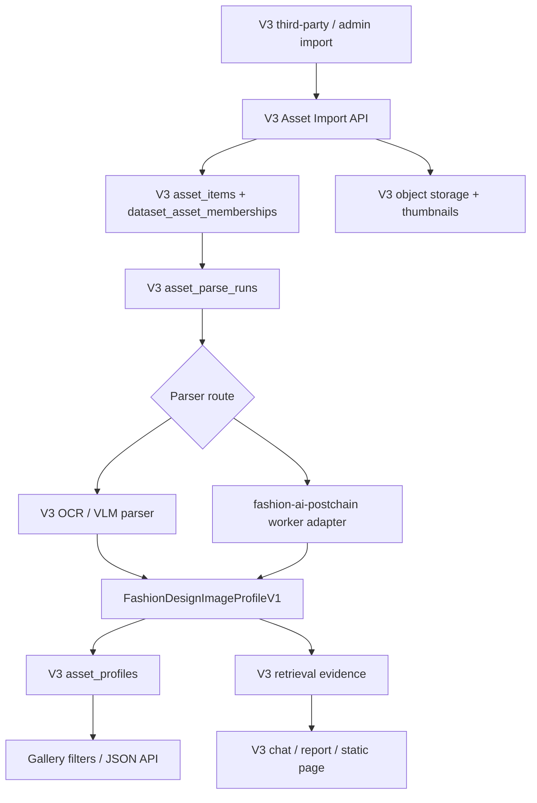

> **ARCHIVED 2026-07-10 — NON-EXECUTABLE:** 历史设计参考，不能覆盖当前任务顺序、授权边界或发布门禁；禁止继续其中 Task。唯一活动入口是 `docs/plans/datamax-active-execution-plan.md`。

# Fashion Postchain Absorption Plan

## Objective

将本地 `fashion-ai-postchain` 项目的服装图片后链路能力吸收到 V3 / DataMax 的多模态资产库规划中，但保持原项目独立演进。V3 不直接合并其数据库、路由和管理台，而是吸收可复用的契约、AI Worker 能力、图片入库安全策略、直出任务策略和工作流经验。

目标落点：

```text
服装图片 / ZIP / 外部图片 URL
-> V3 asset library
-> fashion profile JSON
-> dataset membership
-> chat / report / static page / third-party API
```

原 `fashion-ai-postchain` 继续保持独立仓库、独立服务、独立业务边界。V3 通过适配器调用或按需移植小模块，不做整仓库合并。

## Source Project Inventory

本地项目：

```text
C:\Users\soulzyn\Desktop\codex\fashion-ai-postchain
```

可吸收能力：

1. 资产台账：`fashion_assets`、`style_drafts`、`asset_embeddings`、`asset_selection_batches`。
2. AI Worker：图片拆解、标签预览、OCR、embedding 预览、营销文案、provider readiness。
3. 直出接口经验：第三方图片处理不依赖管理台人工操作，返回 `accepted/running/completed/partial_completed/failed/skipped`。
4. 图片输入安全：公网 URL 校验、MIME/大小/超时校验、私网地址拦截、对象存储与缩略图策略。
5. 工作流队列经验：1-20 张选品批次、步骤状态、任务派发、失败重试、产物回写。
6. 服装领域结构：品类、季节、版型、领型、袖型、衣长、面料、颜色、风格、标签、人审标签。
7. AI 任务底座：`ai_generation_tasks` 中的 provider/model/prompt/reference/result/cost/audit 结构。

## Boundary Decision

### Keep Independent

不把以下内容直接并入 V3：

1. `fashion_assets` / `style_drafts` 等原始表结构。
2. `apps/platform-api/src/routes/assets.rs` 这种大路由文件。
3. Postchain 专用 `/external/image-processing-*` API 路径。
4. Postchain 管理台页面和 PicRun/Qp 专用业务逻辑。
5. Postchain 的租户、额度、发布草稿、人审规则整体模型。

原因：

- V3 已有租户、数据集、第三方通道、静态页、问答和审计链路。
- 原项目是服装后链路垂直系统，V3 要做通用多模态数据资产底座。
- 直接合并会造成双租户、双任务队列、双外部接口、双权限模型。

### Absorb Through Adapter

V3 新增资产库能力时，应吸收：

1. 契约：服装图片 profile、直出状态、任务状态、失败码、source asset ledger。
2. 小模块：公网图片校验、缩略图生成、对象 key 规范、content hash 去重。
3. Worker 调用：通过 `FASHION_POSTCHAIN_WORKER_BASE_URL` 作为可选外部 worker。
4. 工作流经验：后续转成 V3 skill / static page / artifact task，不作为 MVP 先决条件。

## Mapping To V3 Plan

| Postchain 能力 | V3 吸收方式 | V3 落点 |
|---|---|---|
| `fashion_assets` | 不直接复制；映射为通用资产项 | `asset_items` |
| `style_drafts` | 不作为核心表；作为未来服装款式产物或 profile 派生视图 | `asset_profiles` / generated artifacts |
| `asset_embeddings` | 保留思想，改成通用资产 embedding 台账 | `asset_embeddings` |
| `asset_selection_batches` | 后续吸收为资产选品批次 | `asset_selection_batches` 或 V3 task batch |
| AI Worker `/v1/images/decompose` | 作为可选外部 worker 适配 | `fashion_postchain_adapter` |
| AI Worker `/v1/provider/readiness` | 接入 V3 模型/worker 健康检查 | observability / worker readiness |
| 直出 API 状态 | 吸收状态契约，不沿用 URL | V3 external asset imports / direct actions |
| URL probe / thumbnail | 小模块移植 | `asset_import_support` |
| workflow queues | 后续作为 V3 skill 工作流参考 | skills / artifact tasks |
| admin asset library | 只参考 UI 信息架构 | V3 admin asset library |

## Recommended Architecture



原则：

- V3 先落资产记录，再调用外部 worker。
- Worker 只返回结构化识别结果，不直接写 V3 数据库。
- V3 统一负责租户、权限、数据集归属、审计、对话供料和产物发布。

## Absorption Phases

### P0: Contract Absorption

先把能力定义收进 V3，不接真实模型。

任务：

1. 在 V3 contracts 中定义 `FashionDesignImageProfileV1`。
2. 定义 worker 响应适配结构：

```json
{
  "category": "dress",
  "colors": ["black", "white"],
  "silhouette": ["a-line"],
  "collar": ["round_neck"],
  "sleeve": ["short_sleeve"],
  "material": ["cotton"],
  "style": ["commute"],
  "visible_text": [],
  "caption": "..."
}
```

3. 加 mocked worker response 测试。
4. 明确 profile 缺字段允许 partial，不直接失败。

验收：

```bash
cargo test -p contracts fashion_design_image_profile_v1 --lib
cargo test -p platform-api fashion_postchain_adapter --lib
```

### P1: Generic Asset Storage

按 V3 多模态图库计划实现通用资产表，避免先落服装专用表。

任务：

1. `asset_libraries`
2. `asset_collections`
3. `asset_items`
4. `asset_collection_items`
5. `dataset_asset_memberships`
6. `asset_parse_runs`
7. `asset_profiles`
8. `asset_embeddings`

验收：

- 同一图片只存一份原始资产。
- 同一资产可加入多个数据集。
- 第三方私有资产不会进入主站公开范围。

### P2: Fashion Worker Adapter

把 Postchain AI Worker 作为可选 worker 接进 V3。

建议环境变量：

```text
FASHION_POSTCHAIN_ENABLED=false
FASHION_POSTCHAIN_WORKER_BASE_URL=http://127.0.0.1:8090
FASHION_POSTCHAIN_TIMEOUT_MS=120000
FASHION_POSTCHAIN_PARSE_BATCH_SIZE=8
```

调用优先级：

```text
V3 native parser enabled
-> use V3 OCR/VLM
else if FASHION_POSTCHAIN_ENABLED
-> call fashion-ai-postchain worker
else
-> mark parse pending/unsupported, do not fail whole import
```

适配端点：

```text
GET  /v1/provider/readiness
POST /v1/images/decompose
POST /v1/images/decompose/batch
POST /v1/embeddings/preview
```

注意：

- Worker 不接 V3 tenant token。
- Worker 不直接访问 V3 PostgreSQL。
- Worker 不返回内部路径。
- V3 负责把返回结果归一化成 `asset_profiles`。

### P3: Image Import Safety

从 Postchain 移植小而稳定的输入处理策略，不移植大路由。

吸收点：

1. 公网 URL 校验。
2. 私网/localhost/internal host 拦截。
3. 图片 MIME 校验。
4. 最大文件大小限制。
5. 下载超时。
6. content hash 去重。
7. 缩略图生成。
8. 对象存储 key safe segment。

V3 建议默认：

```text
ASSET_IMPORT_MAX_IMAGE_BYTES=26214400
ASSET_IMPORT_FETCH_TIMEOUT_MS=20000
ASSET_THUMBNAIL_MAX_EDGE=512
```

### P4: V3 Third-Party Asset API

不要暴露 Postchain 的 `/external/image-processing-requests` 给 V3 客户。

V3 新增自己的第三方资产入口：

```text
POST /v1/external/channels/{connection_id}/asset-imports
GET  /v1/external/channels/{connection_id}/asset-imports/{import_id}
GET  /v1/external/channels/{connection_id}/assets/{asset_external_id}
```

聊天时仍优先使用 V3 已有数据集字段：

```json
{
  "dataset_external_ids": ["fashion-dataset"],
  "asset_library_external_ids": ["fashion-gallery"],
  "asset_collection_external_ids": ["2026-summer"],
  "asset_external_ids": ["img-001"]
}
```

规则：

- `dataset_external_ids` 是统一推荐方式。
- `asset_*` 字段是第三方直接管理图库时的快捷范围。
- 资产默认 private。
- 返回结构化 JSON，便于第三方入库。

### P5: Retrieval And Report

把 profile 转为 V3 可检索供料，而不是只停在图库 UI。

索引文本组成：

```text
filename
visible_text
caption
category
audience
season
style
silhouette
collar
sleeve
material
craft
colors
patterns
scenes
```

报告能力：

- 按品类统计。
- 按颜色/材质/风格归类。
- 找相似款、同风格、同季节素材。
- 生成设计图库概览页。
- 生成选款建议。
- 把代表缩略图带入静态页。

### P6: Advanced Workflow Reuse

Postchain 的工作流队列、选品批次、直出任务适合二期吸收。

二期能力：

1. 资产选择批次。
2. 1-20 张图片批量处理。
3. 服装图生成/合规微改。
4. 商品详情页/营销文案/视频提示词包。
5. 产物回写到 V3 dataset/artifact。
6. 用户可在已生成产物上继续修改。

这部分应作为 V3 skill / artifact task，而不是图库 MVP 的前置条件。

## What To Reuse First

第一优先级：

1. `GarmentAttributes` / `LabelCandidate` 的字段设计。
2. Worker `/v1/images/decompose` 响应结构。
3. Worker `/v1/provider/readiness` 健康检查。
4. URL 安全校验和缩略图生成策略。
5. 直出状态契约：`accepted/running/completed/partial_completed/failed/skipped`。

第二优先级：

1. `asset_selection_batches` 的选品批次思想。
2. `asset_embeddings` 的索引台账思想。
3. `ai_generation_tasks` 的成本/模型/结果审计字段。
4. 外部 callback、retry、idempotency 经验。

暂缓：

1. 整套 workflow queue。
2. 服装专用营销/详情页/视频链路。
3. Postchain 管理台。
4. PicRun/Qp 专用接口。

## Risks

### Risk 1: 双系统模型混乱

如果直接复制 Postchain 表和 API，V3 会出现两套资产模型。

控制：

- V3 只保留通用 `asset_items`。
- Postchain 字段进入 `asset_profiles.profile`。

### Risk 2: 第三方 API 语义混乱

V3 当前第三方接口是 channel/event/dataset 体系；Postchain 是 direct image processing 体系。

控制：

- V3 新增 `asset-imports`，不暴露 Postchain API 路径。
- 简单文档只讲 V3 字段，不讲内部 worker。

### Risk 3: Worker 输出质量不稳定

Postchain 当前部分图片拆解逻辑是启发式/占位实现，不能直接承诺为高质量识别。

控制：

- MVP 用 mocked tests 验契约。
- 真实环境优先接 V3 OCR/VLM 或可用收费模型。
- Worker readiness 里明确 provider 是否真实可用。

### Risk 4: 成本不可控

服装图库可能一次导入大量图片。

控制：

- 批量解析要有 batch size、并发、重试和成本计数。
- 默认先 OCR/元数据，再按需 VLM。
- 对外返回 partial，不让整批失败。

### Risk 5: 权限泄露

第三方图库和主站数据集边界必须严格。

控制：

- 资产默认 private。
- `dataset_asset_memberships` 必须带 tenant scope。
- 第三方导入自动绑定 channel tenant。
- 主站不可见第三方私有资产，除非显式授权。

## Recommended Next Development Slice

建议下一步只做最小闭环：

```text
V3 asset schema
-> image/ZIP import
-> optional fashion worker adapter with mocked response
-> fashion profile JSON
-> dataset membership
-> text/tag retrieval evidence
-> chat/report can引用图库
```

不先做大 UI、不先做图生图、不先做完整服装后链路。

开发顺序：

1. 将本计划挂到 V3 主计划。
2. 实现 `FashionDesignImageProfileV1` contract。
3. 实现 `fashion_postchain_adapter`，先 mock，再接真实 worker。
4. 实现通用资产库 schema。
5. 迁移 Postchain 的 URL probe / thumbnail 小模块思想。
6. 增加第三方 `asset-imports`，但文档里只写 V3 统一口径。
7. 用一个服装设计 ZIP 做 smoke：

```text
导入 10 张图片
-> 生成 10 个 asset_items
-> 生成 profile
-> 加入数据集
-> 问“按风格和颜色分类”
-> 出一页图库分析静态页
```

## Acceptance Criteria

1. 原 `fashion-ai-postchain` 仓库无改动，仍可独立运行。
2. V3 不新增 Postchain 专用路由命名。
3. V3 数据集可挂接服装图片资产。
4. V3 chat/report 能使用服装图片 profile 供料。
5. 第三方资产导入默认私有。
6. Worker 不直接写 V3 数据库。
7. 真实 worker 不可用时，V3 import 不整体崩溃，而是返回 parse pending/failed 状态供模型解释。
8. 后续可平滑把 Postchain 的选品/后链路能力包装成 V3 skill。
