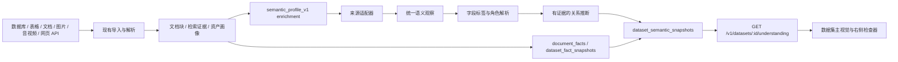

> **ARCHIVED 2026-07-16 — NON-EXECUTABLE:** 仅作历史设计与验收证据；禁止继续 Task、继承 approval/基线/开关或执行部署命令。唯一活动入口为 `docs/plans/datamax-active-execution-plan.md`。正文中的未勾选框属于历史模板，不代表当前待办。

# DataMax Universal Dataset Semantic Understanding Implementation Plan

> **For Claude:** REQUIRED SUB-SKILL: Use superpowers:executing-plans to implement this plan task-by-task.

**Goal:** 建立适用于数据库、表格、普通文档、图片、音视频、网页和 API 数据的通用语义理解层，让数据集页面展示“业务对象、字段含义、示例值、关系、覆盖率和证据”，而不是不可读的拆词、列名和代码。

**Architecture:** 保留现有 PostgreSQL、文档块、检索证据、事实索引和资产画像体系，新增异步生成、版本化保存的 `dataset_semantic_snapshots`，把不同来源的解析结果归一成同一份 `dataset_semantic_understanding_v1` 契约。语义快照通过现有 enrichment/worker 路径生成，公开 API 只返回权限安全的投影；Web 图谱只消费该契约，并在快照缺失时诚实回退到当前基础视图。

**Tech Stack:** Rust、Axum、SQLx、PostgreSQL 18、JSONB、Next.js、React、Apache ECharts、Node.js test runner、systemd。

---

## 1. 当前证据与问题基线

### 1.1 新百经营分析的真实状态

2026-07-13 只读核对结果：

- 公开数据集汇总为 486 份资料；其中 485 份是历史 `documents.dataset_id` 直接归属，另有 1 份通过 `dataset_document_memberships` 归属。
- PostgreSQL 中直接归属部分有 485 个 `document_chunks` 和 485 条 `retrieval_evidences`，说明数据已经可解析、可检索。
- 现有直接归属部分的 `document_facts=0`、`dataset_fact_snapshots=0`，因此不能把当前名词线索宣传为已确认业务事实。
- 数据实际来自 7 类源表：租赁合同、固定租金、提成租金、客流区域、门店、合同预警和租售明细。
- `document_chunks.metadata.parse_metadata` 已保留 `source_table`、源主键、字段和值；现有图谱却主要使用 `noun_term_hints`，导致 `cardparentname`、`BJBDS`、`TJ1b` 等技术标识成为主视觉。

### 1.2 根因

当前 `paragraph_aware_noun_terms_v1` 是面向普通文本的通用抽词策略。数据库行被序列化为 Markdown 后，列名、代码和值混在段落中，通用抽词无法判断：

- 哪个词是业务对象；
- 哪个词是字段名；
- 哪个值只是代码或主键；
- 哪些关系来自真实约束；
- 哪些关系只是同表共现或文本相似。

所以问题不是“图画得不够漂亮”，而是前端缺少面向不同来源的统一语义契约。

### 1.3 必须保留的现有能力

- `documents`、`document_chunks`：原始资料和解析后的可追溯内容。
- `retrieval_evidences`：搜索、召回和回答证据，不用于推断数据集总量。
- `document_facts`、`dataset_fact_snapshots`：已确认事实和权威聚合，继续服务回答与统计。
- `document_enrichment_runs`：异步、幂等、可重试的后处理入口。
- `asset_profiles`、`asset_retrieval_evidences`：图片和资产类语义来源。
- 当前数据集页面和证据检查器：作为新契约的消费端，不重做整套页面。

## 2. 范围与成功标准

### 2.1 本计划覆盖

- 数据库表和数据库行；
- Excel/CSV/结构化表格；
- Word/PDF/Markdown/纯文本；
- 图片和已生成资产画像；
- 音频、视频、PPT 及其转写/分段结果；
- 网页采集和第三方 API 返回；
- 历史 `documents.dataset_id` 与新 membership 双归属；
- 公开、私有和 secret-bound 数据集的同一权限模型。

### 2.2 本计划不覆盖

- 不引入 Neo4j、Neptune 等独立图数据库；
- 不允许 LLM 自动生成的业务解释直接成为“已确认事实”；
- 不在前端遍历数百个 `/documents/{id}/detail` 请求实时拼图；
- 不自动回写上游数据库；
- 不把数据库凭据、原始内部路径或敏感值放进语义快照；
- 不要求一次性回填所有历史数据后才上线。

### 2.3 用户可见完成标准

选择任意数据集后，页面必须回答五个问题：

1. **进来了什么：** 来源类型、业务对象、记录/文档/资产覆盖量。
2. **系统识别了什么结构：** 表、Sheet、章节、页面、镜头、字段和层级。
3. **系统理解了什么：** 中文业务名称、解释、类型、示例值和覆盖率。
4. **对象为什么相连：** 真实约束、共享键、引用、共现或文本推断及其置信度。
5. **能否用于检索和回答：** 可检索证据、已确认事实、待解释项和局限。

任何无法解释的技术字段必须显示为“待解释”，保留原始技术名，但不能冒充业务知识点。

## 3. 方案比较与架构决策

### 3.1 备选方案

| 方案 | 优点 | 缺点 | 结论 |
| --- | --- | --- | --- |
| 前端按需拉取文档详情并临时聚合 | 改动最小 | N+1、慢、结果不完整、无法稳定审计 | 不采用 |
| API 每次从 JSONB 实时聚合 | 无快照迁移 | 大数据集查询成本不稳定，页面结果随查询时点漂移 | 仅用于开发诊断 |
| PostgreSQL 版本化语义快照 | 快、可回退、可审计、兼容现有栈 | 需要 migration、worker 和回填路径 | **采用** |
| 独立图数据库 | 深度图遍历强 | 新基础设施、权限和运维成本高，当前数据规模不需要 | 暂不采用 |

### 3.2 ADR-019：继续使用 PostgreSQL 保存语义图谱快照

**Status:** Proposed，实施 Task 2 后转 Accepted。

**Context:** DataMax 已使用 PostgreSQL 保存资料、文档块、检索证据、事实、资产画像和任务状态。当前需求以“按数据集读取一张有证据的理解图”为主，不需要跨亿级节点执行多跳图算法。

**Decision:** 新增 PostgreSQL JSONB 语义快照和受控字段字典；节点、边、覆盖率和证据引用保存在版本化 manifest 中。已确认业务事实继续存入 `document_facts`，不重复定义事实权威来源。

**Positive consequences:**

- 复用现有备份、迁移、权限、连接池和审计体系；
- 单次读取整张图，前端不做 N+1；
- 可以保留上一版 ready 快照并安全回退；
- 后续需要图数据库时可以从稳定契约导出，而不是重写解析层。

**Negative consequences:**

- 不适合无限深关系遍历；
- 快照生成需要明确节点/边上限；
- JSONB 契约必须版本化，避免 Web 和 API 漂移。

### 3.3 ADR-020：业务标签必须有来源等级

标签解析优先级固定为：

1. 租户确认的字段字典；
2. 上游数据库/文件中明确提供的字段注释、表头或标题；
3. 已审核的数据源模板映射；
4. 确定性命名拆分和类型推断；
5. 原始技术名，并标记 `unresolved`。

模型生成的建议只能进入 `suggested`，不能直接进入 `confirmed`。任何中文业务解释都必须带 `label_source` 和 `confidence`。

## 4. 目标架构与数据流



### 4.1 生成时机

- 新资料解析完成并进入 indexed/ready 后，幂等 enqueue `semantic_profile_v1`。
- 单个来源处理完成后只更新来源指纹；同一 dataset 使用防抖合并，避免每条记录都重建整张图。
- 默认低优先级、单数据集单并发。
- 生成失败不回滚解析、不移除检索证据、不覆盖上一版 ready 快照。

### 4.2 归属兼容

所有数据集级聚合必须使用：

```text
documents.dataset_id = selected_dataset
OR
dataset_document_memberships.dataset_id = selected_dataset
```

合并后按 `document_id` 去重。资产使用 `dataset_asset_memberships` 等现有归属表。禁止只查询 membership，否则历史数据会被漏掉。

## 5. 统一语义契约

API 返回 `dataset_semantic_understanding_v1`：

```json
{
  "schema_version": "1.0.0",
  "generation_version": "semantic_profile_v1",
  "status": "ready",
  "dataset": {
    "id": "uuid",
    "title": "数据集名称"
  },
  "coverage": {
    "source_count": 7,
    "document_count": 486,
    "record_count": 485,
    "asset_count": 0,
    "retrieval_evidence_count": 485,
    "confirmed_fact_count": 0,
    "unresolved_field_count": 12
  },
  "summary": {
    "headline": "系统识别到 7 类业务数据，覆盖合同、租金、门店和客流结构。",
    "limitations": ["当前没有已确认 document_facts，字段关系以结构证据和推断为主。"]
  },
  "objects": [
    {
      "id": "object:database:source:table",
      "kind": "database_table",
      "label": "租赁合同",
      "technical_name": "source_table_name",
      "description": "待审核或已确认的对象说明",
      "label_source": "confirmed_dictionary",
      "confidence": 1.0,
      "coverage_count": 100,
      "status": "confirmed",
      "evidence_refs": []
    }
  ],
  "fields": [
    {
      "id": "field:object:field_key",
      "object_id": "object:database:source:table",
      "label": "合同编号",
      "technical_name": "raw_field_key",
      "semantic_role": "identifier",
      "value_type": "text",
      "non_empty_count": 100,
      "distinct_count": 100,
      "examples": ["示例 1", "示例 2"],
      "status": "confirmed",
      "label_source": "source_comment",
      "confidence": 1.0,
      "evidence_refs": []
    }
  ],
  "relations": [
    {
      "id": "relation:source:target:type",
      "source_id": "object:a",
      "target_id": "object:b",
      "relation_type": "shared_key",
      "label": "通过合同编号关联",
      "evidence_class": "inferred",
      "confidence": 0.82,
      "reason": "字段类型一致且非空值有受控重合；未发现已确认外键。",
      "evidence_refs": []
    }
  ],
  "source_groups": [],
  "pipeline": [],
  "generated_at": "RFC3339",
  "stale": false
}
```

### 5.1 上限

- `objects <= 40`
- `fields <= 160`
- `relations <= 240`
- 每个字段 `examples <= 5`
- 每个节点/边 `evidence_refs <= 5`
- 单个公开 manifest 序列化后默认不超过 2 MB

超限时按业务标签状态、覆盖率、关系度和置信度排序截断，并返回 `truncated=true` 和截断计数。

### 5.2 证据等级

| 等级 | 条件 | UI |
| --- | --- | --- |
| `confirmed` | 上游外键/字段注释、人工确认字典、已确认 `document_facts` | 实线、明确陈述 |
| `observed` | 解析字段和值、章节、表头、资产画像直接返回 | 实线、标明来源 |
| `inferred` | 共享键候选、值重合、同组共现、文本相似 | 虚线、显示置信度和原因 |
| `unresolved` | 只有原始技术名，缺少可靠解释 | 弱化显示、进入待解释清单 |

## 6. 不同数据类型的适配规则

| 来源 | 业务对象 | 字段/结构 | 示例值 | 关系证据 |
| --- | --- | --- | --- | --- |
| 数据库 | schema/table/view | column、类型、注释、主键 | 去敏后样本 | FK、PK/UK、共享键候选 |
| Excel/CSV | workbook/sheet/table | 表头、类型、非空率、公式 | 单元格样本 | 相同表头、引用公式、键候选 |
| Word/PDF/文本 | 文档/章节/实体 | 标题、段落、表格、实体、事实 | 原文短摘 | 章节包含、实体共现、明确引用 |
| 图片/资产 | 资产/主体/属性 | OCR、标签、颜色、类别、画像字段 | 受控描述 | 同资产、同集合、画像关系 |
| 音频/视频/PPT | 文件/片段/说话人/页 | 时间段、转写、镜头、页标题 | 时间戳短摘 | 顺序、说话人、跨页引用 |
| 网页/API | 资源类型/页面 | 字段、标题、层级、链接 | 响应样本 | URL、父子资源、引用字段 |

字段示例必须经过现有安全投影和长度限制。疑似凭据、手机号、邮箱、身份证、数据库 URL、绝对路径和 token 形态不得进入公开快照。

## 7. PostgreSQL 存储设计

新增 migration `0019_dataset_semantic_understanding.sql`。

### 7.1 `dataset_semantic_snapshots`

核心列：

- `id uuid primary key`
- `tenant_id uuid not null`
- `dataset_id uuid not null`
- `schema_version text not null`
- `generation_version text not null`
- `source_fingerprint text not null`
- `status text not null`：`building/ready/failed/superseded`
- `manifest jsonb not null`
- `source_document_count bigint not null default 0`
- `source_asset_count bigint not null default 0`
- `source_record_count bigint not null default 0`
- `node_count integer not null default 0`
- `edge_count integer not null default 0`
- `failure_code text`
- `generated_at timestamptz`
- `created_at/updated_at timestamptz`

约束与索引：

- unique `(tenant_id, dataset_id, generation_version, source_fingerprint)`；
- latest-ready partial index `(tenant_id, dataset_id, generated_at desc) where status='ready'`；
- 不为 `manifest` 默认增加 GIN，因为主查询按 dataset 读取整份快照；只有出现明确 JSON 条件查询后再评估。

### 7.2 `semantic_dictionary_entries`

用于租户确认的业务标签和角色，不保存凭据或业务记录值：

- `tenant_id`
- `source_kind`
- `source_system_key`，无特定系统时使用 `*`
- `source_object_key`，无特定对象时使用 `*`
- `raw_field_key`
- `display_name`
- `description`
- `semantic_role`
- `value_type`
- `status`：`suggested/confirmed/rejected`
- `confidence`
- `created_by_user_id` 可空
- `created_at/updated_at`

唯一键使用非空规范化字段，避免 PostgreSQL 中 NULL unique 语义造成重复条目。

### 7.3 不复用 `dataset_fact_snapshots` 的原因

`dataset_fact_snapshots` 已是回答和统计的权威事实聚合。语义图谱还包含待解释字段、结构观察和推断关系；混用会模糊“事实”和“理解线索”的边界。新表只负责解释性快照，已确认事实仍引用原表。

## 8. 非功能要求

### 8.1 性能

- ready 快照 API：数据集不超过 10,000 个来源对象时，服务端 p95 < 500 ms。
- 前端图谱首屏：快照返回后 1 秒内完成主视觉渲染。
- 快照生成异步执行，不占用请求线程，不阻断导入和检索。
- 数据库聚合必须按 `tenant_id + dataset_id` 命中索引，并设置 bounded limit 和 statement timeout。

### 8.2 可靠性

- 生成失败保留上一版 ready 快照；API 返回 `stale=true` 和安全失败码。
- 同一 `source_fingerprint` 幂等，不重复生成。
- 新版本生成完成后再切换，禁止先删除旧版本。
- backfill 默认 `dry-run + summary-only`；真实回填需要显式确认、数据集范围和上限。

### 8.3 安全

- API 复用数据集 visibility、tenant、membership 和 secret grant 检查。
- manifest 只保存公开安全证据引用，不保存内部绝对路径、凭据、SQL 连接串或原始 provider payload。
- 私密数据集的示例值必须在服务端完成字段级脱敏，前端不能决定是否脱敏。
- 字典确认操作需要认证和审计；公开用户只能读取 confirmed/safe projection。

### 8.4 可观测性

至少记录：

- build duration；
- source/document/asset/record counts；
- object/field/relation counts；
- confirmed/observed/inferred/unresolved counts；
- snapshot bytes；
- stale fallback 次数；
- failure_code；
- truncation counts。

## 9. 详细实施任务

### Task 1: 冻结通用语义契约和纯函数测试

**Files:**

- Create: `crates/platform-api/src/semantic_understanding.rs`
- Modify: `crates/platform-api/src/lib.rs`
- Test: `crates/platform-api/src/semantic_understanding.rs`

**Steps:**

1. 写失败测试，覆盖数据库、表格、文档、图片、音视频和网页/API 六类 fixture。
2. 断言每个节点都有 `label_source`、`status`、`confidence` 和 bounded `evidence_refs`。
3. 断言 unresolved 技术名不能进入 `summary.headline`。
4. 断言 confirmed/observed/inferred 三类关系映射为稳定契约。
5. 实现 serde contract、上限、稳定 ID、排序和去重纯函数。
6. 运行：

```bash
cargo test -p platform-api semantic_understanding --lib
cargo fmt --all -- --check
```

Expected: 新测试全部 PASS，输出不依赖 HashMap 随机顺序。

**Commit:** `feat: define dataset semantic understanding contract`

### Task 2: 添加语义快照和字段字典存储

**Files:**

- Create: `crates/storage/migrations/0019_dataset_semantic_understanding.sql`
- Modify: `crates/storage/src/lib.rs`
- Test: `crates/storage/src/lib.rs`

**Steps:**

1. 写 schema 失败测试，要求 migration、表、约束和 latest-ready partial index 存在。
2. 添加 `DatasetSemanticSnapshot`、`NewDatasetSemanticSnapshot`、`SemanticDictionaryEntry` 模型。
3. 实现幂等 create/building、mark ready、mark failed、load latest ready 和字典 resolve/upsert。
4. repository 查询始终要求 `tenant_id`，latest 查询只返回 `status='ready'`。
5. 添加同 fingerprint 幂等、失败不覆盖 ready、租户隔离测试。
6. 运行：

```bash
cargo test -p storage dataset_semantic --lib
cargo test -p storage migration --lib
```

Expected: migration 幂等，repository 测试通过。

**Commit:** `feat: store versioned dataset semantic snapshots`

### Task 3: 统一历史直接归属和新 membership 查询

**Files:**

- Modify: `crates/storage/src/lib.rs`
- Create: `crates/platform-api/src/dataset_semantic_source_support.rs`
- Test: `crates/platform-api/src/dataset_semantic_source_support.rs`

**Steps:**

1. 写 fixture：一个 direct document、一个 membership document、一个同时存在两种归属的 document。
2. 断言最终返回 2 个唯一 document，而不是 1 个或 3 个。
3. 添加按 dataset 加载可见 documents/chunks/evidences/assets 的 bounded repository 方法。
4. 计算 source fingerprint，包含文档/资产 ID、更新时间、解析版本和事实快照版本，不包含原始内容。
5. 为 `documents.dataset_id` 和 membership 两条路径分别验证 tenant scope。
6. 运行：

```bash
cargo test -p platform-api dataset_semantic_source_support --lib
cargo test -p storage dataset_membership --lib
```

Expected: 兼容查询和去重测试全部 PASS。

**Commit:** `fix: unify dataset semantic source ownership`

### Task 4: 实现多来源结构适配器

**Files:**

- Create: `crates/platform-api/src/semantic_profile_adapters.rs`
- Modify: `crates/platform-api/src/semantic_understanding.rs`
- Test: `crates/platform-api/src/semantic_profile_adapters.rs`

**Steps:**

1. 数据库适配器读取 `parse_metadata.source_table`、主键字段、字段和值、上游注释/约束（存在时）。
2. 表格适配器读取 Sheet、表头、值类型、公式、非空率和候选键。
3. 文档适配器读取章节、表格、实体、`document_facts` 和 retrieval evidence。
4. 图片/资产适配器读取安全 asset profile、OCR/标签和 collection membership。
5. 音视频/PPT 适配器读取页、片段、时间戳、转写、说话人和视觉标签。
6. 网页/API 适配器读取标题、资源类型、层级、字段和安全 URL 引用。
7. 所有适配器只输出统一的 `SemanticObservation`，不直接生成 UI 节点。
8. 对缺字段和未知来源返回 `unresolved`，不抛出整数据集失败。
9. 运行：

```bash
cargo test -p platform-api semantic_profile_adapters --lib
```

Expected: 六类 fixture 均产生稳定、可追溯 observation。

**Commit:** `feat: normalize semantic observations across data sources`

### Task 5: 实现业务标签、类型和角色解析

**Files:**

- Create: `crates/platform-api/src/semantic_label_resolver.rs`
- Modify: `crates/storage/src/lib.rs`
- Test: `crates/platform-api/src/semantic_label_resolver.rs`

**Steps:**

1. 写标签优先级失败测试：confirmed dictionary > source comment > reviewed template > deterministic split > unresolved raw key。
2. 支持 `identifier/name/date/amount/quantity/category/status/location/text/unknown` 等角色。
3. 示例值只用于类型和覆盖率推断，不允许把随机代码翻译成业务概念。
4. 模型建议必须标为 `suggested`，公开投影不当作 confirmed。
5. 添加脱敏检测：凭据、token、数据库 URL、邮箱、手机号、身份证、绝对路径不进入 examples。
6. 运行：

```bash
cargo test -p platform-api semantic_label_resolver --lib
```

Expected: 技术字段保留 technical_name，未知解释明确标记待确认。

**Commit:** `feat: resolve evidence-ranked semantic labels`

### Task 6: 实现有证据的关系推断

**Files:**

- Create: `crates/platform-api/src/semantic_relation_builder.rs`
- Test: `crates/platform-api/src/semantic_relation_builder.rs`

**Steps:**

1. 真实 FK、父子结构、明确引用生成 confirmed 边。
2. 同一对象包含字段、文档包含章节、资产属于集合生成 observed 边。
3. 共享键候选必须同时满足类型兼容、非空率、受控值重合和基数门槛，生成 inferred 边。
4. 同组共现和文本相似保持低置信 inferred，不能显示为因果关系。
5. 对称关系按节点 ID 排序去重；每对节点限制最高优先级关系数量。
6. 增加高基数字段、常量字段、空字段、伪 ID 和敏感字段反例。
7. 运行：

```bash
cargo test -p platform-api semantic_relation_builder --lib
```

Expected: confirmed 和 inferred 永不混淆，所有边都有 reason 和 evidence_refs。

**Commit:** `feat: build evidence-aware semantic relations`

### Task 7: 构建版本化数据集语义快照

**Files:**

- Create: `crates/platform-api/src/dataset_semantic_snapshot.rs`
- Modify: `crates/platform-api/src/lib.rs`
- Test: `crates/platform-api/src/dataset_semantic_snapshot.rs`

**Steps:**

1. 将 source loader、adapters、label resolver、facts 和 relation builder 串成纯 snapshot builder。
2. 加入对象/字段/关系排序和上限，返回 truncation 统计。
3. headline 只使用 confirmed/observed 中文标签；无可靠标签时描述结构数量，不编造行业结论。
4. 将 `document_facts` 和 `dataset_fact_snapshots` 作为权威事实引用，不从 retrieval top-k 推断总数。
5. 生成前写 building，完成后写 ready；失败写 failed 并保留旧 ready。
6. 加入相同 fingerprint 跳过、版本变化重建和 stale fallback 测试。
7. 运行：

```bash
cargo test -p platform-api dataset_semantic_snapshot --lib
```

Expected: 相同输入生成完全相同 manifest 和 fingerprint。

**Commit:** `feat: build dataset semantic snapshots`

### Task 8: 接入 enrichment worker 和安全 backfill

**Files:**

- Modify: `crates/retrieval-worker/src/main.rs`
- Modify: `crates/retrieval-worker/src/bin/document-enrichment-worker.rs`
- Modify: `crates/retrieval-worker/src/bin/document-enrichment-backfill.rs`
- Create: `crates/retrieval-worker/src/bin/dataset-semantic-backfill.rs`
- Test: corresponding Rust modules

**Steps:**

1. 新增标准 kind `semantic_profile_v1`，默认 feature-off。
2. 文档 indexed 后只 enqueue per-source signal；dataset rebuild 做防抖和同 dataset 单并发。
3. backfill 默认 `--dry-run --summary-only`，真实执行必须同时给 dataset ID、explicit limit 和 confirmation。
4. 默认不调用 provider；v1 只使用确定性解析、字段字典和已有事实。
5. 输出只包含计数、fingerprint、状态和安全失败码，不打印样本值、内部路径或凭据。
6. 加入 retry、poison source、旧快照回退和重复任务幂等测试。
7. 运行：

```bash
cargo test -p retrieval-worker semantic_profile
cargo run -p retrieval-worker --bin dataset-semantic-backfill -- \
  --dataset-id <fixture-dataset-id> --dry-run --summary-only --limit 10
```

Expected: dry-run 无写入；重复 enqueue 不产生重复 ready 快照。

**Commit:** `feat: run semantic snapshot enrichment safely`

### Task 9: 提供权限安全的理解 API

**Files:**

- Create: `crates/platform-api/src/dataset_semantic_understanding_support.rs`
- Modify: `crates/platform-api/src/lib.rs`
- Test: `crates/platform-api/src/dataset_semantic_understanding_support.rs`

**Endpoint:**

```text
GET /v1/datasets/{dataset_id}/understanding
```

**Steps:**

1. 写公开、私有、secret-bound、跨 tenant、无快照和 stale 快照测试。
2. 复用现有数据集可见性和 active secret grant 校验。
3. 只返回 latest ready；building/failed 时返回旧 ready + stale 状态。
4. 服务端完成示例脱敏和内部路径过滤。
5. 支持 `If-None-Match`/ETag 使用 snapshot fingerprint，减少重复传输。
6. 无快照时返回 200 的 honest empty contract，不将 404 当页面错误。
7. 运行：

```bash
cargo test -p platform-api dataset_semantic_understanding_support --lib
cargo test -p platform-api public_dataset --lib
```

Expected: 权限测试通过，未授权响应不泄露 dataset 是否存在。

**Commit:** `feat: expose safe dataset understanding API`

### Task 10: Web 接入统一理解契约

**Files:**

- Create: `apps/web/app/lib/dataset-understanding-api.js`
- Create: `apps/web/app/lib/dataset-understanding-api.test.mjs`
- Modify: `apps/web/app/HomePageClient.js`
- Modify: `apps/web/app/components/WorkspaceDirectoryPanel.js`
- Modify: `apps/web/app/lib/dataset-understanding-graph.js`
- Modify: `apps/web/app/lib/dataset-understanding-graph.test.mjs`

**Steps:**

1. 写 API normalizer 测试，拒绝超限节点/边、无 ID、非法 evidence class 和敏感 examples。
2. 选择数据集时只请求一次 understanding endpoint；取消过期选择请求。
3. 将 semantic snapshot 作为 graph model 主输入，现有 dataset/document hints 仅做 fallback。
4. 主图优先业务对象、中文字段和已确认关系；technical_name 只在详情中显示。
5. unresolved 字段进入单独“待解释”组，不参与 headline。
6. stale/empty/failed 明确显示状态，不用虚构节点填图。
7. 运行：

```bash
pnpm --dir apps/web test -- dataset-understanding
```

Expected: API normalizer、fallback 和图模型测试全部 PASS。

**Commit:** `feat: consume dataset semantic snapshots in web`

### Task 11: 完成客户可读的主视觉和检查器

**Files:**

- Modify: `apps/web/app/components/DatasetUnderstandingGraph.js`
- Modify: `apps/web/app/globals.css`

**Steps:**

1. 主视觉分为“业务对象、关键字段、已确认事实、推断关系”四层。
2. 默认摘要展示来源数量、结构数量、可检索覆盖、已确认事实和待解释项。
3. 点击业务对象展示：中文说明、技术来源、覆盖量、字段、示例和证据。
4. 点击字段展示：原始字段名、类型、非空率、去重数、示例、标签来源和状态。
5. 点击关系展示：confirmed/observed/inferred、原因、置信度和证据。
6. 增加“业务视图 / 技术视图”开关；默认业务视图隐藏技术噪声。
7. 1180px 和 760px 断点下保证右侧检查器可读。
8. 使用数据库、文档、表格、资产四类 fixture 做浏览器交互复验。
9. 运行：

```bash
pnpm --dir apps/web test
pnpm --dir apps/web build
```

Expected: 全量测试和生产构建通过，无新增控制台错误。

**Commit:** `feat: make dataset understanding business-readable`

### Task 12: 增加观测、烟测和回归门禁

**Files:**

- Create: `scripts/run-dataset-semantic-understanding-smoke.sh`
- Create: `docs/validation/dataset-semantic-understanding.md`
- Modify: `.github/workflows/datamax-ci.yml`

**Smoke fixtures:**

1. 数据库型：新百经营分析或等价隔离 fixture；
2. 普通文档型：企业问答；
3. 表格型：含表头、日期、金额和分类字段的 fixture；
4. 资产型：已有安全 asset profile fixture；
5. 空/未知型：只有技术字段、没有字典；
6. 私有型：无授权用户不得读取快照。

**Steps:**

1. smoke 只输出计数、状态、schema version 和安全标签，不输出原始样本值。
2. 断言每类数据都能生成 understanding contract。
3. 断言数据库型主节点是业务对象，不是随机列名/代码。
4. 断言无 facts 时 summary 明确写“暂无已确认事实”。
5. 断言 inferred 边不升级为 confirmed。
6. 断言公开投影不包含绝对路径、连接串、token 或 secret-like text。
7. CI 增加 storage migration、Rust 聚焦测试、Web 模型测试和 no-credential smoke。

**Commit:** `test: gate universal dataset semantic understanding`

### Task 13: 新百 canary、通用回填和 feature-off 发布

**Files:**

- Create: `docs/operations/dataset-semantic-understanding-rollout.md`
- Update after execution: `docs/validation/dataset-semantic-understanding.md`

**Phase A — feature-off deploy:**

1. 核对 GitHub main、8 服务器 clean HEAD、PG18、API/Web/worker active。
2. 备份数据库 schema/migration state 和旧二进制；不需要复制业务样本到回执。
3. 应用 migration、构建 API/retrieval worker/Web。
4. 保持 `DATASET_SEMANTIC_UNDERSTANDING_ENABLED=false`。
5. 仅重启纳入变更的 API、document enrichment/retrieval worker 和 Web。
6. health/ready、公开接口保护和主站基础回归通过。

**Phase B — dry-run canary:**

1. 对新百数据集运行 `--dry-run --summary-only`。
2. 验证兼容归属总数为 486，direct/membership 去重正确。
3. 验证识别到 7 类源对象，技术字段不进入 headline。
4. 验证输出无秘密、无内部路径、无原始大字段。

**Phase C — real canary:**

1. 仅为新百生成一份 `semantic_profile_v1` ready 快照。
2. 打开 tenant/dataset allowlist，不做全局 backfill。
3. 公网页面验证业务对象、字段示例、关系依据、检索覆盖和待解释项。
4. 验证 API p95、snapshot bytes、worker 时长和错误日志。
5. 失败时关闭开关；上一版页面 fallback，已有解析/检索不受影响。

**Phase D — 通用扩展:**

1. 依次加入文档、表格、资产、音视频、网页/API canary。
2. 每类至少一个成功快照后再扩大 allowlist。
3. 历史回填按 dataset 分批，默认单并发和明确 limit。
4. 不允许“一次全库回填”作为首个真实执行。

**Commit:** `docs: record semantic understanding rollout evidence`

## 10. 总体验证命令

```bash
cargo fmt --all -- --check
cargo test -p storage dataset_semantic --lib
cargo test -p platform-api semantic_understanding --lib
cargo test -p platform-api dataset_semantic --lib
cargo test -p retrieval-worker semantic_profile
pnpm --dir apps/web test
pnpm --dir apps/web build
bash scripts/run-dataset-semantic-understanding-smoke.sh --no-credentials
git diff --check
```

## 11. 最终验收清单

- [ ] 六类数据来源都能输出同一 schema version 的 understanding contract。
- [ ] 新百页面以合同、租金、门店、客流等业务对象为主，不以 `cardparentname` 等技术词为主。
- [ ] 字段点开后有技术名、业务标签、类型、覆盖率、示例和证据来源。
- [ ] 真实约束、结构观察和推断关系在 UI 中严格区分。
- [ ] `document_facts=0` 时不会宣称已有确认事实。
- [ ] 历史 direct dataset_id 和 membership 合并去重正确。
- [ ] 私有/secret-bound 数据集权限与现有 API 一致。
- [ ] 公开快照无凭据、数据库 URL、绝对路径和敏感示例值。
- [ ] 生成失败保留上一版 ready，导入和检索不被阻断。
- [ ] API、Web、worker、migration、smoke 和 CI 全部通过。
- [ ] 8 服务器仅按变更范围重启服务，最终仓库干净、HEAD 与 GitHub main 一致。

## 12. 推荐执行顺序

```text
契约与纯函数
  -> PostgreSQL migration/repository
  -> 归属兼容
  -> 多来源适配器
  -> 标签解析
  -> 关系推断
  -> 快照 builder
  -> worker/backfill
  -> 权限 API
  -> Web 主视觉
  -> CI/smoke
  -> 新百 canary
  -> 多类型分批开放
```

前 9 个 Task 完成前保持 feature-off。新百只作为第一个真实 canary，不允许在实现中写死数据集 ID、源表名或字段翻译。
