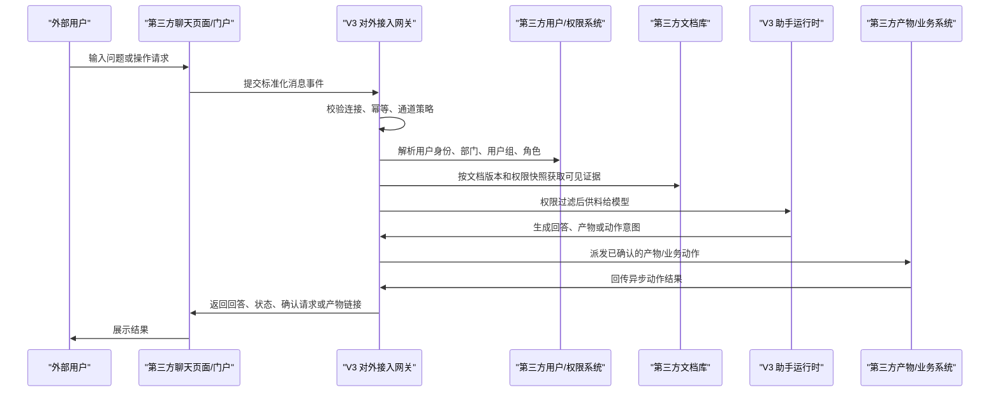

# V3 纯第三方模式对接文档

**文档状态：** 对外草案 v0.1
**最后更新：** 2026-05-15
**适用对象：** 第三方自建门户、文档库、用户中心、产物系统、业务系统和客户 IT 对接团队
**默认 V3 对外域名：** `https://v3.elepcloud.com`

本文只描述“纯第三方模式”。飞书、Lark、企业微信等标准机器人平台不在本文展开；这些平台走各自官方事件和机器人接口，再由 V3 转为统一通道事件。

纯第三方模式适用于：第三方自己搭建聊天页面或业务入口，文档库、用户权限、产物系统、业务系统也可以都在第三方服务器上；V3 作为统一智能处理、权限过滤、动作风控和审计中心。

## 1. 对接目标

纯第三方模式要完成四类闭环：

- 用户在第三方页面或系统里向 V3 提问；
- V3 按第三方用户身份和文档权限，只检索该用户可访问的资料；
- V3 生成回答、报告、静态页或其他产物，并可发布回第三方系统；
- V3 在用户确认后，调用第三方业务接口处理事务，并接收异步结果回传。

V3 不要求第三方放弃自己的页面、文档库或业务系统。第三方页面仍由第三方控制，V3 负责背后的问答、资料供料、权限治理、动作确认和审计。

## 2. 总体架构



关键边界：

- 第三方页面只负责交互展示，不负责最终权限判断；
- V3 不把未授权文档交给模型；
- 模型可以回答普通问题，但涉及 V3 文档、权限、产物和工具结果时，只能基于 V3 已供给证据；
- 高风险或跨系统写入必须经过 V3 确认流程。

## 3. 最小接入范围

最小可联调版本建议先准备：

| 模块 | 第三方需要提供 | V3 使用方式 |
| --- | --- | --- |
| 聊天入口 | 自建页面或网关调用 V3 消息接口 | 创建 AssistantRun 并返回回复对象 |
| 用户身份 | 外部用户 ID、状态、部门/组/角色 | 解析当前提问用户的有效身份 |
| 文档库 | 文档列表、版本、正文或正文读取地址 | 建立索引或按需读取证据 |
| 文档权限 | 文档 ACL 快照或可访问主体列表 | 检索前过滤不可见文档 |
| 产物接口 | 接收报告、页面、文件或链接 | 发布/查询/撤销 V3 产物 |
| 业务动作 | 接收 V3 派发的动作请求 | 执行业务事务并回传结果 |

如果项目早期只做问答，可以先接聊天入口、用户身份、文档库和文档权限；产物和业务动作可以后续接入。

## 4. 文档是否必须搬到 V3

不需要把第三方服务器上的所有文档一次性拷贝到 V3 才能问答。

V3 需要的是“可验证、可权限过滤、可追溯版本”的证据供料。第三方可以根据安全要求选择以下方式：

| 方式 | 说明 | 适用场景 |
| --- | --- | --- |
| 增量索引 | V3 拉取发生变化的文档正文或解析文本，生成检索索引和证据片段 | 常规知识库问答，体验最好 |
| 按需读取 | V3 先同步文档元数据、版本和 ACL，需要深读时再调用正文接口 | 原文敏感、文档量大、只允许按需访问 |
| 第三方预解析 | 第三方提供已解析 Markdown/HTML/段落/结构化表格，V3 不下载原文件 | 第三方已有解析管线 |
| 推送供料 | 第三方主动推送变更文档、片段或索引包 | 内网隔离或第三方主动控制同步 |

无论哪种方式，都建议提供：

- 稳定的 `document_external_id`；
- 单调变化或可比较的 `revision`；
- `updated_at`；
- `content_hash` 或文件哈希；
- 文档 ACL 快照；
- 文档删除或权限撤销信号。

V3 可以保存文档元数据、权限快照、解析后的文本片段、索引和来源定位信息。文档原件可以继续留在第三方服务器上。若项目要求 V3 不长期保存正文，可在实施阶段约定缓存周期、删除策略和只读按需读取策略。

问答时的基本过程是：

1. 第三方页面把用户消息和 `sender_external_id` 发给 V3；
2. V3 解析该用户在第三方系统里的部门、用户组、角色和状态；
3. V3 根据文档 ACL 计算该用户可访问的文档集合；
4. V3 只在可访问集合内检索或按需读取；
5. V3 把证据片段、来源和版本供给模型；
6. 模型基于这些证据回答，并保留 `当前不可见/未供料` 的边界说明。

## 5. V3 入站聊天接口

第三方自建页面或网关将用户消息提交给 V3：

```http
POST /v1/external/channels/{connection_id}/events
Host: v3.elepcloud.com
Content-Type: application/json
```

请求示例：

```json
{
  "platform": "third_party",
  "tenant_external_id": "tenant-ext-001",
  "bot_external_id": "bot-v3",
  "conversation_external_id": "chat-risk-room",
  "thread_external_id": "thread-optional",
  "sender_external_id": "user-10001",
  "message_external_id": "msg-20260515-0001",
  "message_type": "text",
  "text": "帮我总结我能看的采购审批制度，并指出本周需要处理的风险。",
  "mention_external_user_ids": [],
  "attachment_refs": [],
  "idempotency_key": "third_party:tenant-ext-001:msg-20260515-0001",
  "received_at": "2026-05-15T10:00:00Z"
}
```

字段要求：

| 字段 | 必填 | 说明 |
| --- | --- | --- |
| `platform` | 是 | 纯第三方建议使用 `third_party`；自建聊天也可按项目配置使用 `generic_chat` |
| `tenant_external_id` | 是 | 第三方租户、空间或客户 ID |
| `bot_external_id` | 是 | 第三方侧机器人或应用 ID |
| `conversation_external_id` | 是 | 会话、群、房间或页面上下文 ID |
| `sender_external_id` | 是 | 当前提问用户在第三方系统中的稳定 ID |
| `message_external_id` | 是 | 第三方消息 ID，必须稳定 |
| `message_type` | 是 | `text`、`image`、`file`、`audio`、`video`、`card`、`event` 或 `unknown` |
| `text` | 文本消息必填 | 用户输入文本 |
| `attachment_refs` | 否 | 附件引用，文件下载需按项目配置权限和有效期 |
| `idempotency_key` | 是 | 防重放和重复投递 |
| `received_at` | 是 | 第三方收到消息的时间 |

响应示例：

```json
{
  "connection_id": "generic-chat-main",
  "assistant_run_id": "00000000-0000-0000-0000-000000000001",
  "idempotency_key": "third_party:tenant-ext-001:msg-20260515-0001",
  "reply": {
    "reply_type": "task_status",
    "task_status": "accepted",
    "text": "V3 已接收请求，正在处理。"
  }
}
```

常见 `reply_type`：

- `task_status`：已接收、处理中、失败、等待证据；
- `text`：普通文本回答；
- `card`：结构化卡片；
- `artifact_link`：产物链接；
- `requires_confirmation`：需要用户确认；
- `error`：错误或无法完成。

如果消息需要外部/网页搜索，而 V3 尚未供给搜索证据，可能返回：

```json
{
  "reply_type": "task_status",
  "task_status": "v3_search_evidence_required",
  "card": {
    "type": "v3_search_evidence_required",
    "search_evidence_required": true
  }
}
```

这表示 V3 正等待只读搜索证据供料，不表示已经完成联网搜索。

## 6. 用户与组织接口

第三方需要让 V3 能够识别外部用户是谁，以及该用户属于哪些部门、用户组和角色。

建议第三方提供：

```http
GET /users
GET /departments
GET /groups
GET /roles
GET /users/{user_external_id}/memberships
```

用户列表响应示例：

```json
{
  "items": [
    {
      "user_external_id": "user-10001",
      "display_name": "张三",
      "email": "zhangsan@example.com",
      "mobile": "+86-13800000000",
      "status": "active",
      "department_external_ids": ["dept-finance"],
      "group_external_ids": ["group-procurement"],
      "role_external_ids": ["role-requester"],
      "updated_at": "2026-05-15T09:00:00Z"
    }
  ],
  "next_cursor": null
}
```

V3 计算有效权限时会综合：

- 用户直接权限；
- 部门权限；
- 用户组权限；
- 角色权限；
- 租户、空间或连接默认策略；
- 明确拒绝规则；
- 用户是否停用；
- 文档版本和权限快照时间。

用户停用、部门调整、角色变更后，应尽快让 V3 同步最新状态。

## 7. 文档接口

### 7.1 文档列表

建议第三方提供：

```http
GET /documents?cursor=<cursor>&updated_after=<iso_time>&limit=100
```

响应示例：

```json
{
  "items": [
    {
      "document_external_id": "doc-001",
      "title": "采购审批制度",
      "document_type": "pdf",
      "revision": "rev-20260515-01",
      "updated_at": "2026-05-15T09:20:00Z",
      "deleted": false,
      "content_url": "https://third-party.example.com/documents/doc-001/content",
      "acl_url": "https://third-party.example.com/documents/doc-001/acl",
      "content_hash": "sha256:..."
    }
  ],
  "next_cursor": "cursor-002"
}
```

### 7.2 文档正文

建议第三方提供：

```http
GET /documents/{document_external_id}/content?revision=rev-20260515-01
```

可返回：

- 原始文件下载流；
- 已解析文本；
- Markdown；
- HTML；
- 结构化段落；
- 表格数据；
- 附件列表；
- 文件哈希、版本号和更新时间。

正文必须与 `revision` 对应。文档更新后，应生成新的版本标识。

### 7.3 文档权限快照

建议第三方提供：

```http
GET /documents/{document_external_id}/acl?revision=rev-20260515-01
```

响应示例：

```json
{
  "document_external_id": "doc-001",
  "revision": "rev-20260515-01",
  "acl_hash": "sha256:...",
  "captured_at": "2026-05-15T09:21:00Z",
  "allow": [
    { "subject_type": "user", "subject_external_id": "user-10001", "level": "read" },
    { "subject_type": "department", "subject_external_id": "dept-finance", "level": "read" },
    { "subject_type": "role", "subject_external_id": "role-procurement-admin", "level": "manage" }
  ],
  "deny": [
    { "subject_type": "user", "subject_external_id": "user-99999", "reason": "restricted" }
  ]
}
```

ACL 说明：

- `allow` 表示可访问主体；
- `deny` 表示明确拒绝主体；
- 主体可以是 `user`、`department`、`group`、`role`、`tenant`；
- `deny` 优先级应高于 `allow`；
- 文档权限变化后，应尽快触发 V3 同步。

## 8. V3 触发资料源同步

V3 可通过连接配置中的第三方文档接口进行增量同步。运营或系统可触发：

```http
POST /v1/external/sources/{source_id}/sync
Host: v3.elepcloud.com
```

V3 会把同步任务放入后台队列。同步任务应记录：

- 本次同步的 source；
- 增量游标；
- 文档数量；
- 新增、更新、删除、失败数量；
- ACL 快照状态；
- 错误摘要。

同步日志和观测摘要不会展示原始文档正文和密钥。

## 9. 用户确认接口

当 V3 判断某个动作需要确认时，会返回 `requires_confirmation`。第三方页面应把动作摘要展示给用户，再把确认结果提交给 V3：

```http
POST /v1/external/channels/{connection_id}/confirmations
Host: v3.elepcloud.com
Content-Type: application/json
```

请求示例：

```json
{
  "assistant_run_id": "00000000-0000-0000-0000-000000000001",
  "action_id": "act-001",
  "confirmation_external_id": "confirm-001",
  "sender_external_user_id": "user-10001",
  "decision": "approved",
  "comment": "确认提交审批。",
  "idempotency_key": "third_party:tenant-ext-001:confirm-001",
  "confirmed_at": "2026-05-15T10:03:00Z"
}
```

`decision` 支持：

- `approved`；
- `rejected`。

第三方页面必须展示 V3 返回的动作摘要，不应自行拼接高风险动作内容。

## 10. 产物接口

V3 可以生成报告、页面、文档、表格、图片、压缩包或链接，并按项目配置发布到第三方系统。

当前主链路采用“V3 外部动作派发”方式：V3 把 `external_artifact.publish`、`external_artifact.status`、`external_artifact.revoke` 作为受控动作保存到审计记录中，再派发到第三方配置的 HTTPS endpoint。

第三方建议提供：

```http
POST /artifacts
GET /artifacts/{artifact_external_id}
POST /artifacts/{artifact_external_id}/revoke
```

V3 派发示例：

```json
{
  "action_id": "act-artifact-001",
  "assistant_run_id": "00000000-0000-0000-0000-000000000001",
  "action_type": "external_artifact.publish",
  "risk_level": "low_risk_write",
  "target_system": "third_party_artifact_api",
  "arguments_redacted": {
    "artifact_ref": "artifact-001",
    "target_system": "customer-portal",
    "visibility": "source_acl"
  },
  "confirmation_state": "not_required",
  "requester_summary": {
    "platform": "third_party",
    "tenant_external_id": "tenant-ext-001",
    "conversation_external_id": "chat-risk-room",
    "sender_external_id": "user-10001"
  },
  "raw_arguments_included": false
}
```

第三方响应可返回：

```json
{
  "external_request_id": "artifact-publish-001",
  "status": "accepted",
  "artifact_external_id": "tp-artifact-001"
}
```

产物发布要求：

- 产物权限不高于来源文档权限；
- 下载链接应短期有效或带权限校验；
- 撤销后第三方不可继续访问；
- 发布、查看、下载、撤销都应可审计；
- V3 观测接口不展示原始产物正文、原始下载地址或凭证。

## 11. 业务动作接口

V3 可在用户授权和系统校验后调用第三方业务接口，例如：

- 创建或更新工单；
- 发起审批；
- 写入 CRM 跟进记录；
- 创建项目任务；
- 提交结构化表单；
- 调用客户内部流程。

第三方建议提供一个统一动作接收 endpoint：

```http
POST /actions
```

V3 派发请求示例：

```json
{
  "action_id": "act-001",
  "assistant_run_id": "00000000-0000-0000-0000-000000000001",
  "action_type": "ticket.update_priority",
  "risk_level": "high_risk_write",
  "target_system": "ticketing",
  "confirmation_state": "confirmed",
  "arguments_redacted": {
    "ticket_id": "T-1001",
    "priority": "high"
  },
  "requester_summary": {
    "platform": "third_party",
    "tenant_external_id": "tenant-ext-001",
    "conversation_external_id": "chat-risk-room",
    "sender_external_id": "user-10001"
  },
  "raw_arguments_included": false
}
```

风险等级建议：

| 风险等级 | 示例 | 处理要求 |
| --- | --- | --- |
| `read_only` | 查询状态 | 不写入第三方系统 |
| `low_risk_write` | 发布草稿、创建低风险记录 | 可直接执行或轻量确认 |
| `high_risk_write` | 对外发布、变更权限、提交审批 | 必须用户确认 |
| `cross_system` | 跨系统事务、影响多个系统 | 必须确认并重点审计 |

V3 不会把飞书、企微或第三方入站回调用的通用 token 当作动作派发凭证复用。派发 endpoint 必须配置派发专用 Bearer Token 或签名密钥之一；否则 V3 会记录 `dispatch_blocked` 和 `dispatch_auth_missing`。

## 12. 动作结果回传

第三方异步执行完成后，把结果回传给 V3：

```http
POST /v1/external/channels/{connection_id}/actions/{action_id}/result
Host: v3.elepcloud.com
Content-Type: application/json
```

请求示例：

```json
{
  "external_request_id": "gateway-req-001",
  "status": "succeeded",
  "idempotency_key": "third_party:tenant-ext-001:result-001",
  "completed_at": "2026-05-15T10:30:00Z",
  "code": "OK",
  "message": "可选说明文本。V3 只记录 message 是否存在。",
  "result": {
    "artifact_id": "artifact-001",
    "status": "created"
  }
}
```

支持的 `status`：

- `accepted`；
- `running`；
- `succeeded`；
- `failed`；
- `cancelled`；
- `rejected`。

V3 会校验该通道是否拥有对应动作。如果派发时已经记录 `external_request_id`，回传时不允许传入不一致的请求 ID。`message` 和任意 `result` 值不会原文保存；V3 只保存是否存在、状态、安全错误码、字段数量等结构化摘要。

## 13. V3 出站派发签名

V3 调用第三方产物或业务动作 endpoint 时，建议第三方校验以下请求头：

```http
Authorization: Bearer <dispatch token>
X-V3-Connection-Id: generic-chat-main
X-V3-Timestamp: 2026-05-15T10:00:00Z
X-V3-Nonce: 01HX...
X-V3-Content-SHA256: <JSON 原始请求体 sha256 hex>
X-V3-Signature: sha256=<HMAC-SHA256 hex>
```

只有配置派发 Bearer Token 时才发送 `Authorization`。只有配置派发签名密钥时才发送 `X-V3-Signature`。两者都配置时，V3 会同时发送。

推荐签名原文：

```text
method + "\n" + path + "\n" + timestamp + "\n" + nonce + "\n" + raw_body_sha256
```

第三方应校验：

- HTTPS；
- 时间戳窗口；
- nonce 不重复；
- body hash 一致；
- HMAC 签名一致；
- token 未过期；
- 来源 IP 或网络白名单符合项目约定。

## 14. 观测接口

V3 提供观测优先的管理接口，供 V3 控制台和运营人员使用。第三方自建聊天页面不需要直接暴露这些接口给普通用户。

```http
GET /v1/external/integrations
GET /v1/external/integrations/{integration_id}/audit
POST /v1/external/integrations/{integration_id}/retry
POST /v1/external/integrations/{integration_id}/disable
POST /v1/external/integrations/{integration_id}/rotate-secret
```

观测摘要包括：

- 通道健康状态；
- 最近活动时间；
- 文档同步状态；
- 用户映射和权限漂移；
- 动作总数、待确认、派发阻断、派发失败、等待结果、结果成功/失败；
- 搜索证据待供料数量；
- 产物发布、撤销和状态查询摘要。

观测接口不会返回：

- 第三方原始密钥；
- 原始 provider payload；
- 未授权文档正文；
- 原始用户查询全文；
- 原始动作结果正文；
- 原始下载地址或长期凭证。

审计筛选示例：

```http
GET /v1/external/integrations/generic-chat-main/audit?item_type=action&action_state=result_callback
GET /v1/external/integrations/generic-chat-main/audit?item_type=search_evidence
GET /v1/external/integrations/generic-chat-main/audit?item_type=action&action_id=act-001&limit=1
```

## 15. 错误返回

V3 错误格式：

```json
{
  "code": "external_channel_connection_not_found",
  "message": "未找到对应的第三方聊天通道连接。",
  "details": {}
}
```

常见错误码：

| 错误码 | 说明 |
| --- | --- |
| `external_channel_connection_not_found` | 未找到聊天通道连接 |
| `external_channel_disabled` | 连接已停用 |
| `external_channel_platform_mismatch` | 请求平台与连接配置不一致 |
| `external_message_invalid` | 消息结构不合法 |
| `external_action_not_found` | 未找到动作 |
| `external_action_result_request_mismatch` | 回传请求 ID 不一致 |
| `external_action_dispatch_blocked` | 动作派发被阻断 |
| `react_dataset_not_selected` | 请求的数据集不在当前可见范围 |

第三方错误返回也应使用稳定 `code`，不要在 `message` 中返回密钥、token、完整 SQL、堆栈或敏感业务正文。

## 16. 联调前第三方准备清单

请第三方在联调前准备：

- 测试环境域名和网络访问方式；
- V3 可调用的文档列表接口；
- V3 可调用的文档正文或解析文本接口；
- V3 可调用的文档 ACL 接口；
- 用户、部门、用户组、角色样例；
- 至少 3 个不同权限等级的测试用户；
- 至少 5 份测试文档，包括有权、无权、部门可见、角色可见、权限撤销样例；
- 自建聊天页面或消息网关；
- 产物接收 endpoint；
- 业务动作接收 endpoint；
- 动作结果回传测试数据；
- Bearer Token 或签名密钥；
- IP 白名单、证书和 HTTPS 配置；
- 运维联系人和失败重试策略。

推荐测试用例：

1. 同一问题，不同权限用户得到不同可见范围回答；
2. 用户无权访问的文档不进入回答证据；
3. 文档更新后，V3 使用新 revision；
4. 文档权限撤销后，原用户无法继续引用该文档；
5. 高风险动作必须先返回确认请求；
6. 用户拒绝确认后，V3 不派发动作；
7. 已确认动作派发到第三方 endpoint；
8. 第三方回传 `succeeded` 后，V3 观测面板展示结果回调；
9. 重复消息和重复结果回调不会重复创建任务；
10. 未配置派发凭证时，V3 记录 `dispatch_auth_missing`，不静默失败。

## 17. 安全与合规要求

- 生产环境必须使用 HTTPS；
- 所有连接必须有明确租户和连接 ID；
- 所有写入动作必须可审计；
- 高风险动作必须确认；
- 第三方下载地址应短期有效或带权限校验；
- 文档权限撤销后，应尽快同步到 V3；
- V3 和第三方都不应在日志中保存明文 token、密钥、Cookie 或未授权正文；
- 第三方页面不得把 V3 管理接口开放给普通用户；
- 内网部署、专线、代理、网关和证书策略需在项目实施阶段确认。

## 18. 当前实现状态

当前 V3 已具备的纯第三方主链路能力：

- 统一外部聊天通道事件：`POST /v1/external/channels/{connection_id}/events`；
- 统一用户确认回调：`POST /v1/external/channels/{connection_id}/confirmations`；
- 外部动作结果回传：`POST /v1/external/channels/{connection_id}/actions/{action_id}/result`；
- 资料源同步触发：`POST /v1/external/sources/{source_id}/sync`；
- 外部动作派发到第三方 HTTPS endpoint；
- 派发 Bearer Token 和 HMAC 签名；
- 动作生命周期观测和审计筛选；
- action detail permalink 和脱敏 trace export；
- 搜索证据待供料状态观测；
- 第三方交接清单、mock gateway、交接包、V3 安全 HTML artifact manifest 和校验工具。

仍需按项目配置或后续联调确认：

- 具体第三方文档 API 字段映射；
- 用户目录和 ACL 规则映射；
- 产物 endpoint 和业务动作 endpoint；
- 生产级入站签名、白名单、重放窗口和密钥轮换策略；
- 客户真实沙箱环境的端到端验证。

## 19. 推荐联调顺序

1. 创建 V3 第三方连接和 `connection_id`；
2. 配置第三方测试环境、网络和凭证；
3. 第三方消息网关调用 V3 events 接口；
4. 同步测试用户和组织关系；
5. 同步测试文档元数据、正文和 ACL；
6. 验证不同权限用户问答；
7. 接入产物发布 endpoint；
8. 接入业务动作 endpoint；
9. 验证用户确认、动作派发和结果回传；
10. 查看 V3 外部集成观测面板和审计筛选；
11. 生成并校验第三方交接包；
12. 进入真实客户沙箱联调。

## 20. 相关文档

- 总接口说明：`docs/integrations/third-party-integration-api.zh-CN.md`
- 英文接口草案：`docs/integrations/third-party-integration-api.md`
- 交接清单样例：`docs/integrations/third-party-handoff.sample.json`
- 交接包内安全 HTML artifact manifest：`html-artifacts/third-party-handoff-document.json`
- 第三方集成计划：`docs/plans/2026-05-13-v3-external-bot-third-party-knowledge-plan.md`
