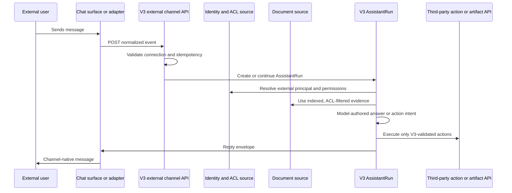

# V3 Third-Party Integration API

**Document status:** Draft v0.1
**Last updated:** 2026-05-14
**Audience:** third-party system owners, customer IT teams, V3 integration developers
**Canonical plan:** `docs/plans/2026-05-13-v3-external-bot-third-party-knowledge-plan.md`
**Default public base URL:** `https://v3.elepcloud.com`

This document describes how external systems connect to V3 after the external bot and third-party knowledge track is complete.

It covers four integration families:

- Chat channels: third-party pages, customer portals, Feishu/Lark adapters, WeCom adapters.
- Knowledge sources: third-party document libraries, folders, files, revisions, and attachments.
- Identity and permission sources: users, departments, groups, roles, disabled users, and document ACLs.
- Artifact and action systems: publish generated V3 artifacts and execute approved business transactions.

## Current Implementation Status

This document is forward-compatible with the target architecture. The implementation is being delivered in phases.

Already implemented:

- Shared external integration contracts in `crates/contracts/src/lib.rs`.
- Storage skeleton and redacted configuration tables in `crates/storage/migrations/0008_external_integrations.sql`.
- Normalized inbound chat event endpoint: `POST /v1/external/channels/{connection_id}/events`.
- Inbound event idempotency record and redacted message summary.
- Creation of an `external_channel` AssistantRun from normalized inbound messages.
- Source sync endpoint: `POST /v1/external/sources/{source_id}/sync`.
- Observe-first integration list and audit endpoints.
- Limited management controls: disable, retry, and secret-rotation request markers.
- Permission-drift and source-recovery observability signals in `GET /v1/external/integrations`.
- Standalone external integration observability panel on `https://v3.elepcloud.com/`.
- External action retry requests now enqueue `external_action_dispatch_workflow` tasks on the `external_action` worker queue instead of dispatching synchronously from the management request.
- Deployment-target third-party gateway smoke now emits JSON and Markdown readiness reports for signed dispatch, result callback acceptance, redaction checks, and remaining customer handoff items.
- A third-party handoff manifest sample and validator now check customer sandbox readiness before live joint testing, including HTTPS or approved loopback URLs, dispatch credentials, callback allowlisting, document/ACL fixtures, operations contacts, and absence of raw secret material.

Planned next:

- Add deeper artifact publish/revoke status controls and package the self-contained customer sandbox handoff as the default pre-live checklist.
- Extend artifact publishing status and revocation controls.

Default public routing:

- `https://v3.elepcloud.com/` opens the external integration observability panel.
- Third-party API calls should use `https://v3.elepcloud.com/v1/...` by default.
- The observability domain does not expose direct navigation back to the main V3 workspace.

## Integration Modes

### 1. Standard Feishu/Lark or WeCom

V3 provides platform adapters for official bot/event/message interfaces.

The platform adapter is responsible for:

- validating platform signatures and replay protection;
- converting platform-specific message events into `ExternalBotMessageView`;
- calling V3's normalized event endpoint;
- converting V3 reply envelopes into platform text, card, file, or status messages.

Feishu/Lark and WeCom API details must be verified against official documentation during adapter implementation.

### 2. Pure Third-Party

A third party can build its own chat page, document system, artifact store, or workflow system.

In this mode:

- the third-party chat page calls V3's normalized chat event endpoint;
- the third-party document library exposes source APIs for V3 to sync or accepts push batches into V3;
- the third-party user directory exposes user, group, department, role, and disabled-user state;
- the third-party ACL source exposes document-level permission snapshots;
- V3 returns answers, task status, artifact links, and confirmation requests through normalized reply contracts.

The third-party page does not become the permission authority. V3 still resolves effective access before retrieval, answer generation, artifact access, or external actions.

### 3. Hybrid

The chat surface, document source, user source, artifact system, and action system may live on different servers.

Example:

- WeCom group chat is the user-facing channel.
- A customer intranet document system provides documents and ACLs.
- A ticketing system receives approved action writes.
- V3 owns AssistantRun state, permission enforcement, retrieval, model execution, artifact ownership, and audit.

## High-Level Flow



## Shared Principles

- V3 is the control plane. External systems are surfaces or sources.
- Every request is tenant-scoped through a V3-created connection.
- Every inbound message must be idempotent.
- Every external document chunk must be tied to a source document, revision, and ACL snapshot.
- Permission filtering happens before evidence enters the model context.
- V3 never asks the model to ignore inaccessible documents; inaccessible documents are not supplied.
- High-risk writes require explicit confirmation.
- Public API responses, logs, management UI, and event summaries must not expose raw secrets, tokens, document bodies outside authorized context, or raw provider payloads.

## Connection Model

V3 creates a connection record before third-party traffic is accepted.

Connection examples:

- `external_channel_connections`: Feishu, WeCom, generic third-party chat, custom portal.
- `external_source_connections`: document, user directory, artifact, action, or combined connector.

Third-party systems receive:

- `connection_id`: used in API paths.
- tenant/account binding: managed by V3.
- credential material: exchanged out-of-band or through the V3 management UI.
- allowed origins or callback URLs where applicable.

V3 stores only redacted configuration summaries in inspectable records.

## Authentication And Signing

Production integrations should use both transport security and request authentication.

Required baseline:

- HTTPS only.
- Tenant-scoped `connection_id`.
- Request timestamp.
- Idempotency key.
- Signature or bearer token associated with the connection.

Recommended generic signature headers:

```http
X-V3-Connection-Id: generic-chat-main
X-V3-Timestamp: 2026-05-13T12:00:00Z
X-V3-Nonce: 01HX...
X-V3-Signature: sha256=...
```

Signature payload:

```text
method + "\n" + path + "\n" + timestamp + "\n" + nonce + "\n" + raw_body_sha256
```

Current implementation note:

- Inbound channel routes validate the connection and event shape; Feishu/Lark and WeCom routes use their platform-specific callback checks where implemented.
- Outbound external action dispatch now requires a dispatch-specific bearer token or signing secret when an endpoint is configured.
- Replay window enforcement, token rotation UI, and per-connection auth policy controls remain in the adapter/API hardening slice.

## Idempotency

Every inbound message or action callback must include an idempotency key.

For chat events, use a stable key:

```text
{platform}:{tenant_external_id}:{message_external_id}
```

If V3 receives the same key again:

- it returns the existing AssistantRun id when available;
- it does not create a duplicate AssistantRun;
- it returns a task-status reply such as `duplicate_accepted`.

## Error Format

V3 error responses use:

```json
{
  "code": "external_channel_connection_not_found",
  "message": "external channel connection generic-chat-main was not found",
  "details": {
    "field": "optional structured details"
  }
}
```

Common error categories:

- `bad_request`: request body or required field is invalid.
- `external_channel_connection_not_found`: unknown channel connection.
- `external_channel_disabled`: connection exists but is disabled.
- `external_channel_platform_mismatch`: message platform does not match the connection.
- `conflict`: duplicate unique record outside normal idempotency handling.
- `storage_error`: backend persistence failed.

## Chat Channel API

### POST `/v1/external/channels/{connection_id}/events`

Use this endpoint when a third-party chat page, adapter, or bot gateway sends a normalized inbound message to V3.

Implementation status: available as the first normalized ingress route.

Path parameters:

- `connection_id`: V3-created channel connection id.

Request body:

```json
{
  "platform": "generic_chat",
  "tenant_external_id": "tenant-ext-001",
  "bot_external_id": "bot-v3",
  "conversation_external_id": "chat-risk-room",
  "thread_external_id": "optional-thread-id",
  "sender_external_id": "user-ext-001",
  "message_external_id": "msg-001",
  "message_type": "text",
  "text": "订单延期风险有哪些？",
  "mention_external_user_ids": [],
  "attachment_refs": [
    {
      "attachment_external_id": "file-001",
      "filename": "orders.xlsx",
      "content_type": "application/vnd.openxmlformats-officedocument.spreadsheetml.sheet",
      "size_bytes": 4096,
      "download_url_redacted": "https://docs.example.com/download/[redacted]"
    }
  ],
  "idempotency_key": "generic_chat:tenant-ext-001:msg-001",
  "received_at": "2026-05-13T12:00:00Z"
}
```

Supported `platform` values:

- `feishu`
- `lark`
- `we_com`
- `generic_chat`
- `third_party`

Supported `message_type` values:

- `text`
- `image`
- `file`
- `audio`
- `video`
- `card`
- `event`
- `unknown`

Response body:

```json
{
  "accepted": true,
  "assistant_run_id": "4fd1b8c0-7d12-49a2-9f4e-5bdce6e2e5a8",
  "idempotency_key": "generic_chat:tenant-ext-001:msg-001",
  "reply": {
    "target_conversation_external_id": "chat-risk-room",
    "reply_type": "task_status",
    "task_status": "accepted",
    "requires_confirmation": false
  }
}
```

Important behavior:

- V3 creates an `external_channel` AssistantRun.
- V3 records a redacted message summary.
- V3 does not store attachment download URLs in inspectable summaries.
- V3 does not compose the final answer in the route handler.
- The final answer or action request is produced through V3 AssistantRun execution and returned through later reply/status mechanisms.

### GET `/v1/external/runs/{assistant_run_id}`

Use this endpoint when a third-party page needs to poll a V3 run status.

Implementation status: planned.

Target response:

```json
{
  "assistant_run_id": "4fd1b8c0-7d12-49a2-9f4e-5bdce6e2e5a8",
  "status": "running",
  "latest_reply": null,
  "required_confirmation": null,
  "artifact_links": [],
  "redacted_trace": [
    {
      "step": "permission_resolution",
      "status": "completed"
    }
  ]
}
```

### POST `/v1/external/channels/{connection_id}/confirmations`

Use this endpoint when a user confirms or rejects a high-risk action from a third-party page or channel card.

Implementation status: available for normalized external action confirmations.

Request body:

```json
{
  "assistant_run_id": "4fd1b8c0-7d12-49a2-9f4e-5bdce6e2e5a8",
  "action_id": "external-action-001",
  "confirmation_external_id": "confirm-001",
  "sender_external_user_id": "user-ext-001",
  "decision": "approved",
  "comment": "Confirmed in the third-party page.",
  "idempotency_key": "confirm:external-action-001:approved",
  "confirmed_at": "2026-05-13T12:03:00Z"
}
```

Allowed `decision` values:

- `approved`
- `rejected`

## Third-Party Document Source API

V3 supports two source sync patterns:

- Pull: V3 calls the third-party source API.
- Push: the third-party source sends batches to V3.

Implementation status: planned.

### Pull Contract Expected From Third-Party

Document list:

```http
GET /documents?cursor={cursor}&updated_after={iso_time}
```

Response:

```json
{
  "items": [
    {
      "document_external_id": "doc-001",
      "revision_external_id": "rev-009",
      "title": "订单风险周报",
      "content_type": "application/pdf",
      "folder_external_id": "folder-risk",
      "updated_at": "2026-05-13T10:00:00Z",
      "content_url": "https://docs.example.com/doc-001/content",
      "acl_url": "https://docs.example.com/doc-001/acl"
    }
  ],
  "next_cursor": null
}
```

Document content:

```http
GET /documents/{document_external_id}/content?revision={revision_external_id}
```

Response options:

- raw file stream with `Content-Type`;
- JSON body with `text`, `html`, or structured blocks;
- signed URL that V3 can fetch through the connector.

Document ACL:

```http
GET /documents/{document_external_id}/acl?revision={revision_external_id}
```

Response:

```json
{
  "source_id": "src-docs",
  "document_external_id": "doc-001",
  "revision_external_id": "rev-009",
  "allowed_user_external_ids": ["user-a"],
  "allowed_department_external_ids": ["dept-sales"],
  "allowed_group_external_ids": ["group-risk"],
  "allowed_role_external_ids": ["role-manager"],
  "denied_user_external_ids": ["user-blocked"],
  "denied_department_external_ids": [],
  "denied_group_external_ids": [],
  "denied_role_external_ids": [],
  "acl_hash": "acl-hash-009",
  "captured_at": "2026-05-13T10:00:00Z"
}
```

### Push Contract Into V3

Target endpoint:

```http
POST /v1/external/sources/{source_id}/documents/_pull
```

Implementation status: planned.

Request body:

```json
{
  "batch_id": "batch-20260513-001",
  "documents": [
    {
      "document_external_id": "doc-001",
      "revision_external_id": "rev-009",
      "title": "订单风险周报",
      "content_type": "application/pdf",
      "content_ref": {
        "kind": "url",
        "url_redacted": "https://docs.example.com/doc-001/content/[redacted]"
      },
      "acl_snapshot": {
        "allowed_group_external_ids": ["group-risk"],
        "denied_user_external_ids": []
      }
    }
  ],
  "idempotency_key": "src-docs:batch-20260513-001"
}
```

## User And Permission API

V3 needs user and group state to convert third-party identity into effective permissions.

Implementation status: planned.

Expected third-party endpoints:

```http
GET /users?cursor={cursor}&updated_after={iso_time}
GET /departments?cursor={cursor}
GET /groups?cursor={cursor}
GET /roles?cursor={cursor}
GET /users/{external_user_id}/memberships
```

User response:

```json
{
  "items": [
    {
      "external_user_id": "user-a",
      "display_name": "Alice",
      "email": "alice@example.com",
      "department_external_ids": ["dept-sales"],
      "group_external_ids": ["group-risk"],
      "role_external_ids": ["role-manager"],
      "is_disabled": false,
      "updated_at": "2026-05-13T10:00:00Z"
    }
  ],
  "next_cursor": null
}
```

Permission resolution rule:

```text
external principal
+ source user memberships
+ source document ACL snapshot
+ V3 tenant/account policy
+ V3 dataset visibility
+ channel policy
= effective access scope
```

If identity mapping is missing or stale, V3 must use the lowest safe trust level and deny source evidence that cannot be proven visible.

## Artifact API

V3 artifacts include reports, static pages, summaries, generated files, HTML review artifacts, and other deliverables.

Implementation status: MVP is available through the external action runtime. V3 persists `external_artifact.publish`, `external_artifact.status`, and `external_artifact.revoke` as audited action runs. Revoke is treated as a high-risk action and must be confirmed before dispatch. Confirmed or confirmation-free actions are sent to the configured third-party artifact endpoint, and `GET /v1/external/integrations` exposes an observe-only `artifact_summary`.

### Publish Artifact

```http
POST /v1/external/artifacts/{artifact_id}/publish
```

Request body:

```json
{
  "target_system": "customer-portal",
  "target_container_external_id": "project-risk",
  "title": "订单风险分析",
  "visibility": "source_acl",
  "idempotency_key": "artifact:publish:artifact-001"
}
```

Response:

```json
{
  "artifact_id": "artifact-001",
  "publication_status": "published",
  "external_artifact_id": "portal-artifact-7788",
  "url_redacted": "https://portal.example.com/artifacts/[redacted]"
}
```

When V3 dispatches to a third-party artifact endpoint, the request uses the shared external action shape:

```json
{
  "action_id": "act-artifact-001",
  "assistant_run_id": "00000000-0000-0000-0000-000000000001",
  "action_type": "external_artifact.publish",
  "risk_level": "low_risk_write",
  "target_system": "third_party_artifact_api",
  "arguments_redacted": {
    "artifact_ref": "artifact-001",
    "target_system": "customer-portal",
    "visibility": "source_acl"
  },
  "confirmation_state": "not_required",
  "requester_summary": {
    "platform": "generic_chat",
    "tenant_external_id": "tenant-ext-001",
    "conversation_external_id": "chat-risk-room",
    "sender_external_id": "user-ext-001"
  },
  "raw_arguments_included": false
}
```

Third-party responses may include `external_request_id`, `externalRequestId`, `request_id`, or `requestId`. V3 stores only that request id and a redacted response summary.

### Revoke Artifact

```http
POST /v1/external/artifacts/{artifact_id}/revoke
```

Request body:

```json
{
  "reason": "source permission changed",
  "idempotency_key": "artifact:revoke:artifact-001"
}
```

Revoke dispatch uses `action_type: "external_artifact.revoke"` and must have `confirmation_state: "confirmed"` before V3 sends it to the third-party endpoint.

## External Action API

External actions are business operations requested by the model but validated and executed by V3.

Implementation status: MVP available for external channel action runs. V3 persists model-selected action intents, pauses high-risk and cross-system actions until confirmation, and dispatches confirmed or confirmation-free runs only to a configured third-party HTTPS endpoint. If no endpoint is configured, V3 records `dispatch_blocked` with `dispatch_endpoint_missing` for audit instead of silently dropping the action.

Risk levels:

- `read_only`: inspect/search/fetch status.
- `low_risk_write`: create draft, add internal note, create non-final task.
- `high_risk_write`: update customer data, notify external users, approve/reject, publish public artifact.
- `cross_system`: combine retrieval, artifact generation, and external writeback.

Action intent example:

```json
{
  "action_id": "act-001",
  "tenant_id": "tenant-001",
  "requester": {
    "platform": "generic_chat",
    "external_user_id": "user-a",
    "trust_level": "employee"
  },
  "risk_level": "high_risk_write",
  "target_system": "ticketing",
  "action_type": "ticket.update_priority",
  "arguments_redacted": {
    "ticket_id": "T-1001",
    "priority": "high"
  },
  "source_evidence_refs": ["retrieval:chunk-001"],
  "requires_confirmation": true,
  "idempotency_key": "external-action:act-001",
  "created_at": "2026-05-13T12:00:00Z"
}
```

High-risk or cross-system actions must pause until confirmation is received.

Dispatch endpoint configuration keys:

- Artifact actions prefer `artifact_action_dispatch_url`, `artifactActionDispatchUrl`, `artifact_dispatch_url`, or `artifactDispatchUrl`.
- Business actions prefer `business_action_dispatch_url`, `businessActionDispatchUrl`, `business_dispatch_url`, or `businessDispatchUrl`.
- Both action families can fall back to `external_action_dispatch_url`, `externalActionDispatchUrl`, `action_dispatch_url`, or `actionDispatchUrl`.

Dispatch authentication configuration keys:

- Bearer token: `external_action_bearer_token`, `externalActionBearerToken`, `action_bearer_token`, `actionBearerToken`, `dispatch_bearer_token`, or `dispatchBearerToken`.
- Signing secret: `external_action_signing_secret`, `externalActionSigningSecret`, `action_signing_secret`, `actionSigningSecret`, `dispatch_signing_secret`, or `dispatchSigningSecret`.

V3 deliberately does not reuse generic platform callback tokens such as `token`, `callback_token`, or `verification_token` for outbound action dispatch. If an endpoint is configured without a dispatch-specific bearer token or signing secret, V3 records `dispatch_blocked` with `dispatch_auth_missing`.

V3 sends only a redacted dispatch payload:

```json
{
  "action_id": "act-001",
  "assistant_run_id": "arun-001",
  "action_type": "ticket.update_priority",
  "risk_level": "high_risk_write",
  "target_system": "ticketing",
  "confirmation_state": "confirmed",
  "arguments_redacted": {
    "ticket_id": "T-1001",
    "priority": "high"
  },
  "requester_summary": {
    "platform": "generic_chat",
    "tenant_external_id": "tenant-001",
    "conversation_external_id": "chat-risk-room",
    "sender_external_id": "user-a"
  },
  "raw_arguments_included": false
}
```

Dispatch responses may return `external_request_id`, `externalRequestId`, `request_id`, or `requestId`. V3 stores that id and a redacted result summary. Raw third-party response bodies, tokens, secrets, and arbitrary message text are not stored in action summaries.

After a third-party system finishes an asynchronously dispatched action, it can report the outcome back to V3:

```http
POST /v1/external/channels/{connection_id}/actions/{action_id}/result
```

Request body:

```json
{
  "external_request_id": "gateway-req-001",
  "status": "succeeded",
  "idempotency_key": "generic_chat:tenant-ext-001:result-001",
  "completed_at": "2026-05-14T10:30:00Z",
  "code": "OK",
  "message": "Optional human-readable text. V3 only records that a message was present.",
  "result": {
    "artifact_id": "artifact-001",
    "status": "created"
  }
}
```

Supported callback statuses are `succeeded`, `failed`, `cancelled`, `rejected`, `running`, and `accepted`. V3 verifies that the callback channel owns the action run and, when an `external_request_id` was recorded during dispatch, rejects mismatched ids. The `message` field and arbitrary `result` values are not stored verbatim; V3 keeps only message/result presence, safe status/code metadata, and a structural result summary such as object field counts.

Outbound dispatch headers:

```http
Authorization: Bearer <dispatch token>
X-V3-Connection-Id: generic-chat-main
X-V3-Timestamp: 2026-05-14T09:30:00Z
X-V3-Nonce: 01HX...
X-V3-Content-SHA256: <hex sha256 of raw JSON body>
X-V3-Signature: sha256=<HMAC-SHA256 hex>
```

`Authorization` is present only when a dispatch bearer token is configured. `X-V3-Signature` is present only when a dispatch signing secret is configured. When both are configured, V3 sends both.

## Reply Envelope

V3 returns normalized replies. Adapters translate these into platform-native messages.

```json
{
  "target_conversation_external_id": "chat-risk-room",
  "reply_type": "task_status",
  "text": null,
  "card": null,
  "artifact_links": [],
  "task_status": "accepted",
  "requires_confirmation": false
}
```

Supported `reply_type` values:

- `task_status`
- `text`
- `card`
- `artifact_link`
- `requires_confirmation`

Rules:

- `task_status` means V3 accepted or is processing the request.
- `text` is model-authored or V3-approved final text.
- `card` is a structured adapter-ready payload.
- `artifact_link` must use V3-authorized links.
- `requires_confirmation` must include a pending action id in the card or status payload.

## Management Observability API

V3 exposes observe-first management endpoints for operators and the V3 console. These endpoints are not a third-party chat surface and must not expose raw credentials, raw provider payloads, or document bodies.

```http
GET /v1/external/integrations
```

The response lists channel and source integrations with health, last activity timestamps, action dispatch counters, action lifecycle summaries, permission/source recovery signals, and a redacted configuration summary.

Channel integrations include `action_summary`, an observe-only lifecycle object for external actions. It reports total actions, pending confirmations, blocked/failed dispatches, actions waiting for third-party results, received result callbacks, succeeded/failed/running result callbacks, the latest action timestamp, and the latest result callback timestamp. It does not include raw third-party result bodies or arbitrary callback message text.

Each item includes `drift_summary`, an observe-only object that does not include raw document bodies, raw ACL entries, provider payloads, or secret material:

- channel integrations report external identity mapping drift such as `identity_mapping_gap` or `disabled_principals`, with unmapped/disabled principal counts and the latest principal update timestamp;
- source integrations report ACL and sync recovery states such as `acl_missing`, `acl_stale`, `sync_failed`, or `sync_recovering`, with ACL snapshot counts, stale snapshot counts, failed sync counts, latest ACL timestamp, and latest sync status.

Channel integrations also include `artifact_summary` for external artifact action state. It reports status/publish/revoke action counts, pending confirmations, blocked/failed dispatch counts, published/revoked counts, and the latest artifact action timestamp. This is for operations and support visibility only; it does not include raw artifact bodies, raw download URLs, or credential material.

```http
GET /v1/external/integrations/{integration_id}/audit
```

The audit response returns a newest-first redacted timeline for messages, action runs, and source sync runs related to the integration. Action entries include confirmation state, dispatch status/reason, auth mode, HTTP status, redacted response summary, and safe result callback state such as callback status, idempotency key, completion time, and structural result summary. Sensitive keys such as `token`, `secret`, `authorization`, `cookie`, and `password` are removed from nested summaries.

The standalone observability panel can preserve selected `integration_id`, `audit_filter`, and `action_id` in the URL so operators can share a direct action drilldown link. It can also export a redacted action trace JSON built from the same audit summary; the export does not include raw third-party request bodies, raw callback messages, or credentials.

Optional query parameters:

- `item_type`: `message`, `action`, `sync`, or `all`.
- `action_state`: `result_callback`, `waiting_result`, `failed`, `blocked`, `pending_confirmation`, or `all`. This can only be used with action items.
- `action_id`: exact external action run id. Use with `item_type=action` when opening one action drilldown.
- `limit`: number of returned records, clamped to `1..100`.

Example:

```http
GET /v1/external/integrations/generic-chat-main/audit?item_type=action&action_state=result_callback
```

```http
GET /v1/external/integrations/generic-chat-main/audit?item_type=action&action_id=act-001&limit=1
```

```http
POST /v1/external/integrations/{integration_id}/retry
```

For source integrations, this enqueues an incremental source sync. For channel integrations, this queues recent action runs that are confirmed or do not require confirmation and are currently marked `dispatch_blocked` or `dispatch_failed` into `external_action_dispatch_workflow` on the `external_action` queue. The worker dispatches the validated external action to the configured third-party endpoint and advances the workflow with a redacted output summary.

```http
POST /v1/external/integrations/{integration_id}/disable
```

Marks a channel or source integration disabled. Disabled channel connections reject future inbound events; disabled source connections reject new sync jobs.

```http
POST /v1/external/integrations/{integration_id}/rotate-secret
```

Records a secret-rotation request marker in redacted connection configuration. It does not return or store raw secret material in public summaries.

## Data Redaction

The following values must not appear in logs, public API responses, management UI summaries, model context, or generated artifacts unless explicitly authorized:

- tokens, secrets, private keys, signing keys, verification tokens, cookies;
- raw third-party document bodies outside authorized retrieval context;
- raw provider requests/responses;
- raw attachment download URLs;
- hidden ACL entries not relevant to the requesting user;
- cross-tenant identifiers not needed for support.

V3 stores:

- `config_redacted`, not raw connection config;
- `arguments_redacted`, not raw action secrets;
- `payload_summary`, not full inbound message payloads;
- source ids, document ids, revision ids, ACL hashes, and evidence refs for audit.

## Deployment Patterns

### Embedded

V3 hosts all adapters and connectors. Third-party systems expose APIs or receive callbacks.

Best for simple private deployments.

### Edge Gateway

A customer-hosted gateway sits near the third-party document library or chat system.

The gateway:

- validates local network access;
- converts local events to V3 normalized contracts;
- sends only redacted summaries and authorized content to V3.

Best when documents live inside a customer network.

### Full Private

V3, gateway, workers, and model routing run inside the customer environment.

Best for strict data residency or private-network deployments.

## Feishu/Lark And WeCom Notes

Feishu/Lark and WeCom are standard channel adapters over the same normalized V3 core.

Adapter responsibilities:

- verify official platform signatures;
- normalize incoming messages to `ExternalBotMessageView`;
- call `POST /v1/external/channels/{connection_id}/events`;
- translate V3 reply envelopes into platform messages or cards;
- support file/attachment handoff only after sender identity and permission policy is known.

V3 core must not depend on Feishu/Lark or WeCom-specific message shapes. Platform-specific details stay in adapter modules.

## Minimum Third-Party Checklist

Before a third party can go live:

1. V3 creates tenant and connection records.
2. Third party receives connection id and auth/signing configuration.
3. Chat events include stable external user, conversation, message, and idempotency ids.
4. User directory sync is available or a trusted user mapping is configured.
5. Document metadata, content, revision, and ACL sync are available.
6. V3 can prove same-question permission filtering for at least two users with different ACLs.
7. Artifact publishing is scoped and revocable.
8. High-risk actions require confirmation.
9. V3 management UI shows connection health, sync state, ACL drift, message/run traces, and redacted failures.

### Handoff Manifest

Before customer sandbox testing, fill a handoff manifest with the third-party environment, chat channel identifiers, dispatch endpoint, callback allowlist, document/ACL fixtures, artifact/action capabilities, and operations contacts.

Reference manifest:

```text
docs/integrations/third-party-handoff.sample.json
```

Validation command:

```bash
npm run validate:external-handoff
```

The validator is intentionally conservative. It fails public HTTP URLs, missing dispatch auth delivery notes, missing callback allowlist confirmation, missing document ACL fixtures, missing escalation contacts, and raw secrets such as bearer tokens, signing secrets, private keys, passwords, or API keys embedded directly in the manifest. Secrets should be exchanged through the agreed secure delivery channel and referenced by delivery method, not pasted into this file.

## Versioning

The external API should be versioned by path and contract version.

Current path prefix:

```text
/v1/external/...
```

Breaking changes require:

- a new API version or explicit contract version;
- migration guidance;
- dual-run period for adapters and customer pages;
- compatibility tests for normalized message and ACL contracts.

## Implementation References

- Plan: `docs/plans/2026-05-13-v3-external-bot-third-party-knowledge-plan.md`
- Contracts: `crates/contracts/src/lib.rs`
- Storage migration: `crates/storage/migrations/0008_external_integrations.sql`
- First normalized ingress route: `POST /v1/external/channels/{connection_id}/events`
- Handoff sample: `docs/integrations/third-party-handoff.sample.json`
- Handoff validator: `tools/validate-external-handoff.mjs`
