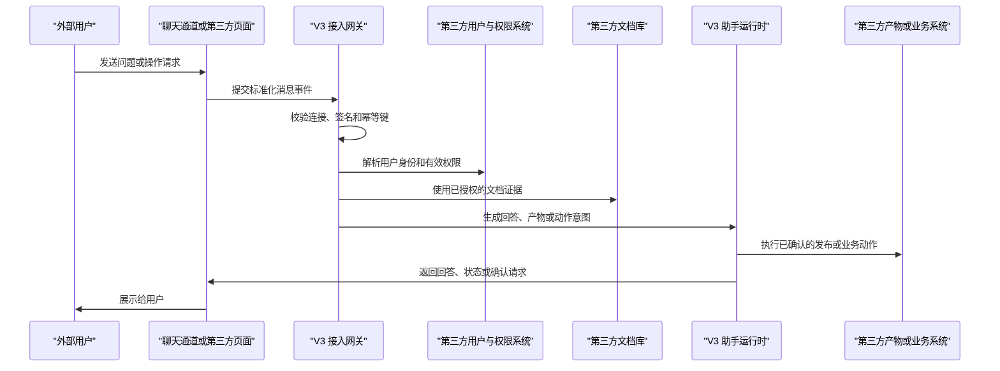

# V3 第三方接入说明书

**文档状态：** 对外草案 v0.1
**最后更新：** 2026-05-14
**适用对象：** 第三方系统负责人、客户 IT 团队、渠道/文档/权限/业务系统对接开发人员
**默认对外域名：** `https://v3.elepcloud.com`
**说明：** 本文可作为第三方联调前的接口说明材料。默认第三方接口使用 `https://v3.elepcloud.com/v1/...`；具体凭证、白名单、回调地址和开放接口，以项目交付环境和双方确认的联调配置为准。

默认访问规则：

- `https://v3.elepcloud.com/` 打开外部集成观测面板；
- 第三方接口默认使用 `https://v3.elepcloud.com/v1/...`；
- 该观测域名不提供直接跳回 V3 主工作台的导航入口。

## 1. 接入目标

V3 支持把智能助手能力接入到第三方系统中，包括：

- 在飞书、Lark、企业微信或第三方自建聊天页面中使用 V3 助手；
- 接入第三方文档库，让 V3 在授权范围内解析、索引和问答；
- 接入第三方用户、部门、角色、用户组和文档权限；
- 将 V3 生成的产物发布回第三方系统；
- 在用户确认后，由 V3 调用第三方业务接口处理事务。

V3 的定位是统一的智能处理和治理中心。第三方系统可以提供聊天入口、文档来源、用户权限来源、产物存储位置或业务动作接口，但 V3 负责最终的权限校验、问答检索、任务运行、动作风控和审计记录。

## 2. 接入模式

### 2.1 标准机器人模式

适用于飞书、Lark、企业微信等标准机器人平台。

在该模式下：

- 第三方平台负责消息投递、事件回调、群聊或单聊入口；
- V3 适配平台的官方机器人接口；
- V3 将平台消息转换为统一事件；
- V3 返回文本、卡片、文件、任务状态或确认请求；
- 平台侧只作为聊天通道，不绕过 V3 的权限和动作校验。

### 2.2 纯第三方模式

适用于客户或合作方自建系统，例如自建门户、自建文档库、自建用户中心、自建业务系统。

在该模式下，第三方可以分别提供：

- 聊天通道接口：把用户消息发送给 V3；
- 文档接口：让 V3 拉取或接收文档、附件、版本和正文；
- 用户接口：让 V3 同步用户、部门、用户组、角色和停用状态；
- 权限接口：让 V3 获取文档级权限快照；
- 产物接口：接收 V3 生成的报告、页面、文件或链接；
- 事务接口：接收经过 V3 校验和用户确认后的业务动作。

第三方可以搭建自己的页面。该页面只负责交互展示，不能替代 V3 的权限判断。

### 2.3 混合模式

聊天入口、文档库、用户权限、产物系统和业务系统可以部署在不同服务器上。

示例：

- 用户在企业微信群里提问；
- 文档来自客户内部门户；
- 用户和部门来自客户统一身份系统；
- 审批或工单动作写入客户业务系统；
- V3 负责统一编排、权限过滤、问答生成、动作确认和审计。

## 3. 总体流程



## 4. 双方职责边界

### V3 负责

- 创建和管理第三方连接；
- 绑定租户、账号和外部身份；
- 解析第三方文档并建立索引；
- 保存第三方权限快照并计算用户有效权限；
- 在检索前过滤不可访问文档；
- 创建和维护助手任务状态；
- 返回问答结果、产物链接、任务状态和确认请求；
- 对高风险动作进行确认和审计；
- 提供接入健康状态、同步状态、错误和审计观测。

### 第三方负责

- 提供稳定的 HTTPS 接口或标准平台机器人配置；
- 提供文档列表、正文、附件、版本号和更新时间；
- 提供用户、部门、用户组、角色和停用状态；
- 提供文档权限或可访问范围；
- 保证外部用户 ID、文档 ID、消息 ID 等标识稳定；
- 配合配置签名密钥、访问令牌、IP 白名单或回调地址；
- 在需要时接收 V3 产物发布和业务动作回调。

## 5. 核心原则

- 所有请求必须归属到明确租户和连接。
- 所有消息、文档和动作回调都必须支持幂等。
- V3 不会把用户无权访问的文档放入模型上下文。
- V3 不依赖模型自行判断权限，权限过滤发生在检索和生成之前。
- 高风险写入、跨系统事务、权限变更、外部发布等动作必须经过确认。
- 日志、观测页面、错误返回和接口响应不得泄露密钥、令牌或未授权正文。
- 第三方聊天页面可以独立部署，但不能绕过 V3 的权限、审计和风控。

## 6. 连接与凭证

V3 会为每个第三方通道或数据源创建连接记录。

常见连接类型：

- 聊天通道连接：飞书、Lark、企业微信、自建聊天页面、客户门户；
- 文档源连接：文档库、文件夹、知识库、附件库；
- 用户源连接：用户目录、组织架构、角色系统、权限系统；
- 产物连接：报告库、文件库、页面系统、下载中心；
- 业务动作连接：工单、审批、CRM、ERP、内部流程系统。

第三方通常会获得：

- `connection_id`：V3 分配的连接 ID；
- API 域名：由项目交付环境提供；
- 鉴权方式：签名密钥、Bearer Token、平台签名或双方确认的专用方式；
- 回调地址：V3 调用第三方接口时使用；
- 白名单配置：IP、域名、来源地址或平台事件地址。

## 7. 鉴权与签名建议

生产环境建议同时使用 HTTPS、连接级凭证和请求签名。

推荐请求头：

```http
X-V3-Connection-Id: generic-chat-main
X-V3-Timestamp: 2026-05-13T12:00:00Z
X-V3-Nonce: 01HXEXAMPLE
X-V3-Signature: sha256=...
```

推荐签名原文：

```text
method + "\n" + path + "\n" + timestamp + "\n" + nonce + "\n" + raw_body_sha256
```

基础要求：

- 使用 HTTPS；
- 时间戳在双方约定的有效窗口内；
- `nonce` 不重复；
- 请求体参与签名；
- 密钥支持轮换；
- 失败请求返回明确错误码，但不返回密钥细节。

飞书、Lark、企业微信等标准平台接入时，应优先使用平台官方签名和事件校验机制，再转换为 V3 内部统一事件。

当前实现状态：

- 入站聊天通道会校验连接和事件形态；飞书/Lark、企业微信已实现的平台入口使用各自的平台回调校验。
- V3 向第三方派发外部业务动作时，若配置了派发 endpoint，则必须同时配置派发专用 Bearer Token 或签名密钥之一。
- 重放窗口、密钥轮换界面和更细的连接级鉴权策略仍属于后续 hardening。

## 8. 幂等规则

第三方发送消息、同步文档、推送权限或回调动作结果时，都应提供稳定幂等键。

聊天消息建议格式：

```text
{platform}:{tenant_external_id}:{message_external_id}
```

示例：

```text
generic_chat:tenant-001:msg-20260513-0001
```

如果 V3 收到相同幂等键：

- 不重复创建助手任务；
- 不重复执行业务动作；
- 可以返回已存在的任务 ID 或状态；
- 对第三方来说可安全重试。

## 9. 聊天通道接口

### 9.1 提交用户消息

```http
POST /v1/external/channels/{connection_id}/events
```

用途：第三方聊天页面、机器人网关或平台适配器向 V3 提交用户消息。

路径参数：

| 字段 | 说明 |
| --- | --- |
| `connection_id` | V3 分配的聊天通道连接 ID |

请求示例：

```json
{
  "platform": "generic_chat",
  "tenant_external_id": "tenant-ext-001",
  "bot_external_id": "bot-v3",
  "conversation_external_id": "chat-risk-room",
  "thread_external_id": "thread-001",
  "sender_external_user_id": "user-10001",
  "sender_display_name": "张三",
  "message_external_id": "msg-20260513-0001",
  "message_type": "text",
  "text": "请基于我有权限查看的制度文档，说明本周采购审批需要注意什么。",
  "attachments": [
    {
      "attachment_external_id": "file-001",
      "filename": "采购申请补充说明.pdf",
      "content_type": "application/pdf",
      "size_bytes": 248930,
      "download_url": "https://third-party.example.com/files/file-001"
    }
  ],
  "idempotency_key": "generic_chat:tenant-ext-001:msg-20260513-0001",
  "received_at": "2026-05-13T12:00:00Z"
}
```

主要字段说明：

| 字段 | 是否必填 | 说明 |
| --- | --- | --- |
| `platform` | 是 | 通道来源，例如 `feishu`、`lark`、`we_com`、`generic_chat`、`third_party` |
| `tenant_external_id` | 是 | 第三方侧租户或客户 ID |
| `bot_external_id` | 是 | 第三方侧机器人或应用 ID |
| `conversation_external_id` | 是 | 群聊、会话或页面会话 ID |
| `thread_external_id` | 否 | 话题、帖子或子线程 ID |
| `sender_external_user_id` | 是 | 第三方侧用户 ID，必须稳定 |
| `sender_display_name` | 否 | 用户展示名 |
| `message_external_id` | 是 | 第三方侧消息 ID，必须稳定 |
| `message_type` | 是 | 消息类型 |
| `text` | 否 | 文本内容 |
| `attachments` | 否 | 附件列表 |
| `idempotency_key` | 是 | 幂等键 |
| `received_at` | 是 | 第三方收到或生成该消息的时间 |

支持的消息类型：

- `text`
- `image`
- `file`
- `audio`
- `video`
- `card`
- `event`
- `unknown`

响应示例：

```json
{
  "status": "accepted",
  "assistant_run_id": "arun_01HXEXAMPLE",
  "idempotency_key": "generic_chat:tenant-ext-001:msg-20260513-0001",
  "reply": {
    "reply_type": "task_status",
    "task_status": "accepted",
    "message": "V3 已接收请求，正在处理。"
  }
}
```

说明：

- 该接口用于接收用户消息并创建或继续 V3 助手任务；
- V3 可能立即返回任务状态，也可能异步返回最终答案；
- 具体是同步等待、轮询查询还是回调发送结果，可在项目联调时确认；
- 当前优先开放标准化消息入口，最终回答、卡片、文件和确认流程会按项目阶段逐步开放。

### 9.2 查询任务状态

计划接口：

```http
GET /v1/external/runs/{assistant_run_id}
```

响应示例：

```json
{
  "assistant_run_id": "arun_01HXEXAMPLE",
  "status": "completed",
  "created_at": "2026-05-13T12:00:01Z",
  "completed_at": "2026-05-13T12:00:05Z",
  "reply": {
    "reply_type": "text",
    "text": "根据你当前权限可查看的制度文档，本周采购审批需要重点关注三点..."
  }
}
```

### 9.3 提交用户确认

已接入接口：

```http
POST /v1/external/channels/{connection_id}/confirmations
```

用途：当 V3 判断某个动作需要确认时，第三方页面或机器人把用户确认结果提交给 V3。

请求示例：

```json
{
  "assistant_run_id": "arun_01HXEXAMPLE",
  "action_id": "external-action-001",
  "confirmation_external_id": "confirm-001",
  "sender_external_user_id": "user-10001",
  "decision": "approved",
  "comment": "确认提交审批。",
  "idempotency_key": "generic_chat:tenant-ext-001:confirm-001",
  "confirmed_at": "2026-05-13T12:03:00Z"
}
```

说明：

| 字段 | 说明 |
| --- | --- |
| `assistant_run_id` | V3 返回的 AssistantRun ID |
| `action_id` | V3 在需要确认的回复中返回的外部动作 ID；如未传，V3 会兼容使用 `confirmation_external_id` 查找 |
| `decision` | `approved` 或 `rejected` |
| `idempotency_key` | 第三方确认回调的幂等键 |

## 10. 第三方文档库接口

V3 支持两种文档接入方式：

- 拉取模式：V3 按计划调用第三方文档接口；
- 推送模式：第三方主动把文档、版本和权限推送给 V3。

项目初期建议优先采用拉取模式，便于 V3 统一处理重试、分页、增量同步和权限快照。

### 10.1 文档列表

第三方建议提供：

```http
GET /documents
```

查询参数示例：

| 参数 | 说明 |
| --- | --- |
| `cursor` | 分页游标 |
| `updated_after` | 增量同步起始时间 |
| `limit` | 单页数量 |

响应示例：

```json
{
  "items": [
    {
      "document_external_id": "doc-001",
      "title": "采购审批制度",
      "document_type": "pdf",
      "revision": "rev-20260513-01",
      "updated_at": "2026-05-13T10:20:00Z",
      "deleted": false,
      "content_url": "https://third-party.example.com/documents/doc-001/content",
      "acl_url": "https://third-party.example.com/documents/doc-001/acl"
    }
  ],
  "next_cursor": "cursor-002"
}
```

### 10.2 文档正文

第三方建议提供：

```http
GET /documents/{document_external_id}/content
```

可返回：

- 原始文件下载流；
- 已解析文本；
- HTML、Markdown 或结构化段落；
- 附件列表；
- 文件哈希、版本号和更新时间。

正文必须与 `revision` 对应。文档更新后，应生成新的版本标识。

### 10.3 文档权限快照

第三方建议提供：

```http
GET /documents/{document_external_id}/acl
```

响应示例：

```json
{
  "document_external_id": "doc-001",
  "revision": "rev-20260513-01",
  "acl_hash": "sha256:...",
  "captured_at": "2026-05-13T10:21:00Z",
  "allow": [
    { "subject_type": "user", "subject_external_id": "user-10001", "level": "read" },
    { "subject_type": "department", "subject_external_id": "dept-finance", "level": "read" },
    { "subject_type": "role", "subject_external_id": "role-procurement-admin", "level": "manage" }
  ],
  "deny": [
    { "subject_type": "user", "subject_external_id": "user-99999", "reason": "restricted" }
  ]
}
```

权限说明：

- `allow` 表示可访问主体；
- `deny` 表示明确拒绝主体；
- 主体可以是用户、部门、用户组、角色或租户；
- V3 会保存权限快照，并在检索前按用户有效权限过滤文档；
- 文档权限变化后，应尽快让 V3 重新同步权限快照。

## 11. 用户与组织接口

第三方需要让 V3 能够识别外部用户是谁，以及该用户属于哪些组织和角色。

建议提供以下接口：

```http
GET /users
GET /departments
GET /groups
GET /roles
GET /users/{user_external_id}/memberships
```

用户响应示例：

```json
{
  "items": [
    {
      "user_external_id": "user-10001",
      "display_name": "张三",
      "email": "zhangsan@example.com",
      "mobile": "+86-13800000000",
      "status": "active",
      "department_external_ids": ["dept-finance"],
      "group_external_ids": ["group-procurement"],
      "role_external_ids": ["role-requester"],
      "updated_at": "2026-05-13T09:00:00Z"
    }
  ],
  "next_cursor": null
}
```

V3 计算有效权限时会综合：

- 用户直接权限；
- 部门权限；
- 用户组权限；
- 角色权限；
- 租户或空间默认权限；
- 明确拒绝规则；
- 用户是否已停用；
- 文档版本和权限快照时间。

## 12. 产物发布接口

当 V3 生成报告、页面、文档、表格、图片或其他产物时，可按项目配置发布到第三方系统。

当前实现状态：产物发布、状态查询和撤销已经接入外部动作运行时。V3 会把 `external_artifact.publish`、`external_artifact.status`、`external_artifact.revoke` 作为受控动作保存到审计记录中；撤销属于高风险动作，必须先完成用户确认。确认后或无需确认的动作，会由 V3 派发到第三方配置的产物 endpoint，并在观测接口中形成 `artifact_summary`。

计划中的直接接口示例：

```http
POST /v1/external/artifacts/{artifact_id}/publish
POST /v1/external/artifacts/{artifact_id}/revoke
```

第三方也可以提供接收接口，例如：

```http
POST /artifacts
POST /artifacts/{artifact_external_id}/revoke
```

V3 派发到第三方产物 endpoint 的请求会采用统一外部动作格式，例如：

```json
{
  "action_id": "act-artifact-001",
  "assistant_run_id": "00000000-0000-0000-0000-000000000001",
  "action_type": "external_artifact.publish",
  "risk_level": "low_risk_write",
  "target_system": "third_party_artifact_api",
  "arguments_redacted": {
    "artifact_ref": "artifact-001",
    "target_system": "customer-portal",
    "visibility": "source_acl"
  },
  "confirmation_state": "not_required",
  "requester_summary": {
    "platform": "generic_chat",
    "tenant_external_id": "tenant-ext-001",
    "conversation_external_id": "chat-risk-room",
    "sender_external_id": "user-ext-001"
  },
  "raw_arguments_included": false
}
```

撤销请求的 `action_type` 为 `external_artifact.revoke`，`confirmation_state` 必须已经是 `confirmed`。第三方响应中可返回 `external_request_id`、`externalRequestId`、`request_id` 或 `requestId`，V3 只保存请求 id 和脱敏响应摘要。

发布请求示例：

```json
{
  "artifact_id": "artifact-001",
  "artifact_type": "report",
  "title": "采购审批风险分析",
  "owner_external_user_id": "user-10001",
  "visibility": "same_as_source_permissions",
  "download_url": "https://v3.example.com/artifacts/artifact-001",
  "expires_at": "2026-06-13T00:00:00Z",
  "idempotency_key": "artifact:artifact-001:publish"
}
```

产物发布必须满足：

- 产物权限不高于来源文档权限；
- 下载链接具备有效期或访问校验；
- 撤销后第三方不可继续访问；
- 发布、查看、下载、撤销都应可审计。
- 观测接口会展示发布、撤销、阻断、失败和待确认数量，但不会展示原始产物正文、原始下载地址或密钥。

## 13. 业务动作接口

V3 可以在用户授权和系统校验后调用第三方业务接口，例如：

- 创建或更新工单；
- 发起审批；
- 写入 CRM 跟进记录；
- 创建项目任务；
- 发送通知；
- 提交结构化表单；
- 调用客户内部流程。

动作风险等级建议：

| 风险等级 | 示例 | 处理要求 |
| --- | --- | --- |
| `low` | 查询状态、生成草稿 | 可直接执行或轻量确认 |
| `medium` | 创建任务、提交普通记录 | 需要清晰展示动作摘要 |
| `high` | 对外发布、变更权限、发起审批 | 必须用户确认 |
| `critical` | 财务、法务、删除、跨系统重大变更 | 需要更严格的确认和审计 |

当前实现状态：外部聊天通道中的业务动作已具备 MVP 闭环。V3 会先保存模型选择的动作意图；高风险和跨系统动作必须等待用户确认；已确认或无需确认的动作，才会派发到第三方配置的 HTTPS endpoint。若未配置派发 endpoint，V3 会把动作记录为 `dispatch_blocked`，失败原因记录为 `dispatch_endpoint_missing`，用于观测和审计，不会静默丢弃。

派发 endpoint 配置键：

- 产物动作优先读取 `artifact_action_dispatch_url`、`artifactActionDispatchUrl`、`artifact_dispatch_url`、`artifactDispatchUrl`；
- 业务动作优先读取 `business_action_dispatch_url`、`businessActionDispatchUrl`、`business_dispatch_url`、`businessDispatchUrl`；
- 两类动作都可回退读取 `external_action_dispatch_url`、`externalActionDispatchUrl`、`action_dispatch_url`、`actionDispatchUrl`。

派发鉴权配置键：

- Bearer Token：`external_action_bearer_token`、`externalActionBearerToken`、`action_bearer_token`、`actionBearerToken`、`dispatch_bearer_token`、`dispatchBearerToken`；
- 签名密钥：`external_action_signing_secret`、`externalActionSigningSecret`、`action_signing_secret`、`actionSigningSecret`、`dispatch_signing_secret`、`dispatchSigningSecret`。

V3 不会把飞书、企微或第三方回调用的通用 `token`、`callback_token`、`verification_token` 当作外部动作派发凭证复用。若配置了派发 endpoint，但没有配置派发专用 Bearer Token 或签名密钥，V3 会记录 `dispatch_blocked`，失败原因是 `dispatch_auth_missing`。

动作意图示例：

```json
{
  "action_external_id": "create-ticket",
  "risk_level": "medium",
  "title": "创建采购审批跟进工单",
  "summary": "为采购审批制度差异创建一条跟进工单。",
  "requires_confirmation": true,
  "requested_by_external_user_id": "user-10001",
  "payload": {
    "ticket_title": "采购审批制度差异跟进",
    "priority": "normal"
  },
  "idempotency_key": "action:create-ticket:arun_01HXEXAMPLE"
}
```

V3 派发给第三方时，只发送脱敏 payload：

```json
{
  "action_id": "act-001",
  "assistant_run_id": "arun-001",
  "action_type": "ticket.update_priority",
  "risk_level": "high_risk_write",
  "target_system": "ticketing",
  "confirmation_state": "confirmed",
  "arguments_redacted": {
    "ticket_id": "T-1001",
    "priority": "high"
  },
  "requester_summary": {
    "platform": "generic_chat",
    "tenant_external_id": "tenant-001",
    "conversation_external_id": "chat-risk-room",
    "sender_external_id": "user-a"
  },
  "raw_arguments_included": false
}
```

第三方响应可返回 `external_request_id`、`externalRequestId`、`request_id` 或 `requestId`。V3 会保存该请求 id 和脱敏后的结果摘要；第三方原始响应正文、令牌、密钥、任意 message 文本不会写入动作摘要。

第三方系统异步执行完成后，可以把动作结果回传给 V3：

```http
POST /v1/external/channels/{connection_id}/actions/{action_id}/result
```

请求示例：

```json
{
  "external_request_id": "gateway-req-001",
  "status": "succeeded",
  "idempotency_key": "generic_chat:tenant-ext-001:result-001",
  "completed_at": "2026-05-14T10:30:00Z",
  "code": "OK",
  "message": "可选说明文本。V3 只记录 message 是否存在。",
  "result": {
    "artifact_id": "artifact-001",
    "status": "created"
  }
}
```

支持的回传状态包括 `succeeded`、`failed`、`cancelled`、`rejected`、`running`、`accepted`。V3 会校验该通道是否拥有对应动作；如果派发时已经记录了 `external_request_id`，回传时不允许传入不一致的请求 ID。`message` 和任意 `result` 值不会原文保存；V3 只保存是否存在、状态/安全错误码，以及对象字段数量等结构化摘要。

V3 出站派发请求头：

```http
Authorization: Bearer <dispatch token>
X-V3-Connection-Id: generic-chat-main
X-V3-Timestamp: 2026-05-14T09:30:00Z
X-V3-Nonce: 01HX...
X-V3-Content-SHA256: <JSON 原始请求体的 sha256 hex>
X-V3-Signature: sha256=<HMAC-SHA256 hex>
```

只有配置派发 Bearer Token 时才会发送 `Authorization`。只有配置派发签名密钥时才会发送 `X-V3-Signature`。两者都配置时，V3 会同时发送。

## 14. 回复格式

V3 返回给第三方通道的内容会统一封装为回复对象。

常见回复类型：

- `task_status`：任务已接收、处理中、失败、完成；
- `text`：普通文本回答；
- `card`：结构化卡片；
- `artifact_link`：产物链接；
- `requires_confirmation`：需要用户确认；
- `error`：错误或无法完成。

文本回复示例：

```json
{
  "reply_type": "text",
  "text": "根据你当前权限可查看的文档，本周采购审批需要关注以下三点：..."
}
```

确认请求示例：

```json
{
  "reply_type": "requires_confirmation",
  "confirmation_id": "confirm-001",
  "title": "是否创建采购审批跟进工单？",
  "summary": "V3 将在第三方工单系统中创建一条普通优先级工单。",
  "risk_level": "medium",
  "actions": ["approve", "reject"]
}
```

## 15. 管理观测接口

V3 提供观测优先的管理接口，供运营人员和 V3 控制台使用。这些接口不是第三方聊天页面，也不会暴露原始凭证、原始 provider payload 或文档正文。

```http
GET /v1/external/integrations
```

返回聊天通道和资料源连接摘要，包括健康状态、最近活动时间、动作派发计数、动作生命周期摘要、权限/同步治理信号和脱敏后的配置摘要。

聊天通道会返回 `action_summary`，用于观测外部动作生命周期，包括总动作数、待确认、派发阻断/失败、已派发待结果、已收到结果回调、成功/失败/处理中结果、最近动作时间和最近结果回调时间。该字段不包含第三方原始结果正文或任意回调 message 文本。

响应中的 `drift_summary` 是观测字段，不包含原始文档正文、原始权限明细或密钥材料：

- 聊天通道会展示外部用户映射漂移，例如 `identity_mapping_gap`、`disabled_principals`，并给出未映射用户数、已停用用户数和最近用户更新时间。
- 资料源会展示 ACL 与同步恢复状态，例如 `acl_missing`、`acl_stale`、`sync_failed`、`sync_recovering`，并给出 ACL 快照数、过期快照数、失败同步数、最新 ACL 快照时间和最新同步状态。
- 聊天通道还会返回 `artifact_summary`，用于展示外部产物动作状态，包括状态查询、发布、撤销、待确认、阻断、失败、已发布、已撤销和最近产物动作时间。该字段仅用于运营观测，不包含原始产物正文、原始下载地址或凭证材料。

```http
GET /v1/external/integrations/{integration_id}/audit
```

返回该集成相关的消息、动作和同步记录时间线。动作记录会展示确认状态、派发状态、派发原因、鉴权模式、HTTP 状态、脱敏响应摘要，以及安全的结果回调状态，例如回调状态、幂等键、完成时间和结构化结果摘要。嵌套摘要中的 `token`、`secret`、`authorization`、`cookie`、`password` 等敏感键会被移除。

可选查询参数：

- `item_type`：`message`、`action`、`sync` 或 `all`；
- `action_state`：`result_callback`、`waiting_result`、`failed`、`blocked`、`pending_confirmation` 或 `all`，只适用于动作记录；
- `action_id`：精确的外部动作运行 ID，通常与 `item_type=action` 一起用于打开单条动作详情；
- `limit`：返回记录数量，会限制在 `1..100`。

示例：

```http
GET /v1/external/integrations/generic-chat-main/audit?item_type=action&action_state=result_callback
```

```http
GET /v1/external/integrations/generic-chat-main/audit?item_type=action&action_id=act-001&limit=1
```

```http
POST /v1/external/integrations/{integration_id}/retry
```

资料源集成会入队一次增量同步；聊天通道集成会把最近处于 `dispatch_blocked` 或 `dispatch_failed` 的、已经确认或无需确认的外部动作排入 `external_action_dispatch_workflow`，并由 `external_action` worker 后台派发到已配置的第三方 endpoint。worker 输出只保存脱敏后的派发状态和结果摘要。

```http
POST /v1/external/integrations/{integration_id}/disable
```

停用聊天通道或资料源连接。停用后的聊天通道会拒绝后续入站事件；停用后的资料源会拒绝新的同步任务。

```http
POST /v1/external/integrations/{integration_id}/rotate-secret
```

记录一次密钥轮换请求标记。该接口不会在公开响应、观测页面或配置摘要中返回原始密钥材料。

## 16. 错误格式

错误响应统一使用：

```json
{
  "code": "external_channel_connection_not_found",
  "message": "未找到对应的第三方聊天通道连接。",
  "details": {
    "field": "connection_id"
  }
}
```

常见错误码：

| 错误码 | 含义 |
| --- | --- |
| `bad_request` | 请求格式或必填字段错误 |
| `unauthorized` | 鉴权失败 |
| `signature_invalid` | 签名错误 |
| `replay_rejected` | 重放请求被拒绝 |
| `external_channel_connection_not_found` | 未找到聊天通道连接 |
| `external_channel_disabled` | 连接已停用 |
| `external_channel_platform_mismatch` | 请求平台与连接配置不一致 |
| `permission_denied` | 当前用户无权访问相关资源 |
| `conflict` | 幂等键或唯一约束冲突 |
| `rate_limited` | 请求过于频繁 |
| `storage_error` | 服务端存储错误 |

## 17. 数据安全要求

第三方和 V3 联调时，应共同遵守：

- 不在 URL 中传递长期有效密钥；
- 不在日志中打印访问令牌、签名密钥、完整下载地址或敏感正文；
- 文件下载地址应短期有效，或必须带权限校验；
- 用户手机号、邮箱等个人信息只在必要字段中传递；
- 文档正文只用于授权索引、问答和审计，不对无权用户暴露；
- 权限撤销后，应让 V3 尽快同步新权限；
- 用户停用后，应禁止继续以该用户身份发起问答或动作；
- 跨租户数据必须物理或逻辑隔离；
- 错误信息只返回排查所需内容，不返回内部堆栈和密钥细节。

## 18. 部署方式

### 18.1 V3 托管接入

第三方系统通过公网或专线访问 V3 接口。适用于标准 SaaS 或托管交付。

### 18.2 第三方网关接入

第三方在自己的网络中部署网关：

- 网关连接内部文档库、用户系统和业务系统；
- 网关与 V3 通过 HTTPS 通信；
- 内部系统无需直接暴露给 V3。

### 18.3 私有化或混合部署

V3、文档源、聊天通道和业务系统可以部署在同一内网或多个网络区域。具体网络、密钥、证书、回调和审计策略在项目实施阶段确认。

## 18. 飞书、Lark、企业微信说明

标准平台机器人接入时，第三方通常需要提供：

- 应用或机器人 ID；
- 事件订阅地址配置；
- 签名密钥或加密密钥；
- 机器人消息发送权限；
- 卡片、文件、回调等平台能力授权；
- 租户、群聊、用户 ID 的映射规则；
- 平台侧可访问范围和安全策略。

V3 会优先按平台官方规则完成验签、事件解析、消息发送和回调处理，再转换成统一的 V3 事件与回复格式。

## 19. 第三方联调准备清单

正式联调前，请第三方准备：

- 测试环境 API 域名；
- 测试租户 ID；
- 测试用户、部门、用户组和角色数据；
- 至少 3 到 5 份测试文档；
- 每份测试文档的权限样例；
- 文档更新、删除、权限变更样例；
- 聊天消息回调或自建聊天页面；
- 文件下载地址或附件获取接口；
- 接口鉴权方案；
- IP、域名或来源白名单；
- 错误码说明；
- 产物接收接口，如需要；
- 业务动作接口和确认规则，如需要；
- 联调负责人和故障联系渠道。

## 20. 版本与变更

本文为 v0.1 对外草案。后续如接口路径、字段、鉴权、幂等、权限模型、回复格式或部署方式发生变化，应同步更新文档版本。

建议版本策略：

- 小字段新增：保持兼容，更新小版本；
- 字段含义变化：需要双方确认；
- 删除字段或改变必填规则：需要提前通知；
- 安全策略变化：需要重新联调；
- 平台官方接口变化：以平台官方最新规则和双方联调结果为准。

## 21. 推荐联调顺序

建议按以下顺序推进：

1. 确认接入模式和部署方式；
2. 配置聊天通道连接；
3. 提交一条标准化测试消息；
4. 同步测试用户和组织结构；
5. 同步测试文档和权限快照；
6. 验证不同用户权限下的问答结果；
7. 验证附件、产物链接和任务状态；
8. 验证需要确认的业务动作；
9. 验证失败、重试、幂等和权限撤销；
10. 进入灰度和生产配置。
