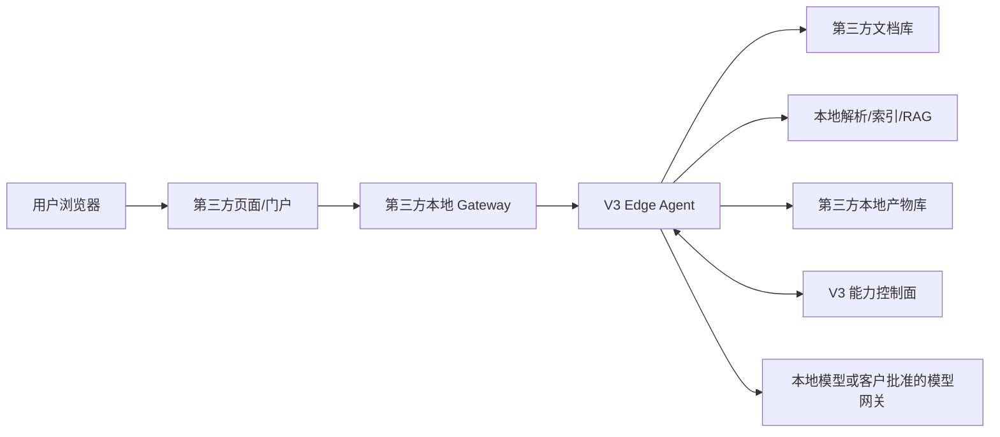

# V3 Edge / Local Data Plane 模式

**文档状态：** 新增模式草案 v0.1  
**最后更新：** 2026-05-18  
**适用对象：** 要求资料、索引、页面和回答尽量留在第三方服务器的客户或合作方  
**边界说明：** 本模式是新增模式，不替换现有第三方消息入口、V3 托管资料链路或标准机器人接入。

## 1. 模式目标

V3 Edge / Local Data Plane 模式把 V3 定位为能力控制面，把第三方服务器定位为数据面和承载面。

目标是：

- 第三方资料不必搬到 V3；
- 第三方页面和生成 HTML 可以继续由第三方服务器托管；
- 解析、索引、检索、权限过滤可以在第三方本地执行；
- V3 仍提供模型路由策略、能力编排、页面生成规范、权限协议和脱敏审计；
- 浏览器不直接持有或调用 V3 的服务凭证。

## 2. 总体架构



## 3. 运行档位

### local_strict

资料、解析、索引、检索、模型回答、页面生成和页面发布都在第三方服务器内完成。V3 只下发能力协议、策略和页面生成约束，并接收脱敏状态。

适合：

- 资料不能出客户网络；
- 页面不能由 V3 托管；
- 客户已有本地模型或私有模型网关；
- 审计要求 V3 不保存原文和生成页面正文。

### local_retrieval_v3_generation

资料、解析、索引和检索留在第三方本地。Edge Agent 只把当前用户有权访问的证据片段发给 V3，由 V3 按模型路由生成回答或页面草案。

适合：

- 原始文档不能进入 V3；
- 经过权限过滤的少量证据片段可以进入 V3 模型上下文；
- 客户希望复用 V3 托管模型和生成质量。

## 4. 页面生成链路

推荐链路：

1. 用户在第三方页面发起“生成页面”；
2. 第三方 Gateway 创建本地任务；
3. Edge Agent 根据 `sender_external_id` 做本地身份和 ACL 解析；
4. Edge Agent 在本地资料库检索当前用户可见证据；
5. Edge Agent 生成 `page_blueprint` 或 `html_package`；
6. HTML、图片、CSS 和附件发布到第三方对象存储、CMS 或静态服务器；
7. Edge Agent 把 `artifact_external_id`、hash、状态、来源摘要回传 V3；
8. V3 观测面板只展示脱敏状态，不展示第三方原文、页面正文或下载凭证。

## 5. V3 与第三方职责

| 模块 | V3 控制面 | 第三方本地数据面 |
| --- | --- | --- |
| 模型路由 | 定义 lane、模型档位、降级策略 | 执行本地模型或已批准模型网关 |
| 权限 | 定义 ACL 协议和校验要求 | 根据本地用户、部门、角色和文档 ACL 执行过滤 |
| 资料 | 记录外部资料源句柄和脱敏摘要 | 保存原文、解析文本、索引、权限快照 |
| 问答 | 定义回答边界、证据格式和审计状态 | 检索本地证据并生成或转交生成 |
| 页面 | 定义页面蓝图、manifest、安全约束 | 生成、预览、发布和撤销页面 |
| 审计 | 保存脱敏状态、hash、计数和时间线 | 保存本地原始操作日志和可追溯材料 |

## 6. 最小参数卡

本模式的参数卡不是 V3 入站聊天 token 卡，而是 Edge Agent 安装和能力声明卡。样例见：

```text
docs/integrations/v3-edge-local-data-plane.sample.json
```

参数卡必须说明：

- `execution_profile`：`local_strict` 或 `local_retrieval_v3_generation`；
- Edge Agent 的第三方本地地址；
- 浏览器是否只访问第三方 Gateway；
- V3 是否保存第三方原文、解析正文、页面 HTML；
- 本地资料源、索引、ACL、页面发布和模型网关的职责；
- 凭证如何线下交付，不能写入参数卡明文。

## 7. 安全底线

- 浏览器不得直接调用 V3 控制面；
- 浏览器不得持有 V3 inbound token、dispatch token 或 signing secret；
- 参数卡不得写入明文 token、secret、password、private key、API key；
- `local_strict` 下 V3 不保存第三方原文、解析正文、向量索引、页面正文；
- 若使用 `local_retrieval_v3_generation`，必须明确允许证据片段进入 V3；
- 页面发布地址应由第三方服务器提供权限控制和撤销能力。

## 8. 第一版验收

第一版只要求模式被清楚表达和可校验，不要求立即交付完整 Edge Agent。

验收命令：

```bash
node tools/validate-v3-edge-local-data-plane.mjs --manifest docs/integrations/v3-edge-local-data-plane.sample.json
node --test tools/validate-v3-edge-local-data-plane.test.mjs
```

通过后，下一步再开发本地 Edge Agent mock：用第三方本地 3 份测试文档、本地 ACL 和本地 HTML 输出目录跑一条端到端 smoke。
