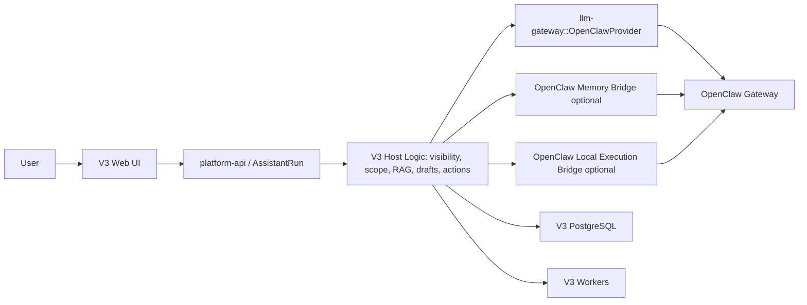

# OpenClaw Extension Adapter Implementation Plan

> **For Claude:** REQUIRED SUB-SKILL: Use superpowers:executing-plans to implement this plan task-by-task.

**2026-04-29 consolidation note:** Use `docs/plans/2026-04-29-v3-consolidated-development-handoff-plan.md` as the active next-thread execution entry. This document remains the detailed source plan for the optional OpenClaw sidecar.

**Goal:** Add OpenClaw back to V3 as an optional extension layer for model configuration, memory augmentation, and local execution, without making V3 depend on OpenClaw for normal operation.

**Architecture:** V3 remains the host system for data permissions, dataset selection, RAG supply, AssistantRun state, static-page drafts, report artifacts, and persistence. OpenClaw is attached behind explicit provider/capability adapters: if configured, it can serve model calls, contribute optional memory context, and run explicitly allowed local execution tasks; if unavailable, V3 keeps running through existing placeholder/OpenAI-compatible/deterministic paths. OpenClaw never becomes a second source of truth and never bypasses V3 visibility or secret-binding rules.

**Tech Stack:** Rust `llm-gateway`, `platform-api`, `static-page-runtime`, `chat-session-worker`, `storage`; existing V3 PostgreSQL 17.9 target; original project reference adapter at `C:/Users/soulzyn/Desktop/codex/ai-data-platform/apps/api/src/lib/openclaw-adapter.ts`; OpenClaw Gateway `/v1/responses` and `/v1/chat/completions`; environment-based runtime configuration; fake HTTP gateway tests.

---

## Boundary Decision

OpenClaw is an optional external capability pack, not a replacement runtime.

V3 owns:

- Tenant and dataset visibility.
- Public/private dataset filtering by local key binding.
- AssistantRun lifecycle and execution trail.
- Conversation memory stored by V3.
- Document chunks, evidence state, report/static-page drafts, image jobs, and final artifacts.
- Platform write actions such as creating datasets, uploading files, retrieving evidence, saving drafts, and queueing render/image work.

OpenClaw may provide:

- Model gateway calls for selected V3 runtime lanes.
- Model configuration indirection such as active model, model override, agent id, and gateway-level model routing.
- Optional memory suggestions or recalled snippets that V3 can treat as evidence candidates.
- Optional local execution tools, only through a V3-controlled capability bridge.

OpenClaw must not:

- Become required for startup, upload, ordinary chat, static-page deterministic fallback, or existing workers.
- Read raw V3 secrets from browser storage or database rows.
- See datasets that V3 has not already filtered as visible for the current local key.
- Write directly to V3 database tables.
- Execute platform actions without V3 validating and recording the action.
- Replace V3's conversation memory or dataset memory with the old OpenClaw memory catalog.

## Runtime Modes

The main runtime mode remains existing V3 config:

```text
ASSISTANT_RUN_RUNTIME_MODE=placeholder|provider
STATIC_PAGE_INTENT_RUNTIME_MODE=deterministic|provider
CHAT_SESSION_RUNTIME_MODE=placeholder|provider
DATASET_OUTPUT_RUNTIME_MODE=placeholder|provider
```

OpenClaw is selected only as a provider/capability value:

```text
ASSISTANT_RUN_RUNTIME_MODE=provider
ASSISTANT_RUN_RUNTIME_PROVIDER=openclaw
STATIC_PAGE_INTENT_RUNTIME_MODE=provider
STATIC_PAGE_INTENT_RUNTIME_PROVIDER=openclaw
```

Global OpenClaw extension config:

```text
OPENCLAW_EXTENSION_ENABLED=false
OPENCLAW_GATEWAY_BASE_URL=
OPENCLAW_GATEWAY_TOKEN=
OPENCLAW_AGENT_ID=
OPENCLAW_MODEL=
OPENCLAW_MODEL_OVERRIDE=
OPENCLAW_PREFER_RESPONSES=true
OPENCLAW_TIMEOUT_MS=60000
OPENCLAW_MEMORY_ENABLED=false
OPENCLAW_LOCAL_EXECUTION_ENABLED=false
```

Per-lane overrides can be added only when needed:

```text
ASSISTANT_RUN_OPENCLAW_MODEL=
STATIC_PAGE_INTENT_OPENCLAW_MODEL=
CHAT_SESSION_OPENCLAW_MODEL=
```

## Architecture Diagram



## Phase 1: Provider Adapter

### Task 1: Add OpenClaw provider config types

**Files:**

- Modify: `crates/llm-gateway/src/lib.rs`
- Test: `crates/llm-gateway/src/lib.rs`

**Step 1: Write failing tests**

Add tests that assert:

- `build_provider_from_env("ASSISTANT_RUN", "provider", "openclaw", ...)` returns a provider named `openclaw` when `OPENCLAW_EXTENSION_ENABLED=true`.
- Missing `OPENCLAW_GATEWAY_BASE_URL` fails with a sanitized config error.
- Missing token is allowed only if an explicit `OPENCLAW_GATEWAY_TOKEN_OPTIONAL=true` is present. Default should require token.

Run:

```powershell
cargo test -p llm-gateway openclaw
```

Expected: FAIL because provider does not exist.

**Step 2: Add config structs**

Add:

```rust
pub struct OpenClawLlmProviderConfig {
    pub gateway_base_url: String,
    pub token: Option<String>,
    pub agent_id: Option<String>,
    pub model_override: Option<String>,
    pub prefer_responses: bool,
    pub timeout_ms: u64,
}
```

**Step 3: Wire provider selection**

In `build_provider_from_env`, when `runtime_provider == "openclaw"` and `runtime_mode == "provider"`, build `OpenClawLlmProvider`.

Do not require lane-specific `*_RUNTIME_BASE_URL`; OpenClaw uses global `OPENCLAW_*` config so each runtime lane can opt into the same extension.

**Step 4: Run tests**

```powershell
cargo test -p llm-gateway openclaw
```

Expected: PASS.

### Task 2: Implement `/v1/responses` request path

**Files:**

- Modify: `crates/llm-gateway/src/lib.rs`
- Test: `crates/llm-gateway/src/lib.rs`

**Step 1: Write fake gateway test**

Use a local fake HTTP server or existing test helper pattern to return:

```json
{
  "id": "resp_openclaw_1",
  "output": [
    {
      "type": "message",
      "content": [
        { "type": "output_text", "text": "OpenClaw answer" }
      ]
    }
  ],
  "usage": {
    "input_tokens": 10,
    "output_tokens": 4,
    "total_tokens": 14
  }
}
```

Assert:

- Request goes to `/v1/responses`.
- Header `Authorization: Bearer <token>` is present.
- Header `x-openclaw-agent-id` is present when configured.
- Header `x-openclaw-model` is present when model override is configured.
- `LlmResponse.output_text == "OpenClaw answer"`.
- Runtime provider is `openclaw`.
- Runtime request id is `resp_openclaw_1`.

Run:

```powershell
cargo test -p llm-gateway openclaw_responses
```

Expected: FAIL.

**Step 2: Implement request body**

For Responses API send:

```json
{
  "model": "<request.model or OPENCLAW_MODEL>",
  "user": "v3",
  "input": "<request.input>",
  "instructions": "<resolved system prompt if present>",
  "temperature": 0.2,
  "reasoning": {
    "effort": "medium",
    "summary": "auto"
  }
}
```

Keep the body minimal. Do not add platform tool definitions in Phase 1.

**Step 3: Implement response parser**

Parse output text from common Responses shapes:

- `output[].content[].text`
- `output[].content[].output_text`
- top-level `output_text` if present

If no text exists, return `InvalidResponse` with sanitized provider failure metadata.

**Step 4: Run tests**

```powershell
cargo test -p llm-gateway openclaw_responses
```

Expected: PASS.

### Task 3: Add chat-completions fallback

**Files:**

- Modify: `crates/llm-gateway/src/lib.rs`
- Test: `crates/llm-gateway/src/lib.rs`

**Step 1: Write failing fallback test**

Fake `/v1/responses` returns HTTP 404 or malformed payload. Fake `/v1/chat/completions` returns:

```json
{
  "id": "chatcmpl_openclaw_1",
  "choices": [
    {
      "message": { "role": "assistant", "content": "Fallback answer" },
      "finish_reason": "stop"
    }
  ],
  "usage": {
    "prompt_tokens": 8,
    "completion_tokens": 3,
    "total_tokens": 11
  }
}
```

Assert:

- Final output is `Fallback answer`.
- Runtime request id is `chatcmpl_openclaw_1`.
- Runtime includes provider `openclaw`.

Run:

```powershell
cargo test -p llm-gateway openclaw_chat_fallback
```

Expected: FAIL.

**Step 2: Reuse existing chat parser**

Refactor shared chat-completion parsing so `OpenAiCompatibleLlmProvider` and `OpenClawLlmProvider` can use the same extraction helpers.

**Step 3: Preserve failure metadata**

If both Responses and Chat fail, return the first meaningful provider failure plus a fallback note. Do not expose token, full headers, or raw config.

**Step 4: Run tests**

```powershell
cargo test -p llm-gateway openclaw_chat_fallback
```

Expected: PASS.

### Task 4: Add corrective retries from original adapter

**Files:**

- Modify: `crates/llm-gateway/src/lib.rs`
- Test: `crates/llm-gateway/src/lib.rs`
- Reference only: `C:/Users/soulzyn/Desktop/codex/ai-data-platform/apps/api/src/lib/openclaw-adapter.ts`

**Step 1: Write tests for bad outputs**

Cover:

- Onboarding drift: model says it has just started, has no name, asks user to name it.
- Tool-call leakage: model prints JSON/tool-call-like text instead of answering.
- Native tool failure text: model says search/tool failed.

Run:

```powershell
cargo test -p llm-gateway openclaw_retry
```

Expected: FAIL.

**Step 2: Port minimal detectors**

Port only the text-pattern detectors needed for OpenClaw quality:

- `looks_like_onboarding_drift`
- `looks_like_leaked_tool_call_content`
- `looks_like_native_search_tool_failure`

**Step 3: Add bounded retries**

Retry at most twice:

- First retry adds a strict instruction to directly answer the current user question.
- Second retry strips context to a minimal system + current prompt only.

Never loop unboundedly.

**Step 4: Run tests**

```powershell
cargo test -p llm-gateway openclaw_retry
```

Expected: PASS.

## Phase 2: V3 Runtime Lane Adoption

### Task 5: AssistantRun ordinary chat provider smoke path

**Files:**

- Modify: `crates/platform-api/src/lib.rs`
- Test: `crates/platform-api/src/lib.rs`
- Docs: `docs/plans/2026-04-27-static-page-generation-studio-plan.md`

**Step 1: Write test**

Add an AssistantRun test with:

```text
ASSISTANT_RUN_RUNTIME_MODE=provider
ASSISTANT_RUN_RUNTIME_PROVIDER=openclaw
OPENCLAW_EXTENSION_ENABLED=true
```

Use fake gateway and assert:

- AssistantRun completes.
- Runtime manifest provider is `openclaw`.
- Evidence state still comes from V3 host before provider call.
- No dataset outside visible scope appears in provider input.

Run:

```powershell
cargo test -p platform-api assistant_run_openclaw
```

Expected: FAIL until fake provider wiring exists in test.

**Step 2: Keep platform-api logic unchanged**

Most logic should already work through `build_provider_from_env`. Do not special-case OpenClaw in AssistantRun unless needed for tests or runtime manifest clarity.

**Step 3: Run tests**

```powershell
cargo test -p platform-api assistant_run_openclaw
```

Expected: PASS.

### Task 6: Static-page intent provider lane

**Files:**

- Modify: `crates/static-page-runtime/src/lib.rs`
- Modify: `crates/platform-api/src/lib.rs`
- Test: `crates/static-page-runtime/src/lib.rs`

**Step 1: Write test**

When `STATIC_PAGE_INTENT_RUNTIME_PROVIDER=openclaw`, fake gateway returns strict JSON:

```json
{
  "summary": "已根据用户要求调整模块。",
  "operations": [
    {
      "type": "update_module",
      "module_id": "kpi_revenue",
      "patch": {
        "title": "收入表现"
      }
    }
  ]
}
```

Assert:

- Strict JSON is parsed.
- Operations still pass V3 sanitizer.
- Invalid OpenClaw JSON falls back to deterministic intent, matching current behavior.

Run:

```powershell
cargo test -p static-page-runtime openclaw
```

Expected: FAIL before adapter support, PASS after Phase 1.

**Step 2: Do not add OpenClaw-specific schema**

Static-page operation schema remains V3-owned. OpenClaw only produces the same JSON operations that any provider must produce.

**Step 3: Run tests**

```powershell
cargo test -p static-page-runtime openclaw
```

Expected: PASS.

### Task 7: Chat-session and dataset-output optional lanes

**Files:**

- Modify only if necessary: `crates/chat-session-worker/src/main.rs`
- Modify only if necessary: `crates/dataset-output-worker/src/main.rs`
- Test: existing worker tests

**Step 1: Verify no code change is needed**

Both workers already call `build_provider_from_env`. Once `llm-gateway` supports `openclaw`, config should be enough:

```text
CHAT_SESSION_RUNTIME_MODE=provider
CHAT_SESSION_RUNTIME_PROVIDER=openclaw
DATASET_OUTPUT_RUNTIME_MODE=provider
DATASET_OUTPUT_RUNTIME_PROVIDER=openclaw
```

**Step 2: Add smoke tests only if current coverage misses provider name**

If existing tests do not assert provider runtime metadata, add one minimal scripted/fake OpenClaw test.

Run:

```powershell
cargo test -p chat-session-worker -p dataset-output-worker
```

Expected: PASS.

## Phase 3: Optional Memory Bridge

### Task 8: Define OpenClaw memory as evidence candidate, not source of truth

**Files:**

- Create: `docs/adr/0004-openclaw-as-optional-extension.md`
- Modify: `docs/plans/2026-04-27-static-page-generation-studio-plan.md`

**Step 1: Write ADR**

Decision:

- OpenClaw memory is optional evidence augmentation.
- V3 conversation memory and document evidence remain authoritative.
- OpenClaw memory may be included only after V3 intent/scope planning decides it is relevant.

Consequences:

- OpenClaw memory snippets must be labeled as `source: "openclaw_memory"`.
- They must be shown in runtime/evidence metadata when supplied.
- They must not be silently merged into document chunks.

**Step 2: Link from static-page plan**

Add a short section to the existing static-page plan saying OpenClaw memory can augment AssistantRun context but cannot replace V3 conversation memory.

### Task 9: Add memory bridge interface

**Files:**

- Create: `crates/openclaw-extension/src/lib.rs`
- Modify: root `Cargo.toml`
- Test: `crates/openclaw-extension/src/lib.rs`

**Step 1: Write trait and fake implementation test**

Define:

```rust
pub trait OpenClawMemoryBridge {
    fn recall(&self, request: OpenClawMemoryRecallRequest) -> anyhow::Result<Vec<OpenClawMemoryItem>>;
}
```

The request should include:

- current prompt
- selected visible dataset summaries
- local thread id
- allowed secret binding fingerprints, not raw keys

The item should include:

- id
- title
- text
- score
- source
- created_at if available

**Step 2: Implement disabled bridge**

Default implementation returns an empty list unless `OPENCLAW_MEMORY_ENABLED=true`.

**Step 3: Run tests**

```powershell
cargo test -p openclaw-extension
```

Expected: PASS.

### Task 10: Inject memory bridge into AssistantRun supply

**Files:**

- Modify: `crates/platform-api/src/lib.rs`
- Test: `crates/platform-api/src/lib.rs`

**Step 1: Write test**

When memory bridge returns one item:

- item appears in `evidence_state.supplied_items`
- provider input includes it only if scope planner/context policy says history/memory is relevant
- item is labeled `openclaw_memory`

Run:

```powershell
cargo test -p platform-api openclaw_memory
```

Expected: FAIL.

**Step 2: Add gated injection**

After V3 scope/evidence planning and before provider input build, optionally append OpenClaw memory items.

Rules:

- Respect `OPENCLAW_MEMORY_ENABLED`.
- Respect visible dataset/user-key scope.
- Cap item count with `OPENCLAW_MEMORY_LIMIT`, default 3, max 8.
- Never add OpenClaw memory to the database as document chunks.

**Step 3: Run tests**

```powershell
cargo test -p platform-api openclaw_memory
```

Expected: PASS.

## Phase 4: Optional Local Execution Bridge

### Task 11: Define local execution contract

**Files:**

- Create: `crates/openclaw-extension/src/execution.rs`
- Test: `crates/openclaw-extension/src/execution.rs`

**Step 1: Write contract tests**

Local execution request:

```rust
pub struct OpenClawExecutionRequest {
    pub action: String,
    pub input: serde_json::Value,
    pub allowed_capabilities: Vec<String>,
    pub working_set: serde_json::Value,
}
```

Local execution response:

```rust
pub struct OpenClawExecutionResult {
    pub status: OpenClawExecutionStatus,
    pub summary: String,
    pub output: serde_json::Value,
}
```

Test:

- Disabled bridge rejects all execution.
- Enabled bridge rejects unknown capability.
- Enabled bridge rejects write actions unless V3 provides explicit allowlist.

Run:

```powershell
cargo test -p openclaw-extension execution
```

Expected: FAIL until implementation.

**Step 2: Implement disabled-by-default bridge**

Default:

```text
OPENCLAW_LOCAL_EXECUTION_ENABLED=false
```

No execution should happen unless enabled.

**Step 3: Run tests**

```powershell
cargo test -p openclaw-extension execution
```

Expected: PASS.

### Task 12: Add AssistantRun execution trail integration

**Files:**

- Modify: `crates/platform-api/src/lib.rs`
- Test: `crates/platform-api/src/lib.rs`

**Step 1: Write test**

When OpenClaw execution is requested by model/capability bridge:

- V3 records an execution trail item before calling the bridge.
- V3 records result summary after bridge returns.
- Failed bridge call does not fail the whole AssistantRun unless the V3 action requires it.
- User-visible assistant text remains model-authored, not host-composed.

Run:

```powershell
cargo test -p platform-api openclaw_execution_trail
```

Expected: FAIL.

**Step 2: Add bridge hook only for explicit allowed actions**

Allowed initial actions:

- `web_search`
- `local_summarize`
- `file_inspect_readonly`

Do not include shell, file write, git, database write, deployment, or secret access in the first version.

**Step 3: Run tests**

```powershell
cargo test -p platform-api openclaw_execution_trail
```

Expected: PASS.

## Phase 5: Operations and UI

### Task 13: Add redacted OpenClaw status endpoint

**Files:**

- Modify: `crates/platform-api/src/lib.rs`
- Test: `crates/platform-api/src/lib.rs`

**Step 1: Write test**

Endpoint:

```text
GET /v1/runtime/openclaw/status
```

Response:

```json
{
  "enabled": true,
  "gateway_configured": true,
  "agent_configured": true,
  "model": "configured-model-name",
  "memory_enabled": false,
  "local_execution_enabled": false,
  "last_health": "unknown"
}
```

Assert no token or raw secret appears.

**Step 2: Implement endpoint**

Return config/status only. Do not perform expensive health probe by default.

**Step 3: Run test**

```powershell
cargo test -p platform-api openclaw_status
```

Expected: PASS.

### Task 14: Add subtle UI runtime indicator

**Files:**

- Modify: `apps/web/app/HomePageClient.js`
- Modify: `apps/web/app/styles.css`
- Test: `apps/web` build

**Step 1: Add UI condition**

Show a small runtime label only when backend says OpenClaw is active:

```text
模型扩展：OpenClaw
```

Do not expose technical config to normal users.

**Step 2: Build**

```powershell
npm run build
```

Expected: PASS.

### Task 15: Add deployment documentation

**Files:**

- Create: `docs/runtime/openclaw-extension.md`
- Modify: `README.md`

**Step 1: Document safe setup**

Include:

- Environment variables.
- Default disabled behavior.
- Which runtime lanes can use OpenClaw.
- How to verify status endpoint.
- How to roll back by setting providers away from `openclaw`.

**Step 2: Document non-goals**

State clearly:

- OpenClaw is not required.
- OpenClaw does not replace V3 storage.
- OpenClaw does not get unfiltered dataset access.
- OpenClaw local execution starts readonly/limited.

## Test Matrix

Run after Phase 1:

```powershell
cargo test -p llm-gateway openclaw
```

Run after Phase 2:

```powershell
cargo test -p platform-api assistant_run_openclaw
cargo test -p static-page-runtime openclaw
cargo test -p chat-session-worker -p dataset-output-worker
```

Run after Phase 3 and Phase 4:

```powershell
cargo test -p openclaw-extension
cargo test -p platform-api openclaw_memory
cargo test -p platform-api openclaw_execution_trail
```

Run final backend verification:

```powershell
cargo fmt --check
cargo test --workspace
```

Run final frontend verification:

```powershell
cd apps/web
npm run build
```

## Rollback Plan

Rollback must be config-only for normal incidents:

```text
OPENCLAW_EXTENSION_ENABLED=false
ASSISTANT_RUN_RUNTIME_PROVIDER=placeholder
STATIC_PAGE_INTENT_RUNTIME_MODE=deterministic
CHAT_SESSION_RUNTIME_PROVIDER=placeholder
DATASET_OUTPUT_RUNTIME_PROVIDER=placeholder
```

Expected behavior after rollback:

- Ordinary chat still works through existing V3 placeholder/provider fallback.
- Static-page intent falls back to deterministic operation generation.
- Upload, parsing, evidence retrieval, drafts, image queue, and renderer remain unaffected.
- Existing OpenClaw memory/execution metadata stays as historical runtime evidence only.

## Risk Register

| Risk | Severity | Mitigation |
| --- | --- | --- |
| OpenClaw gateway unavailable | Medium | Provider failure metadata plus V3 fallback lanes; no hard dependency. |
| Model/tool leakage from OpenClaw | Medium | Port original corrective retry detectors and keep V3 action validation. |
| Dataset permission bypass | High | V3 filters visible datasets before provider input; never let OpenClaw query DB directly. |
| Memory duplication/conflict | Medium | Treat OpenClaw memory as labeled evidence candidate, not source of truth. |
| Local execution overreach | High | Disabled by default; readonly allowlist first; every action recorded in AssistantRun trail. |
| Secret leakage in status/errors | High | Redacted endpoint and sanitized provider error messages only. |
| Product confusion | Low | UI shows one small extension label; no extra form-heavy settings in main flow. |

## Suggested Commit Sequence

1. `docs: plan optional openclaw extension adapter`
2. `feat(llm-gateway): add openclaw provider config`
3. `feat(llm-gateway): support openclaw responses and chat fallback`
4. `fix(llm-gateway): add openclaw corrective retries`
5. `feat(platform-api): expose openclaw runtime status`
6. `feat(platform-api): add optional openclaw memory bridge`
7. `feat(platform-api): add readonly openclaw execution bridge`
8. `docs: document openclaw extension deployment`

## Acceptance Criteria

- With no OpenClaw env configured, all existing V3 tests and UI behavior are unchanged.
- With OpenClaw configured for AssistantRun, ordinary chat returns model output through OpenClaw and records runtime provider `openclaw`.
- With OpenClaw configured for static-page intent, model-generated operations are sanitized by V3 and invalid output falls back to deterministic handling.
- OpenClaw memory appears only as labeled evidence and only when enabled.
- OpenClaw local execution is disabled by default and readonly/allowlisted when enabled.
- No raw token, local key, dataset secret binding, or hidden dataset content appears in UI status, runtime error messages, or logs.
