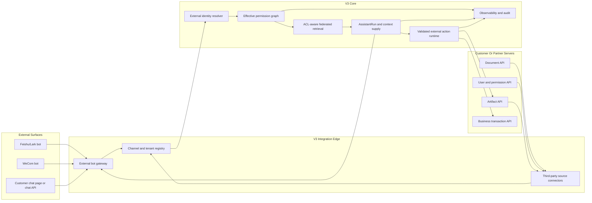

# V3 External Bot And Third-Party Knowledge Implementation Plan

> **For Claude:** REQUIRED SUB-SKILL: Use superpowers:executing-plans to implement this plan task-by-task.

**Goal:** Add V3-owned external bot, third-party knowledge, third-party artifact, and external chat-channel capabilities while keeping V3 as the permission, audit, AssistantRun, and workflow control plane.

**Architecture:** V3 exposes two integration families: first-class Feishu/Lark and WeCom adapters for standard bot/event/message interfaces, and pure third-party APIs for document, user, artifact, and chat-channel systems where customers may build their own pages. Channel gateways, source connectors, and customer chat surfaces may run on different servers; V3 receives normalized events, resolves identity and permissions, builds AssistantRun context, executes model-authored answers or V3-validated transactions, and returns channel-safe replies or artifacts.

**Tech Stack:** Rust crates `contracts`, `platform-api`, `assistant-runtime`, `auth-scope`, `storage`, `ingest-worker`, `retrieval-worker`, `workflow-definitions`, `workflow-engine`, `tool-registry`, and `observability`; Next.js app `apps/web` for V3's observe-first management UI; PostgreSQL migrations in `crates/storage/migrations`; official Feishu/Lark and WeCom HTTP/event APIs after implementation-time documentation verification; generic HTTPS callback and polling APIs for pure third-party integrations.

**Third-party API Guide:** `docs/integrations/third-party-integration-api.md`

**Third-party Sendable Guide (CN):** `docs/integrations/third-party-integration-api.zh-CN.md`

**Current Progress:**
- Phase 5 generic source sync workflow is connected through `platform-api`, `workflow-definitions`, `ingest-worker`, `retrieval-worker`, and `external-source-worker`.
- Generic source MVP currently supports mock HTTPS connector fixtures for external users, groups, document metadata, document bodies, and ACL snapshots.
- Phase 6 thin adapters now cover Feishu/Lark and WeCom callback signature validation, timestamp/replay checks, event normalization, and channel-safe reply payload rendering.
- Phase 6 platform-specific callback entrypoints now read stored connection config and hand normalized Feishu/Lark and WeCom messages to the unified external channel ingestion endpoint.
- Phase 6 now supports Feishu/Lark encrypted `encrypt` callback bodies using the official AES-256-CBC event decryption shape.
- Phase 7 first checkpoint now defines external action risk/confirmation policy contracts, registers external artifact/action tools, exposes external channel Codex action contracts, and routes Codex plan-only suggestions across read-only, low-risk write, high-risk confirmation, and cross-system confirmation cases.
- Phase 7 second checkpoint now persists `external_action_runs` from normalized external channel messages when Codex plan-only selects an external action, returns confirmation-required replies for high-risk/cross-system actions, and accepts normalized confirmation callbacks.
- Phase 7 third checkpoint now dispatches confirmed or confirmation-free external action runs to configured third-party artifact/action HTTPS endpoints, stores external request ids and redacted result summaries, and records auditable blocked states when dispatch endpoints are missing or invalid.
- Phase 7 fourth checkpoint now hardens outbound external action dispatch with dispatch-specific bearer/signature credentials, HMAC request headers, and auditable `dispatch_auth_missing` / `dispatch_auth_invalid` blocked states. V3 does not reuse platform callback tokens for action dispatch.
- Phase 7 fifth checkpoint now exposes observe-first read APIs for external integrations and redacted audit timelines, including channel/source health, last activity, pending/blocked/failed/dispatched action counters, and sanitized action/message/sync summaries for the management UI.
- Phase 7 sixth checkpoint now wires a standalone external integrations observability page, host-routes `v3.elepcloud.com` to that panel without main-workspace navigation links, and exposes same-domain `/v1/...` proxy paths so third-party API examples default to `https://v3.elepcloud.com`.
- Phase 8 first checkpoint now adds limited management controls to the observe-first panel and API: source retry sync, channel action retry attempts, disable, and secret-rotation request markers, all using redacted responses.
- Phase 8 second checkpoint now moves channel action retry from synchronous management requests into `external_action_dispatch_workflow`, enqueues retry tasks on the `external_action` worker queue, and adds `external-action-worker` to dispatch validated actions with workflow success/failure transitions.
- Phase 8 third checkpoint now adds observe-only permission drift and source recovery signals to `GET /v1/external/integrations` and the standalone panel, including external identity mapping gaps, disabled external principals, ACL snapshot freshness, failed sync counts, and recovery status.
- Phase 8 fourth checkpoint now adds observe-only external artifact publish/status/revoke summaries to `GET /v1/external/integrations`, marks artifact action audit entries with action type and safe artifact refs, shows artifact state on the standalone panel, and documents the third-party artifact dispatch handoff shape.
- Phase 9 first checkpoint now adds `scripts/run-external-bot-third-party-smoke.ps1` and `docs/validation/external-bot-third-party-smoke.md`, collecting deterministic policy checks, database-backed ACL/source/adapter/action tests, and the external panel contract into one repeatable smoke entrypoint.
- Phase 9 deployment checkpoint passed on `8服务器` at commit `fac2178` with PostgreSQL-backed ACL/source/adapter/action checks enabled and the public panel responding at `https://v3.elepcloud.com/external-integrations`; see `docs/validation/external-bot-third-party-deployment-smoke-2026-05-14.md`.
- Phase 9 second checkpoint adds database-backed mock/sandbox validation for customer-hosted generic chat page events and signed outbound dispatch to a local third-party mock endpoint, including idempotency, dispatch-specific Bearer/HMAC headers, callback-token non-reuse, and redacted response summaries.
- Phase 9 second checkpoint passed on `8服务器` at commit `aaafd6f`; see `docs/validation/external-third-party-mock-sandbox-smoke-2026-05-14.md`.
- Phase 9 third checkpoint adds a standalone Node-based third-party mock gateway and Linux/deployment-target smoke runner so signed outbound dispatch can be validated outside the in-process Rust test harness.
- Phase 9 third checkpoint passed on `8服务器` at commit `0cfb9c9`; see `docs/validation/external-third-party-gateway-smoke-2026-05-14.md`.
- Phase 9 fourth checkpoint adds the third-party action result callback contract, `POST /v1/external/channels/{connection_id}/actions/{action_id}/result`, with channel ownership checks, external request id mismatch protection, idempotency-key tracking, and non-verbatim result summaries.
- Phase 9 fourth checkpoint passed on `8服务器` at commit `120933a`; the standalone gateway now validates signed dispatch and posts action result callbacks back into a V3 HTTP route. See `docs/validation/external-action-result-callback-smoke-2026-05-14.md`.
- Current implementation checkpoint adds observe-first action lifecycle visibility at commit `c3f702c`: `GET /v1/external/integrations` now includes `action_summary`, action audit summaries include safe callback state, and the standalone panel shows waiting-result/result-callback counts. Deployment-target gateway smoke and web contract tests passed; see `docs/validation/external-action-result-callback-smoke-2026-05-14.md`.
- Current implementation follow-up adds explicit audit filtering at commit `15d700a` for action lifecycle views: `item_type=action` plus `action_state=result_callback|waiting_result|failed|blocked|pending_confirmation`, mirrored by fixed filters in the standalone panel. Deployment-target gateway smoke and web contract tests passed; see `docs/validation/external-action-result-callback-smoke-2026-05-14.md`.
- Current implementation follow-up adds per-action audit drilldown at commit `a203a54`: audit queries now accept `action_id`, and the standalone panel can open a selected action's redacted lifecycle/detail view. Deployment-target gateway smoke and web contract tests passed; see `docs/validation/external-action-result-callback-smoke-2026-05-14.md`.
- Current implementation follow-up adds an external third-party readiness report at commit `36b5c28`: the deployment-target gateway smoke now emits JSON/Markdown checks for signed dispatch, callback acceptance, redaction, and remaining customer handoff items. Deployment-target readiness tests and gateway smoke passed; see `docs/validation/external-third-party-gateway-smoke-2026-05-14.md`.
- Current implementation follow-up adds action-detail permalink and trace export at commit `c751485`: the standalone panel can preserve selected integration/filter/action in the URL, copy a direct operator link, and export a redacted action trace JSON. Deployment-target web contract tests, Next build, gateway smoke, and readiness report passed; see `docs/validation/external-action-result-callback-smoke-2026-05-14.md`.
- Current implementation follow-up adds the external handoff manifest validator at commit `67327ab`: `docs/integrations/third-party-handoff.sample.json` and `npm run validate:external-handoff` now validate customer sandbox readiness before live joint testing, including URL safety, dispatch auth delivery, callback allowlist confirmation, document/ACL fixtures, operations contacts, and raw-secret exclusion. Deployment-target handoff tests, manifest validation, readiness report, and gateway smoke passed; see `docs/validation/external-third-party-gateway-smoke-2026-05-14.md`.
- Current implementation follow-up at commit `51c6329` folds handoff manifest validation into the deployment-target readiness report and gateway smoke: `run-external-third-party-gateway-smoke.sh` now validates the manifest by default, and generated reports include `handoff_manifest_ready` plus a redacted `handoff_manifest_summary`. Deployment-target readiness tests, manifest validation, report generation, and gateway smoke passed; see `docs/validation/external-third-party-gateway-smoke-2026-05-14.md`.
- Current implementation follow-up at commit `86f6aca` packages the self-contained customer sandbox/readiness handoff for third-party delivery: `npm run build:external-handoff-package` writes public guides, the handoff manifest sample, validator, mock gateway reference, README files, package scripts, and a SHA256 package manifest under `target/external-third-party-handoff`. Deployment-target package tests, package generation, and package-internal `validate:handoff` passed; see `docs/validation/external-third-party-gateway-smoke-2026-05-14.md`.
- Current implementation follow-up at commit `b9b89e0` adds package integrity validation: generated handoff packages now include `tools/validate-external-handoff-package.mjs` and `npm run validate:package`, checking package type, relative package root, path traversal, file size/SHA256 integrity, and handoff manifest readiness. Deployment-target package tests, integrity tests, package generation, package-internal `validate:handoff`, and package-internal `validate:package` passed; see `docs/validation/external-third-party-gateway-smoke-2026-05-14.md`.
- Current implementation follow-up at commit `8ac660c` adds sendable archive output for handoff packages: the package builder now writes the package directory, a sibling `.tar.gz` archive, and a matching `.sha256` sidecar without third-party dependencies. Deployment-target package tests, archive generation, archive sidecar existence checks, package-internal `validate:handoff`, and package-internal `validate:package` passed; see `docs/validation/external-third-party-gateway-smoke-2026-05-14.md`.
- Current implementation follow-up at commit `37d02c1` adds archive-level validation for sendable handoff packages: `tools/validate-external-handoff-archive.mjs` verifies the `.sha256` sidecar, gzip/tar structure, single package root, path traversal safety, required entries, package manifest file hashes, and handoff manifest readiness without extracting to disk. Deployment-target archive tests, archive generation, archive validation, package-internal `validate:handoff`, and package-internal `validate:package` passed; see `docs/validation/external-third-party-gateway-smoke-2026-05-14.md`.
- Current implementation follow-up at commit `e48b563` puts the archive validator into the generated third-party handoff package and exposes `npm run validate:archive`, allowing package recipients to validate the sibling `.tar.gz` archive and `.sha256` sidecar from inside the package directory. Deployment-target package tests, archive tests, package generation, and package-internal `validate:handoff`, `validate:package`, and `validate:archive` passed; see `docs/validation/external-third-party-gateway-smoke-2026-05-14.md`.
- Current implementation follow-up at commit `ab38d8e` adds combined release validation for third-party handoff delivery: `tools/validate-external-handoff-release.mjs` verifies the package directory, sibling archive, `.sha256` sidecar, archive root/package-name match, package manifest integrity, and handoff readiness in one ready/not-ready report. Deployment-target release tests, package generation, package-internal `validate:release`, and root `validate:external-handoff-release` passed; see `docs/validation/external-third-party-gateway-smoke-2026-05-14.md`.
- Current implementation follow-up at commit `bb7ea22` makes `npm run build:external-handoff-package` automatically write a sibling `<package>.release.json` validation receipt plus `releaseReportPath`, `releaseReportSha256`, and `releaseReady` in the build output. Deployment-target package/release tests, package generation, release report existence check, and root release validation passed; see `docs/validation/external-third-party-gateway-smoke-2026-05-14.md`.
- Current implementation follow-up at commit `a29428a` adds a human-readable `<package>.release.md` handoff release summary and optional release-validator `--markdown` output, summarizing READY/NOT READY status, archive SHA256, checks, and errors for operator/customer review. Deployment-target package/release tests, package generation, Markdown existence/content checks, and root release validation passed; see `docs/validation/external-third-party-gateway-smoke-2026-05-14.md`.
- Current implementation follow-up at commit `63c4e05` adds release provenance fields to package and release validation reports: `package_type`, `generated_at`, and `repository_head` are now surfaced at the release top level, in `package_summary`, and in the human-readable Markdown receipt. Deployment-target package/release/integrity tests, package generation, JSON provenance checks, Markdown provenance checks, and root release validation passed; see `docs/validation/external-third-party-gateway-smoke-2026-05-14.md`.
- Current implementation follow-up at commit `d50d282` adds a sibling `<package>.delivery-manifest.json` delivery artifact manifest so third-party recipients can verify the expected package directory, package manifest, archive, `.sha256` sidecar, release JSON, and release Markdown with SHA256 values. Deployment-target package/release/integrity/archive tests, package generation, root release validation, and delivery manifest role checks passed; see `docs/validation/external-third-party-gateway-smoke-2026-05-14.md`.
- Current implementation follow-up at commit `7e03b4e` adds delivery-manifest validation into the combined release checker: `validate:release` now verifies the sibling `.delivery-manifest.json`, required artifact roles, expected relative paths, byte sizes, and SHA256 values for the package manifest, archive, sidecar, release JSON, and release Markdown. The package builder still generates release reports before delivery manifests to avoid circular hashes, while post-build release validation catches missing or tampered delivery manifests.
- Current implementation follow-up at commit `3ea49bf` wires handoff release-package validation into the deployment-target readiness smoke: `run-external-third-party-gateway-smoke.sh` now builds a temporary handoff release package, validates it with delivery-manifest checks, and includes a redacted `handoff_release_summary` plus `handoff_release_ready` gate in the JSON/Markdown readiness report. Deployment-target readiness tests, release tests, package build, and synthetic readiness report validation passed on `8服务器`.
- Current implementation follow-up adds a receive-side delivery manifest validator: `tools/validate-external-handoff-delivery.mjs`, root script `validate:external-handoff-delivery`, and package-internal `validate:delivery` now verify `<package>.delivery-manifest.json` against the package directory, package manifest, archive, `.sha256` sidecar, release JSON, and release Markdown before or after transfer.
- Current implementation follow-up adds one-command handoff validation: `tools/validate-external-handoff-all.mjs`, root script `validate:external-handoff-all`, and package-internal `validate:all` now produce a single JSON gate for the handoff manifest, package integrity, archive, delivery manifest, and release readiness.
- Current implementation follow-up wires aggregate handoff validation into the third-party readiness report: any readiness run with `--releasePackage` now includes `handoff_all_ready` and a redacted `handoff_all_summary`, so the deployment-target gateway smoke records the one-command handoff gate alongside signed dispatch/result callback evidence.
- Current implementation follow-up adds persistent aggregate validation evidence: `validate:all` accepts `--out <file>.json --markdown <file>.md` from both the main repository and generated handoff packages, giving V3 operators and third-party recipients a machine-readable gate plus a human-readable review receipt.
- Next implementation checkpoint: run the callback contract through a real HTTPS customer sandbox once a third-party endpoint is available, while continuing smaller hardening work that does not require customer cooperation.

---

## Product Positioning

This is not a separate chatbot product. It is V3's existing AssistantRun, dataset visibility, retrieval, memory, artifact, workflow, and action-validation system exposed through external channels.

External channels become surfaces. V3 remains the authority.

The product must support three integration modes:

1. **Standard Feishu/Lark and WeCom mode:** V3 ships channel adapters for official bot, event, message, card, file, and callback interfaces.
2. **Pure third-party mode:** Customers or partners connect document APIs, user/directory APIs, artifact APIs, and chat-channel APIs. They may host their own chat page or customer portal on a separate server.
3. **Hybrid mode:** Feishu/WeCom provides the chat surface while knowledge, permissions, artifacts, or transactions come from a different third-party server.

The V3 management UI should not require frequent human operation. It is primarily an observability and governance console: connection health, sync status, permission drift, message/run traces, retrieval evidence quality, transaction audit, and failure recovery.

## Non-Negotiable Rules

- V3 owns tenant, account, external identity mapping, effective permissions, AssistantRun state, memory scope, workflow state, action approval, and audit.
- External systems may provide source permissions, but V3 must snapshot and enforce them before retrieval, answer generation, artifact access, or transaction execution.
- Third-party chat pages may exist outside V3, but they do not bypass V3 permission checks or action validation.
- No answer may cite or summarize a document that the external user cannot access through the effective permission graph.
- No cross-tenant, cross-chat, or cross-document leakage through cache, embedding index, artifact links, or conversation memory.
- High-risk external transactions require explicit confirmation through the originating channel or an approved customer page.
- The management UI is observe-first. Manual overrides are limited to disable, retry, revoke, resync, rotate secret, and inspect redacted traces.
- Feishu/Lark and WeCom adapters must be implemented from verified official documentation at implementation time.

## High-Level Architecture



## Capability Scope

### 1. Standard Feishu/Lark and WeCom interfaces

V3 should provide built-in adapters for:

- inbound bot messages, mentions, direct messages, group messages, and event callbacks;
- outbound text, card, file, artifact-link, and task-status replies;
- signature verification, timestamp/replay protection, idempotency, tenant routing, and token rotation;
- user identity mapping from platform ids to V3 external principals;
- channel-level policy such as allowed chats, allowed departments, bot visibility, and reply mode;
- attachment handoff into V3 ingest when the sender has permission.

Implementation must verify official API details before coding because message signatures, callback schemas, and card payloads change over time.

### 2. Pure third-party interfaces

V3 must expose generic integration contracts for customers that do not want to use Feishu or WeCom as the main surface:

- **Document API:** list documents, fetch metadata, fetch content or file streams, fetch revisions, fetch folder/project hierarchy, fetch document ACL.
- **User API:** list users, departments, groups, roles, external ids, disabled status, and membership changes.
- **Artifact API:** publish generated V3 artifacts back to the customer system, query artifact status, revoke artifact links, and attach provenance.
- **Chat channel API:** accept normalized inbound messages from a third-party page, return replies, stream status events, and receive confirmation callbacks.
- **Action API:** execute approved third-party transactions such as creating tickets, updating records, starting approval flows, sending notices, or writing generated artifacts.

Third parties may host their own page. Their page calls V3 as a channel client, while V3 still owns identity resolution, permission checks, answer generation, action validation, artifact ownership, and audit.

### 3. Third-party document parsing and permission-aware Q&A

Source connectors feed V3's existing ingest/retrieval path:

1. Register external source connection.
2. Sync users, departments, groups, roles, and source ACLs.
3. Sync document metadata and revisions.
4. Fetch or stream document bodies/attachments.
5. Parse using V3 ingest workers.
6. Index chunks with source document ids, revision ids, tenant ids, and ACL snapshots.
7. At question time, compute effective user scope before retrieval.
8. Return only evidence visible to that user.
9. Persist cited evidence refs in AssistantRun audit.

Permission filtering must happen before evidence enters the model context. The model must never be asked to ignore hidden documents; hidden documents should simply not be supplied.

### 4. External transactions

V3 should treat external business operations as action contracts:

- **Read-only:** search, summarize, inspect status, fetch record details.
- **Low-risk write:** create draft, add comment, send internal note, create non-final task.
- **High-risk write:** update customer data, send external notification, approve/reject, publish public artifact.
- **Cross-system:** combine knowledge retrieval, artifact generation, and third-party writeback.

High-risk and cross-system actions require a confirmation step in the original channel or trusted customer page. Every action stores normalized intent, requester, source evidence, resolved permission scope, confirmation record, external request id, external response summary, and redacted failure details.

## Core Contracts

These contracts should live first in `crates/contracts/src/lib.rs` and be persisted only after the product shape is stable.

```rust
pub struct ExternalBotMessageView {
    pub platform: ExternalChannelPlatform,
    pub tenant_external_id: String,
    pub bot_external_id: String,
    pub conversation_external_id: String,
    pub sender_external_id: String,
    pub message_external_id: String,
    pub message_type: ExternalMessageType,
    pub text: Option<String>,
    pub attachment_refs: Vec<ExternalAttachmentRefView>,
    pub idempotency_key: String,
    pub received_at: String,
}
```

```rust
pub struct ExternalPrincipalView {
    pub tenant_id: String,
    pub platform: ExternalChannelPlatform,
    pub external_user_id: String,
    pub external_department_ids: Vec<String>,
    pub external_group_ids: Vec<String>,
    pub v3_user_id: Option<String>,
    pub trust_level: ExternalPrincipalTrustLevel,
}
```

```rust
pub struct ThirdPartyKnowledgeSourceView {
    pub source_id: String,
    pub tenant_id: String,
    pub connector_kind: ThirdPartyConnectorKind,
    pub base_url_redacted: String,
    pub sync_mode: ThirdPartySyncMode,
    pub permission_mode: ThirdPartyPermissionMode,
    pub health: IntegrationHealthView,
}
```

```rust
pub struct ExternalDocumentAclSnapshotView {
    pub source_id: String,
    pub document_external_id: String,
    pub revision_external_id: Option<String>,
    pub allowed_user_external_ids: Vec<String>,
    pub allowed_department_external_ids: Vec<String>,
    pub allowed_group_external_ids: Vec<String>,
    pub denied_user_external_ids: Vec<String>,
    pub captured_at: String,
}
```

```rust
pub struct ExternalActionIntentView {
    pub action_id: String,
    pub tenant_id: String,
    pub requester: ExternalPrincipalView,
    pub risk_level: ExternalActionRiskLevel,
    pub target_system: String,
    pub action_type: String,
    pub arguments_redacted: serde_json::Value,
    pub requires_confirmation: bool,
}
```

## Data Model Additions

Add migrations after contracts settle:

- `external_channel_connections`: Feishu, WeCom, generic chat API, enabled flags, redacted config, health.
- `external_source_connections`: document/user/artifact/action connectors, sync mode, redacted endpoint, health.
- `external_principals`: mapped external users, departments, groups, trust level, optional V3 user binding.
- `external_permission_snapshots`: document-level ACL snapshots by source revision.
- `external_message_events`: inbound/outbound message idempotency, routing, AssistantRun link, redacted payload summary.
- `external_action_runs`: action intent, confirmation state, external request id, result, failure class.
- `external_sync_runs`: source sync checkpoints, counts, errors, drift warnings.

Secrets must stay outside public API responses. Management endpoints expose redacted config summaries only.

## API Surface

The third-party-facing API guide is maintained in `docs/integrations/third-party-integration-api.md`, with a Chinese sendable version in `docs/integrations/third-party-integration-api.zh-CN.md`. This plan remains the implementation roadmap; the integration guide is the external-facing contract narrative and should be updated whenever endpoint shape, auth policy, idempotency, or permission behavior changes.

### Platform and adapter APIs

- `POST /v1/external/channels/{connection_id}/events`: normalized inbound events from adapters or third-party chat pages.
- `POST /v1/external/channels/{connection_id}/attachments`: attachment registration and ingest handoff.
- `POST /v1/external/channels/{connection_id}/confirmations`: confirmation callbacks for pending actions.
- `POST /v1/external/channels/{connection_id}/actions/{action_id}/result`: third-party callback for async action outcomes; stores status, request id, idempotency key, and structural result summaries without raw business result bodies.
- `GET /v1/external/runs/{assistant_run_id}`: redacted run status for external pages.

### Source connector APIs

- `POST /v1/external/sources`: register source connector.
- `POST /v1/external/sources/{source_id}/sync`: enqueue metadata, ACL, or content sync.
- `GET /v1/external/sources/{source_id}/health`: redacted health and last sync status.
- `POST /v1/external/sources/{source_id}/documents/_pull`: optional pull endpoint for connector-side batches.

### Artifact APIs

- `POST /v1/external/artifacts/{artifact_id}/publish`: publish or mirror a V3 artifact to a third-party artifact system.
- `POST /v1/external/artifacts/{artifact_id}/revoke`: revoke mirrored artifact links.
- `GET /v1/external/artifacts/{artifact_id}/status`: redacted publication status.

### Management APIs

- `GET /v1/external/integrations`: connection list with health, no secrets.
- `GET /v1/external/integrations/{id}/audit`: redacted events and failures.
- `POST /v1/external/integrations/{id}/disable`
- `POST /v1/external/integrations/{id}/retry`
- `POST /v1/external/integrations/{id}/rotate-secret`

## V3 Management UI

Add an observe-first page inside the existing V3 shell. Do not add a second chat surface.

Recommended route/page concept: reuse the current workspace directory pattern and add an "External Integrations" directory entry after implementation starts.

The UI shows:

- connection cards for Feishu, WeCom, generic chat, document source, user source, artifact source, and action source;
- health state, last successful event, last failed event, last sync checkpoint, pending action confirmations, and drift warnings;
- per-tenant usage counts, AssistantRun links, retrieval evidence counts, and hidden/blocked evidence counts;
- permission-drift indicators such as stale ACL snapshots, missing user mapping, disabled source user still active in cache, or document revision mismatch;
- redacted failure details with retry/disable/resync controls;
- audit timeline for message -> permission resolution -> retrieval -> answer/action -> reply/publish.

It should not ask operators to manually label documents, rewrite permissions, or curate answers as a routine workflow.

## Phased Implementation

### Phase 0: Plan and contract alignment

**Files:**
- Modify: `docs/plans/2026-05-07-v3-master-development-plan.md`
- Create: `docs/plans/2026-05-13-v3-external-bot-third-party-knowledge-plan.md`
- Create: `docs/integrations/third-party-integration-api.md`

**Steps:**
1. Record this plan and add the master-plan pointer.
2. Add the third-party-facing API guide covering chat, document, user/permission, artifact, action, auth, idempotency, error, and deployment contracts.
3. Verify no implementation files changed.
4. Run markdown/diff hygiene.
5. Commit the planning checkpoint.

### Phase 1: Shared contracts only

**Files:**
- Modify: `crates/contracts/src/lib.rs`
- Modify: `crates/contracts/Cargo.toml` only if new serde helpers are needed.

**Steps:**
1. Add failing contract serialization tests for `ExternalBotMessageView`, `ExternalPrincipalView`, `ThirdPartyKnowledgeSourceView`, `ExternalDocumentAclSnapshotView`, and `ExternalActionIntentView`.
2. Add minimal structs/enums with serde derives.
3. Run targeted Rust tests for `contracts`.
4. Commit `Add external integration contracts`.

### Phase 2: Storage skeleton and redaction policy

**Files:**
- Create: `crates/storage/migrations/0008_external_integrations.sql`
- Modify: `crates/storage/src/lib.rs`
- Modify: `crates/auth-scope/src/lib.rs`

**Steps:**
1. Add migration for connections, principals, ACL snapshots, message events, action runs, and sync runs.
2. Add repository tests for insert/list/get using redacted config summaries.
3. Add auth-scope tests proving users cannot inspect integrations outside their tenant/account.
4. Commit `Add external integration storage skeleton`.

### Phase 3: Normalized channel ingestion API

**Files:**
- Modify: `crates/platform-api/src/lib.rs`
- Modify: `crates/platform-api/src/main.rs`
- Create: `crates/platform-api/src/external_integrations.rs`
- Modify: `crates/assistant-runtime/src/lib.rs`
- Modify: `docs/integrations/third-party-integration-api.md` if request/response shape changes.

**Steps:**
1. Add tests for idempotent inbound message handling.
2. Add `POST /v1/external/channels/{connection_id}/events` behind tenant and connection validation.
3. Create or continue AssistantRun from normalized external messages.
4. Persist redacted inbound/outbound message events.
5. Return normalized reply envelopes without platform-specific formatting.
6. Commit `Add normalized external channel ingestion`.

### Phase 4: Permission graph and ACL-aware retrieval gate

**Files:**
- Modify: `crates/auth-scope/src/lib.rs`
- Modify: `crates/retrieval-worker/src/lib.rs`
- Modify: `crates/assistant-runtime/src/lib.rs`
- Modify: `crates/platform-api/src/external_integrations.rs`

**Steps:**
1. Add fixtures with three users, mixed group/department ACLs, and one denied override.
2. Write failing tests proving the same question returns different supplied evidence by user.
3. Add effective-permission resolver from external principal + V3 account/dataset policy + source ACL snapshot.
4. Ensure filtered-out chunks never enter AssistantRun context.
5. Commit `Enforce external ACL retrieval scope`.

### Phase 5: Generic third-party source connector MVP

**Files:**
- Create: `crates/workflow-definitions/src/external_source_sync.rs` if the crate is split, otherwise extend `crates/workflow-definitions/src/lib.rs`.
- Create: `crates/external-source-worker/src/main.rs`.
- Modify: `crates/ingest-worker/src/lib.rs`
- Modify: `crates/retrieval-worker/src/lib.rs`
- Modify: `crates/platform-api/src/external_integrations.rs`

**Steps:**
1. Done: Define a mock HTTPS connector fixture for document metadata, body, user, group, and ACL pulls.
2. Done: Add sync workflow states: `sync_users`, `sync_acl`, `sync_metadata`, `fetch_content`, `ingest`, `index`, `completed`, `failed`.
3. Done: Reuse existing ingest pipeline for parsed content.
4. Done: Attach ACL snapshots to indexed chunks.
5. Done: Add `external-source-worker` to claim `external_source` tasks and emit workflow outputs for ingest/index.
6. Commit `Add generic external source sync MVP`.

### Phase 6: Feishu/Lark and WeCom adapters

**Files:**
- Create: `crates/platform-api/src/external_feishu.rs`
- Create: `crates/platform-api/src/external_wecom.rs`
- Modify: `crates/platform-api/src/external_integrations.rs`
- Add tests next to the adapter modules.

**Steps:**
1. Done: Re-check official Feishu/Lark and WeCom bot/event documentation.
2. Done: Add signature/timestamp/replay validation tests from official examples or sanitized fixtures.
3. Done: Convert platform events to `ExternalBotMessageView` in thin adapter modules.
4. Done: Convert `ExternalBotReplyView` to platform text/card-safe reply payloads.
5. Done: Keep adapters thin; shared behavior stays in normalized channel ingestion.
6. Done: Add platform-specific callback routes that load stored connection config and call normalized channel ingestion.
7. Commit `Add Feishu and WeCom channel adapters`.

### Phase 7: External artifact and transaction runtime

**Files:**
- Modify: `crates/tool-registry/src/lib.rs`
- Modify: `crates/assistant-runtime/src/lib.rs`
- Modify: `crates/platform-api/src/external_integrations.rs`
- Modify: `crates/workflow-definitions/src/lib.rs`

**Steps:**
1. Done: Define V3 action contracts for external artifact publish/revoke/status and external business actions.
2. Done: Add tests for read-only, low-risk write, high-risk confirmation, and cross-system confirmation.
3. Done: Persist external action runs with redacted arguments and external result summaries.
4. Done: Codex plan-only policy marks high-risk and cross-system actions as confirmation-required, normalized channel replies carry confirmation IDs, and confirmation callbacks update action runs.
5. Commit `Add external action runtime`.

### Phase 8: Observe-first management UI

**Files:**
- Modify: `apps/web/app/HomePageClient.js`
- Modify: `apps/web/app/components/WorkspaceDirectoryPanel.js`
- Create: `apps/web/app/components/ExternalIntegrationsPanel.js`
- Modify: `apps/web/app/lib/platform-api.js`
- Add focused tests if the local frontend test pattern supports this panel.

**Steps:**
1. Add a directory entry for external integrations without changing the global shell.
2. Show health, sync, permission drift, message/audit, and pending confirmation summaries.
3. Done: Add disable, retry/resync, and rotate-secret affordances to the standalone observe-first panel and API.
4. Avoid a new chat composer or manual document-curation workflow.
5. Commit `Add external integrations observability UI`.

### Phase 9: End-to-end smoke

**Files:**
- Create: `scripts/run-external-bot-third-party-smoke.ps1`
- Create: `docs/validation/external-bot-third-party-smoke.md`

**Steps:**
1. Done: collect the existing database-backed ACL fixture that seeds one tenant, three external users, mixed ACLs, and filters the same question by principal.
2. Done: include normalized Feishu/Lark and WeCom callback adapter tests.
3. Done: include source sync workflow and high-risk external channel confirmation tests.
4. Done: include deterministic low-risk artifact publish, high-risk revoke, cross-system action, artifact observability, and panel contract tests.
5. Done: Add a deployment-target validation report with PostgreSQL available.
6. Done: Add mock/sandbox coverage for customer-hosted chat page events and signed third-party dispatch.
7. Done: Add third-party action result callback coverage with redacted, structural result summaries.
8. Commit `Add external bot third-party smoke`.

## Acceptance Criteria

- A Feishu/Lark user and a WeCom user can ask V3 a question through standard bot channels.
- A pure third-party chat page can send normalized messages to V3 and render V3 replies.
- A third-party document source can sync documents, revisions, users, groups, and ACL snapshots.
- The same question from users with different source permissions produces different evidence supply and different citable answers.
- External artifacts can be published or revoked through a third-party artifact API with audit records.
- Low-risk external actions can run after V3 validation; high-risk actions require confirmation.
- The V3 management UI shows connection health, sync state, ACL drift, AssistantRun links, and redacted audit traces with minimal manual operation.
- No hidden document content, raw secrets, raw provider payloads, or unauthorized artifact links appear in API responses, model context, management UI, logs, or generated artifacts.

## Risks And Mitigations

- **ACL staleness:** require sync checkpoints, stale warnings, and conservative denial when ACL recency is outside policy.
- **Identity mismatch:** keep external principal mapping explicit; unresolved users get the lowest trust scope.
- **Channel/server separation:** use normalized idempotent event APIs and reply envelopes so gateways and chat pages can live on different servers.
- **Third-party API outages:** persist sync/action failure classes and expose retry/resync controls.
- **Rate limits:** connector sync must support incremental checkpoints, backoff, and partial progress.
- **Artifact leakage:** artifact links must be scoped, revocable, and audited.
- **Transaction risk:** action runtime requires explicit risk levels and confirmation for high-risk writes.
- **Adapter drift:** Feishu/Lark and WeCom adapters must be backed by official-doc fixtures and updated when platform signatures or card schemas change.

## First MVP Slice

Build the pure third-party skeleton first, then hang Feishu/WeCom adapters onto it:

1. Contracts.
2. Storage skeleton.
3. Normalized channel ingestion.
4. Mock third-party document/user/ACL source.
5. Permission-filtered retrieval tests.
6. AssistantRun integration.
7. Minimal observe-first UI.
8. Feishu/WeCom adapters after official API verification.

This order keeps the product from becoming platform-specific too early and makes Feishu/WeCom just two adapters over a V3-owned external integration core.
