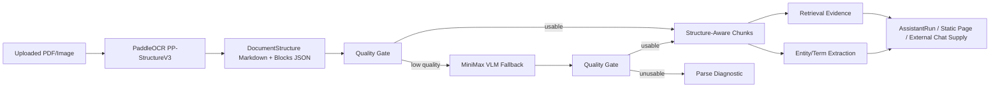

# PaddleOCR Document Understanding Implementation Plan

> **For Claude:** REQUIRED SUB-SKILL: Use superpowers:executing-plans to implement this plan task-by-task.

**Goal:** Upgrade V3 document ingest from plain text extraction toward structured document understanding, using PaddleOCR as the primary PDF/image parser and MiniMax VLM as the low-quality fallback.

**Architecture:** Keep the existing Rust ingest pipeline authoritative, but add a parser sidecar boundary that can call PaddleOCR PP-StructureV3 when configured. The first phase stores PaddleOCR-derived Markdown and structured parse metadata in existing document/chunk metadata so retrieval and entity scans can improve without a schema migration. Later phases promote structure, entities, terms, and hybrid retrieval into first-class durable tables.

**Tech Stack:** Rust `ingest-worker`, Python PaddleOCR `PPStructureV3`, MiniMax document VLM runtime, PostgreSQL document/chunk metadata, current local lexical retrieval, future HanLP and FlagEmbedding/BGE-M3 evaluation.

---

## Requirements Summary

- PaddleOCR is the P0 parser for PDF/image document quality, because this project has already evaluated and connected it before.
- MiniMax VLM remains the fallback for low-quality PaddleOCR/native output.
- The first implementation must be opt-in and non-destructive: if PaddleOCR is not installed or fails, current parsing still works.
- No user-visible fake content. Low-quality parser output must be diagnostic metadata or fallback context, not trusted document content.
- The design must prepare for generalized terms/entities, not just company names.
- Keep Codex substrate frozen; this work belongs to ordinary ingest, retrieval, and provider-routed AssistantRun quality.

## High-Level Architecture



## Key Decisions

### ADR 1: PaddleOCR First For PDF/Image

Use PaddleOCR PP-StructureV3 before native text extraction when `DOCUMENT_PADDLEOCR_ENABLED=true` or `DOCUMENT_PDF_PARSE_ENGINE=paddleocr_first`.

Trade-offs:
- Pro: Better page layout, reading order, table, heading, and OCR coverage.
- Pro: Aligns with prior project evaluation and existing operator decision.
- Con: Heavier runtime dependency and potential model download/cold-start cost.
- Mitigation: Opt-in env gate, timeout, page cap, and fallback to existing parser chain.

### ADR 2: MiniMax VLM Is Fallback, Not Primary

Use MiniMax VLM when PaddleOCR/native output is low quality, missing, or incomplete.

Trade-offs:
- Pro: Better handling for pathological scans, screenshots, mixed visual documents.
- Con: More expensive and provider-dependent.
- Mitigation: Use only after deterministic parser quality gate fails or when explicitly configured.

### ADR 3: Metadata First, Migration Later

Phase 1 stores structure under existing `ExtractedDocumentText.metadata` and chunk metadata surfaces.

Trade-offs:
- Pro: Fast, low-risk deployment without schema migration.
- Con: Querying structured blocks is awkward at first.
- Mitigation: Promote to `document_parse_results`, `document_blocks`, `document_entities`, and `document_terms` once shape stabilizes.

## Task 1: PaddleOCR Plan And Config Contract

**Files:**
- Create: `docs/plans/2026-05-19-paddleocr-document-understanding.md`
- Modify: `docs/validation/ingest-runtime-dependency-gate.md`

**Step 1: Write the plan**

Record the architecture, env flags, quality gates, and rollout steps.

**Step 2: Document env contract**

Add a short validation note:

```text
DOCUMENT_PADDLEOCR_ENABLED=true
DOCUMENT_PADDLEOCR_TIMEOUT_MS=120000
DOCUMENT_PADDLEOCR_MAX_PAGES=8
DOCUMENT_PDF_PARSE_ENGINE=paddleocr_first
```

**Step 3: Commit**

```bash
git add docs/plans/2026-05-19-paddleocr-document-understanding.md docs/validation/ingest-runtime-dependency-gate.md
git commit -m "docs: plan paddleocr document understanding"
```

## Task 2: Add PaddleOCR Parser Sidecar

**Files:**
- Modify: `crates/ingest-worker/src/lib.rs`
- Test: `crates/ingest-worker/src/lib.rs`

**Step 1: Write failing tests**

Add tests for:

```rust
#[test]
fn paddleocr_parse_quality_accepts_structured_markdown() { ... }

#[test]
fn paddleocr_parse_quality_rejects_empty_or_one_character_output() { ... }

#[test]
fn paddleocr_metadata_preserves_blocks_and_quality() { ... }
```

**Step 2: Implement config helpers**

Add:

```rust
fn document_paddleocr_enabled() -> bool
fn document_pdf_parse_engine() -> String
fn document_paddleocr_timeout() -> Duration
fn document_paddleocr_max_pages() -> usize
```

**Step 3: Implement parser call**

Add `extract_pdf_with_paddleocr(path: &Path) -> Option<ExtractedDocumentText>`.

Use Python candidates and a small inline script:

```python
from paddleocr import PPStructureV3
pipeline = PPStructureV3()
output = pipeline.predict(input=pdf_path)
for res in output:
    res.save_to_json(save_path=out_dir)
    res.save_to_markdown(save_path=out_dir)
```

The script prints one JSON object containing:

```json
{
  "markdown": "...",
  "pages": 3,
  "blocks": [...],
  "json_files": [...]
}
```

**Step 4: Wire PDF order**

When enabled:

```text
PaddleOCR -> quality gate -> MiniMax VLM fallback -> native parser chain -> literal -> diagnostic
```

If disabled:

```text
native parser chain -> MiniMax VLM fallback -> literal -> diagnostic
```

**Step 5: Run tests**

```bash
cargo test -p ingest-worker paddleocr --lib
cargo test -p ingest-worker pdf_parse_quality --lib
cargo test -p ingest-worker pdf_low_quality --lib
```

**Step 6: Commit**

```bash
git add crates/ingest-worker/src/lib.rs
git commit -m "Add PaddleOCR PDF parser sidecar"
```

## Task 3: Structure-Aware Chunk Metadata

**Files:**
- Modify: `crates/ingest-worker/src/lib.rs`
- Modify: `crates/platform-api/src/lib.rs`
- Test: `crates/ingest-worker/src/lib.rs`
- Test: `crates/platform-api/src/lib.rs`

**Step 1: Preserve block hints**

Put PaddleOCR structure hints into metadata:

```json
{
  "document_structure": {
    "source": "paddleocr_pp_structure_v3",
    "blocks": [
      {
        "page": 1,
        "index": 0,
        "block_type": "paragraph_title",
        "text": "工作经历",
        "bbox": [10, 20, 300, 60],
        "confidence": 0.93
      }
    ]
  }
}
```

**Step 2: Make section title hints read from structure**

Extend existing `section_title_hints` inference to prefer PaddleOCR `doc_title`, `paragraph_title`, `title`, and `header` blocks.

**Step 3: Run tests**

```bash
cargo test -p ingest-worker document_structure --lib
cargo test -p platform-api section_title_hints --lib
```

**Step 4: Commit**

```bash
git add crates/ingest-worker/src/lib.rs crates/platform-api/src/lib.rs
git commit -m "Use PaddleOCR structure hints for document chunks"
```

## Task 4: General Entity And Term Layer

**Files:**
- Modify: `crates/platform-api/src/lib.rs`
- Future migration: `crates/storage/migrations/00xx_document_entities_terms.sql`
- Test: `crates/platform-api/src/lib.rs`

**Step 1: Add metadata-only extractor first**

Generalize company scan output to:

```json
{
  "type": "dataset_entity_scan",
  "entity_types": ["organization", "person", "position", "skill", "location", "project"],
  "entities": [...]
}
```

**Step 2: Add term extraction contract**

Extract noun/keyword candidates from:

- PaddleOCR headings
- paragraph titles
- table headers
- repeated CJK phrases
- current local lexical signature terms

**Step 3: Keep rules conservative**

Do not claim all noun phrases are correct. Mark them as `candidate_terms`.

**Step 4: Run tests**

```bash
cargo test -p platform-api dataset_entity_scan --lib
cargo test -p platform-api assistant_run_extracts_company_names --lib
```

**Step 5: Commit**

```bash
git add crates/platform-api/src/lib.rs
git commit -m "Generalize document entity scan candidates"
```

## Task 5: Retrieval Upgrade Plan

**Files:**
- Modify: `crates/retrieval-worker/src/lib.rs`
- Create: `docs/plans/2026-05-19-hybrid-retrieval-followup.md`

**Step 1: Keep local lexical**

Do not remove local lexical retrieval. It remains deterministic fallback.

**Step 2: Prepare BGE/FlagEmbedding seam**

Introduce an interface for future dense/sparse/reranker profiles:

```rust
trait RetrievalEmbeddingProvider {
    fn embed(&self, text: &str) -> RetrievalVector;
}
```

**Step 3: Rank with boosts**

Boost:

- title match
- section heading match
- entity match
- table header match
- source document title acronym

**Step 4: Commit**

```bash
git add crates/retrieval-worker/src/lib.rs docs/plans/2026-05-19-hybrid-retrieval-followup.md
git commit -m "Plan hybrid retrieval upgrade"
```

## Task 6: Deployment And Smoke

**Files:**
- Create: `scripts/run-document-understanding-smoke.sh`
- Modify: `scripts/README.md`
- Modify: `docs/validation/ingest-runtime-dependency-gate.md`

**Step 1: Add smoke**

Smoke checks:

- PaddleOCR import is available when enabled.
- Representative PDF produces Markdown and block metadata.
- One-character PDF output triggers MiniMax VLM or diagnostic.
- Document detail exposes section title hints.
- Resume company/entity query uses structured scan supply.

**Step 2: Local tests**

```bash
bash scripts/run-document-understanding-smoke.sh
cargo test -p ingest-worker --lib
cargo test -p platform-api retrieval --lib
```

**Step 3: Deploy to 8 server**

```bash
git push origin main
ssh 8服务器 "cd /srv/aiv3/repo && git pull --ff-only && bash scripts/run-document-understanding-smoke.sh"
ssh 8服务器 "cd /srv/aiv3/repo && CC=clang CXX=clang++ cargo build --release -p ingest-worker -p platform-api -p retrieval-worker"
ssh 8服务器 "systemctl restart aiv3-ingest-worker.service aiv3-platform-api.service aiv3-retrieval-worker.service"
ssh 8服务器 "systemctl is-active aiv3-ingest-worker.service aiv3-platform-api.service aiv3-retrieval-worker.service"
```

**Step 4: Commit validation notes**

```bash
git add docs/validation/ingest-runtime-dependency-gate.md scripts/run-document-understanding-smoke.sh scripts/README.md
git commit -m "Add document understanding smoke"
```

## Rollout Guardrails

- Default remains safe if PaddleOCR is absent.
- Never print provider credentials, model tokens, or raw third-party secrets.
- Do not treat low-quality OCR as source truth.
- Cap pages by env until performance is measured.
- Keep parser outputs redacted when exposed in operator summaries.
- Use source locators for every model-visible evidence item.

## Acceptance Criteria

- PaddleOCR can be enabled without breaking existing PDF tests.
- A representative PDF stores `document_structure.source=paddleocr_pp_structure_v3`.
- Low-quality PaddleOCR/native text triggers MiniMax VLM fallback or parse diagnostic.
- Document detail and retrieval surfaces can expose structure-derived heading hints.
- Resume/company scan keeps working and is ready to expand into broader entity/term extraction.
