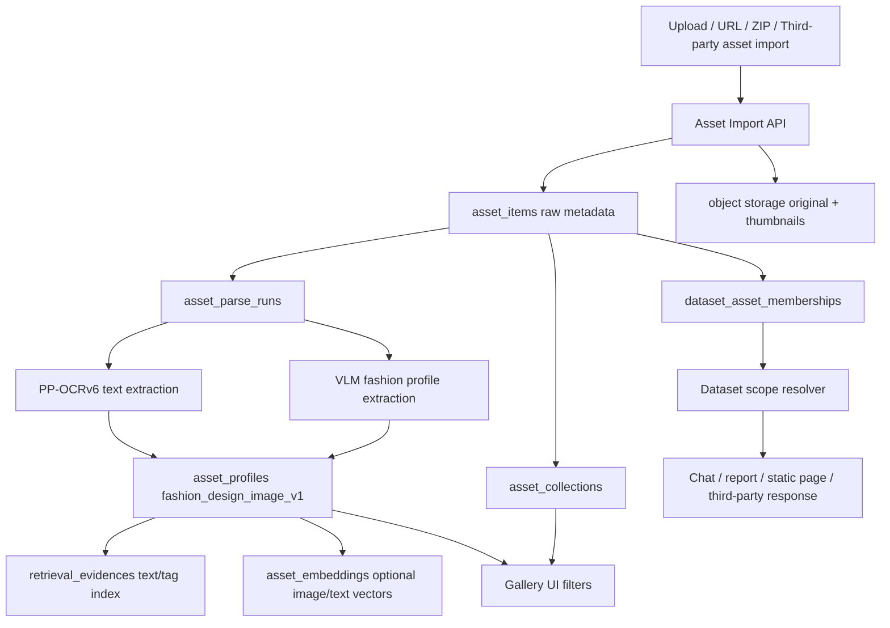

# Multimodal Asset Library and Fashion Gallery Implementation Plan

> **For Claude:** REQUIRED SUB-SKILL: Use superpowers:executing-plans to implement this plan task-by-task.

**Goal:** Upgrade V3 datasets from document-only containers into queryable views over documents, databases, and multimodal asset libraries, then use fashion design galleries as the first vertical asset schema.

**Architecture:** Keep existing datasets and document/database flows compatible. Add a new asset-library layer underneath datasets: raw assets are stored once, parsed into typed profiles and embeddings, then exposed through dataset memberships/views for chat, report generation, third-party APIs, and UI. Fashion is implemented as a vertical profile schema, not as a one-off parser.

**Tech Stack:** Rust workspace (`storage`, `contracts`, `platform-api`, `ingest-worker`, `retrieval-worker`), PostgreSQL migrations, existing object/file storage, PP-OCRv6, VLM parsing through model gateway, existing dataset/retrieval/third-party API patterns, Next.js web app.

---

## Requirements Summary

### Functional Requirements

1. Support a new "asset library" data source type for images, ZIP image packages, videos later, and derived thumbnails.
2. A single asset must be attachable to multiple collections and multiple datasets without copying the original file.
3. Dataset scope must become a query view that can include documents, database-derived rows, and asset libraries.
4. Fashion gallery MVP must parse each design image into structured tags:
   - category, gender/audience, season, style, silhouette, collar, sleeve, waist, hem, material, craft, color, pattern, scene, SKU/text marks.
5. Support OCR text extraction from image labels, tags, screenshots, and filenames through PP-OCRv6.
6. Support VLM visual understanding for fashion fields and human-readable captions.
7. Support text search and later image-similarity search over the same library.
8. Support third-party direct integration:
   - upload/import asset package;
   - query parse status;
   - return structured JSON for easy customer storage;
   - use asset library or collection IDs in chat/report requests.
9. Support main-site UI:
   - asset library list;
   - gallery grid;
   - filters;
   - parse status;
   - dataset membership management.
10. Preserve tenant isolation, third-party privacy, auditability, and existing dataset/document APIs.

### Non-Functional Requirements

1. Must not break current document datasets, database datasets, static-page reports, or third-party document scope behavior.
2. Must not require re-uploading duplicate image files for every dataset.
3. Must support batch imports with progress and partial failures.
4. Must allow parser re-runs by parser version without losing prior accepted results.
5. Must expose model-visible parse state so chat can answer "still parsing / failed / retrying / partial".
6. Must keep raw asset bytes out of prompt logs and audit text.
7. MVP should work without a dedicated vector database; design the schema so vector search can be added cleanly.

---

## Architecture Decision Record

### ADR-001: Dataset Becomes a View, Asset Library Becomes a Storage Domain

**Decision:** Keep `datasets` as permission/query scopes. Add `asset_libraries`, `asset_collections`, and `asset_items` as a new storage domain.

**Rationale:** Fashion galleries, video libraries, PPT screenshots, OCR screenshots, and customer product images cannot be modeled cleanly as "documents" without losing media-specific parse, thumbnail, and similarity behavior.

**Trade-off:** This adds tables and APIs, but avoids corrupting the document model with image-only fields.

### ADR-002: Typed Profiles Are Vertical Extensions, Not Core Columns

**Decision:** Store vertical parse output in `asset_profiles` with `profile_schema` and JSON payload first; add narrow indexed columns only for high-value fields.

**Rationale:** Fashion schema will evolve quickly. JSON profile gives speed; generated/indexed fields can be added after usage patterns are clear.

**Trade-off:** Early SQL filters may be less efficient. Mitigate with expression indexes on common fields.

### ADR-003: Same Asset Can Belong to Multiple Datasets

**Decision:** Add `dataset_asset_memberships`, parallel to current dataset-document membership behavior.

**Rationale:** A design image may belong to "all inspiration", "2026 summer dresses", "customer A private", and "report-ready selections" simultaneously.

**Trade-off:** Query scope resolution must merge document/database/asset memberships. Mitigate with explicit scope resolver tests.

### ADR-004: Fashion Gallery MVP Uses Text Retrieval First, Image Embedding Second

**Decision:** MVP indexes OCR text, filenames, captions, and fashion tags into retrieval evidence. Image embedding tables are added behind a feature flag or placeholder contract.

**Rationale:** Text/tag retrieval gives immediate business value and works with current retrieval pipeline. Image-to-image search is important but should not block gallery ingestion.

**Trade-off:** First release may not support high-quality visual similarity. Mitigate by storing asset fingerprints and model-ready embedding slots.

---

## High-Level Architecture



---

## Phase 0: Scope Guard and Baseline Tests

### Task 0.1: Add Plan Tracking Entry

**Files:**
- Modify: `docs/plans/datamax-active-execution-plan.md`
- Reference: `docs/plans/2026-06-17-multimodal-asset-library-fashion-gallery.md`

**Steps:**
1. Add a short "Multimodal asset library" item under the main plan backlog.
2. Mark this as a feature thread separate from current document parsing quality work.
3. Do not claim implementation is complete.

**Validation:**

```bash
git diff --check docs/plans/datamax-active-execution-plan.md
```

### Task 0.2: Add No-Regression Test Names Before Schema Work

**Files:**
- Modify: `crates/platform-api/src/lib.rs` or a focused support test module if asset scope gets split out.
- Modify: `crates/storage/migrations/0015_multimodal_asset_library.sql` after Task 1.1 creates it.

**Tests to add first:**
- `dataset_document_scope_still_excludes_unselected_documents`
- `external_temporary_document_scope_ignores_assets_without_asset_scope`
- `third_party_private_documents_remain_private_when_asset_library_exists`

**Validation:**

```bash
cargo test -p platform-api dataset_document_scope_still_excludes_unselected_documents --lib
cargo test -p platform-api external_temporary_document_scope_ignores_assets_without_asset_scope --lib
```

Expected before implementation: tests compile only after minimal stubs are in place.

---

## Phase 1: Storage Model

### Task 1.1: Create Asset Library Migration

**Files:**
- Create: `crates/storage/migrations/0015_multimodal_asset_library.sql`

**Schema:**

```sql
create table if not exists asset_libraries (
    id uuid primary key,
    tenant_id uuid not null,
    external_id text,
    name text not null,
    description text,
    asset_domain text not null default 'generic',
    visibility text not null default 'private',
    created_at timestamptz not null default now(),
    updated_at timestamptz not null default now(),
    unique (tenant_id, external_id)
);

create table if not exists asset_collections (
    id uuid primary key,
    tenant_id uuid not null,
    library_id uuid not null references asset_libraries(id) on delete cascade,
    parent_collection_id uuid references asset_collections(id) on delete set null,
    external_id text,
    name text not null,
    description text,
    created_at timestamptz not null default now(),
    updated_at timestamptz not null default now(),
    unique (tenant_id, library_id, external_id)
);

create table if not exists asset_items (
    id uuid primary key,
    tenant_id uuid not null,
    library_id uuid not null references asset_libraries(id) on delete cascade,
    external_id text,
    asset_type text not null,
    original_filename text,
    content_type text,
    byte_size bigint,
    width integer,
    height integer,
    duration_ms bigint,
    content_hash text,
    object_uri text,
    thumbnail_uri text,
    source_kind text not null default 'upload',
    source_ref jsonb not null default '{}'::jsonb,
    status text not null default 'uploaded',
    created_at timestamptz not null default now(),
    updated_at timestamptz not null default now(),
    unique (tenant_id, library_id, external_id)
);

create table if not exists asset_collection_items (
    tenant_id uuid not null,
    collection_id uuid not null references asset_collections(id) on delete cascade,
    asset_id uuid not null references asset_items(id) on delete cascade,
    created_at timestamptz not null default now(),
    primary key (tenant_id, collection_id, asset_id)
);

create table if not exists dataset_asset_memberships (
    tenant_id uuid not null,
    dataset_id uuid not null references datasets(id) on delete cascade,
    asset_id uuid not null references asset_items(id) on delete cascade,
    membership_kind text not null default 'manual',
    expires_at timestamptz,
    created_at timestamptz not null default now(),
    primary key (tenant_id, dataset_id, asset_id)
);

create table if not exists asset_parse_runs (
    id uuid primary key,
    tenant_id uuid not null,
    asset_id uuid not null references asset_items(id) on delete cascade,
    parser_name text not null,
    parser_version text not null,
    status text not null,
    started_at timestamptz,
    finished_at timestamptz,
    error_code text,
    error_message text,
    metadata jsonb not null default '{}'::jsonb,
    created_at timestamptz not null default now()
);

create table if not exists asset_profiles (
    id uuid primary key,
    tenant_id uuid not null,
    asset_id uuid not null references asset_items(id) on delete cascade,
    parse_run_id uuid references asset_parse_runs(id) on delete set null,
    profile_schema text not null,
    profile_version text not null,
    profile jsonb not null,
    confidence numeric,
    accepted boolean not null default false,
    created_at timestamptz not null default now()
);

create table if not exists asset_embeddings (
    id uuid primary key,
    tenant_id uuid not null,
    asset_id uuid not null references asset_items(id) on delete cascade,
    embedding_kind text not null,
    provider text not null,
    model text not null,
    content_hash text not null,
    vector_point_id text,
    metadata jsonb not null default '{}'::jsonb,
    status text not null default 'pending',
    created_at timestamptz not null default now(),
    unique (tenant_id, asset_id, embedding_kind, provider, model, content_hash)
);
```

**Indexes:**

```sql
create index if not exists asset_items_tenant_library_status_idx
    on asset_items (tenant_id, library_id, status, created_at desc);

create index if not exists asset_items_tenant_hash_idx
    on asset_items (tenant_id, content_hash);

create index if not exists asset_profiles_schema_idx
    on asset_profiles (tenant_id, profile_schema, created_at desc);

create index if not exists dataset_asset_memberships_dataset_idx
    on dataset_asset_memberships (tenant_id, dataset_id, expires_at);
```

**Validation:**

```bash
cargo test -p storage migrations_are_registered_in_order --lib
```

### Task 1.2: Register Migration

**Files:**
- Modify: `crates/storage/src/lib.rs` or the existing migration registry file used by `storage`.
- Test: `crates/storage/src/lib.rs`

**Steps:**
1. Add migration `0015_multimodal_asset_library.sql` to the registry.
2. Keep ordering after `0014_retrieval_lexical_index.sql`.
3. Add test if the registry does not already fail on missing migrations.

**Validation:**

```bash
cargo test -p storage migrations_are_registered_in_order --lib
```

---

## Phase 2: Domain and Contracts

### Task 2.1: Add Asset Domain Types

**Files:**
- Modify: `crates/domain-model/src/lib.rs`
- Modify: `crates/contracts/src/lib.rs`

**Types:**
- `AssetLibraryId`
- `AssetCollectionId`
- `AssetItemId`
- `AssetParseRunId`
- `AssetType`
- `AssetParseStatus`
- `AssetProfileSchema`

**Validation:**

```bash
cargo test -p domain-model asset --lib
cargo test -p contracts asset --lib
```

### Task 2.2: Define Fashion Profile Contract

**Files:**
- Create: `crates/contracts/src/fashion_asset_profile.rs`
- Modify: `crates/contracts/src/lib.rs`

**Rust shape:**

```rust
#[derive(Debug, Clone, Serialize, Deserialize, PartialEq)]
pub struct FashionDesignImageProfileV1 {
    pub category: Option<String>,
    pub audience: Vec<String>,
    pub season: Vec<String>,
    pub style: Vec<String>,
    pub silhouette: Vec<String>,
    pub collar: Vec<String>,
    pub sleeve: Vec<String>,
    pub waist: Vec<String>,
    pub hem: Vec<String>,
    pub material: Vec<String>,
    pub craft: Vec<String>,
    pub colors: Vec<String>,
    pub patterns: Vec<String>,
    pub scenes: Vec<String>,
    pub visible_text: Vec<String>,
    pub sku_candidates: Vec<String>,
    pub caption: Option<String>,
    pub confidence: Option<f32>,
}
```

**Tests:**
- JSON roundtrip.
- Missing optional fields do not fail.
- Unknown extra profile fields do not break forward compatibility.

**Validation:**

```bash
cargo test -p contracts fashion_design_image_profile_v1 --lib
```

---

## Phase 3: Import and Parse Pipeline

### Task 3.1: Add Asset Import Support Module

**Files:**
- Create: `crates/platform-api/src/asset_import_support.rs`
- Modify: `crates/platform-api/src/lib.rs`
- Reuse patterns from: `crates/platform-api/src/zip_ingest_support.rs`
- Reuse patterns from: `apps/web/app/api/v3/local-document-uploads/route.js`

**Behavior:**
1. Accept a single image, image URL list, or ZIP package.
2. Create or resolve `asset_library`.
3. Create or resolve `asset_collection`.
4. Store original asset metadata.
5. De-duplicate by `(tenant_id, library_id, content_hash)`.
6. Create `dataset_asset_memberships` when a dataset is supplied.
7. Enqueue asset parse tasks.

**Tests:**
- ZIP import creates multiple assets.
- Same image content does not create duplicate `asset_items`.
- Same asset can be joined to two datasets.
- Third-party private tenant cannot see another tenant asset.

**Validation:**

```bash
cargo test -p platform-api asset_import --lib
```

### Task 3.2: Add Asset Parse Task Kind

**Files:**
- Modify: `crates/ingest-worker/src/lib.rs`
- Modify: task/event contract files under `crates/contracts/src/lib.rs` if workflow task kinds are centralized.

**Behavior:**
1. Add `ingest_asset_item` or equivalent task key.
2. Read asset metadata and object path.
3. Branch by asset type:
   - image: OCR + VLM profile extraction;
   - ZIP: import sub-assets only;
   - video: reserve for future, return unsupported status for MVP.
4. Write `asset_parse_runs`.
5. Write `asset_profiles`.
6. Write retrieval evidence text from profile.

**Validation:**

```bash
cargo test -p ingest-worker asset_parse --lib
```

### Task 3.3: Implement Fashion Image Parser

**Files:**
- Create: `crates/ingest-worker/src/fashion_asset_parser.rs`
- Modify: `crates/ingest-worker/src/lib.rs`
- Reuse: `crates/document-vlm-runtime/src/lib.rs`

**Prompt contract:**
Return strict JSON matching `fashion_design_image_v1`. Do not return freeform prose unless placed under `caption`.

**Parser stages:**
1. Local image metadata extraction.
2. PP-OCRv6 visible text extraction.
3. VLM fashion field extraction.
4. Normalize common Chinese/English values.
5. Save profile with parser version:
   - `fashion_design_image_v1`
   - parser name `datamax-fashion-image-parser`
   - parser version `2026-06-17`

**Tests:**
- VLM JSON response maps into profile.
- Bad JSON becomes failed parse with model-visible error.
- OCR-only text still creates a partial profile.
- Parser does not leak raw image bytes into logs.

**Validation:**

```bash
cargo test -p ingest-worker fashion_asset_parser --lib
```

---

## Phase 4: Dataset Scope and Retrieval

### Task 4.1: Extend Dataset Scope Resolver

**Files:**
- Modify: `crates/platform-api/src/dataset_summary_support.rs`
- Modify: `crates/platform-api/src/external_channel_static_page_dataset_scope_support.rs`
- Modify: `crates/platform-api/src/external_channel_scope_document_support.rs`
- Create if cleaner: `crates/platform-api/src/dataset_asset_scope_support.rs`

**Behavior:**
1. Dataset summary includes asset counts by type and parse status.
2. Assistant model context can see:
   - selected asset library count;
   - selected collection names;
   - parse-ready/failed/reparsing counts;
   - top profile tags.
3. Existing document-only queries remain unchanged unless asset scope exists.

**Tests:**
- Dataset with documents only returns old behavior.
- Dataset with assets includes compact asset context.
- Temporary third-party document scope does not accidentally include all assets.

**Validation:**

```bash
cargo test -p platform-api dataset_asset_scope --lib
```

### Task 4.2: Add Asset Retrieval Evidence

**Files:**
- Modify: `crates/retrieval-worker/src/lib.rs`
- Modify: `crates/retrieval-worker/src/main.rs`
- Modify: `crates/platform-api/src/retrieval_query_support.rs`
- Modify: `crates/platform-api/src/retrieval_evidence_view_support.rs`

**Behavior:**
1. Build search text from profile:
   - filename;
   - caption;
   - OCR visible text;
   - normalized fashion tags.
2. Store evidence with source kind `asset_profile`.
3. Return thumbnails and asset IDs in retrieval evidence payloads.

**Tests:**
- Text query "春夏新中式连衣裙" recalls matching asset profile.
- Query evidence contains `asset_id` and thumbnail ref, not raw binary path.
- Document retrieval ranking still works.

**Validation:**

```bash
cargo test -p retrieval-worker asset_profile_index --lib
cargo test -p platform-api asset_retrieval --lib
```

### Task 4.3: Prepare Optional Image Embedding Path

**Files:**
- Create: `crates/retrieval-worker/src/asset_embedding_support.rs`
- Modify: `crates/retrieval-worker/src/lib.rs`

**Behavior:**
1. Add an interface for image embeddings, but leave provider disabled by default.
2. Store pending rows in `asset_embeddings`.
3. Add feature flag:
   - `ASSET_IMAGE_EMBEDDING_ENABLED=false`
4. Do not block text/tag search.

**Validation:**

```bash
cargo test -p retrieval-worker asset_embedding_disabled_does_not_block_profile_index --lib
```

---

## Phase 5: API

### Task 5.1: Add Main Asset API

**Files:**
- Modify: `crates/platform-api/src/lib.rs`
- Create: `crates/platform-api/src/asset_api_support.rs`

**Endpoints:**

```text
POST /v1/asset-libraries
GET  /v1/asset-libraries
POST /v1/asset-libraries/{library_id}/collections
GET  /v1/asset-libraries/{library_id}/collections
POST /v1/asset-libraries/{library_id}/assets/import
GET  /v1/assets/{asset_id}
GET  /v1/assets/{asset_id}/parse-runs
POST /v1/datasets/{dataset_id}/assets/{asset_id}
DELETE /v1/datasets/{dataset_id}/assets/{asset_id}
```

**Tests:**
- Create library.
- Import asset.
- Add/remove asset from dataset.
- Tenant isolation.

**Validation:**

```bash
cargo test -p platform-api asset_api --lib
```

### Task 5.2: Add Third-Party Asset Import API

**Files:**
- Modify: `crates/platform-api/src/external_document_object_support.rs` only if shared object download code is reused.
- Create: `crates/platform-api/src/external_asset_import_support.rs`
- Modify: `crates/platform-api/src/lib.rs`
- Update docs later:
  - `docs/integrations/third-party-integration-api.zh-CN.html`
  - `docs/integrations/pure-third-party-integration-guide.zh-CN.html`
  - `apps/web/public/external-integrations/third-party-integration-api.zh-CN.html`
  - `apps/web/public/external-integrations/pure-third-party-integration-guide.zh-CN.html`

**Endpoint proposal:**

```text
POST /v1/external/channels/{connection_id}/asset-imports
GET  /v1/external/channels/{connection_id}/asset-imports/{import_id}
GET  /v1/external/channels/{connection_id}/assets/{asset_external_id}
```

**Payload:**

```json
{
  "asset_library_external_id": "fashion-design-library",
  "asset_collection_external_id": "spring-summer-2026",
  "dataset_external_ids": ["fashion-report-dataset"],
  "asset_domain": "fashion",
  "profile_schema": "fashion_design_image_v1",
  "assets": [
    {
      "asset_external_id": "img-001",
      "url": "https://example.com/001.jpg",
      "filename": "001.jpg"
    }
  ]
}
```

**Response:**

```json
{
  "accepted": true,
  "import_id": "uuid",
  "asset_count": 1,
  "parse_status": "queued"
}
```

**Tests:**
- Existing `/events` chat does not require new fields.
- Third-party import auto-creates private library.
- Imported assets are invisible to main public/default tenant unless explicitly authorized.

**Validation:**

```bash
cargo test -p platform-api external_asset_import --lib
npm run smoke:external-scoped-document-chat -- --self-test
```

### Task 5.3: Add Chat Scope Fields Without Breaking Existing Requests

**Files:**
- Modify: `crates/platform-api/src/external_channel_support.rs`
- Modify: `crates/platform-api/src/external_channel_static_page_report_scope_support.rs`

**Optional fields:**

```json
{
  "asset_library_external_ids": ["fashion-design-library"],
  "asset_collection_external_ids": ["spring-summer-2026"],
  "asset_external_ids": ["img-001", "img-002"],
  "profile_schema": "fashion_design_image_v1"
}
```

**Rule:**
Existing `dataset_external_ids` remains preferred for unified chat/report scope. Asset fields are optional shortcuts for third parties that manage图库分组 directly.

**Validation:**

```bash
cargo test -p platform-api external_channel_asset_scope --lib
```

---

## Phase 6: Web UI

### Task 6.1: Add Asset Library Navigation

**Files:**
- Modify: `apps/web/app/admin/page.js`
- Create: `apps/web/app/admin/asset-libraries/page.js`
- Create: `apps/web/app/admin/asset-libraries/AssetLibrariesPageClient.js`

**Behavior:**
1. List asset libraries.
2. Show asset domain, asset count, parse-ready count, failed count.
3. Create library.
4. Open gallery view.

**Validation:**

```bash
npm run build
node --test apps/web/app/lib/*.test.mjs
```

### Task 6.2: Add Gallery Grid and Filters

**Files:**
- Create: `apps/web/app/admin/asset-libraries/[libraryId]/page.js`
- Create: `apps/web/app/admin/asset-libraries/[libraryId]/AssetGalleryPageClient.js`
- Create: `apps/web/app/lib/asset-gallery-view.js`
- Create: `apps/web/app/lib/asset-gallery-view.test.mjs`

**UI:**
- Thumbnail grid.
- Collection filter.
- Category/style/color/material filter.
- Parse status filter.
- Dataset membership panel.
- JSON profile drawer.

**Tests:**
- Filter chips are derived from profile values.
- Failed parse badge renders.
- Dataset membership toggle calls correct endpoint.

**Validation:**

```bash
node --test apps/web/app/lib/asset-gallery-view.test.mjs
npm run build
```

---

## Phase 7: Static Page and Report Integration

### Task 7.1: Add Asset Evidence to Report Planning

**Files:**
- Modify: `crates/platform-api/src/external_channel_static_page_prompt_support.rs`
- Modify: `crates/platform-api/src/static_page_dataset_fact_snapshot_sample_support.rs`
- Create: `crates/platform-api/src/static_page_asset_profile_sample_support.rs`

**Behavior:**
1. Static page planning can receive asset profile samples.
2. Fashion report can include:
   - category distribution;
   - style trend board;
   - color palette summary;
   - material/craft board;
   - selected representative thumbnails.
3. Report generation must not include private raw object paths; use public signed/served thumbnail URLs.

**Validation:**

```bash
cargo test -p platform-api static_page_asset_profile_sample --lib
```

### Task 7.2: Add Fashion Gallery Report Skill

**Files:**
- Modify: `crates/platform-api/src/external_requested_skills_support.rs`
- Create: `crates/platform-api/src/fashion_gallery_report_skill_support.rs`

**Skill ID:**

```text
fashion_gallery_analysis_skill
```

**Inputs:**
- dataset IDs;
- asset library/collection IDs;
- report intent;
- output format.

**Outputs:**
- rich text summary;
- optional static page artifact request;
- structured JSON summary.

**Validation:**

```bash
cargo test -p platform-api fashion_gallery_analysis_skill --lib
```

---

## Phase 8: Documentation and Smoke

### Task 8.1: Add Internal Validation Document

**Files:**
- Create: `docs/validation/multimodal-asset-library-smoke.md`
- Create: `scripts/run-multimodal-asset-library-smoke.sh`

**Smoke coverage:**
1. Create library.
2. Import two image fixtures.
3. Parse into `fashion_design_image_v1`.
4. Add both assets to dataset.
5. Ask chat for matching fashion concepts.
6. Generate a small static page report.
7. Verify third-party private scope.

**Validation:**

```bash
bash scripts/run-multimodal-asset-library-smoke.sh
```

### Task 8.2: Update External Docs After API Stabilizes

**Files:**
- Modify: `docs/integrations/third-party-integration-api.zh-CN.html`
- Modify: `docs/integrations/pure-third-party-integration-guide.zh-CN.html`
- Modify: `apps/web/public/external-integrations/third-party-integration-api.zh-CN.html`
- Modify: `apps/web/public/external-integrations/pure-third-party-integration-guide.zh-CN.html`

**Doc rules:**
1. Keep simple guide minimal.
2. Put full asset import API in complete API page.
3. Do not expose internal model/image-generation implementation details.
4. Explain required and optional fields clearly.
5. State that third-party assets are private by default.

**Validation:**

```bash
npm run build
```

---

## Rollout Plan

### Stage 1: Hidden Backend

- Ship migrations, domain types, import API behind feature flag:

```text
ASSET_LIBRARY_ENABLED=false
FASHION_ASSET_PROFILE_ENABLED=false
```

- Run self-test smoke only.

### Stage 2: Operator-Only Pilot

- Enable on 8 server for admin account only.
- Import one controlled fashion ZIP.
- Validate parse quality and UI filters.
- Do not expose third-party API yet.

### Stage 3: Third-Party Pilot

- Enable `asset-imports` endpoint for one test channel.
- Confirm private visibility.
- Confirm returned JSON is stable enough for customer storage.

### Stage 4: Dataset Integration Default

- Allow datasets to include asset memberships in normal chat/report scope.
- Keep asset scope compact by default:
  - counts;
  - top tags;
  - selected evidence;
  - thumbnails only when report/artifact path needs them.

---

## Acceptance Criteria

1. Existing document/database dataset tests pass unchanged.
2. One image can belong to two datasets and two collections without duplicate raw file rows.
3. A fashion ZIP import creates assets, thumbnails, parse runs, profiles, and retrieval evidence.
4. Chat can answer questions over a fashion gallery using selected dataset scope.
5. Third-party can import fashion image assets and query structured parse JSON.
6. Main-site UI can browse gallery and filter by category/style/color/material.
7. Static page generation can use asset profile samples and thumbnails.
8. Tenant/private boundaries are covered by tests.

---

## Recommended First Sprint

1. Phase 1 storage migration.
2. Phase 2 contracts.
3. Phase 3 image import + fashion parser with mocked VLM tests.
4. Phase 4 text/tag retrieval evidence.
5. Minimal third-party import endpoint.

Do not start with image vector search or a large UI. The fastest useful milestone is:

```text
ZIP/images -> asset library -> fashion profile JSON -> dataset membership -> chat/report can use tags and thumbnails
```
