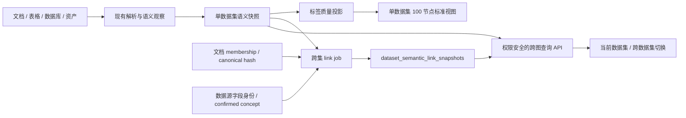

# DataMax Knowledge Graph Quality and Cross-Dataset Network Implementation Plan

> **For Claude:** REQUIRED SUB-SKILL: Use superpowers:executing-plans to implement this plan task-by-task.

**Goal:** 让“新百项目资料”及后续任意数据集优先展示可解释的中文业务语义，把默认图谱扩展到当前约 2–3 倍的高质量关键节点，并在权限安全、证据可追溯的前提下展示跨数据集的同一资料、同一字段、明确引用和相似线索。

**Architecture:** 保留现有 PostgreSQL 18、单数据集 `dataset_semantic_snapshots` 和 `dataset_semantic_understanding_v1` 契约；先修复空快照 fallback 的标签污染、来源身份和贡献权限，再用自适应节点预算与确定性分簇布局扩展单集图谱。跨数据集采用“单数据集语义快照 + PostgreSQL 成对关系快照 + 请求时权限投影”，只折叠有精确身份依据的共享节点；相似度关系始终保留为两个节点之间的推断虚线，不引入独立图数据库。

**Tech Stack:** Rust、Axum、SQLx、PostgreSQL 18、JSONB、Next.js、React、Apache ECharts 6、Node.js test runner、systemd。

---

## 0. 计划边界与执行原则

本文件是后续“数据集图谱提质与跨数据集网络”唯一执行入口。以下历史文件只保留为背景，不再向其中追加本轮任务：

- `docs/plans/2026-07-13-dataset-understanding-graph-mvp.md`
- `docs/plans/2026-07-13-dataset-understanding-network-graph.md`
- `docs/plans/2026-07-13-dataset-understanding-explainability.md`
- `docs/plans/2026-07-13-datamax-universal-dataset-semantic-understanding.md`

本计划不覆盖数据导入、检索问答、资产解析和 Oracle 接入；不得借本计划修改这些能力的开关或部署边界。

执行规则：

1. 每个任务先写失败测试，再做最小实现，再运行聚焦测试。
2. “新百项目资料”先 dry-run，再真实生成语义快照；质量不达标不得仅靠前端隐藏后发布。
3. 单数据集图谱与跨数据集图谱使用独立开关；跨图失败不得影响现有单集图、导入或检索。
4. 不把数字、英文或技术名强行翻译成未经证据支持的中文业务含义。
5. 不把相似度、共现或样本重合宣传为已确认实体关系。
6. 不在 API、日志、快照回执或 Web 中返回 content hash、HMAC、连接串、内部路径或原始敏感值。

## 1. 当前盘点基线

### 1.1 “新百项目资料”线上状态

目标数据集：

```text
title=新百项目资料
dataset_id=d4923d83-6053-4feb-8005-b22ee51e0227
document_count=9
estimated_word_count=55919
content_mix=8 份表格 + 1 份 other/压缩包
```

2026-07-14 只读核对结果：

- 公开 understanding API 返回 HTTP 200，但 `status=empty`。
- `generation_version=semantic_profile_v3`，`objects=0`、`fields=0`、`relations=0`。
- API 明确返回“该数据集尚未生成可解释的语义快照”。
- 8 服务器语义总开关已开，但该 UUID 不在 dataset allowlist。
- 因此页面没有进入真实语义图，而是走 `dataset-understanding-graph.js` 的旧摘要 fallback。

用线上载荷和当前部署同版图模型复现：

| 指标 | 当前值 |
| --- | ---: |
| 默认节点 | 49 |
| 默认边 | 113 |
| 文档节点 | 18 |
| 知识词节点 | 16 |
| 章节节点 | 10 |
| 数字/英文/代码标点开头节点 | 33 / 49（67.3%） |
| 原始表格整行节点 | 15 |
| SQL、MIME 或策略技术串 | 11 |
| 带扩展名节点 | 9 |
| 规范化后重复文档节点 | 9 |

当前未发现绝对内部路径或连接串出现在画布上；主要污染来自原始表格行、年份、合同编号、SQL 表达式、MIME 类型、解析策略名和技术文件名。

### 1.2 代码根因

1. `buildDatasetUnderstandingGraph` 只有在 understanding 为 `ready` 且有对象时才使用语义图；`empty` 会直接回退到数据集摘要。
2. fallback 对 `noun_term_hints`、`section_title_hints` 和 `document_title_hints` 只做 trim/去重/截断，没有“整行数据、SQL、纯数字、MIME、策略串、扩展名”质量门禁。
3. 文档去重按完整标题进行，真实文档标题与去扩展名 title hint 被当作两个节点。
4. fallback business view 不做节点质量裁剪，所有已收集节点直接进入主画布。
5. 现有 ready 语义参考数据中，前端每个对象固定 `.slice(0, 4)`，9 个对象最终只展示约 46 个节点；后端已有 155 个字段，不是后端数据不足。
6. 画布固定 560px，中心节点为 66/68px，且每次选点或筛选都会销毁并重建 ECharts 实例；直接扩到百余节点会造成反复力导向计算。

### 1.3 跨数据集现状与约束

可复用能力：

- `dataset_document_memberships` 已表达同一 Document 同时属于多个数据集。
- `documents.canonical_document_id`、`documents.content_sha256` 和 `document_content_fingerprints` 已表达内容完全一致。
- 单集语义契约已有对象、字段、关系、`evidence_class`、证据引用、版本、指纹和上一 ready 快照回退。
- PostgreSQL 足以承载当前按数据集、按一跳关系查询，不需要 Neo4j。

实施前必须解决：

- 当前数据库对象身份没有完整包含 `source_system/schema`，同名表不能跨集直接合并。
- `semantic_dictionary_entries` 保存了 `source_system_key`，但 `SnapshotDictionaryEntry` 在构建时丢失该作用域。
- 当前单集语义快照按数据集聚合全部 document scope，而公开读取主要校验数据集可见性；跨集前必须保证贡献文档的 owner/secret/local-thread 范围不会比目标数据集更窄。
- membership 增删、canonical dataset 移动和 TTL 到期不会完整触发语义失效，跨图会产生陈旧关系。

## 2. 用户可见目标与验收线

### 2.1 标签质量

默认业务画布必须满足：

- 中文语义主标签覆盖率 `>= 95%`。
- 数字、英文或代码标点开头的主标签合计 `<= 5%`。
- 原始表格整行、SQL 片段、MIME、解析策略串、文件扩展名和规范化重复文件节点均为 `0`。
- 画布标签最多 5 个汉字；完整名、技术原名、值类型和证据只放右侧检查器。
- 无可信中文名时显示“待解释字段/待解释对象”，不得根据英文缩写臆造中文。

### 2.2 图谱规模与视觉

| 视图 | 目标节点 | 硬上限 | 说明 |
| --- | ---: | ---: | --- |
| 桌面精简 | 48 | 48 | 演示和低性能设备 |
| 桌面标准 | 100 | 120 | 默认，约为当前 46–49 节点的 2.0–2.6 倍 |
| 中等容器 | 84 | 96 | 详情栏可下移 |
| 手机 | 42 | 48 | 只保留对象与一级字段 |
| 手动展开 | 按可用数据 | 160 | 用户明确点击后启用，边上限 240 |

节点不足时不为凑数引入垃圾标签；节点过多时保留高质量节点并提供逐对象展开。

视觉目标：

- 中心白色数据集节点统一为 `42px`，不再占据主视觉。
- 对象节点 `28–44px`，字段节点 `12–22px`。
- 桌面画布 `height: clamp(680px, 72vh, 820px)`；常见 1440×900 环境实际高度不低于 720px。
- 根节点固定中心；对象位于第一环；字段按所属对象进入两层扇形分支。
- 缩放小于 0.75 时只显示对象标签；0.75–1.25 显示一级字段；放大后才显示全部可见标签。
- 主结构线弱化，跨对象、跨数据集业务关系保持高对比；推断关系永远使用虚线。

### 2.3 语义与关系真实性

- “新百项目资料” understanding API 必须 `status=ready`，且 objects/fields/relations 均非空，才可显示“真实语义快照”。
- 空快照只能显示“资料来源图”，不能宣传系统已经理解业务。
- 默认边必须有可读 evidence/reason；不得用节点排列顺序生成业务关系。
- 当新百基准中存在不少于 20 条有证据且通过抽样的跨对象候选时，默认展示不少于 20 条；若真实候选不足则如实展示并说明局限，不为数量制造关系。抽样准确率 `>= 90%`。
- `confirmed`、`observed`、`inferred` 在数据契约、线型、图例和右侧详情中均要分开。

### 2.4 跨数据集真实性

| 关系 | 证据等级 | 是否折叠为共享节点 | 画布文案 |
| --- | --- | --- | --- |
| 同一 `document_id` 在两个 dataset scope | observed/membership | 可形成共享资料节点 | 同一资料被两数据集收录 |
| `content_sha256` 完全一致 | confirmed/identity | 是 | 内容完全一致 |
| 完整 source system + schema + object + field 一致 | confirmed/identity | 是 | 同一来源字段 |
| 两个字段人工映射到同一 confirmed concept | confirmed/identity | 是 | 已确认同一业务字段 |
| 真实 FK、明确引用、父子关系 | confirmed/reference | 否，保留端点 | 明确引用/外键关联 |
| 类型、中文标签、结构或值域相似 | inferred/similarity | 否 | 相似线索/可能相关 |

仅凭同名、相同中文短词、样本值重合或文本相似，不得折叠为一个节点。

## 3. 架构决策

### ADR-021：跨数据集使用成对关系快照，不引入图数据库

**Status:** Proposed；Task 8 完成后转 Accepted。

**Context:** 当前主要查询是“以一个数据集为中心，查看少量已授权相邻数据集的一到两跳关系”。单集语义快照已在 PostgreSQL 中稳定运行，节点规模为百级，不需要亿级图遍历。

**Decision:** 保留单集快照；新增两个 latest-ready 单集快照之间的 link snapshot。请求时只组合用户明确选择且逐个鉴权通过的数据集和 link snapshots。

**Rejected:**

- 浏览器拉取 N 个单集快照自行 merge：N+1、无权访问 canonical hash、权限和审计不可控。
- API 每次 O(N²) 实时匹配：首请求不稳定、失效和回退难管理。
- Neo4j/Neptune：增加备份、权限、部署和一致性复杂度，当前规模无收益。

### ADR-022：只有精确身份关系允许折叠

**Status:** Proposed；Task 7 完成后转 Accepted。

**Decision:** exact identity 才生成共享节点；observed entity match 默认不折叠；similarity 永远不折叠。任何打分算法都不能把 inferred 自动升级为 confirmed。

### ADR-023：默认采用质量预算，不采用“每对象固定 N 个字段”

**Status:** Proposed；Task 5 完成后转 Accepted。

**Decision:** 每个对象先保底 6 个可信字段，再按对象轮询、业务分数和标签质量分配全局预算。单对象 soft cap=12、hard cap=24；选中节点与其一跳邻居始终保留。

## 4. 目标数据流



跨图不保存一个无限增长的全局大图。每个 pair snapshot 只保存安全端点、关系分类、证据等级、置信度和脱敏 reason；原始 hash、HMAC 和样本值只用于后端匹配，不进入 manifest 公共投影。

## 5. 实施任务

### Task 1：冻结可复现的“新百项目资料”噪声基线

**Files:**

- Modify: `apps/web/app/lib/dataset-understanding-graph.test.mjs`
- Create: `apps/web/app/lib/fixtures/newbai-project-materials-noisy-fallback.js`
- Create: `tools/dataset-understanding-quality-audit.mjs`
- Create: `docs/validation/dataset-understanding-graph-quality.md`

**Step 1: 建立脱敏 fixture**

只保留噪声形态，不复制业务原值：年份、数字开头整行、SQL 日期表达式、MIME、解析策略、英文文件名、带/不带扩展名的重复标题。

**Step 2: 写失败测试**

测试当前模型确实出现：

- 49 个左右节点；
- 同一文档的扩展名/无扩展名重复；
- 纯数字、SQL、表格整行和技术策略进入主画布；
- `status=empty` 时标记为 fallback。

**Step 3: 增加只读质量审计脚本**

输出：总节点、中文开头、数字/英文/标点开头、疑似数据行、SQL/MIME/策略串、重复规范化标题、证据缺失边。输出不得包含原始敏感内容，只返回计数和节点类别。

**Step 4: 运行基线**

```powershell
pnpm --filter @ai-data-platform-v3/web exec node --test app/lib/dataset-understanding-graph.test.mjs
node tools/dataset-understanding-quality-audit.mjs --fixture newbai-project-materials
```

Expected: 测试记录当前污染并生成稳定基线，审计脚本不输出原始行。

**Commit:** `test: capture newbai graph quality baseline`

### Task 2：给空快照 fallback 增加中文标签防火墙

**Files:**

- Create: `apps/web/app/lib/dataset-understanding-label-quality.js`
- Create: `apps/web/app/lib/dataset-understanding-label-quality.test.mjs`
- Modify: `apps/web/app/lib/dataset-understanding-graph.js`
- Modify: `apps/web/app/lib/dataset-understanding-graph.test.mjs`
- Modify: `apps/web/app/components/DatasetUnderstandingGraph.js`

**Step 1: 写失败测试**

覆盖以下纯函数：

- `classifyGraphLabel` 识别纯数字、数字主导、制表/多列整行、SQL/comment、MIME、解析策略、UUID/hash/path、文件扩展名和正常中文短语。
- `canonicalDocumentTitle` 对 `.xlsx/.zip/.pdf` 与无扩展名 title hint 生成同一去重键。
- `projectFallbackLabel` 只返回可信中文短标签；没有可信中文时返回“待解释资料/待解释线索”，技术原名仅进入 detail。
- 质量不足时宁可少节点，也不补入垃圾节点。

**Step 2: 实现最小标签门禁**

标签质量层返回：

```text
display_label
quality_class=business|document|technical|row|sql|numeric|unknown
main_canvas_allowed
normalized_key
reason
```

禁止在此层调用模型或生成未经证据支持的翻译。

**Step 3: 修复文档去重**

先合并真实 document 与 title hints，再用规范化标题 + content type 作为 fallback 去重键；真实 document 优先保留。

**Step 4: 诚实标记基础视图**

当 understanding 为 `empty` 时：

- 标题改为“资料来源图（语义生成中）”；
- 隐藏“系统已理解”类文案；
- 右侧显示为何处于基础视图以及何时会升级到真实语义图。

**Step 5: 运行测试**

```powershell
pnpm --filter @ai-data-platform-v3/web exec node --test `
  app/lib/dataset-understanding-label-quality.test.mjs `
  app/lib/dataset-understanding-graph.test.mjs
```

Expected: fixture 中原始数据行、SQL/MIME/策略串、扩展名和重复文件节点全部为 0；无可信中文项进入待解释清单而非主画布。

**Commit:** `fix: gate noisy dataset graph fallback labels`

### Task 3：补齐来源身份和贡献权限 P0

**Files:**

- Modify: `crates/platform-api/src/semantic_understanding.rs`
- Modify: `crates/platform-api/src/semantic_profile_adapters.rs`
- Modify: `crates/platform-api/src/dataset_semantic_snapshot.rs`
- Modify: `crates/platform-api/src/semantic_label_resolver.rs`
- Modify: `crates/platform-api/src/dataset_semantic_source_support.rs`
- Modify: `crates/platform-api/src/document_visibility_support.rs`
- Modify: `crates/platform-api/src/document_dataset_membership_support.rs`
- Modify: `crates/storage/src/lib.rs`

**Step 1: 写身份作用域失败测试**

- 两个同名表但不同 `source_system_key/schema` 不能得到相同 canonical identity。
- `SnapshotDictionaryEntry` 必须保留 `source_system_key` 和 `source_object_key`。
- 字段身份至少包含 tenant + source kind + source system + schema/object + raw field。
- public manifest 不能返回上述原始内部身份，只返回 opaque stable id 和安全标签。

**Step 2: 写贡献权限失败测试**

建立矩阵：

| Dataset | Document | 结果 |
| --- | --- | --- |
| public ownerless | ownerless/public-scope | 可贡献 |
| public ownerless | owned/private | 禁止 membership 或排除并告警 |
| private owner A | owner A | 可贡献，仅 owner A 可读 |
| private owner A | owner B | 禁止 |
| secret/local-thread | 不同 secret/thread | 禁止 |

**Step 3: 实现 scope compatibility**

新增明确的 `document_scope_can_contribute_to_dataset` 规则，并同时用于：

- membership add/move；
- 单集语义 source 聚合；
- 跨集 pair 构建。

对历史不兼容 membership 只记录安全告警并排除，不自动删除业务数据。

**Step 4: 扩展 source fingerprint**

把 membership 版本、dataset scope 元数据、source system/schema 和相关字典版本纳入指纹，确保这些变化会生成新快照。

**Step 5: 运行 Rust 测试**

```powershell
cargo test -p platform-api semantic_snapshot
cargo test -p platform-api semantic_profile
cargo test -p platform-api document_dataset_membership
cargo test -p platform-api document_visibility
cargo test -p storage dataset_semantic
cargo fmt --all -- --check
```

Expected: 跨 owner/secret/thread 贡献被拒绝或排除；同名不同来源不合并；公共响应无内部 source identity。

**Commit:** `fix: harden semantic source identity and scope`

### Task 4：为“新百项目资料”生成真实 v3 语义快照

**Files:**

- Modify as needed: `crates/platform-api/src/semantic_profile_adapters.rs`
- Modify as needed: `crates/platform-api/src/semantic_label_resolver.rs`
- Modify as needed: `crates/platform-api/src/dataset_semantic_snapshot.rs`
- Modify: `docs/operations/dataset-semantic-understanding-rollout.md`
- Modify: `docs/validation/dataset-semantic-understanding.md`

**Step 1: 增加新百噪声形态的后端 fixture 测试**

断言表格整行、SQL 片段、年份单值、合同编号和英文技术文件名不会成为业务对象/字段主标签；仍保留来源和 evidence ref。

**Step 2: 本地聚焦测试**

```powershell
cargo test -p platform-api semantic_profile_adapters
cargo test -p platform-api dataset_semantic_snapshot
cargo test -p platform-api semantic_label_resolver
```

**Step 3: 8 服务器 dry-run**

执行前重新核对 HEAD、服务和开关；只把目标 UUID 加入受控 dataset allowlist，不扩大 tenant 或全库范围。

```bash
target/release/dataset-semantic-backfill \
  --dataset-id d4923d83-6053-4feb-8005-b22ee51e0227 \
  --limit 1 \
  --dry-run \
  --summary-only
```

Dry-run gate：

- objects、fields、relations 均大于 0；
- 业务标签中文覆盖率 `>=95%`；
- 原始行、SQL/MIME/策略串、内部路径、连接串命中均为 0；
- 未知项进入 unresolved，不冒充业务字段；
- manifest 小于 2MB。

不满足任一项即停止，不执行 real run。

**Step 4: 单数据集 real canary**

```bash
target/release/dataset-semantic-backfill \
  --dataset-id d4923d83-6053-4feb-8005-b22ee51e0227 \
  --limit 1 \
  --confirm-real-run \
  --summary-only
```

**Step 5: API 与浏览器复验**

- API `status=ready`，objects/fields/relations 非空。
- ETag 二次请求为 304。
- 公共响应绝对路径、连接串、hash、原始整行命中为 0。
- 页面从“资料来源图”自动切换为“真实语义快照”。

**Commit:** `feat: qualify newbai project semantic snapshot`

### Task 5：把业务视图扩到约 100 个高质量节点

**Files:**

- Modify: `apps/web/app/lib/dataset-understanding-graph.js`
- Modify: `apps/web/app/lib/dataset-understanding-graph.test.mjs`
- Create: `apps/web/app/lib/dataset-understanding-graph-budget.js`
- Create: `apps/web/app/lib/dataset-understanding-graph-budget.test.mjs`
- Modify: `apps/web/app/components/DatasetUnderstandingGraph.js`

**Step 1: 写预算失败测试**

断言：

- 桌面 standard 对现有 9-object/155-field fixture 输出约 100 节点且不超过 120。
- 每个有足够可信字段的对象先得到 6 个字段。
- 余量按对象轮询分配，不能被一个大对象吃完。
- 单对象 soft cap 12、hard cap 24。
- selected node 及其一跳在筛选后仍保留。
- 低质量字段不为填满预算进入主画布。
- 输出顺序和初始节点集合对输入顺序稳定。

**Step 2: 实现三档密度**

```text
compact=48
standard=100, hard=120
expanded=160, edges<=240
```

中等容器与手机使用独立预算，不用 user-agent 判断。

**Step 3: 修改提示和统计**

页面显示“已展示 N / 可用 M 个关键节点”；到达硬上限时提示用户聚焦对象或切换展开，不静默截断。

**Step 4: 运行测试**

```powershell
pnpm --filter @ai-data-platform-v3/web exec node --test `
  app/lib/dataset-understanding-graph-budget.test.mjs `
  app/lib/dataset-understanding-graph.test.mjs
```

Expected: Newbai ready fixture standard 视图约 100 节点，所有主标签通过 Task 2 质量门禁。

**Commit:** `feat: add balanced graph node budgets`

### Task 6：扩大画布、缩小中心并重构 ECharts 生命周期

**Files:**

- Create: `apps/web/app/lib/dataset-understanding-graph-layout.js`
- Create: `apps/web/app/lib/dataset-understanding-graph-layout.test.mjs`
- Modify: `apps/web/app/components/DatasetUnderstandingGraph.js`
- Modify: `apps/web/app/globals.css`
- Create: `tools/dataset-understanding-browser-smoke.mjs`

**Step 1: 写布局纯函数失败测试**

- 根节点固定 `{x:0,y:0}`、42px。
- 对象均匀进入第一环；字段按 objectId 分扇区进入第二/第三环。
- 相同输入得到相同坐标。
- 节点数从 48 增到 120 时 repulsion 在 280–380 间自适应。
- 超过 120 节点关闭 layout animation。

**Step 2: 实现推荐初始参数**

```text
repulsion≈320（按节点数自适应）
gravity=0.025
edgeLength=[92,176]
friction=0.32
force.initLayout=none
labelLayout.hideOverlap=true
```

**Step 3: 保持单一 ECharts 实例**

- `chartInstanceRef` 只初始化一次。
- 数据/筛选变化使用 `setOption(..., { replaceMerge: ['series'], lazyUpdate: true })`。
- 不因选点、关系筛选、密度切换而 dispose/init。
- ResizeObserver 通过 `requestAnimationFrame` 节流。

**Step 4: 实现画布与专注模式**

- CSS 改为 `clamp(680px,72vh,820px)`，详情栏 300px。
- 使用容器宽度 1080px 决定详情栏下移，不依赖全局 viewport 1180px。
- 增加“专注图谱”全屏模式，Esc 退出。
- 手机高度 380px，不产生水平溢出。

**Step 5: 实现缩放 LOD**

根据 graph roam zoom 更新标签 tier，不移除节点本身；选中节点标签始终显示。

**Step 6: 浏览器性能门禁**

```powershell
pnpm --filter @ai-data-platform-v3/web build
node tools/dataset-understanding-browser-smoke.mjs `
  --dataset-id d4923d83-6053-4feb-8005-b22ee51e0227 `
  --density standard
```

Expected:

- 100 节点/不超过 180 边首次可交互 p95 `<=1.5s`。
- 选点/筛选 p95 `<=100ms`。
- 连续拖拽缩放 `>=45fps`，无 `>200ms` long task。
- 筛选前后 ECharts instance id 不变。
- 全屏、Esc、ResizeObserver 和手机布局通过。

**Commit:** `perf: scale dataset graph layout and rendering`

### Task 7：定义跨数据集图契约和纯函数匹配器

**Files:**

- Create: `crates/platform-api/src/cross_dataset_semantic_graph.rs`
- Modify: `crates/platform-api/src/lib.rs`
- Modify: `crates/platform-api/src/semantic_understanding.rs`
- Modify: `crates/platform-api/src/semantic_relation_builder.rs`

**Step 1: 写契约测试**

定义独立 `dataset_semantic_graph_v1`：

```json
{
  "schema_version": "1.0.0",
  "root_dataset_id": "uuid",
  "datasets": [],
  "nodes": [],
  "edges": [],
  "truncated": {},
  "stale": false
}
```

节点含 scoped id、kind、display label、dataset refs 和可见 provenance count；边含 `relation_semantics=identity|reference|structure|similarity`、evidence class、confidence、reason、cross_dataset 和 supporting dataset ids。

**Step 2: 写 canonical identity 测试**

- endpoint id 使用 `d:<dataset_id>:<local_node_id>`。
- shared id 使用 opaque `shared:<kind>:<stable-id>`。
- 同一 canonical document/content hash 可折叠。
- 完整 source system/schema/object/field 一致可折叠。
- confirmed concept 可折叠。
- 同名表不同 source system 不折叠。
- 相同中文名只能产生 inferred edge。
- 推断关系永不升级 confirmed。

**Step 3: 实现 bounded matcher**

一期只实现：

1. shared document membership；
2. exact content identity；
3. exact source field identity；
4. confirmed concept；
5. existing explicit FK/reference。

标签/结构/Jaccard/样本重合只生成二期 inferred candidates，默认不开启。

**Step 4: 运行测试**

```powershell
cargo test -p platform-api cross_dataset_semantic_graph
cargo test -p platform-api semantic_relation_builder
cargo fmt --all -- --check
```

**Commit:** `feat: define cross-dataset semantic graph contract`

### Task 8：新增 PostgreSQL 成对关系快照和任务状态机

**Files:**

- Create: `crates/storage/migrations/0020_dataset_semantic_cross_graph.sql`
- Modify: `crates/storage/src/lib.rs`

**Step 1: 写 migration/storage 失败测试**

新增：

```text
dataset_semantic_link_snapshots
dataset_semantic_link_runs
```

`dataset_semantic_link_snapshots` 必须包含：tenant、排序后的 left/right dataset、left/right snapshot、generation version、source fingerprint、status、manifest、node/edge count、failure code 和时间戳。

唯一键：

```text
(tenant_id, left_snapshot_id, right_snapshot_id, generation_version)
```

左右端点必须按 UUID 规范排序，禁止一对数据生成 AB/BA 两份记录。

**Step 2: 实现 repository**

提供：

- `try_begin_build`
- `load_latest_ready`
- `load_latest_attempt`
- `mark_ready`
- `mark_failed`
- `claim_ready_run`
- `retry_or_dead_letter`

所有方法必须显式接收 tenant_id；SQL 测试断言不存在只按 dataset/snapshot id 查询。

**Step 3: 加安全约束**

- manifest 只允许 JSON object。
- status 只允许 building/ready/failed/superseded。
- node/edge count 非负。
- link run 有 attempts/max_attempts/available_at，沿用现有 DB polling worker 模式。

**Step 4: 运行测试**

```powershell
cargo test -p storage dataset_semantic_link
cargo test -p storage migration
```

**Commit:** `feat: store cross-dataset semantic link snapshots`

### Task 9：构建 link worker、backfill 和失效链路

**Files:**

- Create: `crates/retrieval-worker/src/bin/dataset-semantic-link-worker.rs`
- Create: `crates/retrieval-worker/src/bin/dataset-semantic-link-backfill.rs`
- Modify: `crates/retrieval-worker/src/lib.rs`
- Modify: `crates/retrieval-worker/src/main.rs`
- Modify: `crates/platform-api/src/dataset_semantic_snapshot.rs`
- Modify: `crates/platform-api/src/document_dataset_membership_support.rs`
- Modify: `crates/storage/src/lib.rs`

**Step 1: 写 job 失败测试**

- 新单集 snapshot ready 只向同 tenant、精确 allowlist 内其它 latest-ready 数据集 enqueue N-1 个 pair。
- 同 pair 幂等。
- pair build 失败保留上一 ready，并标记 stale，不影响单集 snapshot。
- membership add/remove/move、TTL expiry、canonical document 变化、source metadata/字典变化触发单集和相关 pair 失效。

**Step 2: 增加独立开关**

```text
DATASET_CROSS_SEMANTIC_GRAPH_ENABLED=false
DATASET_CROSS_SEMANTIC_GRAPH_TENANT_ALLOWLIST=
DATASET_CROSS_SEMANTIC_GRAPH_DATASET_ALLOWLIST=
```

开关和 allowlist fail-closed；`*` 不表示通配。

**Step 3: 实现 worker**

单并发默认；pair matcher 只处理两个 ready snapshot 和其安全来源。manifest 不保存 raw hash、HMAC、原值或内部路径。

**Step 4: 实现 dry-run-first backfill**

```text
--left-dataset-id
--right-dataset-id
--dry-run（默认）
--confirm-real-run
--summary-only（默认）
```

回执只包含 pair id、版本、计数、证据等级计数和安全标签质量计数。

**Step 5: 运行测试**

```powershell
cargo test -p retrieval-worker semantic_link
cargo test -p platform-api dataset_semantic_snapshot
cargo test -p platform-api document_dataset_membership
```

**Commit:** `feat: build cross-dataset semantic links`

### Task 10：提供逐数据集鉴权的跨图 API

**Files:**

- Create: `crates/platform-api/src/dataset_semantic_graph_support.rs`
- Modify: `crates/platform-api/src/lib.rs`
- Modify: `crates/platform-api/src/resource_access.rs`

**Step 1: 写 API 权限矩阵失败测试**

覆盖：anonymous public、owner private、secret binding、local-thread、跨 tenant、混合可见/不可见列表。

任何显式 dataset id 不可见时，整个请求返回 masked 404；不能静默忽略后返回隐藏数据集数量或候选计数。

**Step 2: 实现 API**

```http
POST /v1/dataset-semantic-graphs/query
Content-Type: application/json

{
  "root_dataset_id": "uuid",
  "dataset_ids": ["uuid"],
  "auto_neighbors": 3,
  "max_nodes": 160,
  "max_edges": 240,
  "depth": 1
}
```

服务端绝对上限：8 个数据集、360 节点、600 边、2 跳。前端默认仍只请求 100–160 个可视节点。

每个 dataset id 都调用现有 `load_visible_dataset_for_user_with_local_scope`。响应中的 provenance/count/evidence 按本次可见集合重算。

`auto_neighbors` 最大为 4。自动候选必须先从租户数据集中执行 `filter_visible_datasets`，再按 confirmed/observed link 数量排序；不可见数据集不得参与排序、总数或分母。没有 confirmed/observed 关系时不自动塞入 inferred-only 邻居，用户仍可显式选择可见数据集。

**Step 3: 缓存与脱敏**

- `Cache-Control: private, max-age=0, must-revalidate`。
- ETag 包含排序后的 dataset/snapshot/link ids、query limits 和请求 scope fingerprint。
- content hash、HMAC、原始值、内部 source identity、隐藏数据集标题/计数均为 0 命中。

**Step 4: 性能测试**

目标：缓存命中 API p95 `<500ms`，响应 `<2MB`。pair 不 ready 时返回单集图 + `cross_links_status=building|stale|empty`，不返回 500。

**Step 5: 运行测试**

```powershell
cargo test -p platform-api dataset_semantic_graph_support
cargo test -p platform-api resource_access
```

**Commit:** `feat: expose authorized cross-dataset semantic graph`

### Task 11：实现“当前数据集 / 跨数据集”交互

**Files:**

- Modify: `apps/web/app/lib/dataset-understanding-api.js`
- Modify: `apps/web/app/lib/dataset-understanding-api.test.mjs`
- Create: `apps/web/app/lib/dataset-semantic-graph-api.js`
- Create: `apps/web/app/lib/dataset-semantic-graph-api.test.mjs`
- Modify: `apps/web/app/lib/dataset-understanding-graph.js`
- Modify: `apps/web/app/components/DatasetUnderstandingGraph.js`
- Modify: `apps/web/app/HomePageClient.js`
- Modify: `apps/web/app/globals.css`

**Step 1: 写前端契约测试**

- 单集 API 与现有页面完全向后兼容。
- 跨图契约拒绝未知 evidence class、缺失 dataset scope 和越界节点/边。
- ETag 请求缓存按 dataset selection 隔离。

**Step 2: 增加模式开关与选择器**

默认“当前数据集”；用户切换“跨数据集”后，先自动展示当前数据集与最多 3 个有 confirmed/observed 关系的可见邻居，同时允许从当前有权限的数据集中增删选择，首版最多 8 个。推荐候选必须先经过后端可见性过滤；没有可靠邻居时明确显示“尚未发现有证据的跨数据集共享”，不使用纯相似度凑推荐。

**Step 3: 增加跨集视觉语法**

- 每个数据集形成颜色一致的 cluster/ring。
- exact shared document/field/concept 使用共享菱形节点和“共享”徽标。
- identity/reference 为实线；similarity 为虚线。
- 推断边不折叠端点，不使用“同一”“真实共享”等文案。
- 右侧检查器显示来源数据集、对象/字段、证据等级、匹配依据和可见贡献数。

**Step 4: 复用节点预算**

跨集默认仍受 standard/expanded 预算约束；被截断的 cluster 提供“聚焦此数据集/对象”，不一次塞入 360 节点。

**Step 5: 运行测试和构建**

```powershell
pnpm --filter @ai-data-platform-v3/web exec node --test `
  app/lib/dataset-understanding-api.test.mjs `
  app/lib/dataset-semantic-graph-api.test.mjs `
  app/lib/dataset-understanding-graph.test.mjs `
  app/lib/dataset-understanding-graph-budget.test.mjs `
  app/lib/dataset-understanding-graph-layout.test.mjs
pnpm --filter @ai-data-platform-v3/web build
```

**Commit:** `feat: visualize cross-dataset semantic links`

### Task 12：端到端质量、权限和性能门禁

**Files:**

- Modify: `tools/dataset-understanding-browser-smoke.mjs`
- Modify: `tools/dataset-understanding-quality-audit.mjs`
- Create: `tools/dataset-cross-graph-security-smoke.ps1`
- Modify: `.github/workflows/ci.yml` if present and appropriate
- Modify: `docs/validation/dataset-understanding-graph-quality.md`

**Step 1: 单集质量 gate**

对“新百项目资料”执行：

```text
ready snapshot
中文主标签 >=95%
数字/英文/标点开头 <=5%
raw row/sql/mime/strategy/extension/duplicate = 0
standard nodes 90–120（可用高质量节点足够时）
root 42px
canvas >=720px on desktop benchmark
```

**Step 2: 跨集语义 gate**

使用脱敏 fixtures 验证：

- same SHA 折叠；
- same document membership 有共享资料节点；
- 同名不同来源不折叠；
- 相同中文名只 inferred；
- 真实 FK confirmed；
- 推断边不能因高分升级 confirmed。

**Step 3: 权限 gate**

逐项验证 public/private/secret/local-thread/cross-tenant/mixed list；响应和日志中的隐藏 dataset 名、贡献数、hash、原值、内部路径命中全部为 0。

**Step 4: 性能 gate**

- single standard 100 nodes / <=180 edges；
- expanded <=160/240；
- API cached p95 <500ms；
- 首次可交互 p95 <=1.5s；
- 选点/筛选 p95 <=100ms；
- 连续拖拽缩放 >=45fps；
- 筛选不重建 ECharts 实例。

**Step 5: 完整回归**

```powershell
cargo fmt --all -- --check
cargo test -p storage dataset_semantic
cargo test -p platform-api semantic
cargo test -p platform-api resource_access
cargo test -p retrieval-worker semantic
pnpm --filter @ai-data-platform-v3/web test
pnpm --filter @ai-data-platform-v3/web build
```

**Commit:** `test: gate graph quality and cross-dataset security`

### Task 13：8 服务器受控发布与回滚演练

**Files:**

- Create: `docs/operations/dataset-cross-semantic-graph-rollout.md`
- Modify: `docs/operations/dataset-semantic-understanding-rollout.md`
- Modify: `docs/validation/dataset-understanding-graph-quality.md`

**Phase A: feature-off 发布**

1. 核对 GitHub、8 服务器 HEAD、工作区、PostgreSQL 18.4 和服务状态。
2. 备份环境文件、schema 和目标二进制，生成 SHA256SUMS。
3. 应用 `0020_dataset_semantic_cross_graph.sql`。
4. 构建 API、link worker/backfill 和 Web。
5. 保持跨图开关关闭，重启所需服务；单集 API/Web 回归必须完全通过。

**Phase B: 单集图提质 canary**

只开放：

```text
d4923d83-6053-4feb-8005-b22ee51e0227  新百项目资料
```

验证 Task 12 的所有单集门禁。

**Phase C: 两数据集跨图 canary**

首对建议：

```text
d4923d83-6053-4feb-8005-b22ee51e0227  新百项目资料
31588c60-0885-47c4-81fe-4ff5c27de8e7  新百经营分析
```

先 link backfill dry-run，再 real run；只开放这两个 UUID。验证共享资料、共享字段、明确引用和推断线索的分类，不要求为了数量制造跨边。

**Phase D: 扩到现有六类语义 canary**

只有 Phase C 权限、质量、性能全部通过后，才逐个扩入当前六类数据源 canary；每次增加一个 dataset，重新运行 mixed visibility 和 p95 gate。

**Rollback:**

1. `DATASET_CROSS_SEMANTIC_GRAPH_ENABLED=false`。
2. Web 隐藏跨数据集切换，恢复现有单集 endpoint。
3. 停止 link worker；pair 表和历史快照保留，不自动删除。
4. 若单集图提质出现问题，关闭目标 dataset semantic allowlist，页面诚实回退到已降噪的“资料来源图”。
5. 不删除业务、pilot、canary、link snapshot 或语义 snapshot 数据。

**Commit:** `docs: record cross-dataset graph rollout`

## 6. 完成定义

只有以下全部成立，本计划才可标记完成：

1. “新百项目资料”拥有可追溯的 ready v3 语义快照。
2. 默认画布不再出现原始表格整行、SQL/MIME/策略串、扩展名重复节点。
3. 有足够高质量内容时，桌面 standard 稳定展示 90–120 个关键节点；中心 42px，画布明显扩大。
4. 100 节点性能、单实例 ECharts、响应式和全屏门禁通过。
5. 两个已授权数据集可以在同一画布显示 exact shared document/field/concept 和明确 reference。
6. 相似关系始终虚线、不折叠、不冒充真实关联。
7. public/private/secret/local-thread/cross-tenant 权限矩阵全部通过，隐藏贡献不泄漏。
8. 跨图关闭后现有单集图、导入、解析和检索不受影响。
9. 8 服务器 feature-off、single canary、pair canary 和回滚演练均有证据记录。

## 7. 后续二期，不阻塞本计划一期

以下能力必须另立计划，不在一期顺手加入：

- `semantic_concepts` 管理台与人工确认/驳回流程；
- allowlisted identifier/entity facts 的租户级 HMAC 实体匹配；
- 大规模 lexical/structural similarity 候选索引；
- 外部数据源 FK 元数据同步；
- 多跳路径分析、时间演化和图谱版本对比；
- 独立图数据库评估。

二期仍遵守：原值不落跨图、相似不折叠、权限先于推荐、证据等级不可自动升级。
