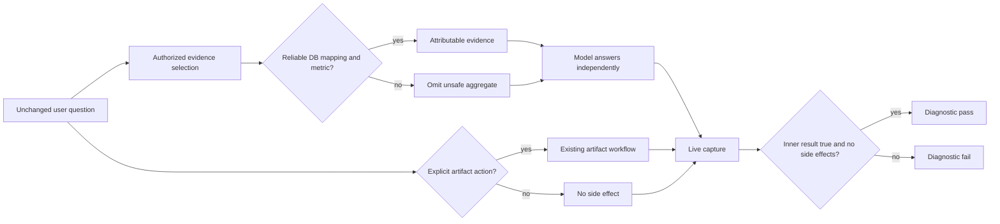

# DataMax Answer Quality P0 Safety Design

**Status:** APPROVED FOR IMPLEMENTATION

**Date:** 2026-07-15

**Source evidence:** `target/qa-quality-extended-20260715T065735Z/qa-quality-live-manual-review-20260715.md`

## 1. Outcome

This slice does not add a new answer engine. It removes three proven ways in which DataMax can supply or trigger the wrong thing:

1. an ordinary question that mentions a report can be mistaken for a request to create a report;
2. database fields and tables can be selected by unsafe substring or first-table fallbacks;
3. the live quality harness can report success even when its inner evaluator failed or the captured answer created an artifact.

The safe result is intentionally conservative: when DataMax cannot prove that an action or aggregate is requested and semantically valid, it supplies less and lets the model answer from the remaining authorized evidence. It does not invent an answer plan to compensate.

## 2. Non-negotiable boundary

DataMax may select and rank authorized, attributable evidence. It must not orchestrate the conversation, user intent, answer structure, conclusions, wording, routes, actions, or model behavior.

- Graph hints remain retrieval hints, never facts or citations.
- Database results remain evidence supplies, never instructions for the conclusion.
- Cross-dataset evidence remains limited to datasets explicitly selected and independently authorized for the current request.
- Feature-off and shadow modes preserve the original model-visible supply.
- An ordinary answer may discuss, explain, quote, compare, or summarize a report without creating or updating one.

## 3. Options considered

### Option A — Add phrase exceptions

Add `解释` and `引用` to the existing explanation list. This would fix the observed question but leave other ordinary wording vulnerable to the same broad artifact heuristics. Rejected as fragile.

### Option B — Require explicit action intent

For every static-page/report side-effect entry point, require both an artifact noun and an explicit creation, update, render, export, or publish action in the unchanged user prompt. Capability fields and model tool proposals cannot replace user authorization. Selected.

### Option C — Remove all text-based artifact routing

Only a future dedicated action-authorization contract could request artifacts. This is the cleanest boundary but would break established explicit natural-language creation requests. Deferred unless Option B proves insufficient.

For database semantics, the selected approach is typed eligibility with exact identifier matching and fail-closed selection. A blacklist for `parentcode` alone is rejected because the same bug applies to every identifier-like field.

## 4. Design

### 4.1 Plain-text artifact action gate

An artifact action is eligible only when all of these are true:

1. the unchanged user prompt names an artifact such as a report, dashboard, page, chart, or template;
2. the same action phrase contains an explicit mutating action such as create, generate, make, update, supplement, render, export, or publish;
3. the prompt is not negated;
4. the prompt is not merely asking to read, explain, quote, compare, inspect, or summarize existing material.

Examples that remain action requests:

- `生成经营健康度报表`
- `按模板把新百经营月报做出来`
- `帮经营报表补充门店面积`
- `把这个看板导出成页面`

Examples that remain ordinary questions:

- `解释销售缺口最大的门店，同时引用报告里的风险描述`
- `请看当前销售报告`
- `经营健康度报表`
- `门店经营看板`
- `引用报告里的风险描述`
- `报告中提到生成页面的原因是什么`

Existing `artifact_type`, `render_mode`, requested skills, and a model-proposed static-page tool describe capability or presentation; they do not prove that the user authorized a side effect. Every mutating path into a static-page draft, static-page image job, publish operation, or workflow creation repeats the same user-prompt authorization check. A future structured client may use a dedicated action-authorization field, but this P0 does not infer one from current metadata.

Direct image structured extraction is a separate read-only evidence-preprocessing path: it may call a configured image provider and attach a non-published structured result to the current run. This P0 does not change that behavior, and its local receipt must not be presented as proof that every provider/model preprocessing route is disabled.

This gate only decides whether an external artifact action was explicitly requested. It does not classify the subject of the question or constrain the model's answer. Database and document evidence selection still runs before this side-effect gate.

### 4.2 Database table and field eligibility

Table and column identifiers are matched as whole normalized identifier tokens, not arbitrary substrings. Selection order is:

1. exact table token;
2. exact column token and meaningful field overlap;
3. no selection when no mapping has a positive, reliable score.

There is no automatic fallback to the first configured table. A mapping that contains only an unknown one-character column, such as `s.a`, stays synchronized but is ineligible for automatic analytical supply.

Metric eligibility applies negative roles before positive metric terms:

- primary identifiers and configured `id_column` / `id_columns` are never metrics;
- code, id, key, uuid, guid, serial, number, name/title, time, and version-like fields are not additive metrics;
- unknown one-character columns are not metrics;
- a metric keyword must match an identifier segment or exact known name, never a substring inside another word;
- ratio, rate, percent, score, and index-like fields are never summed without an explicit field contract.

The Assistant supply planner filters unsafe fields first. The MySQL aggregate query builder repeats the identifier/role guard so a direct aggregate request cannot bypass the Assistant layer. This P0 adds the safe guard using current mappings. Persisted per-column type, unit, additivity, and allowed-aggregation contracts are a separate P1 expansion; until then, ambiguous fields supply schema only or fail closed.

The existing unverified claim that `quekou` or `xuzengxiaoshou` is necessarily additive, has a known unit, or that lower values imply a specific business conclusion is removed. DataMax may supply a field name or a valid aggregate, but it may not supply an invented business interpretation.

### 4.3 Quality evaluator integrity

Each outer live-capture run writes the inner evaluator into a unique directory and reads the single resulting JSON report. Success requires all of the following:

- evaluator process exited successfully;
- inner report has `ok=true`;
- inner report has `diagnostic_match=true`;
- inner report remains explicitly non-decision-eligible for this diagnostic harness.

Missing, duplicate, or invalid evaluator reports fail closed. The outer receipt records process status, parsed report status, diagnostic match, report path, and parse error separately.

Captured side effects are derived from the actual response rows. Any triggered report, artifact, publish flag, or enqueue flag makes `noCapturedTemplateOrReportSideEffects=false` and makes the live report fail. The field that says the harness did not request publishing remains separate from proof that the product did or did not produce a side effect.

## 5. Data flow

## 6. Error handling and compatibility

- Explicit natural-language artifact creation remains available when intent is clear.
- Current capability metadata and model tool proposals no longer amplify an ambiguous prompt into a write.
- Ambiguous prompts stop triggering actions; they are not rewritten into a different intent.
- Old database configs may produce fewer automatic aggregates. This is expected safe degradation.
- Direct invalid aggregate requests may change from HTTP success to a validation error.
- Tables such as `s` are not deleted and their synchronization is unchanged; only automatic analytical selection changes.
- Existing noun-only/view shortcuts that generated or reused artifacts become ordinary QA. Product copy should tell users to say `生成`, `更新`, or `发布` when they want a side effect.
- No provider call, live write, configuration change, deployment, or feature enablement is part of this local implementation slice.

## 7. Acceptance criteria

1. The exact mixed question from live case 012 does not request a static page, report, or workflow, even when capability metadata or a model tool proposal is present.
2. Explicit create/update/render/publish prompts still do.
3. `parentcode`, `storecode`, `contract_no`, and equivalent identifiers never become numeric metrics.
4. A config with `s.a` first does not select `s` for an unrelated business field question.
5. A question with no positive database mapping produces no automatic aggregate.
6. Unverified `quekou` semantics do not claim a unit, direction, or business threshold.
7. The outer live harness fails when the inner evaluator says false, even if the child process exits zero.
8. The outer live harness fails when any captured artifact or report side effect exists.
9. Focused tests, the established offline quality suites, formatting, and diff checks pass.
