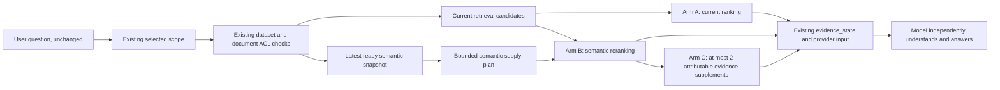

# DataMax Knowledge Graph Assisted Supply Answer Quality Implementation Plan

> **For Claude:** REQUIRED SUB-SKILL: Use superpowers:executing-plans to implement this plan task-by-task.

**Goal:** Prove, with controlled evidence, whether the existing DataMax semantic graph can improve answer quality by helping select, rank, and supplement model supplies without orchestrating conversation, routing, answer structure, or conclusions.

**Architecture:** Keep the current AssistantRun and model behavior unchanged. Read only the latest ready semantic snapshot after the existing dataset, document, secret, local-thread, and external ACL checks; use it to compute a bounded semantic supply plan that can reorder or supplement real retrieval evidence. The model continues to receive ordinary `retrieval_evidence` and independently decides how to answer.

**Tech Stack:** Rust/Axum, PostgreSQL 18.4, existing dataset semantic snapshots and pair snapshots, existing AssistantRun evidence state, Node.js JSONL quality harnesses, PowerShell/Bash smoke runners.

---

**Status:** IMPLEMENTATION COMPLETE — NO PROMOTION CANDIDATE — FEATURE KEPT OFF

**Execution completed:** 2026-07-15. GitHub synchronization and the 8-server Task 10 Phase A receipt are recorded in `docs/validation/semantic-supply-answer-quality.md`. Task 10 completed only as `feature_off_operational_install_only`; no shadow was executed, the rollout runbook initiated no provider call, and no answer-quality or promotion conclusion is claimed.

**Baseline:** `e14e924fa40ddb3f12b2366ea07a73bc18e4f467`

**Current decision (2026-07-15):** `keep_graph_visual_only`. The earlier precommit 24-case diagnostic was superseded after the runtime fixture, exact chunk binding and evaluator contract were hardened, so its numeric uplift is historical and is not current release evidence. Independently of those obsolete numbers, promotion remains fail-closed because no independently captured frozen feature-off baseline exists, the legacy 58 cases are not linked per case, the current answer receipt cannot bind each claim to a visible document/chunk/source locator/retrieval hit, and answer evaluation was not run. Therefore `retrieval_candidate=null`; Task 11 live execution is skipped and the feature remains off. Final clean-HEAD retrieval receipts are operational evidence only and cannot override those structural blockers.

**Previous graph plan:** `docs/plans/2026-07-14-datamax-knowledge-graph-quality-and-cross-dataset-plan.md` is completed and frozen.

**Scope rule:** This plan is independent. Do not append execution records to the frozen graph plan or resume any task number from an archived plan.

## 0. 中文执行摘要

这份计划先回答一个事实问题：现有知识图谱是否已经提升问答质量。结论是 **还没有**。当前图谱已经真实落库、可以展示单数据集和跨数据集关系，但 AssistantRun 的检索、排序和模型供料没有读取这些语义快照，因此现阶段直接提升为 0。

后续不把图谱改成“对话编排器”或“答案生成器”，只验证它能否成为更好的供料索引：

1. 用户原问题、system prompt、模型、回答策略、意图路由和动作路由保持不变。
2. 图谱只帮助找到问题对应的业务对象、字段别名和来源资料。
3. 第一阶段只做 shadow，计算结果但不改变供料。
4. 第二阶段只重排现有证据。
5. 第三阶段只有在重排已经证明有效后，才允许补充最多两条能落到真实可见 document chunk 的证据。
6. 模型继续自己理解问题、组织答案和决定表达方式。
7. 图谱节点和推断关系永远不能直接当引用；引用仍必须是真实资料、切片、数据库结果或确定性事实供料。
8. 跨数据集只使用用户本轮明确选择且逐个鉴权通过的数据集，不自动扩展到所谓“相关邻居”。

最终结果不预设一定上线。执行结束必须在以下三种结论中诚实选择一个：

- `promote_rerank`：只上线图谱辅助重排；
- `promote_supplement`：上线重排和最多两条真实补证；
- `keep_graph_visual_only`：数据不能证明收益，图谱继续只做数据集理解展示。

## 1. Decision summary

The current knowledge graph has **zero direct effect on answer quality**:

- graph generation and display follow `parse -> semantic snapshot -> graph API -> Web`;
- question answering follows `retrieval evidence / fact snapshot / database aggregate -> evidence state -> model`;
- AssistantRun does not currently read `dataset_semantic_snapshots`, `dataset_semantic_link_snapshots`, or `semantic_dictionary_entries`.

The graph can still be valuable as a **supply index**. Its useful contribution is to help the existing pipeline find the correct document, field, and evidence sooner. It must not become a dialogue controller, an intent router, an answer template, or a fact generator.

Recommended approach:

1. establish trustworthy A/B measurement;
2. run graph grounding in shadow mode with no behavior change;
3. test graph-assisted reranking;
4. only if reranking passes, test at most two additional real evidence chunks;
5. promote only when answer quality improves without route, permission, latency, citation, or naturalness regressions.

## 2. Current capability inventory

| Graph work already completed | Current state | Expected QA value |
| --- | --- | --- |
| Versioned single-dataset semantic snapshots | Real: objects, fields, relations, evidence refs, confidence and status | High enabling value |
| Chinese label quality and technical-name mapping | Real for ready snapshots | High for field aliases and source location |
| Evidence refs on semantic objects, fields, and relations | Present, but source resolution coverage must be measured | High only when refs resolve to visible evidence |
| Confirmed / observed / inferred separation | Real contract | High safety value |
| PostgreSQL snapshot storage and previous-ready fallback | Real | Reliability only |
| Graph canvas, larger layout, node labels and ECharts interaction | Real | No direct answer-quality value |
| Seven datasets and 21 ready pair snapshots | Real operational state | Enabling only |
| First live pair: one shared document, zero real cross-dataset edges | Real operational state | Too little for current cross-dataset QA uplift |
| Confirmed concept / explicit FK / reference matcher contracts | Fixture capability only; live worker does not supply them | No live uplift yet |
| Front-end fallback graph inferred from titles and hints | Visual fallback only | Must never be used as answer evidence |

Current NewBai snapshot evidence:

- 9 objects;
- 160 fields;
- 160 relations;
- broad live answer questions still receive repeated generic evidence;
- current graph has not changed those results because it is not connected to AssistantRun.

## 3. Questions the graph can and cannot improve

| Question class | Expected uplift | Rule |
| --- | ---: | --- |
| Chinese business term to technical field, such as `缺口` to `quekou` | High | Use label and technical-name aliases to find evidence |
| Table, field, month, section, or document disambiguation | Medium to high | Boost evidence with visible provenance |
| Object -> field -> source one-hop evidence discovery | Medium to high | Supplement only real document chunks |
| Different questions currently returning the same generic files | Medium to high | Apply source diversity and per-document caps |
| Deep old document recall | Medium | Only if semantic provenance resolves to current visible chunks |
| Cross-dataset shared document or confirmed reference | Low today | Evaluate only with real confirmed/observed links |
| Database TopN, counts, row completeness, sorting | No direct uplift | Keep `database_aggregate` and fact snapshots authoritative |
| One-character PDF, OCR, scan parsing | No direct uplift | Fix parsing before graph construction |
| Ordinary model knowledge questions | Must be unchanged | No dataset supply means no graph involvement |
| Static page/report/template misrouting | Not a graph problem | Route and artifact parity must remain exact |

## 4. Non-negotiable product boundary

The governing product principle is: **DataMax may orchestrate evidence supply when necessary, but it does not orchestrate the dialogue.** Selecting, ranking or adding attributable evidence must never become a hidden answer plan. The model independently interprets the unchanged question and decides the answer, wording and conclusion.

### 4.1 Allowed

The graph may only help:

- choose evidence candidates;
- rank evidence candidates;
- deduplicate repeated sources;
- add at most two actual, visible, attributable evidence chunks;
- attach internal trace information explaining why a source was selected;
- broaden retrieval terms internally while preserving the original user question.

### 4.2 Forbidden

The implementation must not:

- rewrite the user question sent to the model;
- change the system prompt, answer policy, or provider;
- decide ordinary chat, report, static page, template, action, or capability routing;
- force an answer outline, paragraph structure, wording, or conclusion;
- generate an answer from graph nodes;
- treat inferred, similarity, or co-occurrence edges as facts;
- replace database aggregates, fact snapshots, or row scans;
- automatically add an unselected dataset to the current question scope;
- expose graph examples, hashes, hidden labels, source identities, paths, credentials, or invisible dataset names;
- add provider calls, quality retries, workflows, artifacts, reports, or static pages.

### 4.3 Citation boundary

- Public and model-visible citations remain real documents, chunks, database results, or deterministic fact supplies.
- A graph node is never a citation.
- A graph relation can only guide retrieval.
- A supplemented item is eligible only when it resolves to a current, visible `document_id`, `document_chunk_id`, and `source_locator`.
- First release uses only `confirmed` and `observed` nodes or relations. `inferred` and `unresolved` are excluded.

## 5. Alternatives considered

### Option A: Put a semantic summary directly into the prompt

Small implementation, but it mixes graph interpretation into the answer context before provenance quality is proven. It can increase confident but unsupported answers and makes causal measurement difficult.

**Decision:** Reject for the first release.

### Option B: Graph-assisted supply selection and reranking

Use semantic labels and evidence refs to change which existing evidence reaches the model. The provider input contract and the model's freedom remain unchanged.

**Decision:** Recommended.

### Option C: Graph agent, multi-hop dialogue planner, or graph database

Could support future large-scale reasoning, but violates the current no-dialogue-orchestration boundary and is unnecessary for hundred-node snapshots.

**Decision:** Reject.

## 6. Target data flow



There is deliberately no arrow from the semantic plan to intent routing, action routing, report generation, static-page generation, or final-answer composition.

## 7. Experiment design

### 7.1 Three arms

| Arm | Behavior | Model-visible contract |
| --- | --- | --- |
| A — control | Current retrieval, ranking and supply | Unchanged |
| B — rerank | Same candidate pool and TopK; semantic score can reorder | Same ordinary `retrieval_evidence` schema |
| C — rerank + supplement | B plus at most two attributable visible chunks | Same ordinary `retrieval_evidence` schema |

Shadow mode computes B and C traces but sends A to the model.

### 7.2 Evaluation corpus

Keep the current 58 cases as separate regression-suite inventories:

- `fixtures/retrieval-quality/cases.jsonl`: 35;
- `fixtures/newbai-customer-answer/cases.jsonl`: 12;
- `fixtures/document-quality/smoke-cases.json`: 11.

The A/B/C corpus is a standalone 24-case synthetic offline retrieval diagnostic. The 35+12+11 legacy cases are not merged into it or linked per case by its receipt; aggregate suite totals cannot support promotion without explicit case manifests and independently bound receipts. The 24 cases cover:

- 6 field alias and Chinese/technical-name mappings;
- 4 table or document disambiguation cases;
- 6 one-hop cross-document evidence cases;
- 4 explicit multi-dataset selected-scope / dual-source localization cases, with no cross-dataset relation/link assertion;
- 4 negative controls covering ordinary chat, database aggregates, parsing failure, and route/artifact guards.

Split development and holdout sets by source document or dataset, not by randomly splitting similar questions. Fixtures, expected sources, and answer patterns must never enter graph generation or runtime matching.

### 7.3 Live case policy

- Use NewBai 001–008 and 011 for answer uplift.
- Use 009, 010 and 012 only as route, template, workflow and artifact guards.
- If a future, separately approved live study has fewer than five reviewed confirmed/observed cross-dataset relations, mark cross-dataset answer uplift as `insufficient_live_evidence`; do not manufacture links. The current 24-case diagnostic does not cover this relation claim.
- Use the same provider, model, history and test identity for A/B/C.
- Each live case runs in an independent session.
- Alternate order between ABC and CBA to reduce time-order bias.
- Do not call the provider during shadow-only ranking validation.

## 8. Metrics and release gates

### 8.1 Graph grounding gate

Before changing retrieval:

- every used node has a latest-ready, non-stale compatible snapshot;
- every boost or supplement resolves to visible provenance;
- target-node provenance resolution rate is at least 90%;
- hidden, stale, inferred, unresolved, or unresolvable nodes used for boosting: 0;
- NewBai 001–008 expected source Hit@4: 8/8;
- if all prompts map to the same generic source set, stop and improve semantic provenance/dictionary quality first.

### 8.2 Retrieval gate

- full-corpus Recall@20 is not lower than A;
- full-corpus MRR@20 decline is no worse than 0.01;
- semantic-target MRR@20 improves by at least 0.10;
- semantic-target Precision@5 improves by at least 15 percentage points;
- average Top5 source overlap between unrelated NewBai questions drops by at least 30% relative to A;
- supplemented evidence with non-null `document_id`, chunk ID and source locator: 100%;
- permissions leaks: 0.

### 8.3 Answer gate

- NewBai 001–008 required business evidence: 8/8;
- semantic-target answer pass rate improves by at least 20 percentage points;
- unsupported or false claims: 0;
- internal field leakage: 0;
- citation accuracy is not lower than A;
- document quality remains 11/11;
- database TopN, row completeness, resume statistics/ranking and ordinary chat do not regress.

### 8.4 Model-freedom and side-effect gate

- system prompt, answer policy, provider and user question are byte-equivalent across arms;
- intent, selected scope, capability and recommended action lists are identical;
- workflow, artifact, report, template and static-page deltas are identical and expected;
- unexpected new artifacts or tasks: 0;
- provider call and retry counts are identical;
- repeated opening and template-like 5-gram overlap do not increase by more than 5 percentage points;
- blind review of a paired sample finds no material loss of naturalness, clarity, or relevance.

### 8.5 Performance gate

- no extra provider call;
- retrieval-stage p95 overhead is both `<=100ms` and `<=20%`;
- provider-input size increase is `<=15%`;
- snapshot failure, stale state, timeout, invalid manifest, or no match returns the exact A behavior;
- same-run off/A output ordering and model-visible evidence are byte-identical. Promotion additionally requires an independently captured, hash-bound pre-change feature-off baseline, which current v2 has not measured.

## 9. Runtime contract

Use an independent, fail-closed feature family:

```text
ASSISTANT_RUN_SEMANTIC_SUPPLY_MODE=off|shadow|rerank|supplement
ASSISTANT_RUN_SEMANTIC_SUPPLY_TENANT_ALLOWLIST=
ASSISTANT_RUN_SEMANTIC_SUPPLY_DATASET_ALLOWLIST=
ASSISTANT_RUN_SEMANTIC_SUPPLY_USER_ALLOWLIST=
```

Rules:

- default is `off`;
- `*` is not a wildcard;
- all three allowlists must match;
- external-channel scopes may compute only byte-inert `shadow` receipts in the first release; configured `rerank` or `supplement` fails closed to `off` for those scopes;
- mode does not change public request or response fields;
- no new public SSE event is introduced;
- mode only changes internal supply selection;
- cross-dataset matching uses only datasets explicitly selected in the current scope and independently authorized;
- first implementation does not cache cross-user semantic plans;
- if caching is added later, the key must include tenant, user/ACL fingerprint, selected datasets, selected documents and semantic snapshot fingerprint.

Internal pure-function output:

```rust
struct AssistantSemanticSupplyPlan {
    snapshot_id: Uuid,
    matched_node_ids: Vec<String>,
    query_aliases: Vec<String>,
    visible_source_document_ids: Vec<DocumentId>,
    evidence_boosts: Vec<SemanticEvidenceBoost>,
    supplement_document_ids: Vec<DocumentId>,
    trace: SemanticSupplyTrace,
}
```

The plan contains no answer, no intent, no action, no model instruction and no raw example value.

## 10. Implementation tasks

### Task 0: Freeze a trustworthy baseline

**Files:**

- Modify: `scripts/smoke/newbai-customer-answer.mjs`
- Modify: `scripts/run-external-direct-reply-smoke.sh:74`
- Modify: `scripts/run-document-understanding-smoke.sh:88`
- Modify only if root cause requires it: `crates/platform-api/src/lib.rs`
- Create: `docs/validation/semantic-supply-answer-quality.md`

**Steps:**

1. Add a failing NewBai evaluator test proving only selected/executed cases are required; skipped 009/010 must not become `missing_result`.
2. Replace both stale Cargo filters with the current conversation-persistent temporary-membership test name and assert that at least one test executes.
3. Isolate the three existing retrieval `document_id = null` failures and the two PostgreSQL 18 lexical failures.
4. Fix provenance behavior when it violates the current contract; only update a test when the runtime contract intentionally changed and the replacement assertion is explicit.
5. Record all unrelated existing full-suite failures as a frozen regression inventory; this plan may add zero new failures.
6. Capture A-arm evidence order plus explicit `route.status=not_run` and zero workflow/artifact/provider side-effect status. The offline exporter does not execute or observe a dialogue route; citation and answer claims require a separate source-bound contract.

**Verify:**

```powershell
node scripts/smoke/newbai-customer-answer.mjs --self-test --pretty
bash scripts/run-external-direct-reply-smoke.sh
bash scripts/run-document-understanding-smoke.sh
bash scripts/run-retrieval-quality-smoke.sh --baseline
cargo test -p platform-api search_dataset_retrieval_returns_ranked_hits_with_document_ids --lib
cargo test -p platform-api select_retrieval_evidence_ids_for_prompt_supports_chinese_terms --lib
```

**Expected:** selected-case evaluation is honest, Cargo executes nonzero tests, and the graph experiment starts from attributable evidence.

**Commit:** `test: restore trustworthy answer quality measurement`

### Task 1: Add the A/B corpus and evaluator

**Files:**

- Create: `fixtures/semantic-supply-ab/cases.jsonl`
- Create: `scripts/smoke/semantic-supply-ab.mjs`
- Create: `scripts/run-semantic-supply-ab-smoke.sh`
- Modify: `scripts/README.md`

**Steps:**

1. Define a JSONL schema with case ID, category, unchanged prompt, explicit selected scope, expected source IDs, forbidden sources and allowed evidence classes. Do not encode expected dialogue routes, actions, artifact counts, answer structure, conclusions or wording.
2. Add the 24 new cases without copying private business values into Git.
3. Add evaluator self-tests for missing rows, duplicate rows, leakage, source overlap, MRR, Precision@5, A/B/C offline route-not-run consistency, artifact parity and latency. This does not measure model route parity; any future route comparison requires an independently bound live execution receipt and remains observational rather than prescriptive.
4. Make `--require-metrics` fail closed.
5. Write JSON and Markdown receipts under `target/semantic-supply-ab/`.

**Verify:**

```powershell
node scripts/smoke/semantic-supply-ab.mjs --self-test --pretty
bash scripts/run-semantic-supply-ab-smoke.sh --fixture-only
```

**Expected:** the repository retains 58 separate legacy regression cases plus 24 standalone A/B/C diagnostic cases. This is an aggregate inventory count only, not an 82-case merged or per-case-linked promotion receipt; synthetic evaluator self-tests match exact expected values.

**Commit:** `test: add semantic supply answer quality corpus`

### Task 2: Implement the pure semantic supply planner

**Files:**

- Create: `crates/platform-api/src/assistant_run_semantic_supply_support.rs`
- Modify: `crates/platform-api/src/lib.rs:200-420`
- Reuse: `crates/platform-api/src/semantic_understanding.rs:75-188`
- Reuse: `crates/platform-api/src/assistant_run_lexical_query_support.rs`

**Steps:**

1. Write failing pure-function tests for Chinese labels, technical names, semantic roles, confirmed/observed filtering, bounded aliases and deterministic ordering.
2. Add negative tests proving `inferred`, `unresolved`, stale, invalid-version and empty snapshots produce no plan.
3. Implement `build_assistant_semantic_supply_plan` without storage or network access.
4. Cap output to 8 matched nodes, 12 aliases, 8 source IDs and 2 supplement candidates.
5. Ensure the plan contains no examples, raw values, answer text, intent or action.

**Verify:**

```powershell
cargo test -p platform-api assistant_run_semantic_supply_support --lib
cargo fmt --all -- --check
```

**Expected:** pure planner tests pass and the module is not yet called by AssistantRun.

**Commit:** `feat: add bounded semantic supply planner`

### Task 3: Resolve graph provenance inside the existing permission boundary

**Files:**

- Modify: `crates/platform-api/src/assistant_run_semantic_supply_support.rs`
- Modify: `crates/platform-api/src/lib.rs:39915-40130`
- Reuse: `crates/storage/src/lib.rs:5281-5400`
- Reuse: `crates/platform-api/src/dataset_semantic_graph_support.rs:996-1100`
- Test: `crates/platform-api/src/lib.rs`

**Steps:**

1. Add failing tests for public, private owner, secret binding, local-thread, selected-document, external ACL and cross-tenant scopes.
2. Load latest-ready snapshot only after `load_visible_dataset_for_assistant_scope` succeeds.
3. Resolve `evidence_refs.source_id` only to sources already visible in the current evidence scope.
4. Drop any node whose provenance cannot be safely resolved before matching its label against the question.
5. Keep database-origin nodes out of document reranking unless they resolve to an existing structured supply; do not translate them into fake document evidence.
6. Add safe counts only; never log labels or business values.

**Verify:**

```powershell
cargo test -p platform-api semantic_supply_permission_scope --lib
cargo test -p platform-api semantic_supply_provenance --lib
```

**Expected:** no hidden label is used even transiently for query expansion or scoring; unresolvable provenance yields baseline behavior.

**Commit:** `feat: enforce semantic supply provenance scope`

### Task 4: Connect shadow mode without changing answers

**Files:**

- Modify: `crates/platform-api/src/assistant_run_semantic_supply_support.rs`
- Modify: `crates/platform-api/src/lib.rs:39915-40274`
- Modify: `crates/platform-api/src/assistant_run_supply_quality_support.rs:1-270`
- Test: `crates/platform-api/src/lib.rs`

**Steps:**

1. Add mode and exact allowlist parsing tests.
2. Compute semantic plans after ACL and selected-document scope are known.
3. In `shadow`, preserve A candidates, order, supplied items and provider input byte-for-byte.
4. Store only safe internal metrics: snapshot ID, counts, reason codes, candidate ranks and elapsed time.
5. Add a test comparing `off` and `shadow` model-visible evidence and provider input.

**Verify:**

```powershell
cargo test -p platform-api semantic_supply_shadow --lib
cargo test -p platform-api assistant_run_provider_input --lib
```

**Expected:** shadow emits an internal comparison receipt but cannot affect answer text, routing, calls or side effects.

**Commit:** `feat: add semantic supply shadow mode`

### Task 5: Add Arm B semantic reranking

**Files:**

- Modify: `crates/platform-api/src/assistant_run_semantic_supply_support.rs`
- Modify: `crates/platform-api/src/lib.rs:40132-40187`
- Reuse: `crates/platform-api/src/lib.rs:49131-49530`
- Test: `crates/platform-api/src/lib.rs`

**Steps:**

1. Write failing tests for field alias boost, object-source boost, exact provenance boost, deterministic tie breaking and no-match identity.
2. Keep current lexical and recall scores; add a bounded semantic component instead of replacing them.
3. Apply per-document supply cap of two chunks after ensuring the unique correct document cannot be removed.
4. Record `semantic_score` and opaque match IDs in internal trace.
5. Keep model-visible `retrieval_evidence` schema unchanged.

**Verify:**

```powershell
cargo test -p platform-api semantic_supply_rerank --lib
cargo test -p platform-api select_retrieval_evidence_ids_for_prompt --lib
bash scripts/run-retrieval-quality-smoke.sh --baseline
```

**Expected:** target fixtures move correct evidence upward; no-match and feature-off orders are exact baseline.

**Commit:** `feat: rerank answer supplies with semantic provenance`

### Task 6: Add Arm C bounded evidence supplementation

**Files:**

- Modify: `crates/platform-api/src/assistant_run_semantic_supply_support.rs`
- Modify: `crates/platform-api/src/lib.rs:40151-40205`
- Reuse: `crates/platform-api/src/lib.rs:44969-45185`
- Test: `crates/platform-api/src/lib.rs`

**Steps:**

1. Write failing tests that supplements require visible document and chunk provenance.
2. Add at most two supplements not already present in TopK.
3. Use existing chunk loading and ACL filters; never synthesize content from graph labels.
4. Deduplicate by document/chunk/source locator.
5. Keep supplements as ordinary `retrieval_evidence` with source IDs and locators.

**Verify:**

```powershell
cargo test -p platform-api semantic_supply_supplement --lib
cargo test -p platform-api assistant_run_evidence_scope --lib
```

**Expected:** every supplemented item is independently citable; no visible provenance means no supplement.

**Commit:** `feat: supplement bounded attributable answer evidence`

### Task 7: Protect model autonomy and public contracts

**Files:**

- Modify only for guard tests: `crates/platform-api/src/assistant_run_model_supply_item_support.rs:11-260`
- Modify only for guard tests: `crates/platform-api/src/assistant_run_model_supply_budget_support.rs:15-520`
- Modify only for guard tests: `crates/platform-api/src/lib.rs:32425-32845`
- Test: `crates/platform-api/src/external_channel_public_citation_support.rs`

**Steps:**

1. Assert that no new answer template, instruction, route or action field reaches provider input.
2. Strip internal semantic trace from model-facing and public evidence states.
3. Assert citations still point only to actual sources.
4. Assert provider call/retry count and action catalog are identical across A/B/C.
5. Assert ordinary chat with no dataset scope never loads a graph.

**Verify:**

```powershell
cargo test -p platform-api semantic_supply_model_autonomy --lib
cargo test -p platform-api external_channel_public_citation --lib
bash scripts/run-assistant-chat-contract-smoke.sh
```

**Expected:** only evidence selection changes; the model remains fully responsible for understanding and answering.

**Commit:** `test: guard model autonomy for semantic supply`

### Task 8: Run offline three-arm evaluation

**Execution status:** completed fail-closed. No promotion candidate was produced; the earlier numeric precommit diagnostic is superseded and is not release evidence.

**Files:**

- Modify: `scripts/smoke/semantic-supply-ab.mjs`
- Modify: `docs/validation/semantic-supply-answer-quality.md`
- Output only: `target/semantic-supply-ab/`

**Steps:**

1. Generate A/B/C result rows from the same fixture snapshot.
2. Require grounding, retrieval, permission, offline route non-execution, zero-side-effect and performance gates.
3. Report results per category and holdout split.
4. Stop if B does not beat A on target evidence ranking.
5. Stop if C adds no value over B or introduces citation/latency regressions.

**Verify:**

```powershell
# Offline retrieval/grounding/permission/contract/latency gate. Answer may remain not_run.
bash scripts/run-semantic-supply-ab-smoke.sh --require-retrieval-metrics

# Answer-receipt v2 diagnostic. It intentionally remains non-promotion/fail-closed.
bash scripts/run-semantic-supply-ab-smoke.sh --require-metrics
node scripts/smoke/newbai-customer-answer.mjs --self-test --pretty
.\scripts\run-v3-quality-gate-smoke.ps1 -Local -Case all -Json
```

**Recorded result:** the earlier precommit receipt was generated before the runtime fixture, exact chunk/locator attribution and evaluator contract were hardened. Its paths, hashes and numeric uplift are therefore superseded and must not be used as current evidence. A clean-HEAD exporter/evaluator receipt may record the final retrieval diagnostic, but it still cannot produce a promotion candidate because current v2 has no independently captured frozen feature-off baseline. `answer_evaluation=not_run`; the optional answer-receipt v2 remains permanently non-promotion until every claim is independently bound to a visible document/chunk/source locator/retrieval hit and the legacy 58 cases have explicit linked manifests. Current decision: `keep_graph_visual_only`.

**Expected:** one arm is selected by unchanged predeclared metrics, or the documented decision is `keep_graph_visual_only`. A failed gate is a valid result and must not be repaired by changing thresholds.

**Commit:** `test: record semantic supply ab decision`

### Task 9: Complete full local regression

**Execution status:** completed. Web 467/467, dataset semantic smoke 8 checks, retrieval baseline 35 cases, storage 46, retrieval-worker 50 passed/0 failed/1 ignored, and the latest Platform API run has 2884 passed/1 frozen known failure/2 ignored. The semantic-supply filter has 33 passed/0 failed/1 ignored. Document quality remains 11/11 and NewBai self-test remains 12/12.

**Files:**

- No intended product changes.
- Update: `docs/validation/semantic-supply-answer-quality.md`

**Steps:**

1. Run Web tests even though no Web behavior changes.
2. Run semantic graph, retrieval, workers, storage and full platform API tests.
3. Compare failures to the frozen Task 0 baseline.
4. Require no new failure and no zero-test false green.
5. Record commands, counts, HEAD and artifact hashes.

**Verify:**

```powershell
npm --prefix apps/web test
bash scripts/run-dataset-semantic-understanding-smoke.sh --no-credentials
bash scripts/run-retrieval-quality-smoke.sh --baseline
cargo test -p storage
cargo test -p retrieval-worker --all-targets
cargo test -p platform-api --lib
git status --short
```

**Expected:** no new regression, clean worktree after intentional commits, and all graph-specific gates green.

**Commit:** `docs: record semantic supply local regression`

### Task 10: Prepare feature-off and shadow rollout

**Execution status:** completed as Phase A `feature_off_operational_install_only`. Code commit `9b7ec2bcee7796723c58f781a8bbf113d3285b31` was installed with mode explicitly `off` and all three allowlists empty; only `platform-api` was restarted and verified healthy, while non-API services remained unchanged. Shadow was not executed because `retrieval_candidate=null`; `provider_calls_initiated_by_runbook=0`.

**Files:**

- Create: `docs/operations/assistant-semantic-supply-rollout.md`
- Modify: `docs/validation/semantic-supply-answer-quality.md`

**Steps:**

1. Document 8-server preflight, backup, fast-forward, API-only build/restart and rollback.
2. Keep `ASSISTANT_RUN_SEMANTIC_SUPPLY_MODE=off` for initial deployment.
3. Verify same-run off/A model-visible supply self-consistency. This is not an independent frozen baseline and cannot authorize promotion or shadow.
4. Current no-candidate branch stops after Phase A feature-off verification.
5. Future-only: enable `shadow` for one controlled user, tenant and NewBai dataset only after a non-null candidate, an independent frozen baseline, a separate reviewed change and fresh authorization exist.
6. Do not restart Web or workers; do not modify graph generation or snapshots; do not call the provider during any shadow ranking validation.

**Verify:**

```bash
git status --porcelain
git rev-parse HEAD
systemctl is-active aiv3-platform-api.service
curl -fsS http://127.0.0.1:3000/healthz
curl -fsS http://127.0.0.1:3000/readyz
```

**Expected for the current no-candidate path:** an optional Phase A feature-off install may prove only commit/config/API health and same-run off-path consistency. Shadow is not executed, and no `feature_off_shadow_safe` or promotion conclusion is allowed. A future shadow path requires an independently captured pre-change feature-off baseline and a non-null offline candidate.

**Commit:** `docs: add semantic supply controlled rollout`

### Task 11: Run controlled live A/B/C and decide

**Execution status:** skipped fail-closed. Task 8 returned `retrieval_candidate=null`, so no live arm, provider call or feature enablement is authorized by this plan state.

**Files:**

- Create: `scripts/smoke/semantic-supply-main-live.mjs`
- Modify: `scripts/README.md`
- Modify: `docs/validation/semantic-supply-answer-quality.md`
- Output only: controlled private/raw and redacted summary receipts under `target/semantic-supply-main-live/` and, when applicable, the server backup directory.

**Steps:**

1. Read the final Task 8 receipt and require a non-null promotion candidate before any live preflight or execution. If `retrieval_candidate=null`, stop here.
2. Verify the exact GitHub/server HEAD, services, PostgreSQL version and clean worktree.
3. Run A with mode `off`.
4. Run B with mode `rerank` for the same allowlisted identity and cases.
5. Run C only after B passes, with mode `supplement`.
6. Compare evidence, answers, citations, provider calls, route, workflow, artifact counts and latency.
7. Return to `off` immediately after the window.
8. Preserve a cleanup manifest; do not automatically delete business or pilot data.
9. Record one of three decisions:
   - `promote_rerank`;
   - `promote_supplement`;
   - `keep_graph_visual_only`.

**Current result:** the first step fails closed because Task 8 has no candidate. `scripts/smoke/semantic-supply-main-live.mjs` is retained only as future contract scaffolding. Its local self-test passes with zero network requests, zero filesystem writes and `decision_eligible=false`; the current build rejects alternate fixture paths and symbolic links, reads only the repository-owned fixed fixture, then mechanically rejects all preflight/execute requests with `live_execution_disabled_without_offline_promotion_candidate` before receipt creation, filesystem writes, authentication or networking. Removing that hard lock requires a separate reviewed change after a future offline candidate exists. Self-test, preflight and single-arm receipts cannot replace the offline promotion gate or independently authorize live execution.

**Expected:** promotion occurs only when all predeclared offline and live gates pass. A failure is a valid result and must not be hidden by changing thresholds after the run.

## 11. Rollout and rollback sequence

```text
local pure tests
  -> feature-off build
  -> shadow for test identity
  -> offline A/B/C decision
  -> no candidate: keep graph visual-only, remain off, do not run live
  -> candidate: live A/B
  -> live C only if B passes
  -> return off
  -> explicit promotion decision
```

Immediate rollback conditions:

- any permission leak or hidden-label use;
- any route, action, workflow, artifact, template or report delta;
- any unsupported claim caused by supplemented evidence;
- NewBai target evidence below 8/8;
- document-quality regression;
- provider calls or retries increase;
- latency exceeds its gate;
- snapshot errors block normal answers;
- same-run feature-off path is not byte-identical to A, or a future promotion/shadow attempt lacks an independently captured frozen feature-off baseline.

Rollback changes only the semantic-supply environment values and `platform-api` runtime. It does not delete graph snapshots, business data, pilot data or evidence.

## 12. Completion definition

This plan is complete only when:

1. the current zero-direct-uplift baseline is preserved in the validation record;
2. measurement false greens and selected-case evaluator errors are fixed;
3. semantic provenance is permission-safe; promotion requires at least 90% target coverage, while a lower measured result is accepted only as a recorded fail-closed stop;
4. when and only when a non-null candidate exists, shadow mode proves no model-visible or behavioral change; the current no-candidate branch skips shadow and permits at most an operational Phase A feature-off install;
5. offline A/B/C receipts cover retrieval, grounding, permissions, contracts and latency; any future answer/citation/naturalness promotion receipt uses a new reviewed schema with per-claim visible-source binding and explicit legacy-suite case manifests, rather than the non-promotion v2 summary counters;
6. document and database controls do not regress;
7. a controlled live result selects rerank or supplement only when an offline candidate exists; otherwise the offline fail-closed result selects visual-only without a live run;
8. the runtime is returned to the documented final mode and all services are healthy;
9. GitHub, 8 server and validation evidence identify the exact same commit;
10. old frozen plans remain unchanged and the active pointer is closed or advanced explicitly.

## 13. Recommended execution order

Execute strictly in this order:

```text
Task 0 -> Task 1 -> Task 2 -> Task 3 -> Gate: provenance quality
       -> Task 4 -> Gate: shadow parity
       -> Task 5 -> Gate: rerank uplift
       -> Task 6 -> Gate: supplement uplift
       -> Task 7 -> Task 8 -> Task 9
       -> no offline candidate: optional Task 10 Phase A operational feature-off install only
                                -> stop fail-closed at keep_graph_visual_only
       -> offline candidate: full Task 10 off/shadow rollout -> Task 11
```

Do not implement Task 6 merely because Task 5 exists. If reranking alone meets the quality goal, keep the simpler solution. If neither B nor C meets the gates, retain the graph as a dataset-understanding visualization and do not connect it to question answering.
